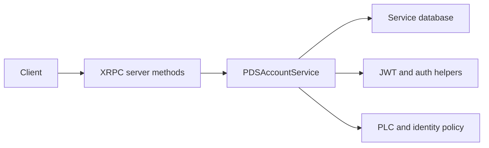

# Tutorial 2: Account Management

## Overview

This tutorial explains how Garazyk turns a running server into a multi-user system. The important contributor story is not "here is a pile of account code." It is how account creation, identity policy, and session issuance fit together across configuration, services, and protocol methods.

That is also where a lot of mistakes happen. New contributors often treat account creation as a single endpoint problem when it is really a system boundary problem involving handles, invite policy, PLC behavior, token issuance, and shared service data.

## What You'll Build

You will build an accurate mental model of the account lifecycle in the real repo:

- account creation
- session creation
- JWT issuance
- invite-policy interaction
- handle and DID constraints

**Learning Objectives:**
- Identify where account and session behavior actually lives
- Understand which configuration values shape registration behavior
- Trace `createAccount` and `createSession` from XRPC registration into service logic
- Verify account flows with tests and small runtime checks

**Estimated Time:** 35-45 minutes

## Prerequisites

- Complete [Tutorial 1: Hello PDS](./tutorial-1-hello-pds)
- Read [Email & Verification](../06-authentication/email-and-verification)
- Be comfortable reading service and auth code together

## Architecture Overview



## Step 1: Start with the Service, Not the Endpoint

The best starting point is:

- `Garazyk/Sources/Services/PDS/PDSAccountService.m`
- `Garazyk/Sources/Services/PDS/PDSAccountService.h`

Why start there?

- the service owns the business rules,
- the service has to reconcile config policy with user-facing behavior,
- and the service boundary is easier to test than the transport layer.

Look for how it handles:

- registration requirements,
- handle validation,
- email and password expectations,
- account lookup and state transitions.

## Step 2: Trace the XRPC Entry Points

Once you know the service shape, move outward to the network layer. The account tutorial is really about how service rules become public protocol behavior.

The important path is:

1. XRPC method registration
2. input parsing and validation
3. account service invocation
4. token or response shaping

The exact method registration lives in the network layer, and that is where you should confirm which methods the server really exposes today.

## Step 3: Understand the Config-Driven Policy

Account behavior depends heavily on configuration:

- `session.invite_code_required`
- issuer and available user domains
- PLC mode and endpoint selection
- email and verification provider choices

This is why account bugs often look like endpoint bugs at first. A registration flow can fail because policy is stricter than the caller expected, not because the endpoint implementation is broken.

## Step 4: Trace Session Creation Separately

Account creation and session creation are related but not identical contributor tasks.

Account creation answers:

- can this identity be created,
- under current policy,
- with current validation rules?

Session creation answers:

- can an existing account authenticate,
- can it receive the expected token set,
- and does the token reflect the configured issuer and security model?

That second path is why this tutorial should be read together with [Tutorial 4: Authentication](./tutorial-4-auth), not instead of it.

## Step 5: Read the Matching Tests

The fastest way to stabilize your understanding is to move from source to tests:

- `Garazyk/Tests/App/Services/PDSAccountServiceTests.m`
- `Garazyk/Tests/Auth/JWTTests.m`
- `Garazyk/Tests/CLI/PDSCLIAccountCommandTests.m`

Those files show:

- what the project already promises,
- how account state is verified,
- and which invariants were important enough to capture in tests.

## Step 6: Verify with Small, Honest Checks

Use small runtime checks to validate the account path, but be explicit about what assumptions they require:

- invite-code policy,
- local or production-like issuer,
- mock versus real PLC and email integrations.

That keeps the tutorial accurate instead of pretending one command sequence works in every configuration.

## Troubleshooting

| Symptom | Likely cause | Where to look |
| --- | --- | --- |
| account creation rejected unexpectedly | invite or domain policy mismatch | config plus account service |
| session creation fails for a real account | auth or token path issue | account service plus JWT/auth helpers |
| handle looks valid to a human but fails | validator rules are stricter than expected | handle validation and identity logic |
| CLI and XRPC behave differently | transport vs service assumptions | CLI command implementation and XRPC registration |

## Next Steps

1. Continue to [Tutorial 3: Records](./tutorial-3-records).
2. Keep [Config Reference](../11-reference/config-reference) nearby when tracing policy-sensitive behavior.
3. Revisit [Tutorial 4: Authentication](./tutorial-4-auth) once the account lifecycle feels clear.

## Summary

Account management in Garazyk is a layered system:

- service-level rules,
- config-driven registration policy,
- network-layer method exposure,
- and token issuance as a separate concern.

If you understand those layers, account bugs become much easier to localize.

## Appendix

### Small verification sequence

```bash
./build/bin/kaszlak serve --config ./config.json --data-dir ./pds-data --foreground &
PID=$!
sleep 2
./build/bin/kaszlak account list
curl -sS -X POST http://127.0.0.1:2583/xrpc/com.atproto.server.createAccount \
  -H 'Content-Type: application/json' \
  -d '{"email":"alice@example.com","handle":"alice.test","password":"password","inviteCode":"..."}'
curl -sS -X POST http://127.0.0.1:2583/xrpc/com.atproto.server.createSession \
  -H 'Content-Type: application/json' \
  -d '{"identifier":"alice.test","password":"password"}'
kill $PID
```

## Related

- [Documentation Map](../11-reference/documentation-map.md)
- [Contributor Guide](../index.md)
- [Repository Documentation Index](../repo-index/index.md)

