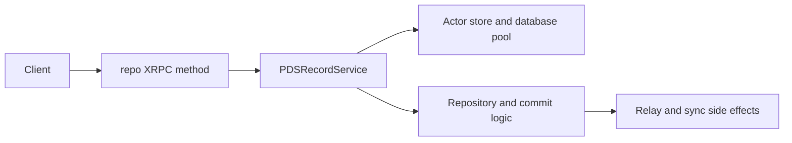

# Tutorial 3: Records

## Overview

This tutorial explains how record writes move through Garazyk. For contributors, record behavior is where the application stops being "a server with accounts" and becomes "a repository system with protocol invariants."

That matters because record work almost never belongs to one file. A single change can touch:

- request validation,
- record service logic,
- actor storage,
- repository state,
- commit generation,
- and downstream sync behavior.

## What You'll Build

You will build a contributor map of the record write path:

- XRPC method entry
- record service behavior
- actor-store persistence
- repository and commit consequences
- verification through tests and small manual checks

**Learning Objectives:**
- Understand how record creation differs from general account or auth logic
- Identify the relationship between record service and repository state
- See how storage splits between service and actor data
- Verify a write path without relying on oversized example payloads

**Estimated Time:** 40-50 minutes

## Prerequisites

- Complete [Tutorial 2: Accounts](./tutorial-2-accounts)
- Read [Request Lifecycle](../01-getting-started/request-lifecycle)
- Be comfortable with the idea of actor-local repository state

## Architecture Overview



## Step 1: Start with the Record Service

Begin with:

- `Garazyk/Sources/App/Services/PDSRecordService.m`
- `Garazyk/Sources/App/Services/PDSRecordService.h`

The service boundary is where the record path becomes legible. It answers:

- what constitutes a valid record operation,
- how record values are normalized,
- and when repository-level work must happen after the write.

## Step 2: Follow the Persistence Boundary

Record writes do not live in the same persistence world as shared service metadata. They primarily belong to per-actor state.

That is why contributors need to understand:

- database pool behavior,
- actor stores,
- and how repository paths consume that data.

If you skip this boundary and think only in terms of request handlers, repository bugs will feel mysterious.

## Step 3: Connect Record Semantics to Repository Semantics

This is the most important conceptual step in the tutorial.

A record change is not just "write JSON somewhere." It has repository meaning:

- the record path must stay coherent,
- the repository root may change,
- commits must remain valid,
- and sync surfaces may need to observe the change.

That is why record changes so often require reading both service and repository code.

## Step 4: Trace the Network Entry Point

Once the service and repository boundaries are clear, read the XRPC registration and handler path that exposes record behavior publicly.

This is where you confirm:

- which repo methods are implemented,
- how input validation is applied,
- and where auth constraints enter the path.

Do this after the service read, not before. It makes the network code much easier to interpret.

## Step 5: Read the Tests That Protect the Write Path

Useful starting tests:

- `Garazyk/Tests/App/Services/PDSRecordServiceTests.m`
- `Garazyk/Tests/App/Services/PDSRecordTombstoneTests.m`
- `Garazyk/Tests/Repository/RepoCommitTests.m`
- `Garazyk/Tests/Core/RecordPathValidationTests.m`

Together they show which invariants the project already treats as critical:

- record identity,
- delete and tombstone behavior,
- path validation,
- commit consequences.

## Step 6: Verify with One Small Write

A single small record write is usually enough to validate the end-to-end path. You do not need a tutorial page full of large payload dumps to prove the system works.

The better question is:

> Did the write reach the right store, preserve repository invariants, and remain inspectable afterward?

That can be checked with a small request plus repository inspection tooling.

## Troubleshooting

| Symptom | Likely cause | Where to look |
| --- | --- | --- |
| write fails before touching storage | validation or auth issue | XRPC path and input validation |
| write succeeds but repository state looks wrong | repository follow-up logic | record service plus repository code |
| record can be created but not retrieved | actor-store or path issue | actor DB layer and record lookup path |
| sync side effects do not reflect the write | side-effect ordering issue | repository and sync layers |

## Next Steps

1. Continue to [Tutorial 4: Authentication](./tutorial-4-auth).
2. Revisit [Tutorial 5: Firehose](./tutorial-5-firehose) after you are comfortable with record side effects.
3. Use [Testing Map](../11-reference/testing-map) to choose the smallest useful regression suite.

## Summary

Record work in Garazyk is the bridge between application logic and repository correctness. The key contributor habit is to read it as a chain:

- endpoint,
- service,
- actor persistence,
- repository integrity,
- sync consequences.

That is the frame that keeps record changes safe.

## Appendix

### Small record verification loop

```bash
./build/bin/kaszlak repo list did:plc:example
./build/bin/kaszlak repo root did:plc:example
curl -sS "http://127.0.0.1:2583/xrpc/com.atproto.repo.listRecords?repo=did:plc:example&collection=app.bsky.feed.post" | jq .
```
