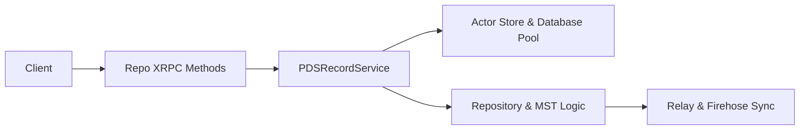

# Tutorial 3: Records

This tutorial traces the lifecycle of a record write in Garazyk. Unlike simple database updates, record writes in an ATProto PDS are cryptographic operations that affect the repository's state root and the network-wide firehose.

## Learning Objectives
- Map the record write path from the XRPC entry point to the actor's persistent store.
- Identify the relationship between the `PDSRecordService` and the repository's Merkle Search Tree (MST).
- Understand how storage is isolated between service-wide metadata and actor-specific data.
- Verify write operations through automated tests and manual inspection.

## Architecture Overview



## Step 1: The Record Service

The `PDSRecordService` acts as the primary orchestrator for record operations. It handles normalization, validation, and ensures that repository-level work occurs after a successful write.

- **`Garazyk/Sources/Services/PDS/PDSRecordService.m`**: Manages the high-level logic for creating, updating, and deleting records.
- **`Garazyk/Sources/Services/PDS/PDSRecordService.h`**: Defines the interface for record retrieval and manipulation.

Observe how the service interacts with the `PDSRepoManager` to update the repository state.

## Step 2: Persistence and Actor Isolation

Records are not stored in a global table. Instead, each actor (user) has a dedicated SQLite database managed by the `ActorStore`.

- **Database Pooling**: The `DatabasePool` manages connections to these individual databases to keep resource usage efficient.
- **Actor Store**: The `ActorStore` handles the low-level SQL operations for an actor's blocks, records, and MST nodes.

Understanding this boundary is critical for debugging data corruption or isolation issues.

## Step 3: Repository Invariants

Every record operation has cryptographic consequences. A record write is essentially an update to a Merkle Search Tree (MST).

- **Commit Generation**: After a record is added, the PDS generates a new repository commit.
- **State Roots**: The root CID of the MST is updated to reflect the new state.
- **Firehose Broadcasting**: The new commit is broadcast to the firehose, allowing relays to sync the change.

## Step 4: Network Entry Points

The `com.atproto.repo.*` methods expose record behavior to the network.

1. **`createRecord`**: Validates the record against its lexicon and adds it to the actor's repository.
2. **`putRecord`**: Performs an idempotent write (upsert).
3. **`deleteRecord`**: Removes the record and potentially leaves a tombstone to maintain MST integrity.

Trace these handlers in `PDSRepoHandlers.m` to see how they invoke the `PDSRecordService`.

## Step 5: Verification and Testing

Verify the record write path using these focused test suites:

- **`Garazyk/Tests/App/Services/PDSRecordServiceTests.m`**: Tests high-level record logic and validation.
- **`Garazyk/Tests/Repository/RepoCommitTests.m`**: Ensures commits are correctly signed and formatted.
- **`Garazyk/Tests/Core/RecordPathValidationTests.m`**: Validates NSID and rkey constraints.

## Troubleshooting

- **Write fails validation**: Check the lexicon schema and verify that the `collection` and `rkey` match protocol requirements.
- **State root mismatch**: This usually indicates a bug in the MST implementation or a non-canonical CBOR encoding during commit generation.
- **Record missing from firehose**: Ensure that the `PDSRepoManager` successfully notified the `CommitBroadcaster` after the write.

## Next Steps

1. Continue to [Tutorial 4: Authentication](./tutorial-4-auth) to learn how these writes are authorized.
2. Explore [Tutorial 5: Firehose](./tutorial-5-firehose) to see how records are streamed to the network.

## Appendix: Manual Verification

```bash
# Start the server
./build/bin/kaszlak serve --config ./config/examples/local.json --foreground &
PID=$!
sleep 2

# List records for a specific repository
curl -sS "http://127.0.0.1:2583/xrpc/com.atproto.repo.listRecords?repo=did:plc:example&collection=app.bsky.feed.post" | jq .

# Check the repository root CID
./build/bin/kaszlak repo root did:plc:example

kill $PID
```

## Related

- [Documentation Map](../11-reference/documentation-map.md)
- [Contributor Guide](../index.md)
- [Repository Documentation Index](../repo-index/index.md)

