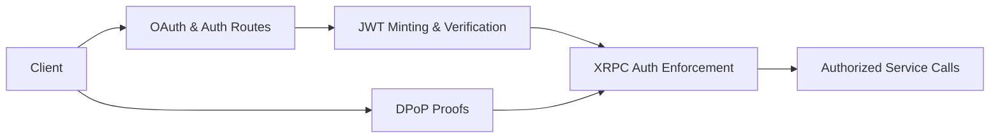

# Tutorial 4: Authentication

Authentication in Garazyk manages the trust boundaries between the client, the PDS, and other network actors. This tutorial covers the integration of JWT, DPoP, and OAuth2 within the repository.

## Learning Objectives
- Distinguish between the roles of JWT, DPoP, and OAuth2 in the AT Protocol.
- Identify the core implementation files that own security behavior.
- Understand how server configuration affects token issuance and verification.
- Verify authentication changes using the project's test suite.

## Architecture Overview



## Step 1: Authentication Layers

To navigate the codebase, it is helpful to treat each security component as a distinct layer:

- **JWT**: Manages token structure, signing, and verification.
- **DPoP**: Handles cryptographic binding of tokens to client keys to prevent replay attacks.
- **OAuth2**: Implements the authorization server behavior, including route handling and client metadata.
- **XRPC Enforcement**: Applies token expectations at the method boundary (e.g., ensuring a repository write is authorized for that specific DID).

## Step 2: Core Implementation Files

Start your investigation with these files:

- **`Garazyk/Sources/Auth/JWT.m`**: The foundation for minting and validating access and refresh tokens.
- **`Garazyk/Sources/Auth/OAuth2.m`**: Contains the logic for the OAuth2 authorization flow.
- **`Garazyk/Sources/Auth/DPoPUtil.m`**: Utilities for verifying DPoP proofs.
- **`Garazyk/Sources/Auth/Crypto/AuthCryptoDPoP.m`**: Platform-specific cryptographic primitives for DPoP.

As you read, look for how `ATProtoServiceConfiguration` values like `issuerDid` influence these components.

## Step 3: Endpoint Enforcement

A valid token is only useful if it is correctly enforced at the network layer.

1. **Route Middleware**: Observe how `ATProtoHttpServerBuilder.m` applies authentication requirements to specific XRPC methods.
2. **Auth Context**: See how the `PDSAuthContext` is populated from the request headers and passed to the handlers.
3. **Identity Verification**: Confirm that handlers verify the token's `sub` (subject) matches the repository being modified.

## Step 4: Verification and Testing

Authentication has the most rigorous test coverage in the project. Use these tests to validate your changes:

- **`Garazyk/Tests/Auth/JWTTests.m`**: Validates token signing and expiration logic.
- **`Garazyk/Tests/Auth/OAuthDPoPTests.m`**: Tests the cryptographic binding of DPoP.
- **`Garazyk/Tests/Security/JWTSecurityTests.m`**: Specifically targets common vulnerabilities like the "none" algorithm or signature stripping.
- **`Garazyk/Tests/Auth/OAuthIntegrationTests.m`**: Runs the full end-to-end authorization code flow.

## Troubleshooting

- **Tokens rejected by server**: Verify that the `issuer` in the token matches the server's configured `issuerDid`.
- **DPoP proof failure**: Check for clock skew between the client and server, or ensure the `htu` and `htm` claims match the current request.
- **OAuth metadata 404**: Confirm that the `.well-known/oauth-authorization-server` route is correctly registered in the server builder.

## Next Steps

1. Move to [Tutorial 5: Firehose](./tutorial-5-firehose) to see how authenticated events are streamed.
2. Review [Tutorial 10: OAuth2 & DPoP](./tutorial-10-oauth-dpop) for a deep dive into the high-security handshake.

## Appendix: Manual Verification

```bash
# Start the server
./build/bin/kaszlak serve --config ./config/examples/local.json --foreground &
PID=$!
sleep 2

# Verify OAuth2 metadata is reachable
curl -sS http://127.0.0.1:2583/.well-known/oauth-authorization-server | jq .

# Verify discovery metadata
curl -sS http://127.0.0.1:2583/xrpc/com.atproto.server.describeServer | jq .

kill $PID
```

## Related

- [Documentation Map](../11-reference/documentation-map.md)
- [Contributor Guide](../index.md)
- [Repository Documentation Index](../repo-index/index.md)

