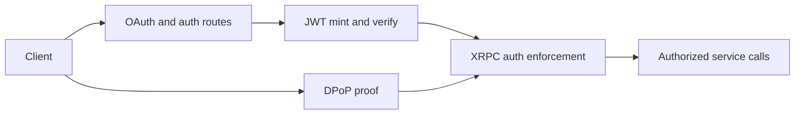

# Tutorial 4: Authentication

## Overview

Authentication in Garazyk is where the repo’s contributor story becomes security-sensitive. This tutorial is therefore organized around trust boundaries, not around long code listings.

The real system combines:

- issuer and token rules,
- JWT signing and verification,
- DPoP proof handling,
- OAuth authorization-server behavior,
- and XRPC auth enforcement.

Contributors who understand those boundaries make better changes and avoid cargo-culting old examples into security-critical code.

## What You'll Build

You will build a mental model of the authentication stack:

- what the server signs,
- what it verifies,
- where OAuth routes live,
- how DPoP changes token usage,
- and where endpoint auth policy is enforced.

**Learning Objectives:**
- Distinguish JWT, DPoP, OAuth, and XRPC auth responsibilities
- Identify the core files that own security behavior
- Understand how issuer configuration affects runtime behavior
- Verify auth changes with focused tests instead of giant example payloads

**Estimated Time:** 45-60 minutes

## Prerequisites

- Complete [Tutorial 2: Accounts](./tutorial-2-accounts)
- Read [Config Reference](../11-reference/config-reference)
- Read [Security Best Practices](../06-authentication/security-best-practices)

## Architecture Overview



## Step 1: Separate the Auth Layers

Start by assigning each subsystem a clear job:

| Subsystem | Primary role |
| --- | --- |
| `JWT` | token structure, signing, verification, issuer claims |
| `DPoPUtil` and related crypto helpers | proof binding and verification |
| `OAuth2` and `OAuth2Handler` | authorization-server behavior and route handling |
| XRPC auth helpers | enforcing token expectations at method boundaries |

This separation is the most important contributor takeaway. Security docs drift quickly when they describe all of auth as one undifferentiated thing.

## Step 2: Trace Issuer and Configuration Effects

Authentication behavior depends heavily on configuration:

- explicit issuer
- local versus public host assumptions
- token TTLs
- app-view and service-auth expectations

If the auth path looks wrong, the bug may be configuration-driven rather than algorithmic. That is why contributors should read `PDSConfiguration` together with the auth code instead of treating config as an afterthought.

## Step 3: Read the Core Files

The most useful source entry points are:

- `Garazyk/Sources/Auth/JWT.m`
- `Garazyk/Sources/Auth/OAuth2.m`
- `Garazyk/Sources/Auth/OAuth2Handler.m`
- `Garazyk/Sources/Auth/DPoPUtil.m`
- `Garazyk/Sources/Auth/Crypto/AuthCryptoDPoP.m`

Read them with one question in mind:

> Which invariant does this file protect that another layer should not duplicate?

That question keeps the system readable.

## Step 4: Connect Auth to Endpoint Enforcement

Security behavior is not finished when tokens are minted correctly. It matters only if the right endpoints enforce the right expectations.

The network layer is where contributors confirm:

- which endpoints require auth,
- which tokens are accepted,
- how issuer and audience checks are interpreted,
- and where auth failures are turned into client-visible errors.

This is also the point where an apparently correct JWT implementation can still produce the wrong system behavior.

## Step 5: Use the Tests as the Specification

Auth has one of the strongest test surfaces in the repo. Start with:

- `Garazyk/Tests/Auth/JWTTests.m`
- `Garazyk/Tests/Auth/OAuth2Tests.m`
- `Garazyk/Tests/Auth/OAuthDPoPTests.m`
- `Garazyk/Tests/Auth/OAuthIntegrationTests.m`
- `Garazyk/Tests/Security/JWTSecurityTests.m`

These tests are a better contributor guide than old tutorial-sized code blocks because they show what the project is actually protecting today.

## Step 6: Verify Discovery and Metadata Too

Authentication changes often leak into discovery surfaces:

- OAuth metadata
- well-known endpoints
- discovery output tied to issuer configuration

That means auth work is never just an internal crypto concern. It changes what clients learn about the server.

## Troubleshooting

| Symptom | Likely cause | Where to look |
| --- | --- | --- |
| tokens mint but requests still fail | endpoint enforcement mismatch | XRPC auth helpers and route behavior |
| auth works locally but not on public host | issuer mismatch | config plus JWT/OAuth metadata |
| DPoP flow fails intermittently | proof construction or replay assumptions | DPoP utilities and related tests |
| OAuth routes behave unexpectedly | route handler and metadata drift | `OAuth2Handler`, server metadata tests |

## Next Steps

1. Continue to [Tutorial 5: Firehose](./tutorial-5-firehose).
2. Use [Explorer, OpenAPI & UI](../11-reference/explorer-openapi-ui) when validating auth-sensitive tooling surfaces.
3. Revisit [Tutorial 6: Deployment](./tutorial-6-deployment) for production-safe auth settings.

## Summary

Authentication in Garazyk is a layered trust system:

- configuration defines identity and policy,
- JWT and DPoP define token semantics,
- OAuth exposes authorization-server behavior,
- and XRPC enforcement turns those rules into real access control.

Understanding those boundaries is the difference between a safe auth change and a superficial one.

## Appendix

### Small auth verification loop

```bash
./build/bin/kaszlak serve --config ./config.json --data-dir ./pds-data --foreground &
PID=$!
sleep 2
curl -sS http://127.0.0.1:2583/.well-known/oauth-authorization-server | jq .
curl -sS http://127.0.0.1:2583/xrpc/com.atproto.server.describeServer | jq .
./build/tests/AllTests -XCTest JWTTests
kill $PID
```


## Related

- [Documentation Map](../11-reference/documentation-map.md)
- [Contributor Guide](../index.md)
- [Repository Documentation Index](../repo-index/index.md)

