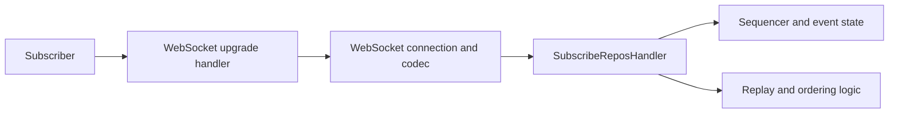

# Tutorial 5: Firehose

The firehose is where Garazyk moves from simple request-response to continuous protocol participation. Working on the firehose requires thinking about event ordering, connection lifecycles, and replay semantics.

This tutorial maps the flow from WebSocket upgrade to `subscribeRepos` behavior.

## Architecture

## Separate Upgrade from Protocol Semantics

Upgrade negotiation and event streaming are distinct concerns. The stack separates them into specific layers:

- **Upgrade Negotiation:** Handles the initial HTTP-to-WebSocket transition.
- **Connection Lifecycle:** Manages the active socket state.
- **Frame Codec:** Handles the bit-level framing and masking.
- **Protocol Semantics:** Implements the `subscribeRepos` logic.

### Core Sync Files

Start with these files to understand the boundaries:

- `Garazyk/Sources/Network/WebSocketUpgradeHandler.m`
- `Garazyk/Sources/Sync/Firehose/SubscribeReposHandler.m`
- `Garazyk/Sources/Sync/WebSocketConnection.m`
- `Garazyk/Sources/Sync/WebSocketCodec.m`

## Connecting Writes to the Stream

The firehose stream is downstream of repository truth. Every repository mutation should produce a corresponding event. When debugging, always ask what event was expected and how the sequencer preserved its order.

## Ordering, Replay, and Backpressure

A robust firehose implementation must address several system-level questions:

- **Ordering:** Is the sequence number strictly monotonic?
- **Replay:** Can a client catch up from a specific cursor?
- **Backpressure:** How does the server handle slow subscribers?
- **Liveness:** How are connections kept alive and when are they dropped?

The [SubscribeReposHandlerTests.m](https://github.com/google/garazyk/blob/main/Garazyk/Tests/Sync/SubscribeReposHandlerTests.m) (and related tests) are the definitive source for which of these guarantees the project enforces.

## Verification

A successful connection is only the first step. Verify the stream by checking:

1. **Upgrade Success:** Does the handshake complete?
2. **Event Delivery:** Do live commits appear immediately?
3. **Replay Logic:** Does providing a cursor trigger the expected catch-up?
4. **Resilience:** How does the server respond when the client stops reading?

## Troubleshooting

| Symptom | Likely cause | Where to look |
| --- | --- | --- |
| Upgrade fails | Route or handshake mismatch | `WebSocketUpgradeHandler` |
| No events arrive | Subscription or publish failure | `SubscribeReposHandler` |
| Strange replay | Cursor or sequencer mismatch | Replay logic and sequencer state |
| Degraded performance | Backpressure or policy issues | `WebSocketHeartbeatPolicy` |

## Next Steps

- [Network from Scratch](./network-from-scratch/) covers the transport and framing internals.
- [Tutorial 14: Advanced Firehose](./tutorial-14-advanced-firehose) covers filtering and backfill.
- [Testing Map](../11-reference/testing-map) helps you choose the right integration suite.
- [Tutorial 6: Deployment](./tutorial-6-deployment) explains how to run this in production.
