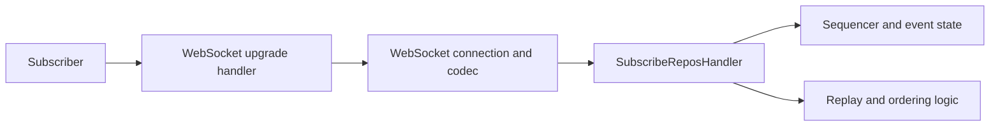

# Tutorial 5: Firehose

## Overview

The firehose is where Garazyk stops feeling like a request-response server and starts behaving like a continuously synchronized protocol participant. Contributors working here need to think about ordering, upgrades, connection lifecycle, and replay semantics, not just a single endpoint handler.

This tutorial therefore focuses on the real flow from WebSocket upgrade to `subscribeRepos` behavior instead of trying to inline a full reimplementation.

## What You'll Build

You will build a contributor mental model of the firehose stack:

- HTTP upgrade path
- WebSocket connection handling
- `subscribeRepos` semantics
- event ordering and replay implications
- verification through targeted tests and small manual checks

**Learning Objectives:**
- Understand how WebSocket upgrade and sync logic are separated
- Identify the core files that own connection lifecycle and firehose behavior
- Connect record writes to downstream sync consequences
- Verify firehose behavior without relying on oversized code dumps

**Estimated Time:** 40-50 minutes

## Prerequisites

- Complete [Tutorial 3: Records](./tutorial-3-records)
- Complete [Tutorial 4: Authentication](./tutorial-4-auth)
- Read [Request Lifecycle](../01-getting-started/request-lifecycle)

## Architecture Overview



## Step 1: Separate Upgrade from Protocol Semantics

One of the easiest mistakes in firehose work is to treat the WebSocket upgrade as the same concern as the event stream itself.

In practice, there are different responsibilities:

- upgrade negotiation,
- connection lifecycle,
- frame parsing and codec behavior,
- heartbeat and backpressure policies,
- protocol-level event semantics.

Keeping those boundaries clear is what makes firehose bugs debuggable.

## Step 2: Read the Core Sync Files

Start with these files:

- `Garazyk/Sources/Network/WebSocketUpgradeHandler.m`
- `Garazyk/Sources/Sync/Firehose/SubscribeReposHandler.m`
- `Garazyk/Sources/Sync/WebSocketServer.m`
- `Garazyk/Sources/Sync/WebSocketConnection.m`
- `Garazyk/Sources/Sync/WebSocketCodec.m`

Those files tell you which parts of the stack are transport mechanics and which parts are firehose-specific behavior.

## Step 3: Connect Firehose Output to Record Writes

Firehose behavior makes more sense after record semantics are already familiar. The important contributor question is:

> What event should exist after a repository mutation, and what ordering guarantees does the stream attempt to preserve?

That is why the firehose tutorial belongs after records. Sync is downstream of repository truth.

## Step 4: Understand Ordering, Replay, and Backpressure

The firehose must answer:

- was ordering preserved,
- can a client replay from a cursor,
- what happens to slow subscribers,
- how are connections kept alive,
- and what counts as recoverable versus fatal connection state?

These are system-level questions, and the tests are the fastest way to understand which guarantees the project currently enforces.

## Step 5: Read the Matching Tests

Start with:

- `Garazyk/Tests/Sync/SubscribeReposHandlerTests.m`
- `Garazyk/Tests/Sync/FirehoseTests.m`
- `Garazyk/Tests/Sync/FirehoseConformanceTests.m`
- `Garazyk/Tests/Sync/WebSocketConnectionTests.m`
- `Garazyk/Tests/Network/WebSocketUpgradeHandlerTests.m`
- `Garazyk/Tests/Integration/FirehoseIntegrationTests.m`

Together they explain:

- what upgrade behavior is expected,
- what event ordering is protected,
- and how conformance is validated at the sync layer.

## Step 6: Verify the Stream, Not Just the Socket

A successful WebSocket connection does not prove the firehose is correct. Contributors should verify:

- upgrade success,
- event delivery,
- ordering or replay expectations,
- and behavior under slow or repeated subscription patterns.

That is the difference between "the socket opened" and "the firehose works."

## Troubleshooting

| Symptom | Likely cause | Where to look |
| --- | --- | --- |
| upgrade fails immediately | route or upgrade negotiation issue | upgrade handler and network layer |
| socket opens but no events arrive | downstream subscription or event publish issue | `SubscribeReposHandler` and write side effects |
| replay behaves strangely | cursor or sequencer mismatch | replay logic and sequencer state |
| stream works for one client but degrades under load | backpressure or connection policy issue | connection, codec, and heartbeat policy |

## Next Steps

1. Take the [Subguide: HTTP + WebSocket from Scratch](./network-from-scratch/) if you want the transport and framing internals behind this tutorial.
2. Move to [Tutorial 14: Advanced Firehose (Filtering & Backfill)](./tutorial-14-advanced-firehose) for production-grade features like backfill and backpressure.
3. Use [Testing Map](../11-reference/testing-map) to choose focused sync and integration suites.
4. Continue to [Tutorial 6: Deployment](./tutorial-6-deployment).
5. Revisit [Tutorial 3: Records](./tutorial-3-records) whenever firehose behavior depends on write semantics.

## Summary

The firehose is a layered subsystem:

- upgrade handling,
- connection management,
- WebSocket framing,
- `subscribeRepos` protocol behavior,
- and repository-derived event semantics.

Contributors who debug it at the right layer move much faster than contributors who treat it as one giant handler.

## Appendix

### Small verification loop

```bash
./build/bin/kaszlak serve --config ./config.json --data-dir ./pds-data --foreground &
PID=$!
sleep 2
./build/tests/AllTests -XCTest SubscribeReposHandlerTests
./build/tests/AllTests -XCTest WebSocketUpgradeHandlerTests
# Note: websocat will run until interrupted
websocat ws://127.0.0.1:2583/xrpc/com.atproto.sync.subscribeRepos
kill $PID
```


## Related

- [Documentation Map](../11-reference/documentation-map.md)
- [Contributor Guide](../index.md)
- [Repository Documentation Index](../repo-index/index.md)

