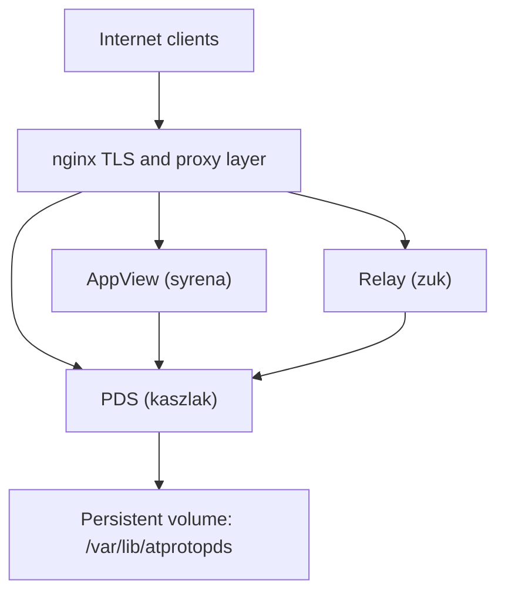

# Tutorial 6: Production Deployment

This tutorial covers the production runtime: Linux containers, Nginx reverse proxying, and the configuration required for protocol interoperability.

## Deployment Topology



### Infrastructure Components
- **Nginx:** Handles TLS termination and forwards trusted proxy headers.
- **PDS (kaszlak):** Remains isolated behind the proxy.
- **Persistence:** Durable state is stored in explicit Docker volumes.

## Docker Compose

The canonical Docker setup is in `docker/pds/`. 

The `docker-compose.yml` handles:
- Building from `docker/Dockerfile.gnustep`.
- Mounting `/var/lib/atprotopds` as a persistent volume.
- Loading `config.json` as read-only.
- Setting `PDS_TRUST_PROXY_HEADERS=1` to allow Nginx to pass client IP and protocol information.

## Configuration Requirements

Standard interoperability requires these settings:

| Setting | Recommendation | Rationale |
| --- | --- | --- |
| `session.invite_code_required` | `true` | Prevents open registration on the public web. |
| `plc.url` | `https://plc.directory` | Resolves network-wide identity. |
| `server.issuer` | Your public HTTPS URL | Defines the discovery identity for clients. |
| `PDS_TRUST_PROXY_HEADERS` | `1` | Required for correct IP logging and protocol detection behind Nginx. |

### Upstream Services

Configure your PDS to communicate with the wider network:

```json
{
  "appview": {
    "url": "https://api.bsky.app",
    "did": "did:web:api.bsky.app"
  },
  "relays": ["https://bsky.network"]
}
```

## Running the PDS

Initialize the volume and start the services from the `docker/pds` directory:

```bash
docker volume create local_pds_data
docker compose up -d
docker compose logs -f pds
```

Verify the deployment by checking the server's public metadata:

```bash
curl -sS https://your-pds.com/xrpc/com.atproto.server.describeServer | jq .
```

## Backup and Recovery

All critical state lives in the `/var/lib/atprotopds` volume. Back up the contents of this volume directly. Do not rely on container snapshots for data durability.

## Common Pitfalls

- **Relative Paths:** Running `docker compose` from the repository root instead of `docker/pds/`.
- **Insecure Defaults:** Accidentally using development settings (like mock PLC) in production.
- **Direct Access:** Exposing the PDS port (usually 2583) to the internet instead of routing through Nginx.

## See Also

- [Configuration Reference](../11-reference/config-reference)
- [Performance Monitoring](../11-reference/performance-monitoring)
