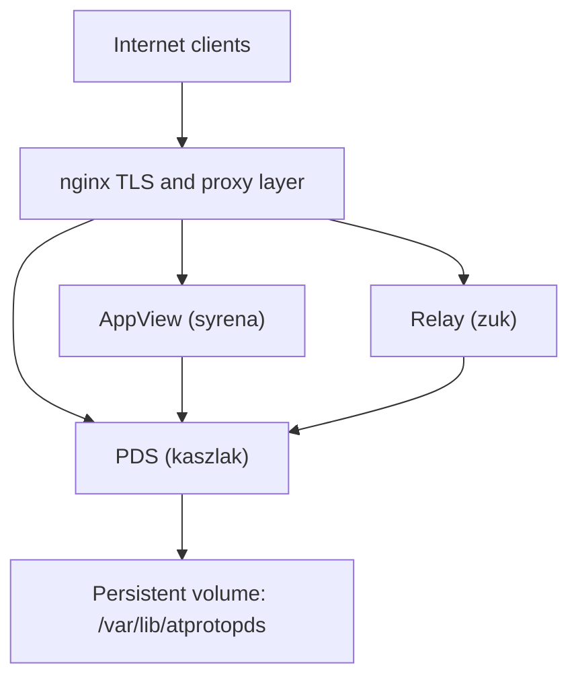

# Tutorial 6: Production Deployment

## Overview

This tutorial describes the production deployment model: a Linux container runtime using Docker Compose, Nginx as a reverse proxy, and explicit configuration for protocol interoperability.

**Learning Objectives:**
- Understand the production topology used by the deployment docs.
- Configure the PDS with production-safe settings.
- Verify public discovery routing after deploy.
- Identify common deployment mistakes before they reach users.

**Estimated Time:** 35-50 minutes

## Prerequisites

- Docker and Docker Compose installed on the target host.
- A DNS name pointing at the deployment host.
- TLS certificates managed by Nginx or the deployment platform.
- Access to the repository checkout on the deployment host.

## Deployment Topology



### Key Principles
- **Nginx**: Handles TLS termination and trusted proxy headers.
- **Isolation**: The PDS remains behind the reverse proxy.
- **Persistence**: Durable state is mounted via explicit volumes.

## Docker Compose Configuration

The canonical Docker Compose root is located in `docker/pds/`. Commands should be executed from this directory to ensure correct path resolution for configuration and volumes.

The `docker-compose.yml` file performs the following:
- Builds from `docker/Dockerfile.gnustep`.
- Mounts `/var/lib/atprotopds` as the persistent data volume.
- Mounts `docker/pds/config.json` as a read-only configuration.
- Sets `PDS_TRUST_PROXY_HEADERS=1` to support reverse proxying.

## Production Configuration

These settings are required for a standard, interoperable PDS deployment.

| Setting | Value | Rationale |
| --- | --- | --- |
| `session.invite_code_required` | `true` | Prevents unauthorized registration. |
| `plc.url` | `https://plc.directory` | Ensures network-wide DID resolution. |
| `server.issuer` | Public HTTPS URL | Sets the discovery identity for clients. |
| `PDS_TRUST_PROXY_HEADERS` | `1` | Enables Nginx header forwarding. |

### AppView and Relay Settings
Ensure the AppView configuration uses the correct key format:

```json
{
  "appview": {
    "url": "https://api.bsky.app",
    "did": "did:web:api.bsky.app",
    "local_enabled": false
  },
  "relays": ["https://bsky.network"]
}
```

## Verification

Verify a new deployment by checking discovery metadata and public routing.

```bash
cd docker/pds
docker compose up -d
docker compose logs --tail=100 pds
curl -sS https://your-pds.com/xrpc/com.atproto.server.describeServer | jq .
```

## Backup and Recovery

Durable state is stored in the `/var/lib/atprotopds` volume. Backup procedures should target the contents of this volume rather than the container itself.

## Troubleshooting

- **Working Directory**: Running compose commands from the repository root instead of `docker/pds/`.
- **Local Defaults**: Using development settings (e.g., mock PLC) in a production environment.
- **Direct Exposure**: Bypassing Nginx and exposing the PDS port directly to the internet.

## Next Steps

1. Review [Configuration Reference](../11-reference/config-reference).
2. Review [Monitoring](../11-reference/performance-monitoring) before enabling public traffic.

## Summary

A production deployment should make the public HTTPS issuer, PLC directory, proxy headers, and persistent data volume explicit. Treat local defaults as developer conveniences, not deployment policy.

## Related

- [Documentation Map](../11-reference/documentation-map.md)
- [Contributor Guide](../index.md)
- [Repository Documentation Index](../repo-index/index.md)
