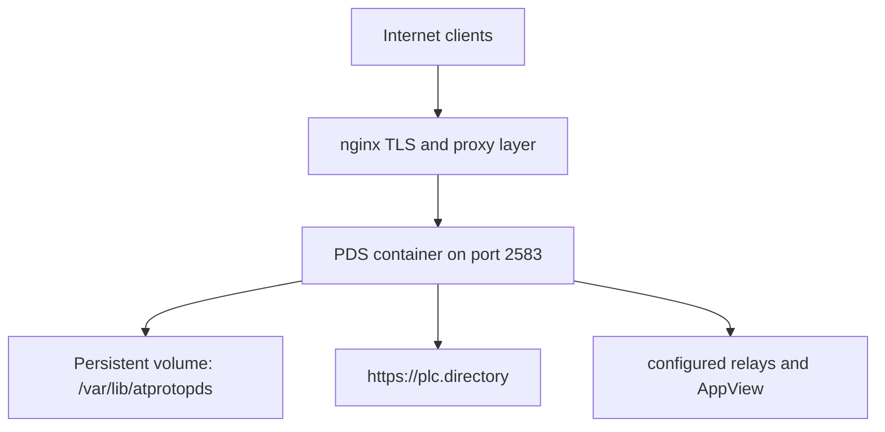

# Tutorial 6: Production Deployment

## Overview

This tutorial explains the production deployment model that this repository actually uses: Linux container runtime, `docker/pds/` as the compose root, nginx in front of the PDS, and explicit production safety settings.

The goal is not to overwhelm you with a giant shell transcript. The goal is to explain why the deployment is shaped this way and which configuration choices are non-negotiable if you want an interoperable, supportable PDS.

By the end, you should understand:

- why compose must run from `docker/pds/`,
- how the checked-in compose file and config mount the service,
- which config keys matter most for production safety,
- and how to verify the deployment without guessing.

**Learning Objectives:**
- Understand the repository’s canonical production topology
- Use the checked-in compose workflow instead of ad hoc root-level commands
- Recognize the difference between development-friendly defaults and production-safe settings
- Verify deployment health through discovery, logs, and configuration-sensitive checks

**Estimated Time:** 45-60 minutes

## Prerequisites

- Comfortable with the contributor workflow in [Setup](../01-getting-started/setup)
- Familiarity with [Config Reference](../11-reference/config-reference)
- Basic Docker and reverse proxy knowledge
- A Linux host or VM for the actual deployment path

## Architecture Overview

The production model is intentionally simple:



Why this shape matters:

- nginx owns TLS and trusted proxy headers
- the PDS stays behind the reverse proxy instead of being exposed directly
- persistent state is mounted explicitly
- deployment behavior is reproducible because the compose entrypoint is checked into the repo

## The Canonical Compose Root

For this repository, production compose commands belong in:

```text
docker/pds/
```

That is not an optional style choice. The checked-in compose file and config path assumptions live there, and the repository’s own operating guidance depends on that location.

## What the Checked-In Compose File Does

The current compose file:

- builds from `docker/Dockerfile.gnustep`
- mounts `/var/lib/atprotopds` as the data volume
- mounts `docker/pds/config.json` read-only
- sets `PDS_TRUST_PROXY_HEADERS=1`
- starts the service with `serve --config /var/lib/atprotopds/config.json --foreground`

That means the contributor mental model should be:

1. compose provides the runtime shell,
2. the config file provides the persisted policy,
3. environment variables provide deployment-time overrides,
4. nginx provides the public HTTPS boundary.

## Production-Safe Settings That Matter Most

These are the settings that contributors should reason about first when reading or changing deployment docs.

| Setting | Production expectation | Why it matters |
| --- | --- | --- |
| `session.invite_code_required` | `true` | avoids open registration and abuse |
| `plc.url` | `https://plc.directory` | keeps the PDS interoperable with the network |
| `server.issuer` | public HTTPS issuer | determines discovery and token expectations |
| `PDS_TRUST_PROXY_HEADERS` | enabled behind nginx | preserves correct upstream client context |

Two contributor rules follow from that table:

- never cargo-cult local defaults into deployment configs,
- and never document a production path that bypasses nginx and trusted proxy handling.

## AppView and Relay Configuration

Production deployments often need upstream read-model integration and relay notifications, but the loader expects current key shapes:

```json
{
  "appview": {
    "url": "https://api.bsky.app",
    "did": "did:web:api.bsky.app",
    "local_enabled": false
  },
  "relays": ["https://bsky.network"]
}
```

Keep the structure aligned with `PDSConfiguration`, not with older camelCase examples.

## Verification Strategy

A deployment is not verified because `docker compose up` returned successfully. Verify the things clients and operators actually depend on:

1. discovery metadata
2. logs
3. mounted config path
4. trusted proxy behavior
5. public routing through nginx

## Core Verification Checks

```bash
cd docker/pds
docker compose up -d
docker compose logs --tail=100 pds
curl -sS http://localhost:2583/xrpc/com.atproto.server.describeServer | jq .
```

Then verify the public host through nginx, not just the loopback path.

## Backup and Recovery Mindset

The deployment stores durable state under the mounted data volume. That means backup and restore documentation should always talk about the volume and the service data directory, not just the container lifetime.

For contributors, the important design point is:

- application containers are replaceable,
- state is not.

That is why backup procedures belong to the deployment story, not as an afterthought.

## Common Mistakes

### Running compose from the repo root

This is the biggest recurring deployment-doc mistake in the repo history. The canonical compose root is `docker/pds/`.

### Using local-development config values in production

The production story is incompatible with values such as:

- mock PLC
- disabled invite codes
- debug PLC bypasses

### Documenting stale config shapes

Older examples used unsupported camelCase AppView keys. Current docs should use the shape that `PDSConfiguration` loads.

## Troubleshooting

| Symptom | Likely cause | What to check |
| --- | --- | --- |
| `describeServer` looks wrong | issuer or mounted config drift | mounted config and env overrides |
| server works locally but not publicly | nginx or proxy header issue | nginx config and `PDS_TRUST_PROXY_HEADERS` |
| deployment starts but users cannot interoperate | wrong PLC or issuer | `plc.url`, issuer, public DNS |
| compose commands behave strangely | wrong working directory | ensure you are in `docker/pds/` |

## Next Steps

1. Compare the mounted config to [Config Reference](../11-reference/config-reference).
2. Verify contributor tooling surfaces with [Explorer, OpenAPI & UI](../11-reference/explorer-openapi-ui).
3. Use [Testing Map](../11-reference/testing-map) to decide what to run after deployment-sensitive changes.

## Summary

The production deployment model in this repository is intentionally narrow:

- compose from `docker/pds/`,
- nginx in front,
- explicit mounted config,
- explicit production-safe config keys,
- and verification that checks discovery plus public routing, not just container startup.

That is the deployment story contributors should preserve when they touch docs or operations code.

## Appendix

### Minimal production-oriented config shape

```json
{
  "server": {
    "host": "0.0.0.0",
    "port": 2583,
    "data_dir": "/var/lib/atprotopds",
    "issuer": "https://pds.example.com",
    "available_user_domains": ["example.com"]
  },
  "session": { "invite_code_required": true },
  "plc": { "url": "https://plc.directory" }
}
```

### Compose commands

```bash
cd docker/pds
docker compose build
docker compose up -d
docker compose logs -f pds
```
