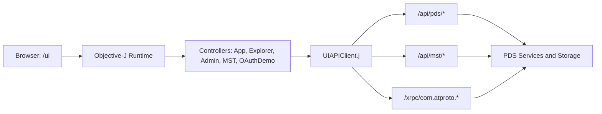
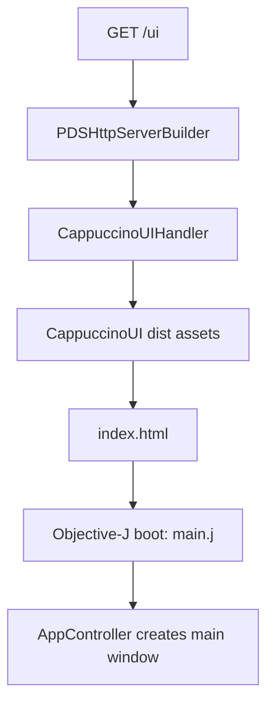
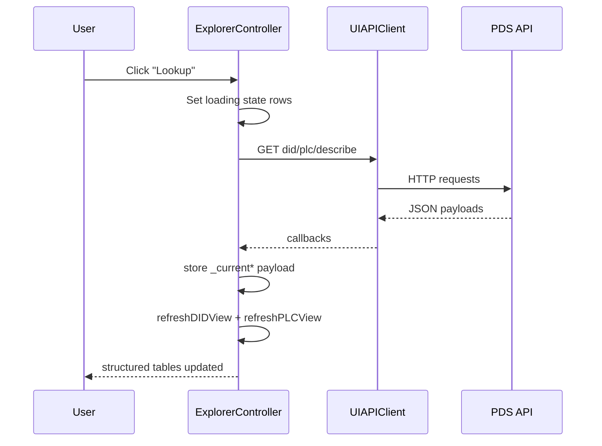

# Tutorial 7: Building the Objective-J PDS Web UI

## Overview

This tutorial explains how to build and evolve the Objective-J web UI for September PDS without inventing new backend APIs. The focus is practical: controller structure, rendering patterns, endpoint wiring, and a repeatable dev loop that works with Docker.

You will use the real app layout in this repository (`/ui`, `CappuccinoUIHandler`, `ExplorerController`, `UIAPIClient`) and build feature slices that are easy to test.

### What You'll Build

- A tabbed Objective-J UI slice that loads live PDS data
- Structured rendering for records, DID documents, and PLC operation logs
- A clean rendered-vs-JSON view mode toggle for debugging
- Endpoint integration using existing `/api/pds/*`, `/api/mst/*`, and XRPC paths

**Learning Objectives:**

- Understand Objective-J and Cappuccino fundamentals used in this codebase
- Design controller state for async API loading and table rendering
- Build non-JSON default views for feeds, records, profiles, and PLC logs
- Avoid common Objective-J runtime errors in table setup and data shapes
- Run a reliable build, Docker, and browser smoke-test workflow

**Estimated Time:** 90-120 minutes

## Prerequisites

- Completed:
  - [Tutorial 1: Hello PDS](./tutorial-1-hello-pds)
  - [Tutorial 3: Records](./tutorial-3-records)
  - [Tutorial 6: Deployment](./tutorial-6-deployment)
- Tools:
  - `npm` (for Cappuccino UI build)
  - Docker + Docker Compose
  - `curl` and `jq`
- Familiarity:
  - Basic Objective-C message syntax
  - HTTP JSON APIs and XRPC terminology

## Architecture At A Glance



### Key Files In This Repo

| File | Role |
| --- | --- |
| `ATProtoPDS/Sources/App/CappuccinoUI/main.j` | UI entrypoint |
| `ATProtoPDS/Sources/App/CappuccinoUI/AppController.j` | Window shell and top-level tabs |
| `ATProtoPDS/Sources/App/CappuccinoUI/ExplorerController.j` | Explore UI state, tables, renderers |
| `ATProtoPDS/Sources/App/CappuccinoUI/UIAPIClient.j` | HTTP client wrappers for backend routes |
| `ATProtoPDS/Sources/App/CappuccinoUI/CappuccinoUIHandler.m` | Serves `/ui` assets |
| `ATProtoPDS/Sources/Network/PDSHttpServerBuilder.m` | Route registration and UI defaults |
| `scripts/build_cappuccino_ui.sh` | Canonical UI build script |

## Objective-J And Cappuccino Crash Course

Objective-J looks like Objective-C, but the execution model is much closer to JavaScript running in the browser. In this repo you work across three layers at once:

| Layer | What it gives you | Example in this repo |
| --- | --- | --- |
| Objective-J syntax | Classes, ivars, selectors, message sends | `@implementation AppController : CPObject` |
| Cappuccino framework | Cocoa-style UI and foundation classes | `CPWindow`, `CPView`, `CPTableView`, `CPTextField` |
| JavaScript runtime | Arrays, objects, functions, browser APIs | `[]`, `{}`, `XMLHttpRequest`, `window.setInterval` |

That mixed model is the first thing to internalize. A `.j` file is not "Objective-C compiled for macOS". It is Cappuccino code that uses Objective-C-style syntax on top of the browser runtime.

### How Objective-J Code Is Structured

Most files in the UI follow the same shape:

1. import Cappuccino frameworks and local classes,
2. declare a class with ivars,
3. initialize state in `init`,
4. build views,
5. respond to user actions through selectors,
6. call browser or HTTP APIs using normal JavaScript objects and functions.

Here is a stripped-down version of the same pattern used by `AppController.j` and `ExplorerController.j`:

```objectivec
@import <Foundation/Foundation.j>
@import <AppKit/AppKit.j>

@implementation ExampleController : CPObject
{
    CPTextField _statusLabel;
    CPString _currentHandle;
    CPArray _accounts;
}

- (id)init
{
    self = [super init];
    if (self)
    {
        _currentHandle = nil;
        _accounts = [];
    }
    return self;
}

- (void)setStatusText:(CPString)text
{
    [_statusLabel setStringValue:text];
}
@end
```

What matters in that example:

- `@implementation` defines the class body.
- The braces after the class name declare ivars such as `_statusLabel`.
- Methods still use selector syntax like `setStatusText:`.
- `self = [super init];` is the normal initializer pattern.
- `[]` is a JavaScript array literal, which Objective-J code uses freely.

### Message Sends, Selectors, and Colons

The most important syntax rule is that Objective-J still uses Objective-C message sends:

```objectivec
[_statusLabel setStringValue:@"Idle"];
[lookupButton setTarget:self];
[lookupButton setAction:@selector(handleLookup:)];
```

Read those as:

- "send `setStringValue:` to `_statusLabel`"
- "send `setTarget:` to `lookupButton`"
- "register the selector `handleLookup:` as the click handler"

The trailing colon in `handleLookup:` means the method accepts one argument. In this UI that argument is usually the sender:

```objectivec
- (void)handleLookup:(id)sender
{
    var query = [_lookupField stringValue];

    if (!query || [query length] === 0)
    {
        [_statusLabel setStringValue:@"Enter a DID or handle first."];
        return;
    }

    [_statusLabel setStringValue:@"Loading..."];
}
```

This is the basic event-handling loop in Cappuccino: a widget targets a controller, then the controller method reads widget state, updates ivars, and refreshes views.

### Objective-J Lives Beside JavaScript, Not Instead of It

A large part of Objective-J fluency is knowing when you are using Cappuccino objects and when you are using raw JavaScript values. This repository does both in the same method.

Example from the real UI patterns:

```objectivec
- (CPArray)normalizedArrayValue:(id)value
{
    if (value === nil || value === undefined)
        return [];
    if (value instanceof Array)
        return value;
    return [value];
}
```

That method is a good illustration of the language boundary:

- `nil` is the Objective-J "no object" value.
- `undefined` comes from JavaScript and browser APIs.
- `instanceof Array` is plain JavaScript type inspection.
- `return [value];` uses a JavaScript array literal to normalize one item into a list.

The same pattern shows up in async code. `UIAPIClient.j` uses browser networking directly, then hands the result back to controller code:

```objectivec
[_apiClient getJSONWithPath:@"/accounts"
              endpointGroup:@"explore"
                queryParams:nil
                 completion:function(statusCode, payload, errorMessage)
{
    if (errorMessage)
    {
        [_statusLabel setStringValue:errorMessage];
        return;
    }

    _accounts = payload.accounts || [];
    [_accountsTable reloadData];
}];
```

Important details here:

- `completion:function(...) { ... }` is a JavaScript function literal, not an Objective-C block.
- `payload.accounts || []` is standard JavaScript fallback logic.
- `[_accountsTable reloadData]` switches back into Cappuccino message-send style.

### A Quick Mental Model That Prevents Most Beginner Mistakes

When reading or writing Objective-J in this repo, use this checklist:

- If it starts with `CP`, it is probably a Cappuccino class and expects message sends.
- If it uses `var`, `function`, `===`, `[]`, or `{}`, you are in JavaScript territory.
- If a method name has colons, every colon corresponds to one argument.
- If UI state changes, update ivars first and then call a refresh or reload method.
- If data came from the network, guard for both `nil` and `undefined`.

### Syntax Quick Map

| Objective-C concept | Objective-J equivalent |
| --- | --- |
| `@interface` and ivars | `@implementation Class : CPObject { ... }` |
| Message send `[obj doThing]` | Same message syntax |
| Cocoa/AppKit | Cappuccino `CP*` classes (`CPView`, `CPTableView`, `CPButton`) |
| Target/action | `setTarget:` + `setAction:` |
| `NSError **` flow | JS object payload + status/error callback patterns |

### UI Building Blocks You Will Use Constantly

| Class | Typical usage in this UI |
| --- | --- |
| `CPView` | Feature containers and tab panes |
| `CPTableView` + `CPTableColumn` | Main data presentation |
| `CPScrollView` | Table and text scrolling wrappers |
| `CPTextView` | JSON fallback and multi-line details |
| `CPPopUpButton` | Mode switches (`Rendered` vs `JSON`) |
| `CPButton` | User actions (`Lookup`, `Load`, `Refresh`) |

## Step 1: Confirm UI Routing And Shell

The UI is served at `/ui` and can be made the default `/` entrypoint. Verify route setup first, before touching view logic.

### Route Flow



### Verify Locally

```bash
./scripts/build_cappuccino_ui.sh
cd docker/pds
docker compose build
docker compose up -d
curl -sS http://127.0.0.1:2583/ui/Info.plist | head
```

If `Info.plist` is reachable, static routing is healthy.

## Step 2: Lock Data Contracts Before UI Code

Do not create ad-hoc `api/v2` UI endpoints. Use existing APIs, then adapt payloads in the UI controller.

### Recommended Endpoint Map

| UI feature | Endpoint |
| --- | --- |
| Account list | `GET /api/pds/accounts` |
| DID document | `GET /api/pds/did?did=...` |
| PLC operation log | `GET /api/pds/plc-log?did=...` |
| Collections | `GET /api/pds/describe?did=...` |
| Collection records | `GET /api/pds/records?did=...&collection=...` |
| Record detail | `GET /api/pds/record?uri=...` |
| Feed slices | `GET /api/pds/feed-posts`, `feed-likes`, `feed-reposts` |
| Graph follows | `GET /api/pds/graph-follows?did=...` |
| Profile | `GET /api/pds/actor-profile?did=...` |
| MST utility | `GET /api/mst/...` |

Use XRPC directly for write flows such as account and record creation:

- `POST /xrpc/com.atproto.server.createAccount`
- `POST /xrpc/com.atproto.repo.createRecord`

## Step 3: Build Views With Table-First Layouts

Prefer structured tables as the default rendered mode. Keep JSON as a secondary debug mode.

### Critical Table Column Rule

In Cappuccino, set table header text via `headerView`, not `setTitle:` on `CPTableColumn`.

```objc
var didSummaryFieldColumn = [[CPTableColumn alloc] initWithIdentifier:@"did_summary_field"];
[[didSummaryFieldColumn headerView] setStringValue:@"Field"];
[didSummaryFieldColumn setWidth:200.0];
[_didSummaryTable addTableColumn:didSummaryFieldColumn];
```

This avoids runtime selector failures on `CPTableColumn`.

### Layout Pattern To Repeat

1. Create tab view container.
2. Add a mode popup (`Rendered`, `JSON`).
3. Add rendered tables inside `CPScrollView`.
4. Add JSON `CPTextView` fallback.
5. Toggle visibility in a refresh method.

## Step 4: Normalize Payloads And Render Rows

Controllers should not assume array shapes from network payloads. Normalize early, then render predictable row objects.

```objc
- (CPArray)normalizedArrayValue:(id)value
{
    if (value === nil || value === undefined)
        return [];
    if (value instanceof Array)
        return value;
    return [value];
}
```

Use this pattern for fields like:

- DID `alsoKnownAs`
- DID `service`
- DID `verificationMethod`
- DID `@context`
- PLC payload list variants (`operations`, `log`, `history`)

Then derive display rows, not raw payload blobs:

- Summary rows (`field`, `value`)
- Detail rows (`type`, `label`, `value`)
- Operation rows (`when`, `summary`, `details`)

## Step 5: Wire User Actions And Async Loads

Target/action should dispatch a single feature flow, then call a render refresh.



Good state handling pattern:

- Keep `_current*Payload` objects for each tab.
- Keep row arrays (`_didSummaryRows`, `_plcOpRows`, etc.) for table datasource.
- Refresh tables after payload update.
- Select first row when a detail table depends on parent selection.

## Step 6: Render Domain Data, Not Generic JSON

Use domain-aware rendering rules for each tab.

| Tab | Rendered default |
| --- | --- |
| DID | Identity summary + aliases/services/verification rows |
| PLC | Operation timeline + selected operation detail rows |
| Records | Record metadata table + content pane |
| Feed | Entry list + selected entry detail table |
| Graph | Follow actor list + detail table |
| Profile | Profile summary table + bio pane |
| MST Utility | Metrics table + node list table |

For PLC logs, use concise change labels:

- `Identity created`
- `Alias updated`
- `Service updated`
- `Verification method updated`
- `Rotation keys added (N)`

This keeps the UI readable while still preserving JSON mode for deep inspection.

## Step 7: Build And Test Loop

Use this loop every time you ship a UI slice.

The order matters:

1. rebuild UI assets,
2. restage the runtime image from `docker/pds/`,
3. verify both the protocol surface and the `/ui` asset route,
4. then exercise the rendered tabs in the browser.

The concrete shell loop lives in the appendix so the main tutorial can stay focused on what the loop is protecting.

### Seed Real Data Through XRPC

Use XRPC writes to validate rendering with realistic records:

- create an account through `com.atproto.server.createAccount`,
- create a profile or post through `com.atproto.repo.createRecord`,
- then confirm the same data appears in the rendered UI and the JSON fallback.

For posts, let the server generate proper TID-like rkeys unless you have a strict test case.

## Troubleshooting

| Symptom | Likely cause | Fix |
| --- | --- | --- |
| `Cannot read properties of undefined (reading 'push')` | Controller assumed array shape for payload fields | Normalize with `normalizedArrayValue` before loops |
| `CPInvalidArgumentException: ... CPTableColumn setTitle:` | Wrong API used for header titles | Use `[[column headerView] setStringValue:@"..."]` |
| 404 for `/ui` assets | Dist assets not staged or route not wired | Re-run `./scripts/build_cappuccino_ui.sh`; verify `CappuccinoUIHandler` routes |
| UI loads but accounts are missing | API call failing or empty seed data | Check `/api/pds/accounts`; seed via XRPC and reload |
| Data shows but only as plain JSON | Rendered mode not wired or hidden | Add row adapters and `refresh*View` visibility toggles |
| Admin assets missing in container logs | Runtime path lookup incomplete | Ensure Admin UI candidates include `/usr/share/atprotopds/assets/AdminUI` |

## Next Steps

1. Add sorting, filtering, and pagination to high-cardinality tables.
2. Add small reusable row formatter helpers to reduce controller duplication.
3. Add browser smoke tests that click each tab and assert non-empty rendered sections.
4. Add UI instrumentation for request timing and endpoint-level errors.
5. Extend the same renderer pattern to Admin and OAuth demo tabs.

## Summary

You now have a practical pattern for building the September PDS Objective-J UI:

- Keep backend contracts stable and reuse existing endpoints.
- Build table-first rendered views with JSON fallback.
- Normalize payloads before deriving row models.
- Treat controller refresh methods as the single rendering boundary.
- Use a strict build and Docker smoke loop before shipping.

This approach makes the UI easier to extend, easier to debug, and much more useful than raw JSON output.

## Appendix

### Build and verify loop

```bash
./scripts/build_cappuccino_ui.sh
cd docker/pds
docker compose build
docker compose up -d
curl -sS http://127.0.0.1:2583/xrpc/com.atproto.server.describeServer | jq '.did'
curl -sS -o /dev/null -w '%{http_code}\n' http://127.0.0.1:2583/ui/Info.plist
```

### Seed real data through XRPC

```bash
curl -sS -X POST http://127.0.0.1:2583/xrpc/com.atproto.server.createAccount \
  -H 'Content-Type: application/json' \
  -d '{"email":"alice@example.com","handle":"alice.example.com","password":"pass123","inviteCode":"..."}'

curl -sS -X POST http://127.0.0.1:2583/xrpc/com.atproto.repo.createRecord \
  -H "Authorization: Bearer <accessJwt>" \
  -H 'Content-Type: application/json' \
  -d '{"repo":"did:plc:...","collection":"app.bsky.actor.profile","rkey":"self","record":{"$type":"app.bsky.actor.profile","displayName":"Alice"}}'
```
