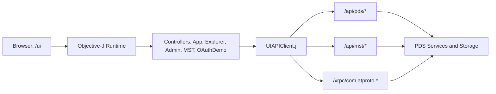
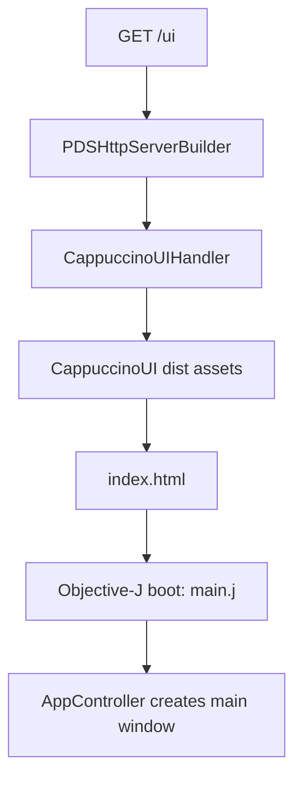
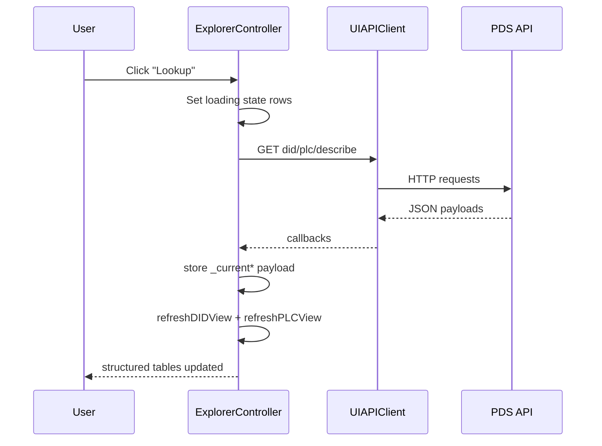

# Tutorial 7: Building the Objective-J PDS Web UI

## Overview

This tutorial explains how to build and evolve the Objective-J web UI for Garazyk PDS without inventing new backend APIs. The focus is practical: controller structure, rendering patterns, endpoint wiring, and a repeatable dev loop that works with Docker.

You will use the real app layout in this repository (`/ui`, `CappuccinoUIHandler`, `ExplorerController`, `UIAPIClient`) and build feature slices that are easy to test.

### What You'll Build

- A tabbed Objective-J UI slice that loads live PDS data
- Structured rendering for records, DID documents, and PLC operation logs
- A clean rendered-vs-JSON view mode toggle for debugging
- Endpoint integration using existing `/api/pds/*`, `/api/mst/*`, and XRPC paths

**Learning Objectives:**

- Understand Objective-J and Cappuccino fundamentals used in this codebase
- Design controller state for async API loading and table rendering
- Build non-JSON default views for feeds, records, profiles, and PLC logs
- Avoid common Objective-J runtime errors in table setup and data shapes
- Run a reliable build, Docker, and browser smoke-test workflow

**Estimated Time:** 90-120 minutes

## Prerequisites

- Completed:
  - [Tutorial 1: Hello PDS](./tutorial-1-hello-pds)
  - [Tutorial 3: Records](./tutorial-3-records)
  - [Tutorial 6: Deployment](./tutorial-6-deployment)
- Tools:
  - `npm` (for Cappuccino UI build)
  - Docker + Docker Compose
  - `curl` and `jq`
- Familiarity:
  - Basic Objective-C message syntax
  - HTTP JSON APIs and XRPC terminology

## Architecture At A Glance



### Key Files In This Repo

| File | Role |
| --- | --- |
| `Garazyk/Sources/App/CappuccinoUI/main.j` | UI entrypoint |
| `Garazyk/Sources/App/CappuccinoUI/AppController.j` | Window shell and top-level tabs |
| `Garazyk/Sources/App/CappuccinoUI/ExplorerController.j` | Explore UI state, tables, renderers |
| `Garazyk/Sources/App/CappuccinoUI/UIAPIClient.j` | HTTP client wrappers for backend routes |
| `Garazyk/Sources/App/CappuccinoUI/CappuccinoUIHandler.m` | Serves `/ui` assets |
| `Garazyk/Sources/Network/PDSHttpServerBuilder.m` | Route registration and UI defaults |
| `scripts/build_cappuccino_ui.sh` | Canonical UI build script |

## Objective-J And Cappuccino Crash Course

Objective-J looks like Objective-C, but the execution model is much closer to JavaScript running in the browser. In this repo you work across three layers at once:

| Layer | What it gives you | Example in this repo |
| --- | --- | --- |
| Objective-J syntax | Classes, ivars, selectors, message sends | `@implementation AppController : CPObject` |
| Cappuccino framework | Cocoa-style UI and foundation classes | `CPWindow`, `CPView`, `CPTableView`, `CPTextField` |
| JavaScript runtime | Arrays, objects, functions, browser APIs | `[]`, `{}`, `XMLHttpRequest`, `window.setInterval` |

That mixed model is the first thing to internalize. A `.j` file is not "Objective-C compiled for macOS". It is Cappuccino code that uses Objective-C-style syntax on top of the browser runtime.

### Where Objective-J Came From

Objective-J and Cappuccino were created together as part of the original 280 North effort to bring Cocoa-style application development to the browser. The [Cappuccino FAQ](https://www.cappuccino.dev/support/faq.html) describes the project as initially created by 280 North, and the official [Learning Objective-J](https://www.cappuccino.dev/learn/objective-j.html) and [What is Cappuccino?](https://www.cappuccino.dev/learn/) pages explain the language and framework goals from that original design.

Why Objective-J exists is just as important as who made it:

- Cappuccino wanted Foundation/AppKit-style APIs in the browser, not just a pile of DOM helpers.
- Plain JavaScript in 2008 was missing some of the language features that made Cocoa development productive for large UI codebases.
- Objective-J added Objective-C-like structure on top of JavaScript so Cappuccino code could use classes, imports, selectors, and message sends without leaving the web runtime.
- The design goal was not "hide JavaScript completely." It was "add the missing pieces while staying on top of JavaScript and avoiding a heavy compile cycle."

That design intent still shows up in this repository. Controllers are written with Objective-C-style class structure, but they freely use browser features like `XMLHttpRequest`, JavaScript arrays, and `window.setInterval`.

### How Objective-J Code Is Structured

Most files in the UI follow the same shape:

1. import Cappuccino frameworks and local classes,
2. declare a class with ivars,
3. initialize state in `init`,
4. build views,
5. respond to user actions through selectors,
6. call browser or HTTP APIs using normal JavaScript objects and functions.

Here is a stripped-down version of the same pattern used by `AppController.j` and `ExplorerController.j`:

```objectivec
@import <Foundation/Foundation.j>
@import <AppKit/AppKit.j>

@implementation ExampleController : CPObject
{
    CPTextField _statusLabel;
    CPArray _accounts;
}
- (id)init
{
    self = [super init];
    if (self)
        _accounts = [];
    return self;
}
- (void)setStatusText:(CPString)text
{
    [_statusLabel setStringValue:text];
}
@end
```

What matters in that example:

- `@implementation` defines the class body.
- The braces after the class name declare ivars such as `_statusLabel`.
- Methods still use selector syntax like `setStatusText:`.
- `self = [super init];` is the normal initializer pattern.
- `[]` is a JavaScript array literal, which Objective-J code uses freely.

### Message Sends, Selectors, and Colons

The most important syntax rule is that Objective-J still uses Objective-C message sends:

```objectivec
[_statusLabel setStringValue:@"Idle"];
[lookupButton setTarget:self];
[lookupButton setAction:@selector(handleLookup:)];
```

Read those as:

- "send `setStringValue:` to `_statusLabel`"
- "send `setTarget:` to `lookupButton`"
- "register the selector `handleLookup:` as the click handler"

The trailing colon in `handleLookup:` means the method accepts one argument. In this UI that argument is usually the sender:

```objectivec
- (void)handleLookup:(id)sender
{
    var query = [_lookupField stringValue];

    if (!query || [query length] === 0)
    {
        [_statusLabel setStringValue:@"Enter a DID or handle first."];
        return;
    }

    [_statusLabel setStringValue:@"Loading..."];
}
```

This is the basic event-handling loop in Cappuccino: a widget targets a controller, then the controller method reads widget state, updates ivars, and refreshes views.

### Objective-J Lives Beside JavaScript, Not Instead of It

A large part of Objective-J fluency is knowing when you are using Cappuccino objects and when you are using raw JavaScript values. This repository does both in the same method.

Example from the real UI patterns:

```objectivec
- (CPArray)normalizedArrayValue:(id)value
{
    if (value === nil || value === undefined)
        return [];
    if (value instanceof Array)
        return value;
    return [value];
}
```

That method is a good illustration of the language boundary:

- `nil` is the Objective-J "no object" value.
- `undefined` comes from JavaScript and browser APIs.
- `instanceof Array` is plain JavaScript type inspection.
- `return [value];` uses a JavaScript array literal to normalize one item into a list.

The same pattern shows up in async code. `UIAPIClient.j` uses browser networking directly, then hands the result back to controller code:

```objectivec
[_apiClient getJSONWithPath:@"/accounts"
              endpointGroup:@"explore"
                queryParams:nil
                 completion:function(statusCode, payload, errorMessage)
{
    if (errorMessage)
    {
        [_statusLabel setStringValue:errorMessage];
        return;
    }

    _accounts = payload.accounts || [];
    [_accountsTable reloadData];
}];
```

Important details here:

- `completion:function(...) { ... }` is a JavaScript function literal, not an Objective-C block.
- `payload.accounts || []` is standard JavaScript fallback logic.
- `[_accountsTable reloadData]` switches back into Cappuccino message-send style.

### A Quick Mental Model That Prevents Most Beginner Mistakes

When reading or writing Objective-J in this repo, use this checklist:

- If it starts with `CP`, it is probably a Cappuccino class and expects message sends.
- If it uses `var`, `function`, `===`, `[]`, or `{}`, you are in JavaScript territory.
- If a method name has colons, every colon corresponds to one argument.
- If UI state changes, update ivars first and then call a refresh or reload method.
- If data came from the network, guard for both `nil` and `undefined`.

### Syntax Quick Map

| Objective-C concept | Objective-J equivalent |
| --- | --- |
| `@interface` and ivars | `@implementation Class : CPObject { ... }` |
| Message send `[obj doThing]` | Same message syntax |
| Cocoa/AppKit | Cappuccino `CP*` classes (`CPView`, `CPTableView`, `CPButton`) |
| Target/action | `setTarget:` + `setAction:` |
| `NSError **` flow | JS object payload + status/error callback patterns |

### Cappuccino API Map For This Repo

The official API index is large. For Garazyk's UI, start with the Foundation and AppKit classes that appear repeatedly in `Garazyk/Sources/App/CappuccinoUI/`.

| Area | Primary APIs | Why they matter here |
| --- | --- | --- |
| Object model | [`CPObject`](https://www.cappuccino.dev/learn/documentation/class_c_p_object.html) | Base class for controllers, session state, and API clients |
| Window and layout | [`CPWindow`](https://www.cappuccino.dev/learn/documentation/interface_c_p_window.html), [`CPView`](https://www.cappuccino.dev/learn/documentation/class_c_p_view.html) | Main shell, subviews, sizing, and composition |
| Form controls | [`CPTextField`](https://www.cappuccino.dev/learn/documentation/interface_c_p_text_field.html), [`CPButton`](https://www.cappuccino.dev/learn/documentation/interface_c_p_button.html), [`CPPopUpButton`](https://www.cappuccino.dev/learn/documentation/interface_c_p_pop_up_button.html) | Input, actions, and mode selection |
| Navigation | [`CPTabView`](https://www.cappuccino.dev/learn/documentation/interface_c_p_tab_view.html) | Primary app tabs and detail tabs |
| Structured data | [`CPTableView`](https://www.cappuccino.dev/learn/documentation/interface_c_p_table_view.html) | Account, record, DID, PLC, feed, and MST tables |
| Text output | [`CPTextView`](https://www.cappuccino.dev/learn/documentation/interface_c_p_text_view.html) | JSON fallback panes and read-only debug output |

If you want the full catalog, start from the [Cappuccino API documentation index](https://www.cappuccino.dev/learn/documentation/annotated.html), then drill into AppKit and Foundation classes from there.

#### `CPObject`: The Base Class and Object Model

Almost every local class in the UI inherits from `CPObject`:

```objectivec
@implementation SessionState : CPObject
{
    CPString _currentDID @accessors(property=currentDID);
    CPString _currentHandle @accessors(property=currentHandle);
}
@end
```

Important API ideas to learn first:

- `init` and `initWith...` establish the normal initializer pattern.
- `@accessors(property=...)` generates Objective-C-style getters and setters.
- Selector-oriented APIs such as `respondsToSelector:` and `performSelector:` show up across Cappuccino.

In this repo, `CPObject` is the base for `AppController`, `ExplorerController`, `UIAPIClient`, and `SessionState`. If you understand that class model, most of the UI source stops looking unusual.

#### `CPWindow` and `CPView`: The Shell and View Hierarchy

The root window and nearly every layout container come from `CPWindow` and `CPView`.

```objectivec
_window = [[CPWindow alloc] initWithContentRect:CGRectMake(80.0, 80.0, 1120.0, 760.0)
                                       styleMask:CPTitledWindowMask | CPClosableWindowMask | CPResizableWindowMask];

var statusBar = [[CPView alloc] initWithFrame:CGRectMake(0.0, 0.0, contentBounds.size.width, statusBarHeight)];
[statusBar setAutoresizingMask:CPViewWidthSizable | CPViewMinYMargin];
[[_window contentView] addSubview:statusBar];
```

When reading the official APIs, focus on:

- `initWithContentRect:styleMask:` for top-level windows,
- `contentView`, `bounds`, and `frame` for geometry,
- `addSubview:` and `setAutoresizingMask:` for composition and resizing.

This is the Cappuccino equivalent of the browser's layout tree. Most UI work in Garazyk starts by composing `CPView` containers and then dropping controls into them.

#### `CPTextField`, `CPButton`, and `CPPopUpButton`: Input and Actions

The UI mostly uses Cappuccino controls through the target/action model:

```objectivec
_lookupField = [[CPTextField alloc] initWithFrame:CGRectMake(20.0, 72.0, 260.0, 28.0)];
[_lookupField setPlaceholderString:@"Enter DID or handle"];

var lookupButton = [[CPButton alloc] initWithFrame:CGRectMake(290.0, 72.0, 80.0, 28.0)];
[lookupButton setTitle:@"Lookup"];
[lookupButton setTarget:self];
[lookupButton setAction:@selector(handleLookup:)];

_didViewModePopup = [[CPPopUpButton alloc] initWithFrame:CGRectMake(52.0, 10.0, 120.0, 24.0)];
[_didViewModePopup addItemsWithTitles:[@"Rendered,JSON" componentsSeparatedByString:@","]];
```

APIs worth learning early:

- `CPTextField`: `setStringValue:`, `stringValue`, `setPlaceholderString:`
- `CPButton`: `setTitle:`, `setTarget:`, `setAction:`
- `CPPopUpButton`: `addItemsWithTitles:`, selection APIs for mode toggles

If a Garazyk screen has a button, search field, or rendered-vs-JSON toggle, you are almost certainly in this part of AppKit.

#### `CPTabView`: High-Level Navigation

The top-level application shell and the detail panes both use `CPTabView`.

```objectivec
var item = [[CPTabViewItem alloc] initWithIdentifier:label];
[item setLabel:label];
[item setView:contentView];
[tabView addTabViewItem:item];
```

The important thing about the API is conceptual: `CPTabView` is the main way this UI segments large feature areas without routing through separate browser pages. In Garazyk it holds:

- the top-level `Explorer`, `Admin`, `MST`, and `OAuth Demo` tabs,
- the nested DID / PLC / Records / Feed / Graph / Profile / MST detail panes.

#### `CPTableView`: Structured Data Rendering

`CPTableView` is the single most important AppKit class in this tutorial because the UI is table-first by design.

```objectivec
_accountsTable = [[CPTableView alloc] initWithFrame:CGRectMake(0.0, 0.0, 240.0, 530.0)];
[_accountsTable setDelegate:self];
[_accountsTable setDataSource:self];

var accountColumn = [[CPTableColumn alloc] initWithIdentifier:@"account"];
[[accountColumn headerView] setStringValue:@"Handle / DID"];
[accountColumn setWidth:240.0];
[_accountsTable addTableColumn:accountColumn];
```

Read the official `CPTableView` API with these repo patterns in mind:

- a table needs a datasource and usually a delegate,
- columns are explicit objects,
- header labels are configured through `headerView`,
- row changes do not repaint automatically, so `reloadData` is part of the normal update loop.

Also note one practical detail from the Cappuccino docs and this codebase: the table itself is not the scroll container. Garazyk wraps tables in `CPScrollView` so large datasets remain usable.

#### `CPTextView`: Raw Payload and Debug Surfaces

Where a rendered table would be too limiting, Garazyk falls back to `CPTextView` for raw JSON or multi-line detail output.

```objectivec
var textView = [[CPTextView alloc] initWithFrame:CGRectMake(0.0, 0.0, frame.size.width, frame.size.height)];
[textView setEditable:NO];
[textView setString:@""];
```

This is why many tabs in `ExplorerController`, `AdminController`, `MSTController`, and `OAuthDemoController` offer both:

- a rendered mode for structured browsing,
- and a text mode for inspection and debugging.

If you are adding a new view and are unsure how to render a payload cleanly, `CPTextView` is the safe intermediate step before you commit to a table design.

### UI Building Blocks You Will Use Constantly

| Class | Typical usage in this UI |
| --- | --- |
| `CPView` | Feature containers and tab panes |
| `CPTableView` + `CPTableColumn` | Main data presentation |
| `CPScrollView` | Table and text scrolling wrappers |
| `CPTextView` | JSON fallback and multi-line details |
| `CPPopUpButton` | Mode switches (`Rendered` vs `JSON`) |
| `CPButton` | User actions (`Lookup`, `Load`, `Refresh`) |

### `CPApplication` and Startup Lifecycle

Cappuccino applications have a formal startup lifecycle, and Garazyk follows the standard path:

1. `main.j` calls `CPApplicationMain(args, namedArgs)`.
2. Cappuccino creates the shared application object.
3. The app delegate receives `applicationDidFinishLaunching:`.
4. The delegate builds the initial window and view hierarchy.

The repo's startup path is intentionally minimal:

```objectivec
function main(args, namedArgs)
{
    CPApplicationMain(args, namedArgs);
}
```

Then `AppController` takes over:

```objectivec
- (void)applicationDidFinishLaunching:(CPNotification)aNotification
{
    [self setUpControllers];
    [self setUpWindow];
}
```

This matters because Cappuccino's lifecycle is closer to Cocoa than to a typical browser SPA bootstrap. There is a central application object, a launch callback, and a view tree rooted in a `CPWindow`. The official [`CPApplication`](https://www.cappuccino.dev/learn/documentation/interface_c_p_application.html) docs are worth reading early because they explain the app delegate hooks and the `CPApplicationMain` boot path directly.

### Foundation Collections and Strings: What Is Actually "Native" Here

One source of confusion for new Objective-J contributors is that Foundation types are partly Cappuccino abstractions and partly thin wrappers over JavaScript runtime values.

#### Arrays

In this repo, arrays are usually plain `[]` literals:

```objectivec
_accounts = [];
_collections = [];
_plcOpRows = [];
```

That is normal Objective-J style. The Cappuccino docs describe `CPMutableArray` as mostly a source-compatibility alias because array behavior is backed by JavaScript arrays. In practice, Garazyk relies on that fact and uses JavaScript array literals freely.

#### Dictionaries

For keyed objects, the code uses both JavaScript objects and `CPDictionary`, depending on context. `UIAPIClient` keeps endpoint groups in a `CPDictionary`:

```objectivec
var endpointBases = [CPMutableDictionary dictionary];
[endpointBases setObject:@"/api/pds" forKey:@"explore"];
[endpointBases setObject:@"/xrpc" forKey:@"xrpc"];
```

This is useful when you want Cocoa-style key lookup with methods like:

- `objectForKey:`
- `setObject:forKey:`
- `allKeys`

The official [`CPDictionary`](https://www.cappuccino.dev/learn/documentation/interface_c_p_dictionary.html) docs make one especially important point: unlike Cocoa, Cappuccino does not keep a hard immutable/mutable split here. The regular `CPDictionary` is mutable.

#### Strings

`CPString` looks like Cocoa's `NSString`, but it interoperates closely with JavaScript strings. That is why code like this works naturally:

```objectivec
if (normalizedPath.length > 0 && ![normalizedPath hasPrefix:@"/"])
    normalizedPath = [@"/" stringByAppendingString:normalizedPath];
```

The [`CPString`](https://www.cappuccino.dev/learn/documentation/interface_c_p_string.html) reference is useful because it documents both the familiar Cocoa methods and the fact that `CPString` is designed to work where JavaScript strings are expected.

#### Practical Rule

Use this rule of thumb in Garazyk's UI:

- use Objective-C-style methods when the value is clearly a Cappuccino object,
- use JavaScript syntax when the runtime shape is easier to express that way,
- and do not force everything through one style just for purity.

That mixed style is not a smell in Objective-J. It is the language model.

### Delegates, Data Sources, and Table Contracts

Cappuccino leans heavily on Cocoa's delegation model. Garazyk uses that directly rather than introducing a custom component abstraction layer.

The most visible case is `CPTableView`:

```objectivec
_accountsTable = [[CPTableView alloc] initWithFrame:CGRectMake(0.0, 0.0, 240.0, 530.0)];
[_accountsTable setDelegate:self];
[_accountsTable setDataSource:self];
```

The official [`CPTableView`](https://www.cappuccino.dev/learn/documentation/interface_c_p_table_view.html) docs call out the two required datasource methods for basic operation:

- `numberOfRowsInTableView:`
- `tableView:objectValueForTableColumn:row:`

That maps directly to the pattern used throughout `ExplorerController`, `AdminController`, and `MSTController`:

1. fetch or derive row-model arrays,
2. store them in ivars such as `_feedRows` or `_didSummaryRows`,
3. implement datasource methods against those arrays,
4. call `reloadData` after mutations,
5. respond to selection changes in delegate callbacks when detail panes depend on the selected row.

This is a core Cappuccino mental model: views do not own the truth. Controllers own the truth, and delegate/datasource methods project that truth into widgets.

That is also why Garazyk's controllers keep so many parallel ivars:

- raw payload ivars like `_currentPLCPayload`,
- normalized row arrays like `_plcOpRows`,
- widget references like `_plcOpsTable`.

Those are not arbitrary layers. They correspond to different responsibilities in the delegate/data-source flow.

### `CPScrollView` and Why Tables Never Stand Alone

One easy mistake for people coming from raw HTML tables is to think the table widget handles scrolling itself. Cappuccino's table docs explicitly note that `CPTableView` does not contain its own scroll view. Garazyk follows that rule everywhere:

```objectivec
var accountsScroll = [[CPScrollView alloc] initWithFrame:CGRectMake(20.0, 130.0, 260.0, 540.0)];
[accountsScroll setHasVerticalScroller:YES];
[accountsScroll setAutohidesScrollers:YES];
[accountsScroll setDocumentView:_accountsTable];
```

The pattern repeats for:

- accounts,
- DID summaries,
- PLC operation logs,
- records,
- feeds,
- graph data,
- MST stats and nodes.

If a new contributor skips the `CPScrollView` wrapper, the UI will usually still render, but it will behave like a broken desktop app once content grows. In practice, "control + scroll wrapper" is one of the default composition moves in Cappuccino.

### Networking: Cappuccino APIs vs Browser APIs

Cappuccino includes Foundation-style request/connection APIs such as [`CPURLConnection`](https://www.cappuccino.dev/learn/documentation/interface_c_p_u_r_l_connection.html), and Cappuccino's own blog documentation explains the usual pairing of `CPURLRequest` with `CPURLConnection` for higher-level request handling.

Garazyk uses a hybrid model instead:

- `UIAPIClient` builds `CPURLRequest` objects in helper methods when a Foundation-style request object is convenient,
- but the actual JSON fetch path uses `XMLHttpRequest` directly.

That split is visible in `UIAPIClient.j`:

```objectivec
- (CPURLRequest)requestWithPath:(CPString)path endpointGroup:(CPString)group method:(CPString)method
{
    var urlString = [self URLStringForPath:path endpointGroup:group queryParams:nil];
    var request = [CPURLRequest requestWithURL:[CPURL URLWithString:urlString]];
    [request setHTTPMethod:(method || @"GET")];
    return request;
}
```

and then:

```objectivec
var httpMethod = method || @"GET",
    urlString = [self URLStringForPath:path endpointGroup:group queryParams:queryParams],
    xhr = new XMLHttpRequest(),
    bodyJSON = nil;
```

Why do this?

- raw `XMLHttpRequest` makes JSON parsing and browser error handling explicit,
- it avoids adding another delegate protocol layer for simple request/response flows,
- and it matches the rest of the UI's JavaScript-friendly style.

This is an important guide-level point: Cappuccino gives you Cocoa-style network abstractions, but Objective-J does not require you to hide the browser. Garazyk uses the browser runtime directly when that is simpler.

### Protocols, Categories, and Other Objective-J Features You Will See Elsewhere

The official [Learning Objective-J](https://www.cappuccino.dev/learn/objective-j.html) guide covers more language surface area than Garazyk's current UI happens to use day to day.

Two features worth knowing in advance:

- protocols, which let classes declare conformance to a method contract,
- categories, which let you add methods to an existing class without subclassing it.

Those are standard Objective-C ideas, and Objective-J keeps them. They matter because many Cappuccino APIs are documented in a Cocoa-shaped way even when this repo does not lean on every feature directly.

For example, Cappuccino networking and widget APIs often describe delegate contracts in protocol-style terms, even when you mostly discover the required methods from the class reference. Likewise, categories are part of why Cappuccino's API reference sometimes shows extra behavior as "Provided by category ...".

In Garazyk specifically:

- you will see selectors and informal delegate contracts constantly,
- you will see `@accessors` frequently,
- you will see very little custom protocol or category authoring in the UI layer today.

That does not mean the features are irrelevant. It means the current codebase is using a deliberately narrow subset of Objective-J so the control flow stays easy to trace.

### What Garazyk Uses From Cappuccino, and What It Deliberately Does Not

Cappuccino can support more than what you see in this repo:

- Cib-based interface construction,
- bindings-driven table wiring,
- richer responder-chain behavior,
- broader Foundation APIs,
- more Cocoa-like networking abstractions.

Garazyk deliberately keeps the UI narrower:

- views are built programmatically,
- controller state lives in explicit ivars,
- tables are fed by manual datasource methods,
- JSON inspection remains available through text panes,
- network flows are explicit instead of hidden behind bindings or generated adapters.

That choice makes the code more verbose, but it also makes it easier to debug in a project where the backend protocol surface matters as much as the UI.

If you are expanding the UI, keep that discipline. Prefer code you can trace from button click to request to payload normalization to `reloadData`, even if Cappuccino offers a more magical option.

## Step 1: Confirm UI Routing And Shell

The UI is served at `/ui` and can be made the default `/` entrypoint. Verify route setup first, before touching view logic.

### Route Flow



### Verify Locally

```bash
./scripts/build_cappuccino_ui.sh
cd docker/pds
docker compose build
docker compose up -d
curl -sS http://127.0.0.1:2583/ui/Info.plist | head
```

If `Info.plist` is reachable, static routing is healthy.

## Step 2: Lock Data Contracts Before UI Code

Do not create ad-hoc `api/v2` UI endpoints. Use existing APIs, then adapt payloads in the UI controller.

### Recommended Endpoint Map

| UI feature | Endpoint |
| --- | --- |
| Account list | `GET /api/pds/accounts` |
| DID document | `GET /api/pds/did?did=...` |
| PLC operation log | `GET /api/pds/plc-log?did=...` |
| Collections | `GET /api/pds/describe?did=...` |
| Collection records | `GET /api/pds/records?did=...&collection=...` |
| Record detail | `GET /api/pds/record?uri=...` |
| Feed slices | `GET /api/pds/feed-posts`, `feed-likes`, `feed-reposts` |
| Graph follows | `GET /api/pds/graph-follows?did=...` |
| Profile | `GET /api/pds/actor-profile?did=...` |
| MST utility | `GET /api/mst/...` |

Use XRPC directly for write flows such as account and record creation:

- `POST /xrpc/com.atproto.server.createAccount`
- `POST /xrpc/com.atproto.repo.createRecord`

## Step 3: Build Views With Table-First Layouts

Prefer structured tables as the default rendered mode. Keep JSON as a secondary debug mode.

### Critical Table Column Rule

In Cappuccino, set table header text via `headerView`, not `setTitle:` on `CPTableColumn`.

```objc
var didSummaryFieldColumn = [[CPTableColumn alloc] initWithIdentifier:@"did_summary_field"];
[[didSummaryFieldColumn headerView] setStringValue:@"Field"];
[didSummaryFieldColumn setWidth:200.0];
[_didSummaryTable addTableColumn:didSummaryFieldColumn];
```

This avoids runtime selector failures on `CPTableColumn`.

### Layout Pattern To Repeat

1. Create tab view container.
2. Add a mode popup (`Rendered`, `JSON`).
3. Add rendered tables inside `CPScrollView`.
4. Add JSON `CPTextView` fallback.
5. Toggle visibility in a refresh method.

## Step 4: Normalize Payloads And Render Rows

Controllers should not assume array shapes from network payloads. Normalize early, then render predictable row objects.

```objc
- (CPArray)normalizedArrayValue:(id)value
{
    if (value === nil || value === undefined)
        return [];
    if (value instanceof Array)
        return value;
    return [value];
}
```

Use this pattern for fields like:

- DID `alsoKnownAs`
- DID `service`
- DID `verificationMethod`
- DID `@context`
- PLC payload list variants (`operations`, `log`, `history`)

Then derive display rows, not raw payload blobs:

- Summary rows (`field`, `value`)
- Detail rows (`type`, `label`, `value`)
- Operation rows (`when`, `summary`, `details`)

## Step 5: Wire User Actions And Async Loads

Target/action should dispatch a single feature flow, then call a render refresh.



Good state handling pattern:

- Keep `_current*Payload` objects for each tab.
- Keep row arrays (`_didSummaryRows`, `_plcOpRows`, etc.) for table datasource.
- Refresh tables after payload update.
- Select first row when a detail table depends on parent selection.

## Step 6: Render Domain Data, Not Generic JSON

Use domain-aware rendering rules for each tab.

| Tab | Rendered default |
| --- | --- |
| DID | Identity summary + aliases/services/verification rows |
| PLC | Operation timeline + selected operation detail rows |
| Records | Record metadata table + content pane |
| Feed | Entry list + selected entry detail table |
| Graph | Follow actor list + detail table |
| Profile | Profile summary table + bio pane |
| MST Utility | Metrics table + node list table |

For PLC logs, use concise change labels:

- `Identity created`
- `Alias updated`
- `Service updated`
- `Verification method updated`
- `Rotation keys added (N)`

This keeps the UI readable while still preserving JSON mode for deep inspection.

## Step 7: Build And Test Loop

Use this loop every time you ship a UI slice.

The order matters:

1. rebuild UI assets,
2. restage the runtime image from `docker/pds/`,
3. verify both the protocol surface and the `/ui` asset route,
4. then exercise the rendered tabs in the browser.

The concrete shell loop lives in the appendix so the main tutorial can stay focused on what the loop is protecting.

### Seed Real Data Through XRPC

Use XRPC writes to validate rendering with realistic records:

- create an account through `com.atproto.server.createAccount`,
- create a profile or post through `com.atproto.repo.createRecord`,
- then confirm the same data appears in the rendered UI and the JSON fallback.

For posts, let the server generate proper TID-like rkeys unless you have a strict test case.

## Troubleshooting

| Symptom | Likely cause | Fix |
| --- | --- | --- |
| `Cannot read properties of undefined (reading 'push')` | Controller assumed array shape for payload fields | Normalize with `normalizedArrayValue` before loops |
| `CPInvalidArgumentException: ... CPTableColumn setTitle:` | Wrong API used for header titles | Use `[[column headerView] setStringValue:@"..."]` |
| 404 for `/ui` assets | Dist assets not staged or route not wired | Re-run `./scripts/build_cappuccino_ui.sh`; verify `CappuccinoUIHandler` routes |
| UI loads but accounts are missing | API call failing or empty seed data | Check `/api/pds/accounts`; seed via XRPC and reload |
| Data shows but only as plain JSON | Rendered mode not wired or hidden | Add row adapters and `refresh*View` visibility toggles |
| Admin assets missing in container logs | Runtime path lookup incomplete | Ensure Admin UI candidates include `/usr/share/atprotopds/assets/AdminUI` |

## Next Steps

1. Add sorting, filtering, and pagination to high-cardinality tables.
2. Add small reusable row formatter helpers to reduce controller duplication.
3. Add browser smoke tests that click each tab and assert non-empty rendered sections.
4. Add UI instrumentation for request timing and endpoint-level errors.
5. Extend the same renderer pattern to Admin and OAuth demo tabs.

## Summary

You now have a practical pattern for building the Garazyk PDS Objective-J UI:

- Keep backend contracts stable and reuse existing endpoints.
- Build table-first rendered views with JSON fallback.
- Normalize payloads before deriving row models.
- Treat controller refresh methods as the single rendering boundary.
- Use a strict build and Docker smoke loop before shipping.

This approach makes the UI easier to extend, easier to debug, and much more useful than raw JSON output.

## Appendix

### Build and verify loop

```bash
./scripts/build_cappuccino_ui.sh
cd docker/pds
docker compose build
docker compose up -d
curl -sS http://127.0.0.1:2583/xrpc/com.atproto.server.describeServer | jq '.did'
curl -sS -o /dev/null -w '%{http_code}\n' http://127.0.0.1:2583/ui/Info.plist
```

### Seed real data through XRPC

```bash
curl -sS -X POST http://127.0.0.1:2583/xrpc/com.atproto.server.createAccount \
  -H 'Content-Type: application/json' \
  -d '{"email":"alice@example.com","handle":"alice.example.com","password":"pass123","inviteCode":"..."}'

curl -sS -X POST http://127.0.0.1:2583/xrpc/com.atproto.repo.createRecord \
  -H "Authorization: Bearer <accessJwt>" \
  -H 'Content-Type: application/json' \
  -d '{"repo":"did:plc:...","collection":"app.bsky.actor.profile","rkey":"self","record":{"$type":"app.bsky.actor.profile","displayName":"Alice"}}'
```\n\n## Related\n\n- [Documentation Map](../11-reference/documentation-map.md)\n- [Contributor Guide](../index.md)\n- [Repository Documentation Index](../repo-index/index.md)\n\n