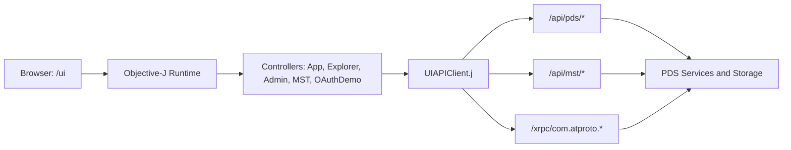

# Tutorial 7b: The Admin UI Architecture

## Overview

This tutorial explains how to build and evolve the Objective-J web UI for Garazyk PDS without inventing new backend APIs. The focus is practical: controller structure, rendering patterns, endpoint wiring, and a repeatable dev loop that works with Docker.

**Learning Objectives:**
- Understand the real app layout in `/ui`.
- Design controller state for async API loading and table rendering.
- Build non-JSON default views for feeds, records, and PLC logs.
- Run a reliable build, Docker, and browser smoke-test workflow.

**Estimated Time:** 60-90 minutes

## Prerequisites

- Complete [Tutorial 7a: Objective-J for Contributors](./tutorial-7a-objective-j-intro).
- Complete [Tutorial 6: Deployment](./tutorial-6-deployment).
- Tools: `npm`, Docker, `curl`, and `jq`.

## Architecture At A Glance



### Key Files In This Repo

| File | Role |
| --- | --- |
| `Garazyk/Sources/App/CappuccinoUI/AppController.j` | Window shell and top-level tabs |
| `Garazyk/Sources/App/CappuccinoUI/ExplorerController.j` | Explore UI state, tables, renderers |
| `Garazyk/Sources/App/CappuccinoUI/UIAPIClient.j` | HTTP client wrappers for backend routes |
| `Garazyk/Sources/App/CappuccinoUI/CappuccinoUIHandler.m` | Serves `/ui` assets |
| `scripts/build_cappuccino_ui.sh` | Canonical UI build script |

## Step 1: Confirm UI Routing And Shell

The UI is served at `/ui` via `CappuccinoUIHandler`. Verify the route setup first.

### Verify Locally
```bash
./scripts/build_cappuccino_ui.sh
cd docker/pds
docker compose build && docker compose up -d
curl -sS http://127.0.0.1:2583/ui/Info.plist | head
```

## Step 2: Lock Data Contracts

Do not create ad-hoc `api/v2` UI endpoints. Use existing APIs like `GET /api/pds/accounts` or `GET /api/pds/did?did=...`, then adapt payloads in the UI controller.

## Step 3: Build Views With Table-First Layouts

Prefer structured tables (`CPTableView`) as the default rendered mode. Use `CPScrollView` as a wrapper for tables to ensure scrolling works correctly.

### Layout Pattern
1. Create tab view container.
2. Add a mode popup (`Rendered`, `JSON`).
3. Add rendered tables inside `CPScrollView`.
4. Add JSON `CPTextView` fallback.
5. Toggle visibility in a refresh method.

## Step 4: Normalize Payloads And Render Rows

Controllers should normalize network payloads before rendering. Use domain-aware rendering rules (e.g., summary rows for DID documents).

```objectivec
- (void)refreshDIDView
{
    _didSummaryRows = [self deriveSummaryRowsFromPayload:_currentDIDPayload];
    [_didSummaryTable reloadData];
}
```

## Step 5: Wire User Actions And Async Loads

Target/action should dispatch a single feature flow (e.g., `handleLookup:`), call the API client, and then refresh the UI in the completion handler.

## Step 6: Build And Test Loop

1. Rebuild UI assets.
2. Restage the runtime image from `docker/pds/`.
3. Verify both the protocol surface and the `/ui` asset route.
4. Exercise the rendered tabs in the browser.

## Failure Modes to Watch For

| Symptom | Likely cause | Fix |
| --- | --- | --- |
| `undefined` errors | Assumed array shape for payload fields | Normalize with `normalizedArrayValue` |
| 404 for `/ui` | Dist assets not staged or route not wired | Re-run build script; check `CappuccinoUIHandler` |
| UI loads but empty | API call failing or empty seed data | Check backend logs; seed data via XRPC |

## Summary

By following the "table-first with JSON fallback" pattern, you ensure the Garazyk UI remains both user-friendly for browsing and powerful for debugging.

## Related

- [Documentation Map](../11-reference/documentation-map.md)
- [Contributor Guide](../index.md)
- [Repository Documentation Index](../repo-index/index.md)
