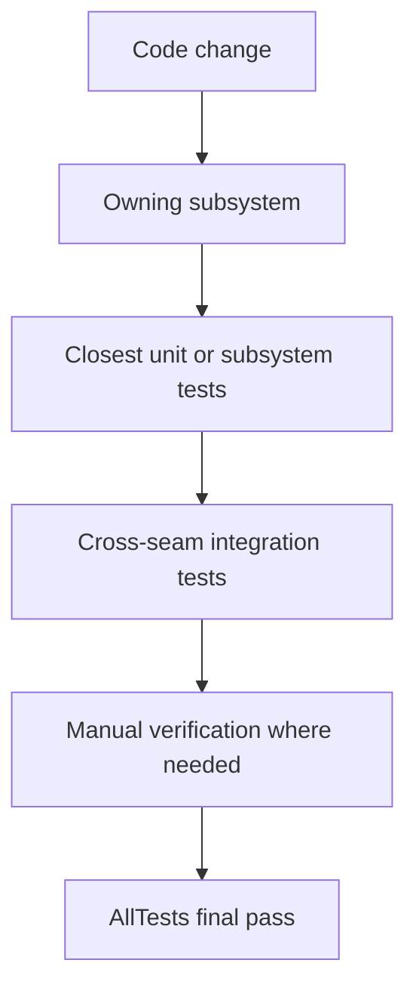

# Test Selection Workflow

Target tests that protect the specific logic you modified rather than running the full `AllTests` suite immediately.

## Selection Flow



## Mapping Changes to Tests

- **Routes and Handlers**: Run Network or XRPC tests.
- **Auth and Token Logic**: Run Auth tests.
- **Repository or Blob Mutation**: Run Service tests, then Integration or Sync tests.
- **Database Migrations**: Run Database tests.
- **Explorer Tooling**: Run targeted docs/UI checks and manual smoke verification.

The `Garazyk/Tests/` directory structure reflects these categories.

## Registration

Register every new test class in `testClasses` within `Garazyk/Tests/test_main.m`. Unregistered tests will compile but fail to run. If a test appears to pass suspiciously quickly, verify its registration.

## Escalation Sequence

1. Execute the closest targeted suite.
2. Run the adjacent integration seam.
3. Perform a manual smoke check on the user-facing surface.
4. Run `AllTests` for final verification.

## Full Stack Scenario Testing

Use the scenario suite for changes affecting multiple services (PDS, AppView, Relay):

```bash
# List scenarios
./scripts/run_scenarios.ts --list

# Run specific scenarios
./scripts/run_scenarios.ts --no-setup 01 05

# Full setup and teardown
./scripts/run_scenarios.ts --setup --teardown
```

Scenarios reside in `scripts/scenarios/scenarios/*.ts`. The runner skips PDS2-only scenarios by default unless you include the `--pds2` flag.

## Related Resources

- [Testing Map](./testing-map)
- [Test Organization](./test-organization)
- [Property-Based Testing](./property-based-testing)
- [E2E Testing](./e2e-testing)
- [Documentation Map](documentation-map.md)
