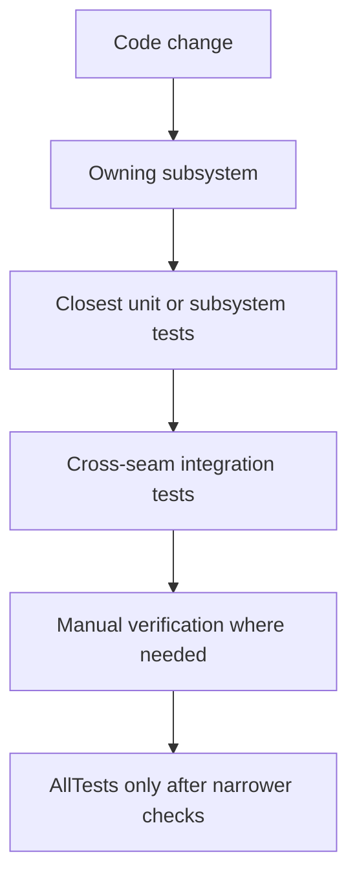

# Test Selection Workflow

## Goal

Read this page when you know what you changed but do not know which tests to run first. The goal is to map common contributor changes to the smallest useful test surfaces before you fall back to `AllTests`.

## Full Flow

## Why This Matters

The repo is large enough that full-suite-first is a poor default. It is slower, noisier, and less informative than running the tests that protect the seam you just touched.

The right question is not "what can I run?" It is "what should fail if I broke this change?"

## Walkthrough: Mapping A Change To Tests

Use these defaults:

- route or handler registration change: network tests first
- auth or token logic change: auth tests first
- record, repository, or blob mutation change: service tests, then integration commit or sync tests
- database pool or migration change: database tests first
- UI or Explorer tooling change: targeted docs or UI checks plus manual smoke verification

That pattern matches the repo structure under `Garazyk/Tests/` closely enough that directory names are usually your first map.

## The Registration Footgun

This repo has one important test-runner rule that still catches contributors: a new test class must be added to `testClasses` in `Garazyk/Tests/test_main.m`.

If you forget that step, a test can compile and still never run. Any test-selection workflow should include checking registration when a new class appears to be "passing" too quietly.

## Where To Debug When This Breaks

- Start in the closest subsystem test directory before inventing new integration coverage.
- Start in `Garazyk/Tests/test_main.m` when a new test class seems invisible.
- Start in manual verification only after targeted automated checks stop giving you new information.

## Tests That Should Fail If This Changes

- `Garazyk/Tests/Network/PDSHttpServerBuilderTests.m`
- `Garazyk/Tests/Auth/OAuth2HandlerTests.m`
- `Garazyk/Tests/App/Services/PDSBlobServiceTests.m`
- `Garazyk/Tests/Database/Pool/DatabasePoolTests.m`

## Appendix

### Default escalation path

1. run the closest targeted suite
2. run the adjacent integration seam
3. do the smallest manual smoke check that matches the user-facing surface
4. run `AllTests` last

## Related

- [Documentation Map](documentation-map.md)
- [Contributor Guide](../index.md)
- [Repository Documentation Index](../repo-index/index.md)

