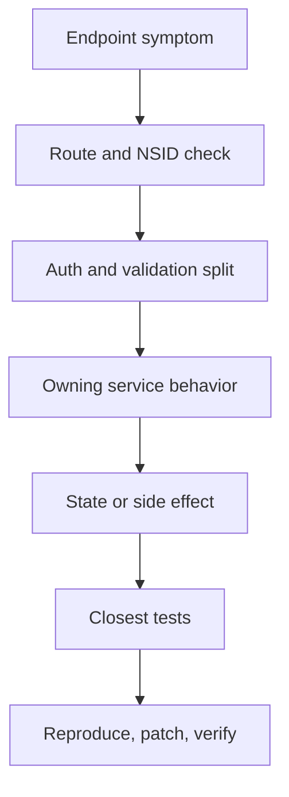

# Troubleshooting a Failing Endpoint

Trace endpoint symptoms to the owning code, logs, metrics, and tests. This guide focuses on diagnosing a single broken request path.

## Full Flow

## Failure Categories

Classify the failure into one of these buckets before opening files:
- Wrong status code before service logic.
- Auth or DPoP failure.
- Validation failure with a misleading error.
- Service returns incorrect data.
- Write succeeds but side effects are missing.

## Triage Walkthrough

1. Confirm the exact path, method, and whether it is an XRPC request.
2. Identify the NSID and the registered handler block.
3. Split auth/validation failures from service failures (401 or 400 are rarely repository bugs).
4. Determine if the service reads shared state, actor state, or both.
5. Check logs and `/metrics` once the owning subsystem is identified.
6. Run the closest unit or subsystem test.

## Debug Surfaces

- **Network Layer**: Start here for incorrect handlers, routes, or auth paths.
- **Service Layer**: Start here if behavior is wrong after the request is accepted.
- **Database Layer**: Start here for stale, missing, or inconsistent responses.
- **Sync/Side-Effects**: Start here if the request succeeds but downstream consumers do not see changes.

## Critical Tests

- `Garazyk/Tests/Network/XrpcMethodRegistryTests.m`
- `Garazyk/Tests/Auth/OAuth2HandlerTests.m`
- `Garazyk/Tests/App/Services/PDSRecordServiceTests.m`
- `Garazyk/Tests/Integration/CommitChainTests.m`

## Related Resources

- [Troubleshooting](./troubleshooting)
- [Test Selection Workflow](./test-selection-workflow)
- [Performance Monitoring](./performance-monitoring)
- [Logging Strategy](./logging-strategy)
- [Documentation Map](documentation-map.md)

## Appendix: Triage Order

1. Route
2. Auth
3. Validation
4. Service
5. Store
6. Side effects
7. Tests
