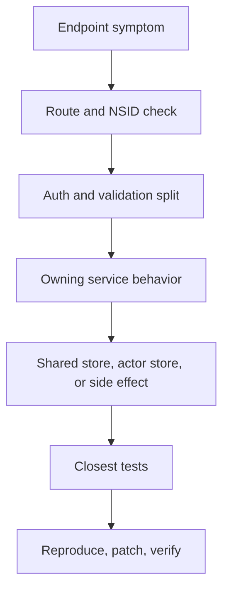

# Troubleshooting a Failing Endpoint

## Goal

Read this page when one endpoint is failing and you need a fast decision tree from symptom to owning code, logs, metrics, and tests. This page is intentionally narrower than the main troubleshooting guide: it is for one broken request path, not whole-system diagnosis.

## Full Flow

## Start With The Failure Shape

One endpoint failure usually fits one of these buckets:

- wrong status code before service logic
- auth or DPoP failure
- validation failure with a misleading error
- service returns the wrong data
- write succeeds but the side effect is missing

Your first job is to classify which bucket you are in. That is faster than opening every file that mentions the NSID.

## Walkthrough: Endpoint Triage

1. Confirm the exact path and method, including whether the request is really XRPC.
2. Identify the NSID and the handler block registered for it.
3. Split auth and validation failures from service failures. A 401 or 400 is usually not a repository bug.
4. If the service runs, identify whether the endpoint reads shared state, actor state, or both.
5. Check logs and `/metrics` only after you know the owning subsystem.
6. Run the closest unit or subsystem test before escalating to integration tests.

This flow is boring on purpose. It keeps contributors from skipping directly to the most complex component in the stack.

## Debug Surfaces Worth Using

- request and route docs for handler ownership
- auth helper and OAuth logs for request rejection
- service logs for domain behavior
- `/metrics` when the endpoint is slow rather than wrong
- targeted tests when you need to confirm whether the behavior is expected

The common mistake is to go to logs before knowing which layer should be logging.

## Where To Debug When This Breaks

- Start in the network layer when the wrong handler, wrong route, or wrong auth path owns the request.
- Start in the service layer when the behavior is wrong after the request is accepted.
- Start in the database layer when the response is stale, missing, or internally inconsistent.
- Start in sync or side-effect code when the request succeeds but downstream consumers do not see the change.

## Tests That Should Fail If This Changes

- `Garazyk/Tests/Network/XrpcMethodRegistryTests.m`
- `Garazyk/Tests/Auth/OAuth2HandlerTests.m`
- `Garazyk/Tests/App/Services/PDSRecordServiceTests.m`
- `Garazyk/Tests/Integration/CommitChainTests.m`

## Appendix

### One-endpoint triage order

1. route
2. auth
3. validation
4. service
5. store
6. side effects
7. tests\n\n## Related\n\n- [Documentation Map](documentation-map.md)\n- [Contributor Guide](../index.md)\n- [Repository Documentation Index](../repo-index/index.md)\n\n