# Diagram Reference

This page indexes all diagrams in the Garazyk PDS documentation. The diagrams illustrate architectural concepts, data flows, and system interactions.

## Architecture Diagrams

### System Architecture

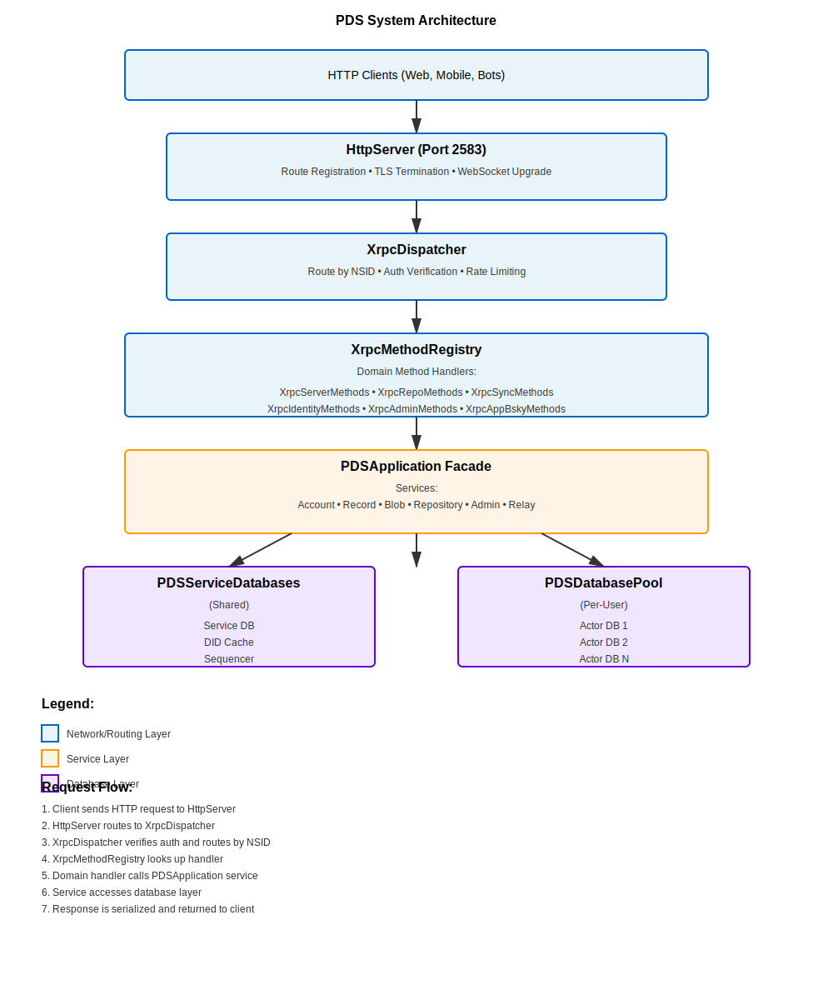

**Description:** Complete overview of the Garazyk PDS system architecture, showing all major components and their interactions.

**Used in:**
- [Architecture Overview](../01-getting-started/architecture-overview.md)
- [Getting Started](../01-getting-started/overview.md)

**Key Components:** PDSApplication, HttpServer, XrpcDispatcher, Service Layer, Database Layer, Repository Protocol

---

### Database Architecture

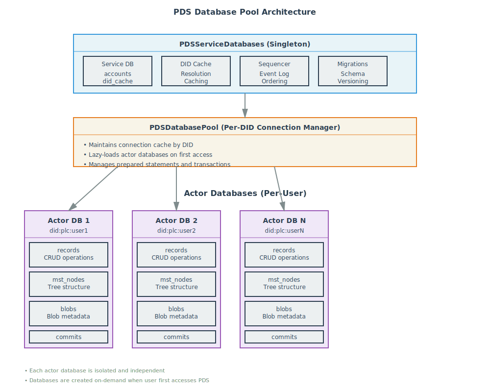

**Description:** Illustrates the SQLite database architecture with separate service databases and per-user actor databases.

**Used in:**
- [SQLite Architecture](../05-database-layer/sqlite-architecture.md)
- [Actor Databases](../05-database-layer/actor-databases.md)

**Key Components:** PDSDatabasePool, Service Databases, Actor Databases, WAL Mode

---

### Request Flow

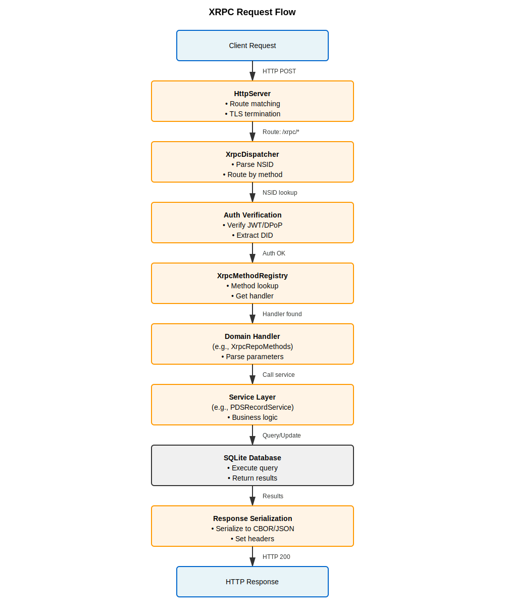

**Description:** Shows the complete lifecycle of an HTTP request through the PDS system.

**Used in:**
- [HTTP Server](../04-network-layer/http-server.md)
- [XRPC Dispatch](../04-network-layer/xrpc-dispatch.md)

**Key Components:** HttpServer, XrpcDispatcher, Authentication, Service Layer, Response Serialization

---

## Authentication & Security

### OAuth 2.0 with DPoP Flow


**Description:** Complete OAuth 2.0 authorization flow with DPoP (Demonstrating Proof-of-Possession) token binding.

**Used in:**
- [OAuth 2.0 & DPoP](../06-authentication/oauth2-dpop.md)
- [Tutorial 4: Authentication](../10-tutorials/tutorial-4-auth.md)

**Key Components:** Authorization Server, Client, Resource Server, DPoP Proof, Access Token

---

### JWT Token Flow


**Description:** JWT token creation, validation, and refresh flow in the PDS system.

**Used in:**
- [JWT Tokens](../06-authentication/jwt-tokens.md)
- [Tutorial 2: Accounts](../10-tutorials/tutorial-2-accounts.md)

**Key Components:** Token Minting, Signature Verification, Claims Validation, Token Refresh

---

### Cryptography Flow

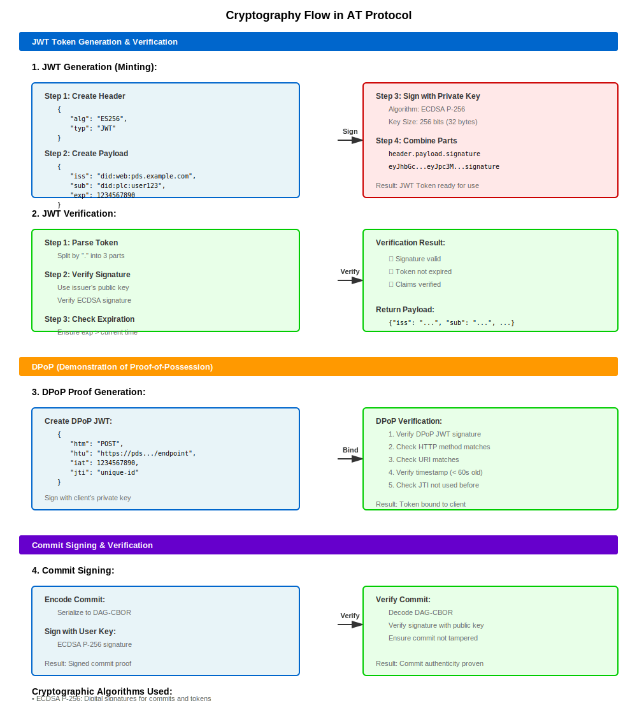

**Description:** Cryptographic operations including key generation, signing, and verification.

**Used in:**
- [Cryptography](../02-core-concepts/cryptography.md)
- [Security Best Practices](../06-authentication/security-best-practices.md)

**Key Components:** Key Generation, Signing, Verification, Hardware-Backed Storage

---

### Key Rotation Flow


**Description:** Process for rotating cryptographic keys without service disruption.

**Used in:**
- [Key Rotation](../06-authentication/key-rotation.md)
- [Security Best Practices](../06-authentication/security-best-practices.md)

**Key Components:** Key Generation, Gradual Rollout, Old Key Deprecation, Key Revocation

---

### Secrets Management Flow


**Description:** Secure storage and retrieval of sensitive configuration data.

**Used in:**
- [Secrets Management](../06-authentication/secrets-management.md)
- [Security Audit Guide](../11-reference/security-audit-guide.md)

**Key Components:** Environment Variables, Secure Storage, Access Control, Rotation

---

### Defense in Depth Architecture


**Description:** Multi-layered security architecture with defense at every level.

**Used in:**
- [Security Best Practices](../06-authentication/security-best-practices.md)
- [Security Audit Guide](../11-reference/security-audit-guide.md)

**Key Components:** Network Layer, Application Layer, Data Layer, Monitoring

---

## Core Concepts

### CBOR Encoding Process


**Description:** Demonstrates how data is encoded using CBOR (Concise Binary Object Representation).

**Used in:**
- [CBOR and CAR](../02-core-concepts/cbor-and-car.md)
- [CBOR Serialization](../07-repository-protocol/cbor-serialization.md)

**Key Components:** Data Structure, CBOR Encoding, Binary Output, Deterministic Encoding

---

### MST Tree Structure

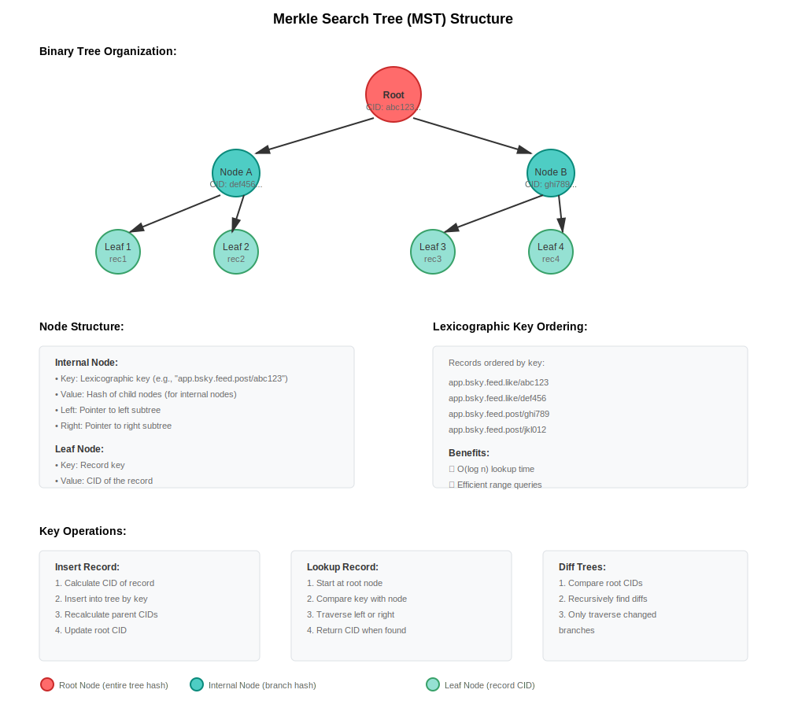

**Description:** Merkle Search Tree structure used for repository data organization.

**Used in:**
- [MST Trees](../02-core-concepts/mst-trees.md)
- [Repository Basics](../07-repository-protocol/repository-basics.md)

**Key Components:** Root Node, Internal Nodes, Leaf Nodes, Hash Pointers

---

### DID Resolution Flow


**Description:** Process for resolving Decentralized Identifiers (DIDs) to DID documents.

**Used in:**
- [PLC Directory](../02-core-concepts/plc-directory.md)
- [DID Document Updates](../02-core-concepts/did-document-updates.md)

**Key Components:** DID, PLC Directory, DID Document, Resolution Cache

---

## Network Layer

### Method Registration

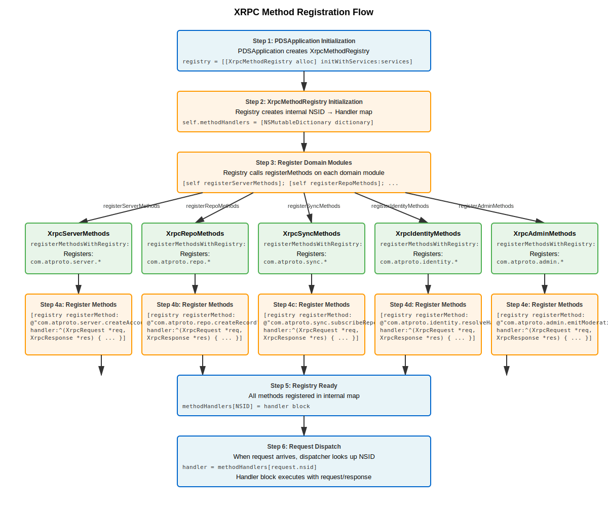

**Description:** XRPC method registration and routing architecture.

**Used in:**
- [Method Registry](../04-network-layer/method-registry.md)
- [Domain Methods](../04-network-layer/domain-methods.md)

**Key Components:** XrpcMethodRegistry, Domain Modules, Method Handlers, Route Registration

---

### XRPC Routing

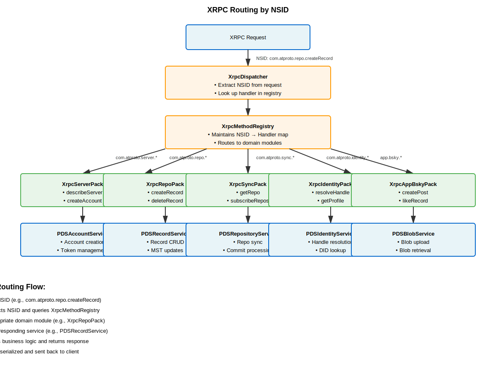

**Description:** Request routing through the XRPC dispatcher to appropriate handlers.

**Used in:**
- [XRPC Dispatch](../04-network-layer/xrpc-dispatch.md)
- [Error Handling](../04-network-layer/error-handling.md)

**Key Components:** XrpcDispatcher, Method Lookup, Handler Invocation, Response Serialization

---

### Rate Limiting Algorithm

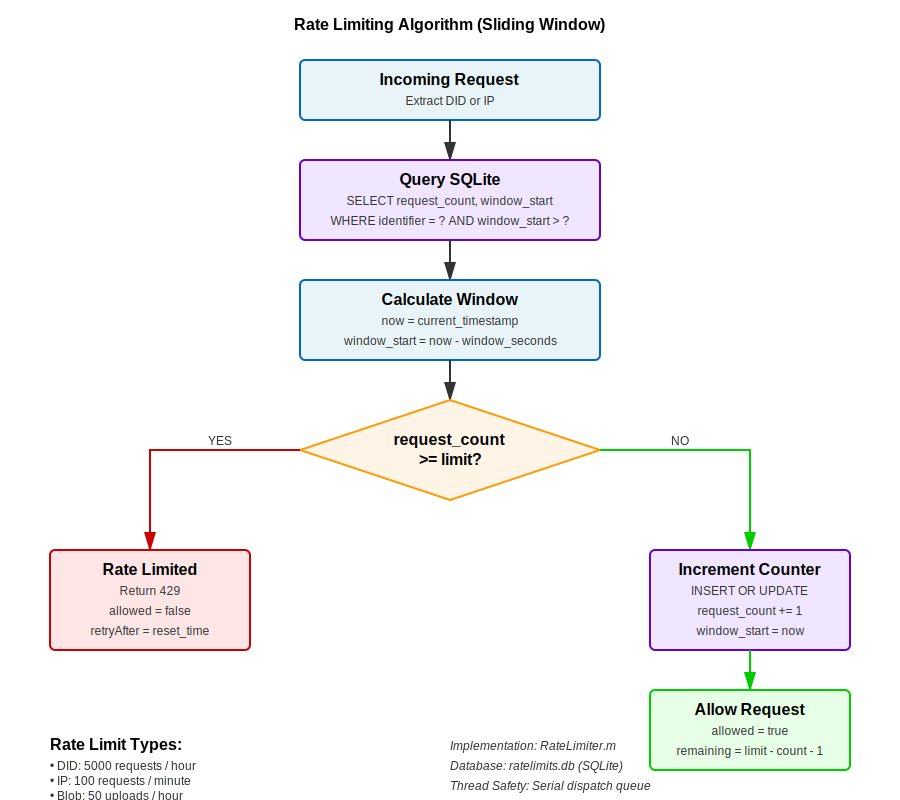

**Description:** Token bucket algorithm for rate limiting requests.

**Used in:**
- [Rate Limiting](../04-network-layer/rate-limiting.md)
- [DoS Protection](../04-network-layer/dos-protection.md)

**Key Components:** Token Bucket, Request Counter, Refill Rate, Burst Capacity

---

### Request Throttling Flow

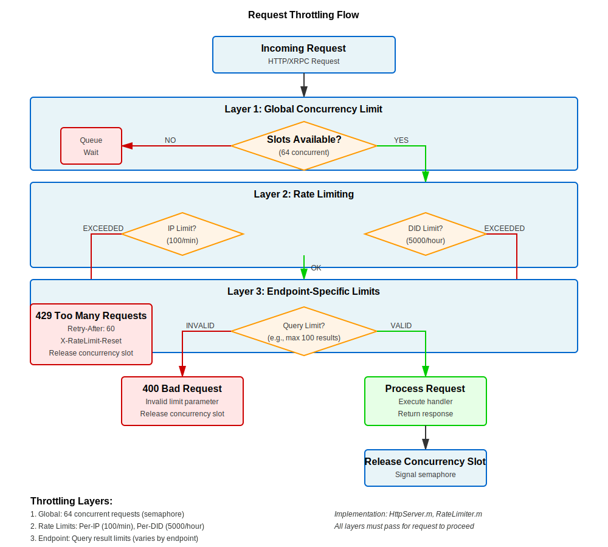

**Description:** Request throttling and queue management for load control.

**Used in:**
- [Request Throttling](../04-network-layer/request-throttling.md)
- [DoS Protection](../04-network-layer/dos-protection.md)

**Key Components:** Request Queue, Throttle Check, Queue Management, Response

---

### DoS Mitigation Architecture


**Description:** Multi-layered defense against denial-of-service attacks.

**Used in:**
- [DoS Protection](../04-network-layer/dos-protection.md)
- [Security Best Practices](../06-authentication/security-best-practices.md)

**Key Components:** Rate Limiting, Connection Limits, Request Validation, Circuit Breakers

---

### Input Validation Pipeline

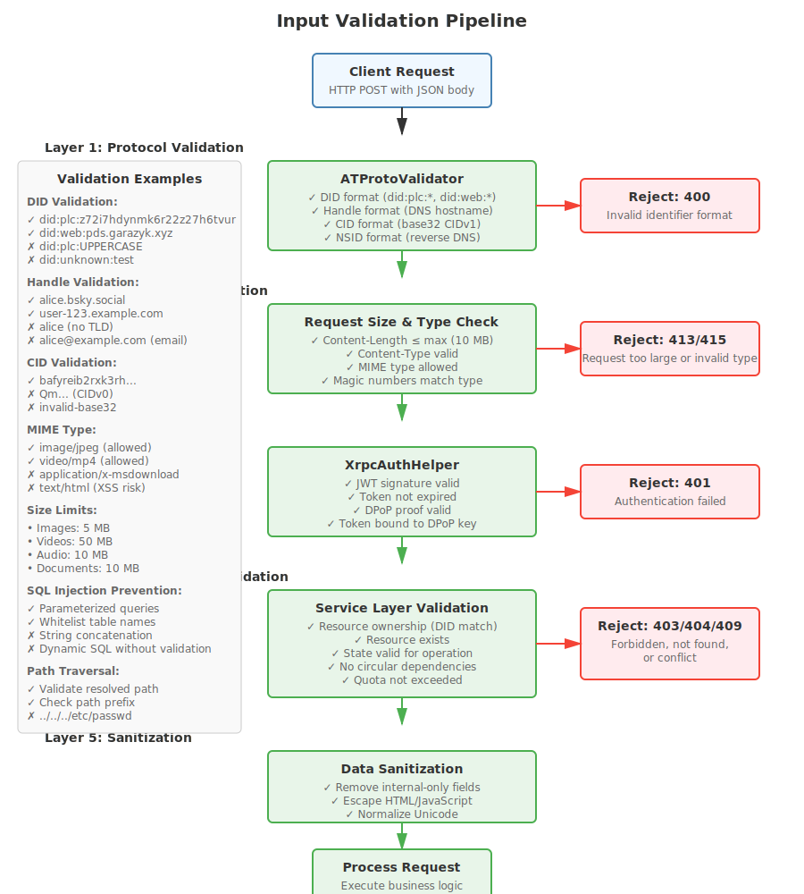

**Description:** Multi-stage input validation and sanitization process.

**Used in:**
- [Input Validation](../04-network-layer/input-validation.md)
- [Security Best Practices](../06-authentication/security-best-practices.md)

**Key Components:** Schema Validation, Type Checking, Sanitization, Business Rules

---

## Repository Protocol

### Transaction Flow

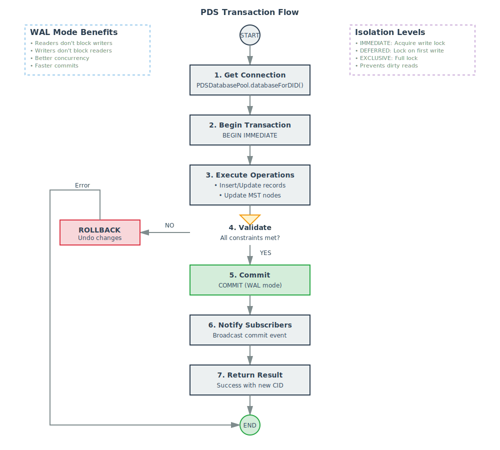

**Description:** Database transaction lifecycle with commit and rollback handling.

**Used in:**
- [SQLite Architecture](../05-database-layer/sqlite-architecture.md)
- [Data Integrity](../05-database-layer/data-integrity.md)

**Key Components:** BEGIN, Operations, COMMIT/ROLLBACK, WAL Checkpoint

---

### Blob Upload Flow

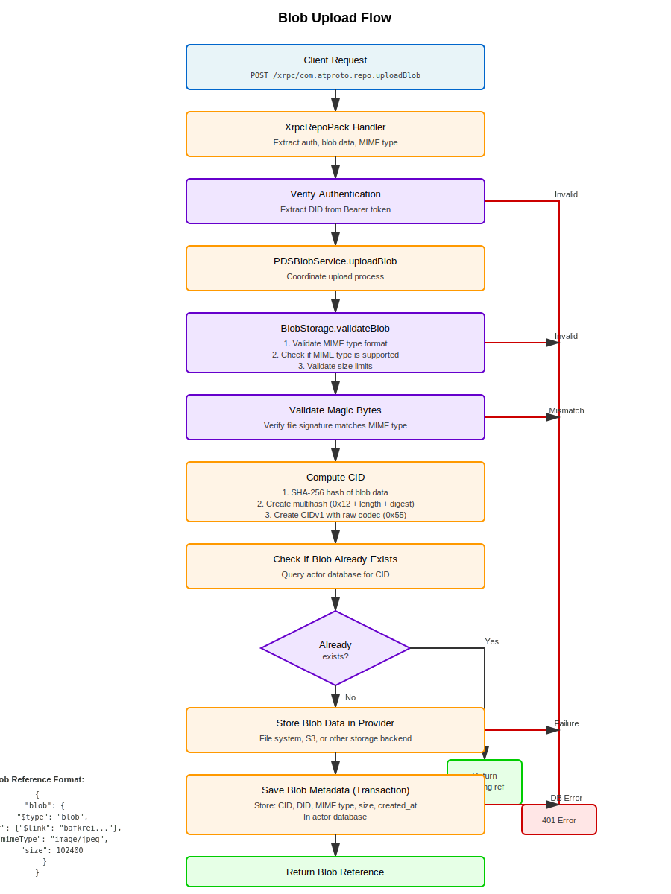

**Description:** Complete process for uploading and storing blob data.

**Used in:**
- [Blob Storage](../07-repository-protocol/blob-storage.md)
- [Blob Lifecycle](../07-repository-protocol/blob-lifecycle.md)

**Key Components:** Upload Request, Validation, Storage, CID Generation, Database Record

---

### Blob Garbage Collection Flow

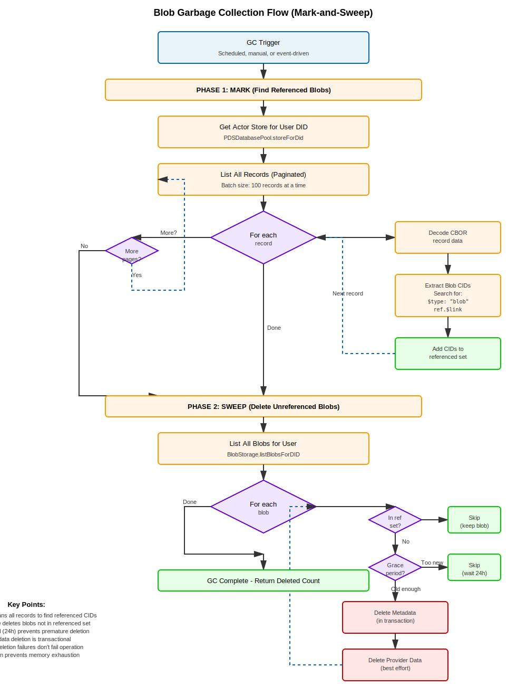

**Description:** Process for identifying and removing unreferenced blobs.

**Used in:**
- [Blob Garbage Collection](../07-repository-protocol/blob-garbage-collection.md)
- [Blob Lifecycle](../07-repository-protocol/blob-lifecycle.md)

**Key Components:** Reference Scan, Unreferenced Detection, Grace Period, Deletion

---

### Blob Quota Enforcement

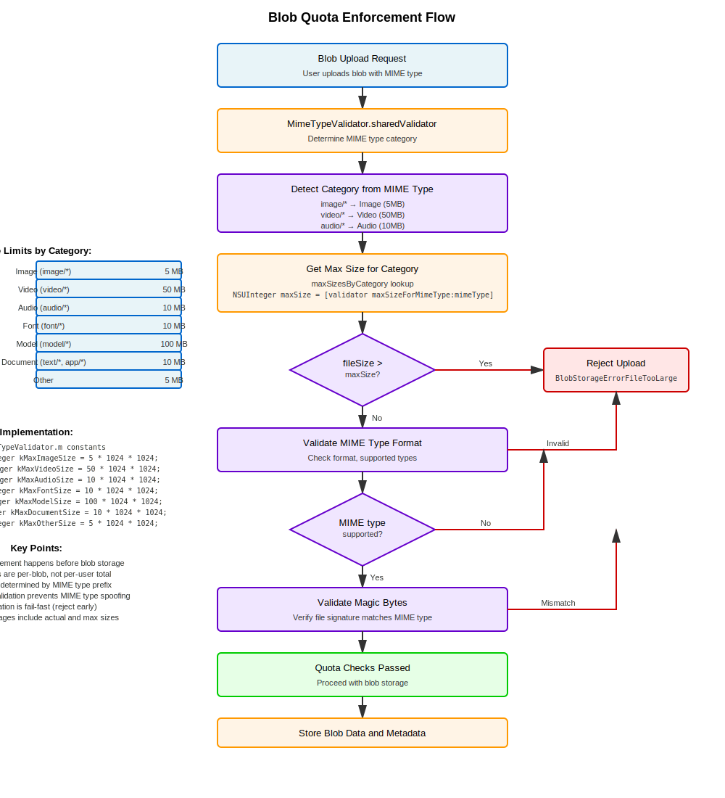

**Description:** Quota checking and enforcement for blob storage limits.

**Used in:**
- [Blob Quotas](../07-repository-protocol/blob-quotas.md)
- [Blob Lifecycle](../07-repository-protocol/blob-lifecycle.md)

**Key Components:** Quota Check, Usage Calculation, Limit Enforcement, Error Response

---

## Sync & Firehose

### Commit Broadcasting Flow

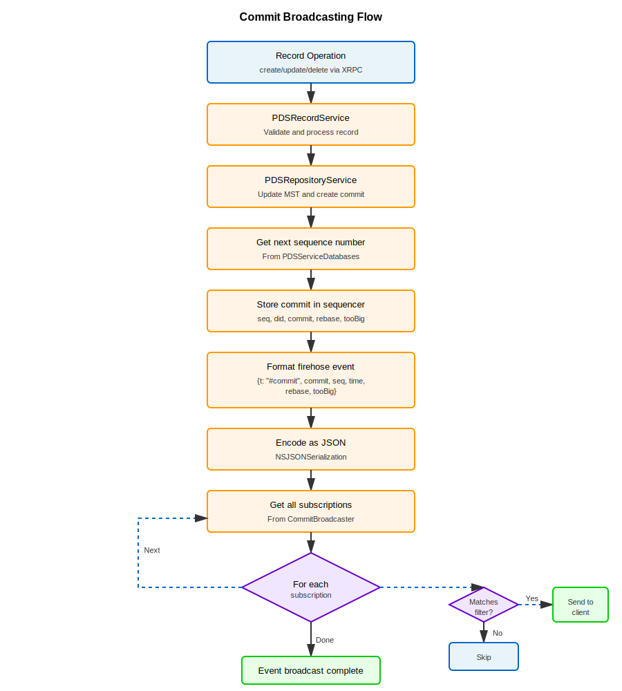

**Description:** Process for broadcasting repository commits to subscribers via firehose.

**Used in:**
- [Commit Broadcasting](../08-sync-firehose/commit-broadcasting.md)
- [Firehose Overview](../08-sync-firehose/firehose-overview.md)
- [Tutorial 5: Firehose](../10-tutorials/tutorial-5-firehose.md)

**Key Components:** Commit Event, Sequencer, WebSocket Server, Subscribers, Event Delivery

---

### WebSocket Upgrade Flow

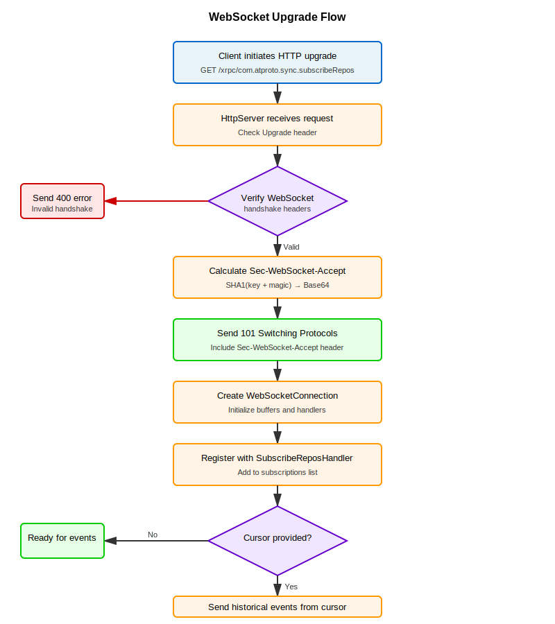

**Description:** HTTP to WebSocket protocol upgrade for firehose connections.

**Used in:**
- [WebSocket Server](../08-sync-firehose/websocket-server.md)
- [Firehose Overview](../08-sync-firehose/firehose-overview.md)

**Key Components:** HTTP Request, Upgrade Handshake, WebSocket Connection, Frame Exchange

---

### Backpressure Flow


**Description:** Backpressure handling for slow consumers in the firehose.

**Used in:**
- [Backpressure](../08-sync-firehose/backpressure.md)
- [Reliability Guarantees](../08-sync-firehose/reliability-guarantees.md)

**Key Components:** Event Queue, Buffer Management, Flow Control, Disconnect Handling

---

### Event Ordering Guarantee

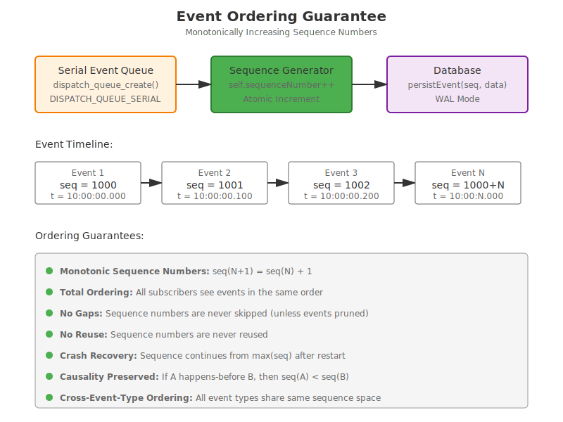

**Description:** Mechanisms ensuring correct event ordering in the firehose.

**Used in:**
- [Event Ordering](../08-sync-firehose/event-ordering.md)
- [Reliability Guarantees](../08-sync-firehose/reliability-guarantees.md)

**Key Components:** Sequence Numbers, Ordering Buffer, Delivery Queue, Gap Detection

---

### Event Replay Mechanism

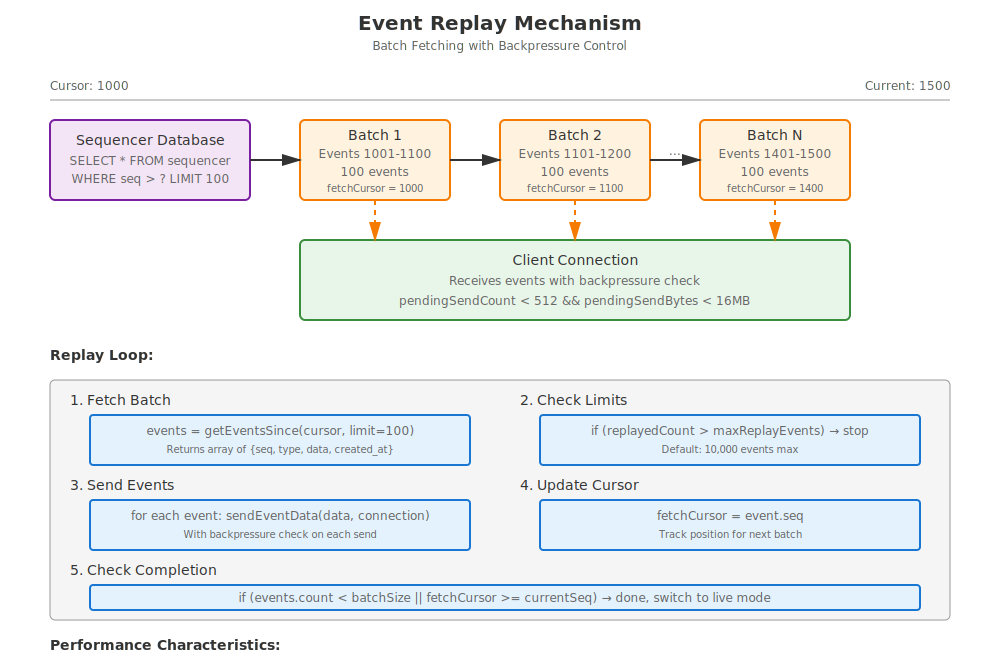

**Description:** Event replay for recovering from connection failures.

**Used in:**
- [Event Replay](../08-sync-firehose/event-replay.md)
- [Reconnection Strategy](../08-sync-firehose/reconnection-strategy.md)

**Key Components:** Cursor Storage, Event Log, Replay Request, Catch-up Delivery

---

### Reconnection Flow

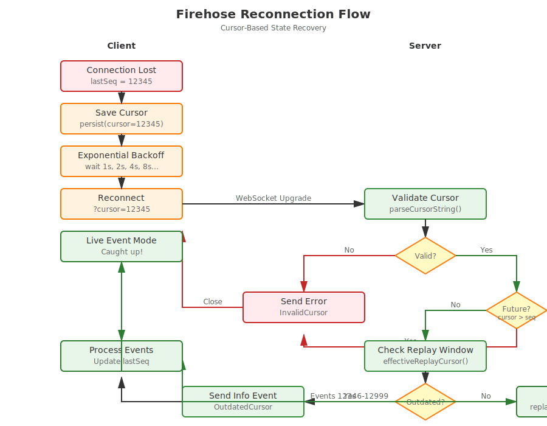

**Description:** Automatic reconnection with exponential backoff for firehose clients.

**Used in:**
- [Reconnection Strategy](../08-sync-firehose/reconnection-strategy.md)
- [Reliability Guarantees](../08-sync-firehose/reliability-guarantees.md)

**Key Components:** Connection Loss, Backoff Calculation, Reconnect Attempt, Resume

---

## Database Layer

### Database Schema

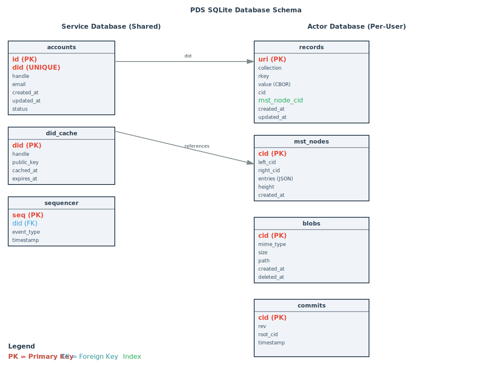

**Description:** Complete database schema showing all tables and relationships.

**Used in:**
- [SQLite Architecture](../05-database-layer/sqlite-architecture.md)
- [Service Databases](../05-database-layer/service-databases.md)

**Key Components:** Service Tables, Actor Tables, Indexes, Foreign Keys

---

### Migration Workflow

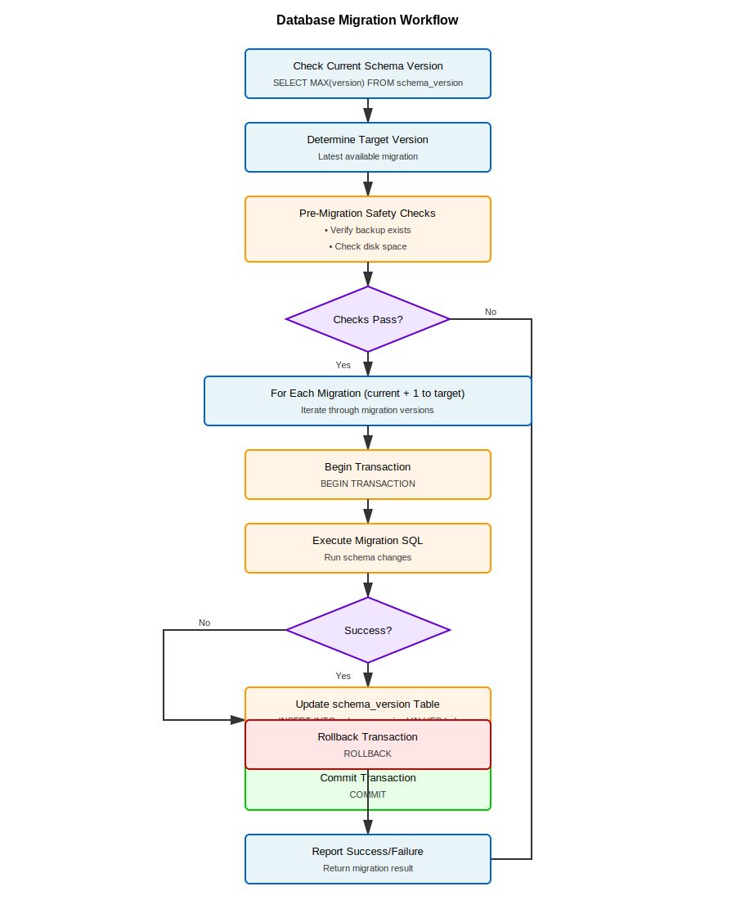

**Description:** Database migration process with version tracking and rollback.

**Used in:**
- [Migration Strategy](../05-database-layer/migration-strategy.md)
- [Zero-Downtime Migrations](../05-database-layer/zero-downtime-migrations.md)

**Key Components:** Version Check, Migration Execution, Rollback, Version Update

---

### Rollback Procedure

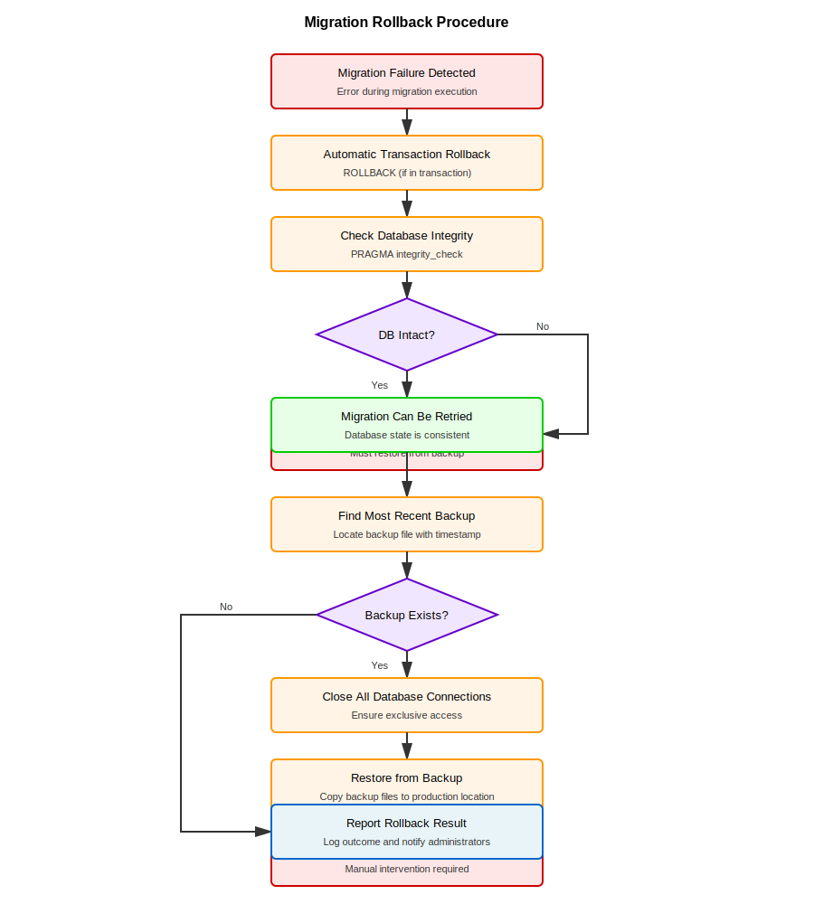

**Description:** Process for rolling back failed database migrations.

**Used in:**
- [Migration Rollback](../05-database-layer/migration-rollback.md)
- [Migration Strategy](../05-database-layer/migration-strategy.md)

**Key Components:** Failure Detection, Rollback Script, State Restoration, Verification

---

### Data Integrity Verification

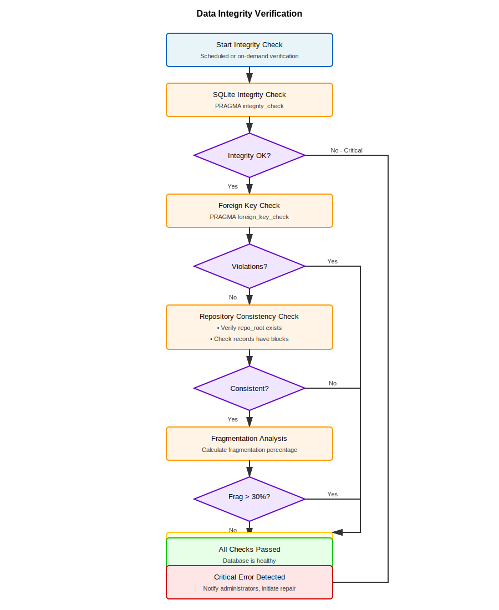

**Description:** Multi-level data integrity checking and verification.

**Used in:**
- [Data Integrity](../05-database-layer/data-integrity.md)
- [Migration Strategy](../05-database-layer/migration-strategy.md)

**Key Components:** Constraint Checks, Hash Verification, Foreign Key Validation, Consistency Checks

---

## PLC Directory

### PLC Directory Architecture

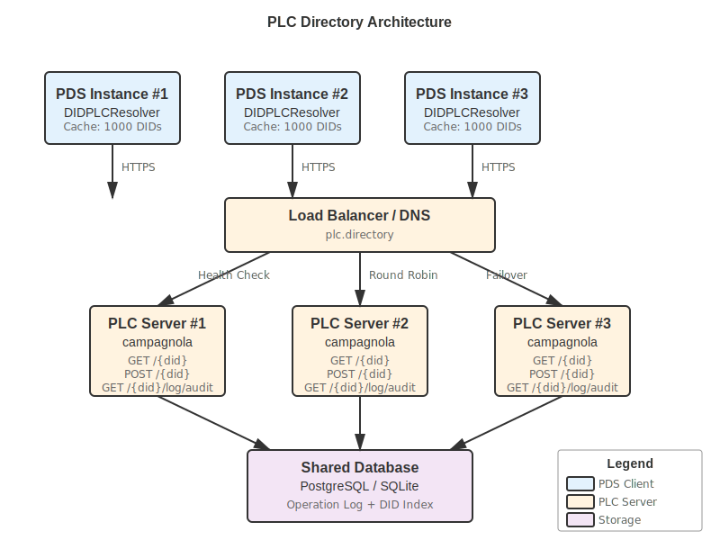

**Description:** Architecture of the PLC (Public Ledger of Credentials) directory service.

**Used in:**
- [PLC Directory](../02-core-concepts/plc-directory.md)
- [PLC Server Operations](../11-reference/plc-server-operations.md)

**Key Components:** PLC Server, DID Registry, Operation Log, Signature Verification

---

### PLC Failover Mechanism

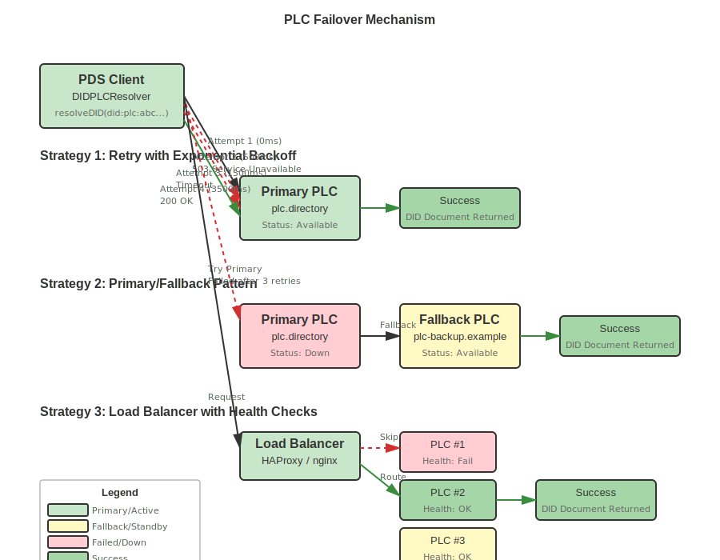

**Description:** Failover and redundancy mechanisms for PLC directory availability.

**Used in:**
- [PLC Failover](../11-reference/plc-failover.md)
- [PLC Server Operations](../11-reference/plc-server-operations.md)

**Key Components:** Primary Server, Backup Servers, Health Checks, Automatic Failover

---

## Monitoring & Operations

### Logging Pipeline

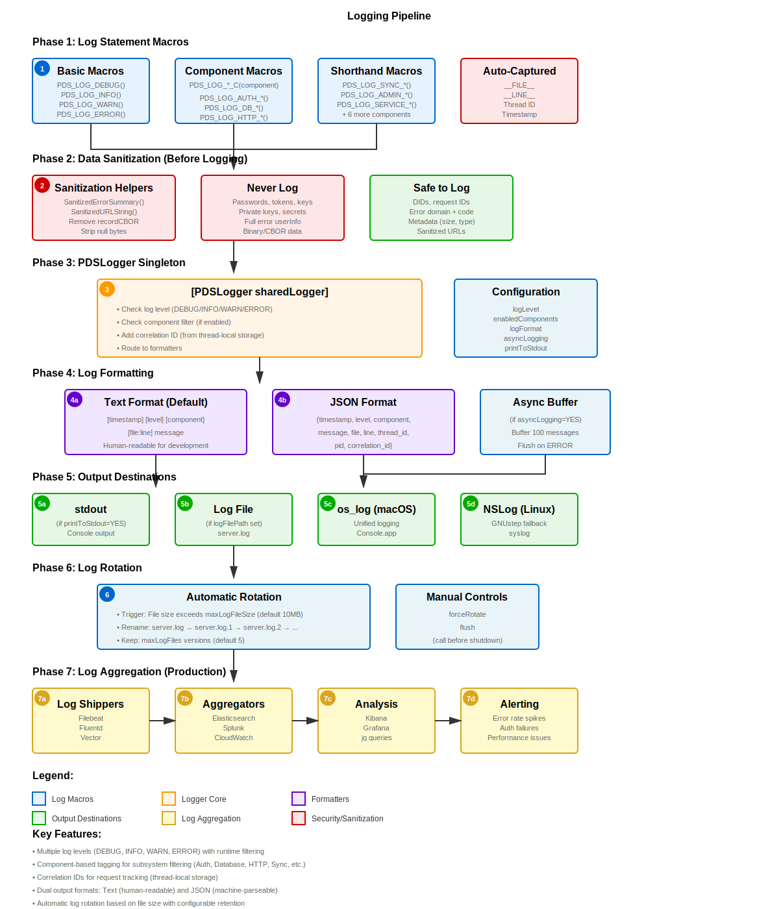

**Description:** Complete logging pipeline from log statements to aggregation systems.

**Used in:**
- [Logging Strategy](../11-reference/logging-strategy.md)
- [Performance Monitoring](../11-reference/performance-monitoring.md)

**Key Components:** Log Macros, Formatters, Destinations, Aggregation, Analysis

---

### Metrics Collection Architecture


**Description:** System for collecting, aggregating, and exposing metrics.

**Used in:**
- [Metrics Collection](../11-reference/metrics-collection.md)
- [Performance Monitoring](../11-reference/performance-monitoring.md)

**Key Components:** Metric Sources, Collectors, Aggregators, Exporters, Dashboards

---

### Performance Monitoring Flow


**Description:** End-to-end performance monitoring and alerting flow.

**Used in:**
- [Performance Monitoring](../11-reference/performance-monitoring.md)
- [Alerting](../11-reference/alerting.md)

**Key Components:** Instrumentation, Collection, Analysis, Alerting, Dashboards

---

## Testing

### Test Organization Structure

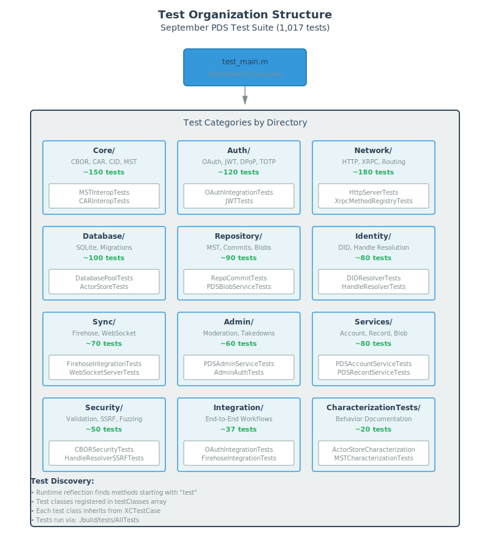

**Description:** Organization of test suites and test discovery mechanism.

**Used in:**
- [Test Organization](../11-reference/test-organization.md)
- [Test Coverage Goals](../11-reference/test-coverage-goals.md)

**Key Components:** Test Runner, Test Classes, Test Methods, Assertions

---

### Property-Based Testing Flow

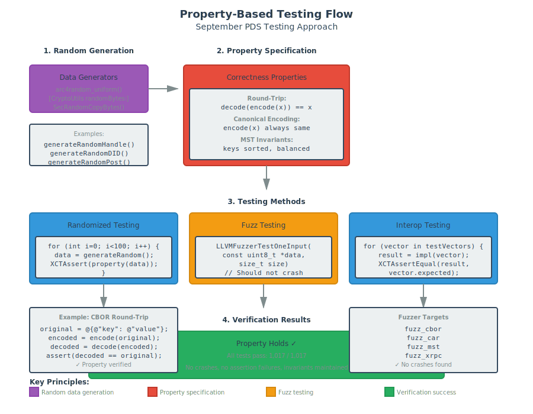

**Description:** Property-based testing workflow with input generation and shrinking.

**Used in:**
- [Property-Based Testing](../11-reference/property-based-testing.md)
- [Test Organization](../11-reference/test-organization.md)

**Key Components:** Property Definition, Input Generation, Test Execution, Shrinking

---

### E2E Test Architecture

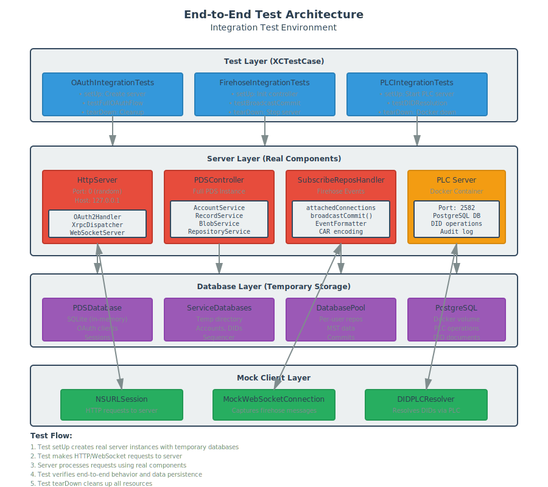

**Description:** End-to-end test architecture with real server and client interactions.

**Used in:**
- [E2E Testing](../11-reference/e2e-testing.md)
- [Test Organization](../11-reference/test-organization.md)

**Key Components:** Test Server, Test Client, Playwright, Assertions, Cleanup

---

## Usage Guidelines

### Embedding Diagrams

To embed a diagram in your documentation, use standard Markdown image syntax:

```markdown

```

### Using the Diagram Plugin

For enhanced features like captions and zoom, use the custom diagram syntax:

```markdown
::: diagram
src: /12-diagrams/diagram-name.svg
alt: Diagram description for accessibility
caption: Optional caption displayed below the diagram
zoomable: true
description: Extended description for screen readers
:::
```

### Accessibility

All diagrams should include:
- **Alt text**: Brief description of the diagram's content
- **Caption**: Visible caption explaining the diagram's purpose
- **Extended description**: Detailed description for complex diagrams (for screen readers)

### Creating New Diagrams

When creating new diagrams:
1. Use SVG format for scalability
2. Follow the existing visual style
3. Include clear labels for all components
4. Add the diagram to this index page
5. Update documentation pages that reference the diagram
6. Test rendering in both light and dark modes

## Diagram Statistics

- **Total Diagrams**: 40
- **Architecture Diagrams**: 3
- **Authentication & Security**: 7
- **Core Concepts**: 3
- **Network Layer**: 7
- **Repository Protocol**: 4
- **Sync & Firehose**: 6
- **Database Layer**: 4
- **PLC Directory**: 2
- **Monitoring & Operations**: 3
- **Testing**: 3

## Contributing

To add or update diagrams:
1. Create or modify the SVG file in `docs/12-diagrams/`
2. Update this index page with diagram details
3. Add references in relevant documentation pages
4. Test diagram rendering and accessibility
5. Submit a pull request with your changes

## Related

- [Documentation Map](../11-reference/documentation-map.md)
- [Contributor Guide](../index.md)
- [Repository Documentation Index](../repo-index/index.md)

