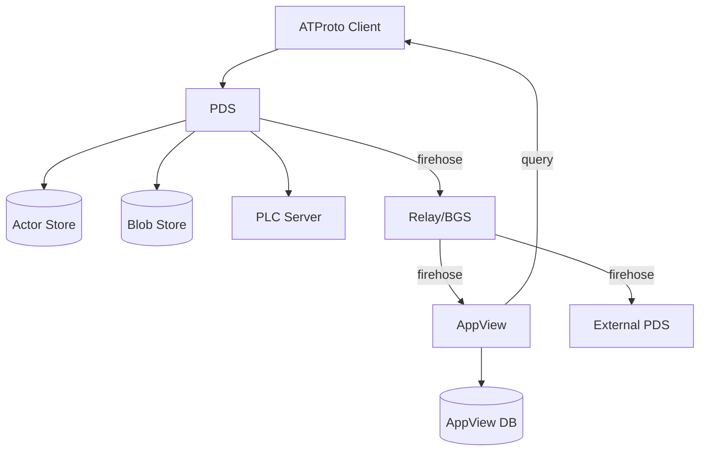

# ATProto PDS Architecture

Garazyk implements the AT Protocol stack in Objective-C, portable to Linux via GNUstep. The system runs on POSIX sockets with a sans-I/O HTTP stack, stores state in per-user SQLite databases, and exposes XRPC endpoints through a modular route-pack system.

## Service Topology



| Service | Binary | Port | Role |
|---|---|---|---|
| PDS | `garazyk` | 2583 | Repository hosting, blob storage, account management, XRPC endpoints |
| AppView | `kaszlak` | — | Indexing, backfill, profile/feed/notification queries |
| Relay | `zuk` | — | Firehose aggregation, network crawls, event broadcast |
| PLC | — | 2584 | DID directory, rotation key management, operation logs |
| Admin UI | `garazyk-ui` | — | HTMX-based monitoring, moderation, administration |
| Chat | `syrena-chat` | — | Direct messaging, group chat |
| Video | `campagnola` | — | Video transcoding (AVFoundation on macOS, FFmpeg on Linux) |

Each service is a standalone binary with its own `main.m`. They communicate over HTTP/XRPC and share no process memory.

## The HTTP Stack

The HTTP layer is built directly on POSIX sockets with a sans-I/O design. Protocol parsing is fully decoupled from transport, so the same parser runs on bare-metal sockets, WebSocket proxies, and test harnesses.

### Socket Layer

`HttpServer` calls `socket()`, `setsockopt(SO_REUSEADDR)`, `bind()`, `listen()`, `accept()`. Accepted connections go to a global concurrent GCD queue. On macOS, `dispatch_source_t` uses kqueue; on Linux, libdispatch uses epoll.

### Sans-I/O Parser

`Http1Parser` is a pure state machine with no knowledge of sockets or I/O:

```
ReadingHeaders -> ReadingBody / ReadingChunkedBody -> Complete | Error
```

The network layer pushes data into the parser via `feedData:`. The parser never pulls. This makes it testable by feeding fragmented strings without any TCP socket.

`HttpProtocolDriver` bridges parser events to `HttpProtocolEvent` values. `HttpConnectionIOCoordinator` orchestrates the read-parse-dispatch cycle per connection, managing two header timeout deadlines:

- **Idle timeout** (30s): resets per byte received
- **Aggregate deadline** (30s): starts with the first byte, cannot be reset by trickle input

### Trie-Based Routing

`HttpRouteTrie` maps URL paths by splitting on `/` into a prefix tree. Routing is O(L) where L is path segment count (typically 2-4 for XRPC), unaffected by total endpoint count.

The XRPC dispatcher mounts at `/xrpc/*` and routes by NSID in O(1) dictionary lookup.

### Request Lifecycle

1. `HttpServer.accept()` creates an `HttpConnectionState` with an `HttpProtocolDriver`
2. `HttpConnectionIOCoordinator` starts the read loop via `dispatch_source_t`
3. Raw bytes feed into `Http1Parser.feedData:` — state machine transitions through headers to body
4. Completed `HttpRequest` extracts from the driver
5. `HttpServer` dispatches via semaphore (64 max concurrent requests)
6. `HttpRouteTrie.handlerForMethod:path:` finds the route handler
7. `XrpcDispatcher.handleRequest:response:` extracts NSID, applies rate limiting, CORS, scope validation
8. Route pack handler executes business logic
9. `HttpResponseSender` serializes response (header + streaming body in 64KB chunks)
10. `responseDidFinishSending` signals pipelining readiness

### OOM Defense

At the parser level, before any routing or database access:
- `maxHeaderBytes = 16KB` — rejects 431/413 immediately
- `maxBodyBytes = 50MB` — rejects 413 immediately

### WebSocket

`WebSocketUpgradeHandler` handles the upgrade handshake. Used by `com.atproto.sync.subscribeRepos` (firehose) and relay subscriptions.

## The XRPC Layer

### Route Pack Pattern

XRPC handlers are grouped into domain-specific modules called route packs. Each pack conforms to `XrpcRoutePack`:

```objc
@protocol XrpcRoutePack <NSObject>
+ (void)registerWithDispatcher:(XrpcDispatcher *)dispatcher
                      services:(id<XrpcRoutePackServices>)services;
@end
```

Registration is orchestrated by `XrpcMethodRegistry` in a fixed order:

| Pack | Namespace | Scope |
|---|---|---|
| `XrpcServerPack` | `com.atproto.server.*` | Account lifecycle, sessions, tokens |
| `XrpcRepoPack` | `com.atproto.repo.*` | Record CRUD, blobs, imports |
| `XrpcSyncPack` | `com.atproto.sync.*` | Repo sync, subscribeRepos |
| `XrpcIdentityPack` | `com.atproto.identity.*` | Handle/DID resolution |
| `XrpcAppBskyPack` | `app.bsky.*` | Social features, feeds, notifications |
| `XrpcChatBskyPack` | `chat.bsky.*` | Messaging |
| `XrpcAdminPack` | `com.atproto.admin.*` | Moderation, account status |
| `XrpcModerationPack` | `com.atproto.moderation.*` | Reports |
| `XrpcLabelPack` | `com.atproto.label.*` | Labels |
| `XrpcSpacePack` | — | Permissioned spaces (Proposal 0016) |
| `XrpcVendorPack` | `tools.garazyk.*` | Vendor extensions |

Each pack receives dependencies through `XrpcRoutePackServiceBag`, a protocol exposing ~30 service properties (account service, record service, blob service, database pools, rate limiter, JWT minter, etc.).

### Request Dispatch

1. **CORS**: OPTIONS handled immediately; CORS headers on all responses
2. **Rate limiting**: Per-IP and per-DID (lightweight JWT decode without verification)
3. **Method extraction**: From path `/xrpc/{method}`
4. **Protected methods**: All `com.atproto.*` always execute locally, never proxied
5. **Request interceptor**: Optional pre-dispatch hook for proxy routing
6. **Namespace fallback**: `app.bsky.*` proxied to AppView if no local handler; `tools.ozone.*` to Ozone; `chat.bsky.*` to Chat
7. **Scope validation**: JWT scope checked against method
8. **Handler execution**: `@try/@catch` for exception safety

### HTTP Route Packs (non-XRPC)

Separate packs handle non-XRPC routes mounted at the `HttpServer` level:

| Pack | Routes |
|---|---|
| `ATProtoHttpOAuthRoutePack` | `/oauth/*` (authorization, token, revocation) |
| `ATProtoHttpWellKnownRoutePack` | `/.well-known/*` (OAuth metadata, AT Protocol handles) |
| `ATProtoHttpXrpcRoutePack` | `/xrpc/*` (mounts the XRPC dispatcher) |
| `ATProtoHttpNodeInfoRoutePack` | `/nodeinfo` |
| `ATProtoHttpMSTViewerRoutePack` | MST visualization endpoints |
| `ATProtoHttpMetricsRoutePack` | Prometheus-style metrics |
| `ATProtoHttpRelayAPIRoutePack` | Relay REST API |
| `PDSHttpPDSAdminRoutePack` | PDS admin endpoints |

## Database Layer

### Single-Tenant Per-DID Architecture

Each user gets an isolated SQLite database. The system evolved from a monolithic single-file design to per-user databases matching the Bluesky reference implementation.

**Three service databases** (shared across all users):

| Database | Purpose |
|---|---|
| `service.sqlite` | Account management, invite codes, refresh tokens |
| `did_cache.sqlite` | DID resolution cache (document + expiry) |
| `sequencer.sqlite` | Repo sequencing (DID, root CID, sequence number) |

**Per-user databases** stored hierarchically:

```
${dbDirectory}/${didPrefix2}/${did}/
  data.sqlite            # Records, blocks, repo root
  ${did}_signing_key.pem # ES256K signing key
```

### User Database Schema

```sql
CREATE TABLE repo_root (cid BLOB PRIMARY KEY, updated_at DATETIME NOT NULL);
CREATE TABLE records (
  uri TEXT PRIMARY KEY,
  collection TEXT NOT NULL,
  rkey TEXT NOT NULL,
  cid BLOB NOT NULL,
  value BLOB,
  indexed_at DATETIME NOT NULL
);
CREATE TABLE ipld_blocks (
  cid BLOB PRIMARY KEY,
  block BLOB NOT NULL,
  size INTEGER NOT NULL
);
CREATE INDEX idx_records_collection_rkey ON records(collection, rkey);
```

Performance: O(1) for primary key lookups, O(log n) for collection queries, unlimited concurrent reads via WAL, serialized writes per user.

### WAL Mode and Connection Pooling

All databases use SQLite WAL (Write-Ahead Log) mode with these PRAGMAs:

```sql
PRAGMA journal_mode=WAL;
PRAGMA synchronous=NORMAL;
PRAGMA wal_autocheckpoint=1000;
PRAGMA cache_size=-64000;     /* 64MB cache */
PRAGMA mmap_size=268435456;   /* 256MB memory mapping */
```

WAL mode enables one writer plus unlimited concurrent readers. `DatabasePool` manages an elastic pool of pre-opened `sqlite3 *` connections:

- **Read pool**: Up to 30,000 connections, LRU-cached, 5-minute idle timeout
- **Write connection**: Single dedicated connection on a GCD Serial Queue

All reads are lock-free. All writes funnel through the serial queue, eliminating `SQLITE_BUSY`.

### ActorStore

`ActorStore` (`Garazyk/Sources/Database/ActorStore/`) manages a single user's database with a Reader/Transactor pattern:

- **Reader** (`PDSActorStoreReader`): `getRecord:forDid:`, `listRecordsForDid:collection:limit:offset:`, `getBlockForCID:forDid:`
- **Transactor** (`PDSActorStoreTransactor`): `putRecord:forDid:`, `putBlock:forDid:`, batch operations via `transactWithBlock:`

### Repository Pattern

Abstract protocols (`PDSAccountRepository`, `PDSRecordRepository`, `PDSBlockRepository`, `PDSRepoRepository`, `PDSSessionRepository`) in `Garazyk/Sources/Core/Repositories/` with SQLite implementations. This enables testing with in-memory databases and swapping backends.

## The Firehose and Relay

### SubscribeReposHandler

The firehose broadcasts repository mutations over WebSocket:

1. Local record commit fires `NSNotification` (`PDSRecordDidChangeNotification`)
2. `SubscribeReposHandler` serializes CAR blocks into DAG-CBOR on its serial event queue
3. WebSocket binary frames broadcast to all connected subscribers

Event kinds:
- **Commit** (most common): CAR blocks with MST diff
- **Identity**: DID rotation, handle update, PDS migration
- **Error**: Stream error or invalid cursor

### Backpressure

- 16MB max pending bytes per subscription
- Slow consumers receive `ConsumerTooSlow` and are dropped
- On reconnect with `?cursor=N`, historical events replayed in batches
- Stale cursors return `OutdatedCursor`; relay must resync via `getRepo`

### Relay (`zuk`)

The relay aggregates firehose from multiple PDSes and broadcasts to subscribers. `RelayClient` connects to upstream PDSes; `RelayUpstreamManager` manages those connections. `RelayDownstreamHandler` serves downstream consumers (AppView, external relays).

## AppView

The AppView is a standalone server with three planes.

### Ingest Plane

`AppViewIngestEngine` subscribes to the relay firehose:

1. `RelayClient` connects to relay URLs
2. **Idempotency check**: `hasEventWithDID:rev:cid:` (fast, on relay thread)
3. **Backpressure**: Pauses relay if lag > 5,000 or queue > 100K events / 2GB
4. **Durable persistence**: Raw CBOR envelope stored in the durable index queue
5. **Queue drain**: Workers claim events via `claimIndexEventsForWorker:limit:leaseDuration:`
6. **Record materialization**: CAR blocks decoded, CID links resolved, records saved

### Index Plane

Domain-specific indexers process materialized records:

| Indexer | Collections |
|---|---|
| `AppViewActorIndexer` | Profile records |
| `AppViewFeedIndexer` | Posts, reposts, likes |
| `AppViewGraphIndexer` | Follows, blocks, mutes |
| `AppViewNotificationIndexer` | Notifications |
| `AppViewBookmarkIndexer` | Bookmarks |
| `AppViewGroupIndexer` | Chat groups |
| `AppViewGenericIndexer` | Fallback for unhandled collections |

Indexers conform to `AppViewIndexer` protocol: `canIndexCollection:`, `indexRecord:did:collection:rkey:cid:error:`.

Post-indexing hooks (`AppViewIndexHook` protocol) dispatch to webhook and search indexing.

### Query Plane

`AppViewLexiconEndpointGenerator` scans loaded lexicon schemas and registers dynamic XRPC routes:
- Query definitions → `GET /xrpc/{nsid}`
- Procedure definitions → `POST /xrpc/{nsid}`

Domain-specific routes from `AppViewXRpcRoutePack` take priority via exact-match-first routing. Custom handlers can override generated routes via `AppViewCustomQueryRegistry`.

### AppView Database

Dedicated SQLite database with:
- Global relay cursors (checkpoints)
- Per-repo sync state (backfill state machine)
- Pending deltas (buffered during active backfill)
- Relevance membership (interest-graph partial mode)
- Raw event log (idempotent by sequence number)
- Dead-letter table (failed records)
- Records and blocks (materialized)
- Handle mappings
- Durable index queue with lease-based worker claiming

Migrations are numbered and transactional via `PDSMigrationManager`.

## Dependency Injection

`ATProtoServiceContainer` (`Garazyk/Sources/Core/`) is a protocol-based IoC container:

```objc
[container registerInstance:someService forProtocol:@protocol(SomeService)];
[container registerFactory:^{ return [[SomeService alloc] init]; } forProtocol:@protocol(AnotherService)];
id<SomeService> resolved = [container resolveProtocol:@protocol(SomeService)];
```

Thread-safe via `NSRecursiveLock`. Route packs receive dependencies through `XrpcRoutePackServiceBag` rather than importing singletons.

## Security

- **SSRF validation**: `SSRFValidator` prevents server-side request forgery
- **Rate limiting**: Per-IP and per-DID
- **Scope-aware JWT validation**: JWT scope checked against XRPC method
- **CSP**: Per-request nonce, `script-src-attr 'none'`
- **CSRF**: Double-submit token with nonce rotation
- **XSS**: `UIEscaped()` for HTML context, lexicon validation for input
- **OOM defense**: Header and body size limits at the parser level

## Service Lifecycle

`GZCommandLineOptions` and `GZServiceLifecycle` provide standard CLI parsing and signal handling across all binaries. Each binary registers its own configuration, routes, and startup sequence. Crash diagnostics write to `/tmp/<binary>-crash.log`.

## Cross-Platform

- **macOS**: Apple frameworks, AVFoundation for video, kqueue for I/O
- **Linux**: GNUstep reimplementation of Foundation/AppKit, FFmpeg for video, epoll via libdispatch
- **Compat shims** (`Garazyk/Sources/Compat/`): Original API-compatible reimplementations of CommonCrypto, Security, CoreFoundation, LocalAuthentication, os/log, and XCTest, backed by OpenSSL and SQLite

## Further Reading

- [AT Protocol specification](https://atproto.com/specs/atp)
- [SQLite persistence](../../../Garazyk/docs-site/src/content/docs/core-server/sqlite-persistence.md)
- [Sans-I/O architecture](../../../Garazyk/docs-site/src/content/docs/advanced-parsing/sans-io-architecture.md)
- [Firehose protocol](../../../Garazyk/docs-site/src/content/docs/federation/firehose.md)
- [Database layer](../../../Garazyk/Sources/Database/ARCHITECTURE.md)
- [Admin UI architecture](../../../Garazyk/Sources/Admin/ADMINUI_ARCHITECTURE.md)
