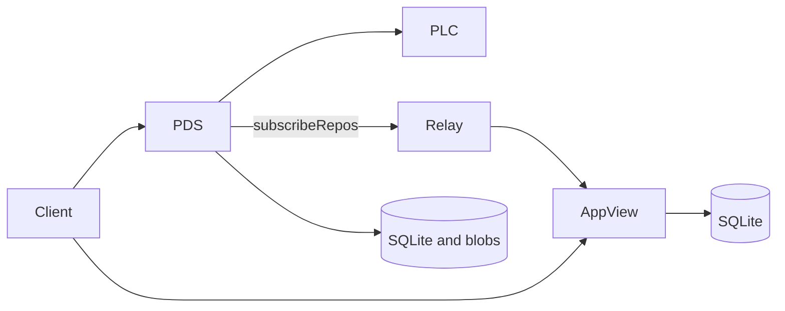

# Architecture

Garazyk implements AT Protocol services in Objective-C. The services use HTTP
and XRPC, store local state in SQLite, and run as separate processes.

## Services

| Binary        | Role                                  |
| ------------- | ------------------------------------- |
| `kaszlak`     | PDS server and command-line interface |
| `zuk`         | Relay                                 |
| `campagnola`  | PLC directory                         |
| `syrena`      | AppView                               |
| `kaszlak` admin | Embedded PDS Admin UI (`:2590`) |
| `syrena-chat` | Chat service                          |
| `jelcz`       | Video processing                      |

Each binary selects its own configuration and routes. Shared code lives in the
static libraries defined by `CMakeLists.txt`.

## HTTP and XRPC

The HTTP implementation separates byte parsing from socket I/O. `Http1Parser`
consumes data and reports protocol events. `HttpConnectionIOCoordinator` owns
the connection read and write cycle. `HttpRouteTrie` selects an HTTP handler,
and `XrpcDispatcher` selects an XRPC method handler.

A request normally passes through these stages:

1. `HttpServer` accepts a connection.
2. The protocol driver parses the request.
3. The route trie selects an HTTP route.
4. The XRPC dispatcher applies request policy and invokes a route pack.
5. The handler calls a service or repository and writes the response.

XRPC methods are grouped by namespace in route packs such as `XrpcServerPack`,
`XrpcRepoPack`, and `XrpcSyncPack`. Non-XRPC routes cover OAuth, well-known
metadata, health checks, metrics, and administration.

The parser enforces request size and timeout limits before dispatch. WebSocket
support is used for `com.atproto.sync.subscribeRepos`.

## Storage

Service-level SQLite databases hold account, DID cache, and sequencing state.
Actor repositories use separate stores for records and blocks. Blob data lives
outside the SQLite databases.

SQLite runs in WAL mode. Read connections come from a pool, while writes for a
store are serialized. Database migrations run through `PDSMigrationManager`.

`ActorStore` provides record and block operations. Higher-level services use
repository protocols so tests can substitute in-memory implementations.

## Federation

The PDS emits repository events through `SubscribeReposHandler`. Events contain
repository commits, identity changes, or stream errors.

`zuk` connects to PDS firehoses, validates upstream hosts, and forwards events
to downstream subscribers. Its WebSocket client handles TLS, masking,
heartbeats, cursors, and reconnects.

The relay root route serves a self-contained HTML/CSS/JavaScript dashboard. It
polls relay health, metrics, and upstream crawl state through `/api/relay/*`,
provides crawl and upstream connection actions, and can display live
`subscribeRepos` frames. Operators can also consume the same binary DAG-CBOR
stream with `scripts/monitor_relay_firehose.ts`, which reports sequence progress,
throughput, event types, commit actions, collections, repositories, reconnects,
and malformed frames.

The AppView consumes relay events in two steps:

1. The ingest path stores and queues incoming data.
2. Indexers materialize records for profile, feed, graph, and notification
   queries.

AppView query handlers read the resulting SQLite indexes.

## Dependencies and lifecycle

`ATProtoServiceContainer` registers shared service instances and factories.
Route packs receive dependencies through `XrpcRoutePackServiceBag`.

The binaries share command-line parsing and signal handling. They start their
stores before accepting requests and stop network work before closing storage.

## Security boundaries

The request path includes:

- host and SSRF checks for outbound HTTP
- request size and timeout limits
- rate limiting
- JWT scope and DPoP checks
- CORS, CSP, CSRF, and HTML escaping where applicable

Production services still need TLS termination and appropriate secret storage.

## Platform support

macOS builds use Apple frameworks. Linux builds use GNUstep, libdispatch,
OpenSSL, and the compatibility code under `Garazyk/Sources/Compat/`.

## Related documentation

- [AT Protocol specification](https://atproto.com/specs/atp)
- [Database architecture](../../../Garazyk/Sources/Database/ARCHITECTURE.md)
- [Admin UI architecture](../../../Garazyk/Sources/Admin/ADMINUI_ARCHITECTURE.md)
- [Deployment](../guides/DEPLOYMENT.md)
- [NixOS build and deployment](../guides/NIXOS.md)
