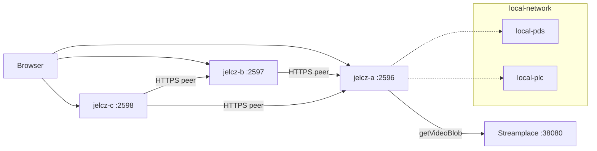

# Streamplace and jelcz peership lab

How to run a **local lab** where:

1. Garazyk’s ATProto network is up (PLC, PDS, relay, AppView, …)
2. A **Streamplace** node is the video origin (test stream and/or RTMP)
3. **Multiple `jelcz` instances** HTTPS-peer Streamplace and each other

This is the operator path for [workstream 15](../../plans/workstreams/15-streamplace-vod-peership.md)
(HTTPS `getVideoBlob` peership) and [workstream 16](../../plans/workstreams/16-jelcz-p2p-peership.md)
Phase 2 (multi-provider HTTPS mesh). It does **not** join Streamplace’s live
iroh swarm.

Canonical compose and failure notes:
[`docker/streamplace-peership/README.md`](../../../docker/streamplace-peership/README.md).
Byte model: [ADR 0036](../../adr/0036-content-addressed-video-distribution.md).
Discovery options: [video discovery guide](video-discovery-and-peer-sharing-options.md).

## What you get

| Piece | Role | Host ports |
| --- | --- | --- |
| `docker/local-network` | Garazyk ATProto | PLC 2582, PDS 2583, relay 2584, AppView 3200, … |
| Streamplace | Video origin | HTTP **38080**, RTMP **1935** |
| jelcz-a / b / c | Peering video nodes + demo UI | **2596** / **2597** / **2598** |

Ports **2596–2598** avoid colliding with local-network `local-video` (2586) and
optional PDS2 (2587).

## Quick start (Docker)

```bash
# Stages Linux jelcz, starts ATProto, builds/starts Streamplace + 3× jelcz
./scripts/demo/streamplace_peership_up.sh

# CA mesh smoke: seed A → pull B/C → local getVideoBlob
./scripts/demo/streamplace_peership_smoke.sh

# Optional: ffmpeg testsrc → Streamplace RTMP
./scripts/demo/streamplace_peership_up.sh --publish
```

| UI | URL |
| --- | --- |
| jelcz-a peership demo | http://127.0.0.1:2596/demo/streamplace |
| jelcz-b | http://127.0.0.1:2597/demo/streamplace |
| jelcz-c | http://127.0.0.1:2598/demo/streamplace |
| Streamplace | http://127.0.0.1:38080/ |

Tear down peership only:

```bash
./scripts/demo/streamplace_peership_down.sh
```

Tear down peership + ATProto:

```bash
./scripts/demo/streamplace_peership_down.sh --atproto
```

### Prerequisites

1. Docker
2. `deno run -A scripts/stage_binaries.ts` (Linux ELF `jelcz` for
   `Dockerfile.jelcz`) — the up script runs this unless `--skip-stage`
3. External Docker network from local-network (default
   `local-network_local_net`; override with `GARAZYK_ATPROTO_NET`)

Copy knobs from
[`docker/streamplace-peership/.env.example`](../../../docker/streamplace-peership/.env.example).

## Host-only demos (no Streamplace container)

Useful when iterating on jelcz without pulling the Streamplace image:

```bash
# Single jelcz + public/mirror Streamplace HTTPS
./scripts/demo/jelcz_streamplace_peer_demo.sh
# http://127.0.0.1:2586/demo/streamplace

# Two local jelcz HTTPS peers (seed → pull)
./scripts/demo/jelcz_https_mesh_demo.sh
```

## Architecture (lab)



**Identity planes stay separate:** Streamplace’s embedded PDS is not kaszlak.
Jelcz treats Streamplace as an untrusted HTTPS origin (ADR 0036). Publishing
Garazyk/Streamplace origin records from jelcz is WS16 Phase 3+.

**Browser path:** players talk to a jelcz demo origin; playlists are rewritten
so media requests stay on that jelcz (CA hit or Range-proxy), not on
`stream.place` / the Streamplace container for the player.

## Env cheatsheet

| Variable | Meaning |
| --- | --- |
| `JELCZ_STREAMPLACE_MIRROR_BASE` | Streamplace HTTP base (compose: `http://streamplace:38080`) |
| `JELCZ_STREAMPLACE_ATTRIBUTION_DID` | `did=` for getVideoBlob accounting |
| `JELCZ_PEER_HTTPS_PROVIDERS` | Comma-separated peer jelcz bases |
| `JELCZ_P2P_ALLOWED_STREAMERS` / `_BROADCASTERS` | Origin-record auto-ingest consent (`*` or DIDs; empty = deny) |
| `JELCZ_STREAMPLACE_DEMO=1` | Demo UI + APIs |
| `JELCZ_STREAMPLACE_SERVE_COMPAT=1` | Serve `place.stream.playback.getVideoBlob` from local CA |

## Related scripts

| Script | Purpose |
| --- | --- |
| `scripts/demo/streamplace_peership_up.sh` | Full Docker lab up |
| `scripts/demo/streamplace_peership_smoke.sh` | Mesh + optional catalog probe |
| `scripts/demo/streamplace_peership_down.sh` | Compose down |
| `scripts/demo/streamplace_rtmp_publish.sh` | Host ffmpeg → RTMP |
| `scripts/test/streamplace_vod_mirror_smoke.sh` | Opt-in live mirror smoke (WS15) |
| `scripts/scenarios/setup_local_network.sh` | Garazyk ATProto Docker topology |
