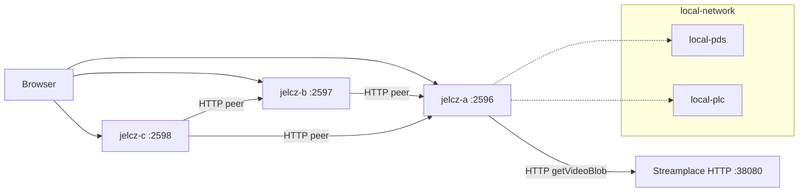

# Streamplace and jelcz peership lab

How to run a **local lab** where:

1. Garazyk’s ATProto network is up (PLC, PDS, relay, AppView, …)
2. A **Streamplace** node is the video origin (test stream and/or RTMP)
3. **Multiple `jelcz` instances** peer over HTTP inside the Docker lab and
   exercise the optional Track A iroh-blobs path

This is the operator path for [workstream 15](../../plans/workstreams/15-streamplace-vod-peership.md)
(HTTPS `getVideoBlob` peership) and [workstream 16](../../plans/workstreams/16-jelcz-p2p-peership.md)
Phase 2 (multi-provider HTTP mesh) and the implementation path for Phase 3
(remote-PDS origin announce). The default procedure below does **not** join
Streamplace’s live iroh swarm. Track B uses a separate, opt-in acceptance
profile documented in the canonical Compose README; no dated Scenario 101 pass
is recorded as of 2026-08-13.

> **Lab transport boundary.** The canonical Compose lab is HTTP internally:
> Streamplace runs with `SP_SECURE=false`, and the jelcz and sidecar service
> URLs use Docker DNS with `http://`. Published host ports bind to loopback by
> default. This is intentionally not an HTTPS/TLS exercise; no procedure here
> asserts a true TLS handshake or certificate validation.

Canonical compose and failure notes:
[`docker/streamplace-peership/README.md`](../../../docker/streamplace-peership/README.md).
Byte model: [ADR 0036](../../adr/0036-content-addressed-video-distribution.md).
Discovery options: [video discovery guide](video-discovery-and-peer-sharing-options.md).

## What you get

| Piece | Role | Host ports |
| --- | --- | --- |
| `docker/local-network` | Garazyk ATProto | PLC 2582, PDS 2583, relay 2584, AppView 3200, … |
| Streamplace | Video origin | HTTP **38080**, RTMP **1935** |
| jelcz-a / b / c | Peering video nodes + demo UI | **2596** / **2597** / **2598** |

Ports **2596–2598** avoid colliding with local-network `local-video` (2586) and
optional PDS2 (2587).

## Quick start (Docker)

```bash
# Copy the immutable-image and loopback-bind defaults first. The generated
# .env is intentionally local and ignored.
cp docker/streamplace-peership/.env.example docker/streamplace-peership/.env

# Stages Linux jelcz, starts ATProto, builds/starts Streamplace + 3× jelcz.
# --fresh creates an isolated project and empty project-owned volumes.
./scripts/demo/streamplace_peership_up.sh

# CA mesh smoke: fresh HTTP and iroh objects, initial destination misses,
# transport attribution, and byte-equal local getVideoBlob reads.
# If startup generated the capabilities, run the exact safe-loader command
# printed by the startup wrapper before this command.
./scripts/demo/streamplace_peership_smoke.sh

# Optional Docker implementation smoke for PDS announce/retract (WS16 Phase 3).
# It creates disposable PDS credentials, recreates only jelcz-a, verifies the
# record through getRecord, retracts it, and removes the temporary capability.
./scripts/demo/streamplace_peership_federation_smoke.sh
# Requires the same Compose project plus local-network PDS on host :2583.

| UI | URL |
| --- | --- |
| jelcz-a peership demo | http://127.0.0.1:2596/demo/streamplace |
| jelcz-b | http://127.0.0.1:2597/demo/streamplace |
| jelcz-c | http://127.0.0.1:2598/demo/streamplace |
| Streamplace | http://127.0.0.1:38080/ |

Tear down peership only (the normal project retains its volumes):

```bash
./scripts/demo/streamplace_peership_down.sh
```

Tear down peership + ATProto:

```bash
./scripts/demo/streamplace_peership_down.sh --atproto
```

### Run with an explicit project lifecycle

The normal `.env` names a persistent project (`streamplace-peership-demo`). For
a disposable run, use `--fresh`; the wrapper prints the generated project name,
the project-specific runtime token file (when it generated one), and the exact
smoke command to use. Tear it down with that same project name and `--wipe`.

```bash
./scripts/demo/streamplace_peership_up.sh --fresh
# Copy the command printed by the wrapper. It validates and parses the generated
# capability file, sets COMPOSE_PROJECT_NAME, then invokes the smoke script.
./scripts/demo/streamplace_peership_down.sh --project-name YOUR_PROJECT --wipe
```

Do not reuse the same published ports for concurrent projects. Use separate
env files with distinct `*_HOST_PORT` values when you need concurrent labs.

### Prerequisites

1. Docker
2. `deno run -A scripts/stage_binaries.ts` (Linux ELF `jelcz` for
   `Dockerfile.jelcz`) — the up script runs this unless `--skip-stage`
3. External Docker network from local-network (default
   `local-network_local_net`; override with `GARAZYK_ATPROTO_NET`)

Copy knobs from
[`docker/streamplace-peership/.env.example`](../../../docker/streamplace-peership/.env.example).

## Host-only demos (no Streamplace container)

Useful when iterating on jelcz without pulling the Streamplace image:

```bash
# Single jelcz + public/mirror Streamplace HTTPS
./scripts/demo/jelcz_streamplace_peer_demo.sh
# http://127.0.0.1:2586/demo/streamplace

# Two local jelcz HTTPS peers (seed → pull)
./scripts/demo/jelcz_https_mesh_demo.sh
```

## Architecture (lab)



**Identity planes stay separate:** Streamplace’s embedded PDS is not kaszlak.
Jelcz treats Streamplace as an untrusted HTTPS origin (ADR 0036). Publishing
Garazyk/Streamplace origin records from jelcz is WS16 Phase 3+.

**Browser path:** players talk to a jelcz demo origin; playlists are rewritten
so media requests stay on that jelcz (CA hit or Range-proxy), not on
`stream.place` / the Streamplace container for the player.

**Sidecar bind boundary:** outside Docker, the IPC smoke starts the sidecar on
`127.0.0.1`. In Compose, each sidecar listens on `0.0.0.0` only so its paired
jelcz can reach it on the private Compose network; it has no published host
port. Compose enables `JELCZ_IROH_SIDECAR_TRUST_LAN=1` for those service names.
Do not expose a sidecar port from this lab.

## Env cheatsheet

| Variable | Meaning |
| --- | --- |
| `JELCZ_STREAMPLACE_MIRROR_BASE` | Streamplace HTTP base (compose: `http://streamplace:38080`) |
| `JELCZ_STREAMPLACE_ATTRIBUTION_DID` | `did=` for getVideoBlob accounting |
| `JELCZ_PEER_HTTPS_PROVIDERS` | Comma-separated peer jelcz bases |
| `JELCZ_P2P_ALLOWED_STREAMERS` / `_BROADCASTERS` | Origin-record auto-ingest consent (`*` or DIDs; empty = deny) |
| `JELCZ_STREAMPLACE_DEMO=1` | Demo UI + APIs |
| `JELCZ_STREAMPLACE_SERVE_COMPAT=1` | Serve `place.stream.playback.getVideoBlob` from local CA |
| `JELCZ_DEMO_API_TOKEN` | Bearer capability for mutating demo APIs. Docker requires it; the wrapper generates one when blank. Standalone demos may omit it for compatibility. |

### Track A iroh-blobs sidecar (lab — default off)

Garazyk CA/VOD P2P uses a **separate** Rust sidecar
(`tools/jelcz-iroh-blobs-sidecar/`) on iroh 1.x. Standalone jelcz accepts a
loopback HTTP sidecar URL by default; Docker service-name URLs require the
explicit lab-only `JELCZ_IROH_SIDECAR_TRUST_LAN=1` setting described above.
The resolver verifies candidate bytes before writing to the CA store.

| Variable | Meaning |
| --- | --- |
| `JELCZ_P2P` | Master opt-in for Track A iroh mirror fetch (`1`/`true`/`yes`/`on`; **default off**) |
| `JELCZ_IROH_SIDECAR_URL` | Loopback sidecar IPC base, e.g. `http://127.0.0.1:17352` (ignored unless `JELCZ_P2P=1`) |
| `JELCZ_IROH_PROVIDER_ENDPOINT_ID` | Bootstrap provider EndpointID (also emitted as `iroh://…` in provider list) |
| `JELCZ_IROH_PROVIDER_ENDPOINT_TICKET` | Optional bootstrap ticket for first dial |
| `JELCZ_CA_MIRROR_FETCH=1` | Required (with providers) for mirror resolver to call any fetcher |
| `JELCZ_IROH_SIDECAR_TRUST_LAN=1` | Compose-only opt-in for private service-name/LAN sidecar URLs; leave unset for loopback-only use |

Run the sidecar: `cargo run -p jelcz-iroh-blobs-sidecar -- --listen 127.0.0.1:17352`
or `--unix /path/to.sock` (UDS is sidecar-only; jelcz still needs the HTTP URL
unless you add a local forwarder).

Smoke (sidecar IPC only): `./scripts/demo/jelcz_iroh_sidecar_smoke.sh`

## What the Docker smoke and scenario assert

`streamplace_peership_smoke.sh` seeds distinct payloads with mesh fanout
disabled. It requires an initially missing B object before the HTTP pull and an
initially missing C object before the iroh pull; each successful pull must
report `peered-verified`, the expected `peerSource` (`http-peer` or
`iroh-peer`), `blake3Verified=true`, and a byte-equal local `getVideoBlob`
response. Docker always uses a non-empty demo capability and checks missing and
wrong Bearer values return 401 and 403. Only a standalone, deliberately
unauthenticated demo may omit `JELCZ_DEMO_API_TOKEN` for compatibility.

Scenario 100 offers the same externally managed lab to Hamownia:

```bash
# Start the Compose lab first. If it generated capabilities, run the validated
# loader command printed by streamplace_peership_up.sh.
JELCZ_PEERSHIP_LAB=1 deno task hamownia run --no-setup 100
```

It is skipped unless `JELCZ_PEERSHIP_LAB=1`; Hamownia does not create the
Compose topology. The scenario uses host URLs for A/B/C but gives B the Compose
DNS provider URL `http://jelcz-a:2596`. It records HTTP and iroh source
attribution plus byte equality, and explicitly skips Streamplace-origin and
ATProto-federation assertions.

**Live evidence, 2026-08-13:** an isolated `codex-peership-verify` Compose
project passed `streamplace_peership_smoke.sh`. Scenario 100 then passed 12
steps with one explicit scope skip; the structured local report was written to
`scripts/scenarios/reports/runs/2026-08-13t2257z-82379/reports/100_jelcz_iroh_peership.json`.
Both paths proved fresh initial misses, `http-peer` and `iroh-peer` attribution,
BLAKE3 verification, and byte equality. The separate federation smoke stopped
at preflight because no local PDS was reachable on `127.0.0.1:2583`; it made no
PDS mutation and is not successful federation evidence.

## Streamplace catalog and origin limitations

The catalog probe is informational and non-gating. With the local Streamplace
v0.8.4 test stream, it does not currently yield a deterministic VOD record that
can drive a `getVideoBlob` assertion. Therefore the smoke uses freshly seeded
jelcz CA bytes rather than treating catalog output as VOD proof.

Likewise, Docker PDS origin announce/discovery and cross-PDS federation remain
unproven by this lab. `streamplace_peership_federation_smoke.sh` provides the
Docker announce → PDS read-back → retract procedure, but it is evidence only
when a dated run succeeds against a reachable local-network PDS. Scenario 100
explicitly does not assert that scope. Public catalog access is optional and
never gates the HTTP or iroh assertions.

## Related scripts

| Script | Purpose |
| --- | --- |
| `scripts/demo/streamplace_peership_up.sh` | Full Docker lab up |
| `scripts/demo/streamplace_peership_smoke.sh` | Mesh + optional catalog probe |
| `scripts/demo/streamplace_peership_federation_smoke.sh` | Optional Docker jelcz-a → PDS publish/read/retract proof |
| `scripts/scenarios/scenarios/100_jelcz_iroh_peership.ts` | Opt-in Hamownia assertion for an already-running Compose lab |
| `scripts/scenarios/scenarios/101_streamplace_track_b_live_iroh.ts` | Opt-in pinned-image Track B acceptance; currently awaiting its first dated live pass |
| `scripts/demo/check_streamplace_peership_compose.sh` | Static Compose interpolation and isolation check (not a live lab run) |
| `scripts/demo/check_streamplace_track_b_compose.sh` | Static Track B profile and isolation check (not live acceptance) |
| `scripts/demo/streamplace_peership_down.sh` | Compose down |
| `scripts/demo/streamplace_rtmp_publish.sh` | Host ffmpeg → RTMP |
| `scripts/test/streamplace_vod_mirror_smoke.sh` | Opt-in live mirror smoke (WS15) |
| `scripts/scenarios/setup_local_network.sh` | Garazyk ATProto Docker topology |
