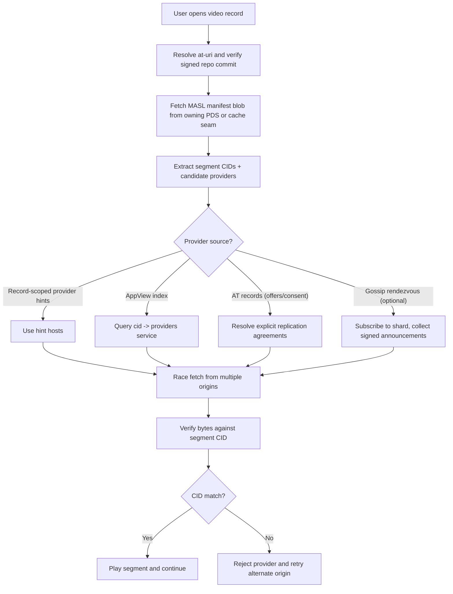

# Video discovery and peer-sharing options

This document consolidates research and design options for content-addressed
video retrieval in Garazyk, focused on discovery and bandwidth sharing when the
same bytes exist on multiple servers.

It assumes the ADR 0036 direction: atproto blobs carry a small manifest, while
segments are content-addressed resources named by CID and fetched from
pluggable origins.

Important layering note: provider hints are mutable operational metadata and
should be carried on mutable record metadata, not embedded in immutable manifest
bytes.

## Problem statement

For large video, the hard part is not hash verification. The hard parts are:

| Problem | Why it matters |
| --- | --- |
| Provider discovery | A CID does not tell clients where bytes are hosted. |
| Bandwidth sharing | Single-origin serving is expensive for popular media. |
| Low startup latency | Playback needs fast first-byte and seek behavior. |
| Consent and policy | Not every host wants to serve arbitrary third-party traffic. |

## Core architectural separation

Treat these concerns as separate layers:

## On atproto, the firehose is the advertisement chain

Before evaluating external discovery systems, note what atproto already has.
A provider announcement is just a record, and the firehose is already a signed
append-only advertisement chain. Any indexer that ingests one collection can
answer `cid → providers`.

[IPNI](https://github.com/ipni/specs/blob/main/IPNI.md) — the IPFS network
indexer — reimplements this apparatus from scratch: signed append-only ad
chains, replay-from-genesis, snapshot trust. That is repo + firehose +
backfill, a problem Garazyk already owns (`zuk` ingests the firehose; `kaszlak`
serves backfill). Adopting IPNI would mean running a parallel indexer for a
problem the existing stack already solves, against a different advertisement
format that does not carry atproto signatures or repo semantics.

The practical consequence: `cid → providers` on atproto is a **lexicon
question**, not a build-or-adopt question. Define the provider-announcement
record (the shape already exists as `place.stream.broadcast.origin` — a
mirror-authored origin attestation with server DID, address, and heartbeat),
let mirrors publish it, and let any firehose consumer index it. Evaluate
IPNI/gossip/Willow against *that* baseline, not against nothing.

The vendored `place.stream.metadata.distributionPolicy` lexicon also carries
`allowedBroadcasters` (with `*` for anyone and a `!` prefix to ban) and
`deleteAfter` — the consent primitive that external systems like Meadowcap
would need to layer on top. On atproto it is a declared policy a cooperating
mirror can honor, which is more than nothing and more than Meadowcap would
give you.

## What each protocol family is good at

| Family | Best at | Not best at |
| --- | --- | --- |
| RASL-style verified multi-origin HTTPS | Practical browser retrieval with hash verification | Decentralized provider discovery on its own |
| AppView/provider index | Fast lookup and ranking in one operator domain | Decentralization and consent by default |
| AT record-based offers/consent | Explicit policy and federated coordination | Instant discovery unless many indexers track it |
| Gossip/rendezvous overlays | Decentralized liveness announcements | Strong cold-start guarantees and abuse resistance without extra design |
| Willow sync/reconciliation | Efficient set difference sync between known peers | Global discovery of providers for arbitrary CIDs |
| WebRTC peer-assist | Live/hot-content bandwidth offload | Reliable VOD cold-start across heterogeneous clients |

## Saorsa-gossip vs Willow

Both are useful references, but they solve different classes of problems.

| Dimension | Saorsa-style gossip concepts | Willow concepts |
| --- | --- | --- |
| Primary objective | Discovery and dissemination through overlay announcements | Confidential, efficient synchronization between peers |
| Key mechanism | Rendezvous shards and signed provider summaries | 3d range-based set reconciliation and private interest overlap |
| Typical question answered | "Who has CID X right now?" | "Given we should sync, what entries differ?" |
| Fit for segment provider lookup | Direct fit | Indirect; needs separate discovery layer |
| Fit for mirror backfill after partition | Good with anti-entropy extensions | Strong fit at *catalog* scale; unnecessary within a single asset |

Willow's reconciliation algorithm is the part most often cited, but for this
workstream its more useful contributions are the entry/payload split and its
treatment of partial payloads. See
[Range-based set reconciliation and the Willow protocol](range-based-set-reconciliation.md)
for the full breakdown; the summary follows.

## Reconciliation here is three questions, not one

A MASL manifest ([ADR 0036](../../adr/0036-content-addressed-video-distribution.md))
enumerates every segment of a video and commits to all of them under one CID.
That answers, up front, the question set-reconciliation protocols exist to
answer — so "sync two mirrors" decomposes into three problems at three scales
with three different answers:

| Question | Scale | Right answer |
| --- | --- | --- |
| Do two nodes hold the same version of asset X? | 1 asset | Compare manifest CIDs — 32 bytes |
| Which segments of asset X does the peer hold? | ~10³ segments | Possession **bitmap** over manifest-ordered indices |
| Which assets does this mirror hold at all? | ~10⁷–10⁸ segment CIDs | Range-based set reconciliation over the CID-ordered keyspace |

Only the third is a set-reconciliation problem. For a one-hour, three-rendition
video (~1,800 segments) a possession bitmap is ~225 bytes raw and compresses
further because possession is contiguous — roughly an order of magnitude cheaper
than an IBLT over the same data, and exact rather than probabilistic. This is
the BitTorrent bitfield, and it is the right shape here for the same reason.

The practical consequence: **do not put a set-reconciliation protocol on the
per-asset path.** It belongs, if anywhere, at cross-mirror catalog scale, which
is deferred to [workstream 12](../../plans/workstreams/12-content-addressed-video.md)
Phase 10.

## What to take from Willow, and what to leave

| Willow idea | Verdict |
| --- | --- |
| Reconcile metadata; transfer payloads as a separate negotiated phase, eager or lazy by size | **Adopt.** This is exactly the manifest-then-segments split already in the design; Willow reaching the same boundary is evidence it is placed correctly. |
| Partial payloads, verifiable incrementally | **Adopt the constraint.** It is the argument for settling the BDASL chunk-digest sidecar question with bao outboard encoding rather than a bespoke format — the same encoding iroh uses. |
| Range-based set reconciliation | **Defer** to catalog scale (Phase 10). |
| Meadowcap capabilities | **Leave.** Mirrors are ordinary HTTPS origins and manifest CIDs already make them untrusted-safe; content addressing gives integrity without authorization on the read path. |
| Prefix pruning / newest-timestamp-wins | **Leave.** Segments are immutable; importing a conflict-resolution rule would invent a conflict that does not exist. |
| Private area intersection | **Leave.** Public media; there is no interest set to conceal. |

Note that consent and policy — the "not every host wants to serve arbitrary
third-party traffic" row in the problem statement — is a *discovery and
publication* concern, not a sync-authorization one. Declining to advertise as a
provider is the control point, and it does not require Meadowcap.

## Candidate strategies for Garazyk

| Strategy | Pros | Cons | Best fit |
| --- | --- | --- | --- |
| Record-scoped RASL/provider hints | Mutable without changing manifest CID; no extra index service needed initially | Requires record updates to keep hints fresh; still operator-managed metadata | Smaller deployments with stable mirror topology |
| AppView `cid -> providers` index | Fast lookup, easy ranking by latency and health, excellent UX | Centralized control plane; requires TTL and abuse controls; consent model must be explicit | Single-operator or tightly managed federation |
| AT record offers/consent (p2pds-style) | Clear policy, explicit opt-in replication, fully auditable | More product and schema surface; slower adoption | Community mirror networks and consent-first federation |
| Gossip rendezvous overlay | Decentralized liveness, no single index dependency | Higher protocol complexity, Sybil/scoring work, weaker cold-start predictability | Large federated mirror ecosystems |
| WebRTC peer-assist | Major offload for live/hot content, proven in video ecosystems | NAT/upload/churn complexity; uneven client capabilities | Live streaming and flash crowd events |
| iroh sidecar distribution | Strong NAT traversal and verified range-fetch potential | Additional runtime and operational burden; integration complexity | Persistent home seeding and advanced P2P deployments |

## Critical design constraints

| Constraint | Design implication |
| --- | --- |
| Atproto object identity is repo-scoped | Treat identical CIDs across repos as retrieval candidates, not identity merges |
| Manifest trust chain is authoritative | Discovery metadata is advisory; segment bytes must verify against manifest CIDs |
| Video startup latency budget is strict | Prefer direct provider hints/index lookups over multi-round global lookups |
| Mirror participation may be voluntary | Add explicit consent semantics before auto-enrolling hosts as providers |

## Recommended phased plan

| Phase | Goal | Deliverable | Risk notes |
| --- | --- | --- | --- |
| 1 | Reliable verified retrieval | Segment-store + manifest resolution + CID verification path | Baseline correctness before optimization |
| 2 | Practical provider discovery | Start with one source of providers: manifest hints or AppView index | Keep discovery source explicit for observability |
| 3 | Policy hardening | Consent model (record-based offers or operator policy) | Prevent accidental "free CDN" behavior |
| 4 | Live scaling | Optional WebRTC peer-assist for live/hot traffic | Keep as additive path, not mandatory |
| 5 | Decentralized expansion | Optional gossip rendezvous and/or iroh sidecar | Add only with measured demand and ops capacity |
| 6 | Mirror sync optimization | Evaluate range-based reconciliation for the *cross-asset catalog* only, and only if catalog backfill is costly at scale | Skip while manifest comparison plus possession bitmaps remain sufficient — they will be for a long time |

## Practical recommendation

Start with the smallest useful system:

1. Keep atproto trust and identity unchanged.
2. Make provider discovery explicit and measurable.
3. Verify every segment against manifest CID before playback.
4. Add decentralized discovery only when central indexing becomes the bottleneck.

This preserves interoperability while allowing gradual evolution from
single-origin serving to multi-origin and peer-assisted distribution.

## References

- [ADR 0036: content-addressed video distribution](../../adr/0036-content-addressed-video-distribution.md)
- [Range-based set reconciliation and the Willow protocol](range-based-set-reconciliation.md)
- [IBLT for atproto reconciliation](iblt-for-atproto-reconciliation.md)
- [AT Protocol blob spec](https://github.com/bluesky-social/atproto-website/blob/main/src/app/%5Blocale%5D/specs/blob/page.mdx)
- [Willow protocol](https://willowprotocol.org/)
- [Willow Confidential Sync](https://willowprotocol.org/specs/confidential-sync/)
- [Willow 3d RBSR](https://willowprotocol.org/specs/rbsr/)
- [Streamplace video architecture write-up](https://blog.stream.place/3mfd2zatm4c2s)
- [p2pds replication model](https://tangled.org/burrito.space/p2pds/blob/main/README.md)
- [libp2p gossipsub spec](https://github.com/libp2p/specs/blob/master/pubsub/gossipsub/gossipsub-v1.0.md)
- [libp2p episub notes](https://github.com/libp2p/specs/blob/master/pubsub/gossipsub/episub.md)
