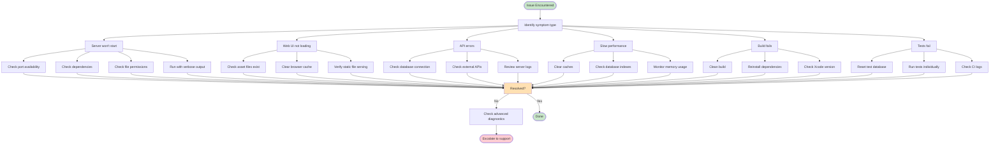
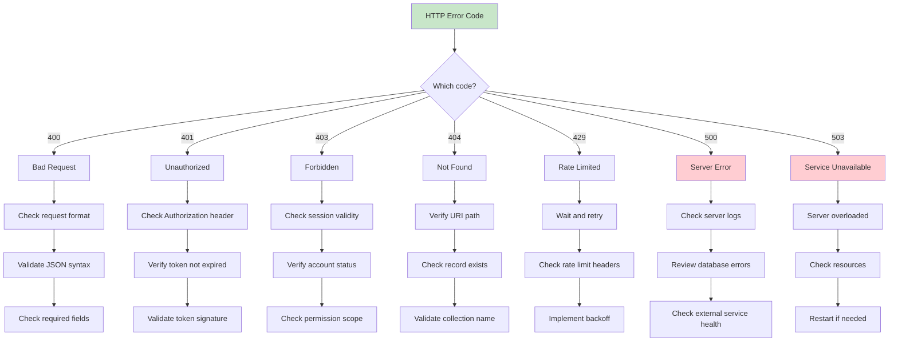

# Troubleshooting Guide

This guide provides procedures for diagnosing and resolving common issues with the ATProto PDS server.

## Troubleshooting Decision Tree



## Quick Diagnosis

### Server Status Check

```bash
# Check if server is running
ps aux | grep atprotopds

# Check port availability
lsof -i :2583

# Test basic connectivity
curl -s http://localhost:2583/explore/api/accounts | head -3
```

### Log Analysis

```bash
# View recent logs
tail -50 server.log

# Follow logs in real-time
tail -f server.log

# Search for errors
grep -i error server.log | tail -10
```

### Database Health

```bash
# Check database file
ls -la data/pds.db

# Test database connectivity
sqlite3 data/pds.db "SELECT COUNT(*) FROM accounts;"

# Check database integrity
sqlite3 data/pds.db "PRAGMA integrity_check;"
```

## HTTP Error Code Quick Reference



| Code | Meaning | Quick Fix |
|------|---------|-----------|
| 400 | Bad Request | Validate JSON format |
| 401 | Unauthorized | Check access token |
| 403 | Forbidden | Verify session valid |
| 404 | Not Found | Check URI path |
| 429 | Rate Limited | Wait and retry |
| 500 | Internal Error | Check server logs |
| 503 | Unavailable | Restart server |

## Common Issues and Solutions

### Issue: Server Won't Start

#### Symptoms
- `atprotopds-cli serve` exits immediately
- Port 2583 not listening
- Error messages about missing libraries

#### Solutions

**Check Dependencies**
```bash
# Verify SQLite
which sqlite3

# Check libsecp256k1
ls -la secp256k1/.libs/libsecp256k1.a

# Rebuild dependencies
make clean-deps && make deps
```

**Check Port Availability**
```bash
# Find process using port 2583
lsof -i :2583

# Kill conflicting process
kill -9 <PID>

# Use different port
./atprotopds-cli serve --port 2584
```

**Check File Permissions**
```bash
# Fix data directory permissions
chmod 755 data/
chmod 644 data/pds.db

# Check executable permissions
chmod +x atprotopds-cli
```

#### Advanced Debugging
```bash
# Run with verbose output
./atprotopds-cli serve --verbose --log-level debug 2>&1 | head -50

# Check for library loading issues
otool -L atprotopds-cli

# Run under debugger
lldb ./atprotopds-cli
(lldb) run serve --port 2583
```

### Issue: Web Interface Not Loading

#### Symptoms
- Server starts but browser shows blank page
- JavaScript errors in browser console
- Static assets return 404

#### Solutions

**Check Asset Loading**
```bash
# Test static file serving
curl -I http://localhost:2583/explore/css/style.css

# Verify asset files exist
ls -la ATProtoPDS/Sources/App/Explore/Assets/

# Check file permissions
find ATProtoPDS/Sources/App/Explore/Assets/ -type f -exec ls -la {} \;
```

**Browser Console Errors**
Common JavaScript errors:

```
TypeError: API is not defined
```
**Fix**: Ensure `api.js` loads before `ui.js`

```
Failed to load module script
```
**Fix**: Check ES6 module support in browser

**Clear Browser Cache**
```bash
# Hard refresh browser
# Cmd+Shift+R (Mac) or Ctrl+F5 (Windows/Linux)
```

**Check Module Loading**
```bash
# Test individual JS files
curl -H "Accept: text/javascript" http://localhost:2583/explore/js/api.js | head -5
```

### Issue: API Endpoints Return Errors

#### Symptoms
- HTTP 500 Internal Server Error
- JSON error responses
- Database connection failures

#### Solutions

**Database Connection Issues**
```bash
# Test database file
ls -la data/pds.db

# Check database permissions
chmod 644 data/pds.db

# Reset database if corrupted
rm -f data/pds.db
./scripts/start_server.sh  # Recreates database
```

**Query Errors**
```bash
# Enable query logging
./atprotopds-cli serve --verbose --log-level debug

# Check for SQL errors in logs
grep -i "sqlite\|sql" server.log | tail -10
```

**External API Failures**
```bash
# Test PLC directory connectivity
curl -s https://plc.directory/did:plc:g3x5vnga7kiu3oaookgeozpb | head -5

# Test DID resolver
curl -s https://did.webplc.io/did:plc:g3x5vnga7kiu3oaookgeozpb | head -5
```

### Issue: Slow Performance

#### Symptoms
- Pages take >5 seconds to load
- High CPU usage
- Memory usage keeps growing

#### Solutions

**Cache Issues**
```bash
# Clear caches
rm -rf ~/.cache/atproto-pds/

# Restart server to clear memory cache
pkill -f atprotopds
./scripts/start_server.sh
```

**Database Performance**
```bash
# Add indexes for slow queries
sqlite3 data/pds.db "CREATE INDEX IF NOT EXISTS idx_records_did ON records(did);"
sqlite3 data/pds.db "CREATE INDEX IF NOT EXISTS idx_records_collection ON records(collection);"

# Analyze query performance
sqlite3 data/pds.db "EXPLAIN QUERY PLAN SELECT * FROM records WHERE did = ?;"
```

**Memory Leaks**
```bash
# Monitor memory usage
ps aux | grep atprotopds

# Profile with Instruments (Xcode)
# Product > Profile > Allocations
```

**Network Issues**
```bash
# Test external API response times
time curl -s https://plc.directory/did:plc:g3x5vnga7kiu3oaookgeozpb > /dev/null

# Check DNS resolution
time nslookup plc.directory
```

### Issue: Build Failures

#### Symptoms
- Xcode build fails with errors
- Make commands fail
- Missing header files

#### Solutions

**Clean Build**
```bash
# Xcode clean
xcodebuild -project ATProtoPDS.xcodeproj clean

# Make clean
make clean

# Remove derived data
rm -rf ~/Library/Developer/Xcode/DerivedData/ATProtoPDS-*
```

**Dependency Issues**
```bash
# Reinstall dependencies
make clean-deps
make deps

# Check libsecp256k1 build
cd secp256k1 && make clean && make
```

**Xcode Configuration**
```bash
# Check Xcode version
xcodebuild -version

# Select correct Xcode
sudo xcode-select -s /Applications/Xcode.app

# Reset Xcode preferences
defaults delete com.apple.dt.Xcode
```

**Compiler Errors**
```bash
# Check for missing imports
grep -r "#import" ATProtoPDS/Sources/ | grep -i missing

# Verify header files
find ATProtoPDS/Sources/ -name "*.h" | wc -l
```

### Issue: Test Failures

#### Symptoms
- Unit tests fail
- Integration tests timeout
- CI pipeline fails

#### Solutions

**Test Data Issues**
```bash
# Reset test database
rm -f test-data/pds.db

# Rebuild test fixtures
./scripts/setup_test_data.sh
```

**Test Environment**
```bash
# Run tests individually
xcodebuild -project ATProtoPDS.xcodeproj -scheme AllTests test -only-testing:TestTarget/TestClass/testMethod

# Debug test failures
xcodebuild -project ATProtoPDS.xcodeproj -scheme AllTests test 2>&1 | grep -A 5 -B 5 "FAILED"
```

**CI Issues**
```bash
# Check GitHub Actions logs
# Look for dependency installation failures
# Verify test data setup in CI
```

## Advanced Troubleshooting

### Network Debugging

**Packet Capture**
```bash
# Capture network traffic
sudo tcpdump -i lo0 port 2583 -w capture.pcap

# Analyze with Wireshark
open capture.pcap
```

**SSL/TLS Issues**
```bash
# Test HTTPS endpoints (when enabled)
curl -v https://localhost:8443/explore/api/accounts

# Check certificate validity
openssl s_client -connect localhost:8443 -servername localhost
```

### Database Debugging

**Query Analysis**
```bash
# Enable SQLite tracing
export SQLITE_TRACE=1
./atprotopds-cli serve --port 2583

# Analyze slow queries
sqlite3 data/pds.db ".timer on" "SELECT * FROM records LIMIT 100;"
```

**Corruption Recovery**
```bash
# Backup database
cp data/pds.db data/pds.db.backup

# Attempt repair
sqlite3 data/pds.db ".recover" > recovered.sql
sqlite3 new.db < recovered.sql
mv new.db data/pds.db
```

### Memory Debugging

**Leaks Detection**
```bash
# Xcode memory graph debugger
# Product > Debug > Debug Memory Graph

# Command line leaks
leaks atprotopds-cli
```

**Heap Analysis**
```bash
# Use heap tool
heap atprotopds-cli

# Profile allocations
malloc_history atprotopds-cli -callTree
```

### Performance Profiling

**CPU Profiling**
```bash
# Sample process
sample atprotopds-cli 10

# Time profiler in Instruments
# Xcode > Product > Profile > Time Profiler
```

**System Monitoring**
```bash
# Monitor system resources
top -pid $(pgrep atprotopds)

# Disk I/O monitoring
iostat -d 1

# Network monitoring
nettop -p atprotopds
```

## Diagnostic Tools

### Built-in Diagnostics

```bash
# Server debug endpoint
curl http://localhost:2583/explore/api/debug

# Health check
curl http://localhost:2583/explore/api/accounts

# Cache status
curl http://localhost:2583/explore/api/debug | jq .cacheStats
```

### External Tools

**Database Tools**
```bash
# SQLite browser
open -a "DB Browser for SQLite" data/pds.db

# SQLite command line
sqlite3 data/pds.db
.schema
.tables
.quit
```

**Network Tools**
```bash
# Charles Proxy for HTTP debugging
# Proxyman for API inspection
# Postman for API testing
```

**System Tools**
```bash
# Activity Monitor for resource usage
# Console.app for system logs
# Disk Utility for file system issues
```

## Getting Help

### Information to Provide

When reporting issues, include:

1. **System Information**
   ```bash
   sw_vers
   xcodebuild -version
   uname -a
   ```

2. **Error Logs**
   ```bash
   tail -100 server.log
   ```

3. **Configuration**
   ```bash
   cat config.json 2>/dev/null || echo "No config file"
   ```

4. **Reproduction Steps**
   - Exact commands used
   - Input data
   - Expected vs actual behavior

### Support Resources

- **GitHub Issues**: Report bugs and request help
- **API Documentation**: `http://localhost:2583/explore/api/docs`
- **Architecture Docs**: `docs/ARCHITECTURE_DIAGRAMS.md`
- **Session Summary**: `docs/SESSION_SUMMARY.md`

### Emergency Recovery

**Complete Reset**
```bash
# Stop server
pkill -9 -f atprotopds

# Backup important data
cp -r data/ data.backup/

# Clean rebuild
make clean-all
make deps
make build

# Restart
./scripts/start_server.sh
```

**Factory Reset**
```bash
# Remove all data and caches
rm -rf data/ ~/.cache/atproto-pds/

# Rebuild from scratch
git clean -fdx
git reset --hard HEAD
make deps && make build
./scripts/start_server.sh
```

This troubleshooting guide covers the most common issues. For unresolved problems, please include the diagnostic information above when seeking help.

## Related Documentation

- **[Development Workflows](docs/guides/DEVELOPMENT_WORKFLOWS.md)** - Build, test, and debug process diagrams
- **[Architecture Diagrams](docs/architecture/README.md)** - System architecture reference
- **[Database Schema](docs/architecture/database_schema.dot)** - Entity relationships
- **[Authentication Flow](docs/architecture/authentication_flow.dot)** - Auth process details
- **[Request Flow](docs/architecture/request_flow.dot)** - HTTP request pipeline
- **[API Documentation](http://localhost:2583/explore/api/docs)** - Interactive API docs (when server running)