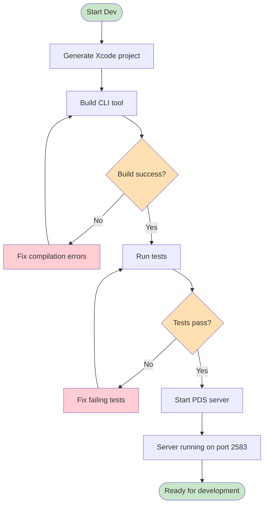
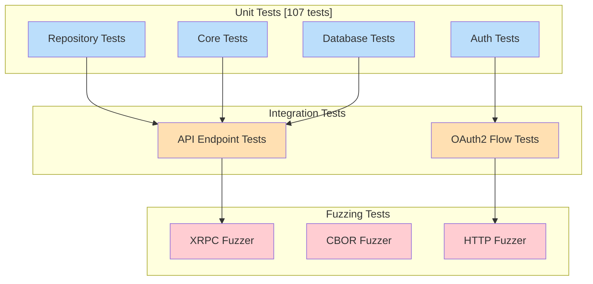
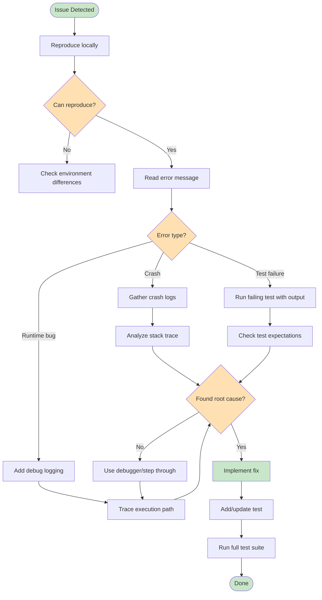
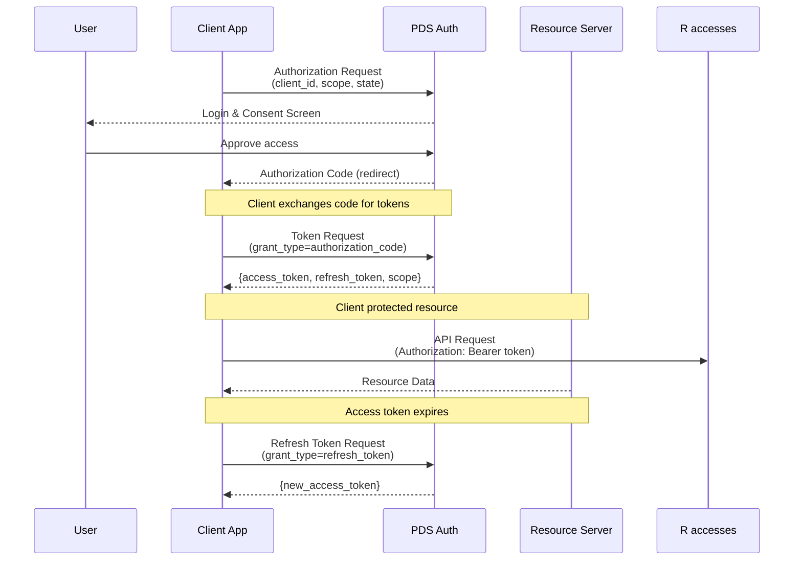
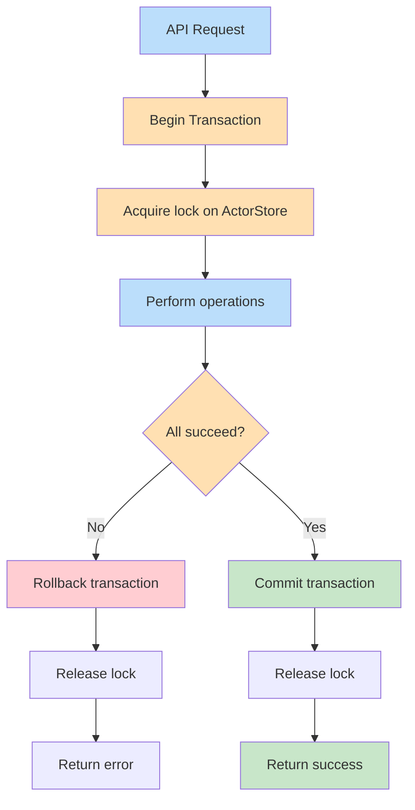
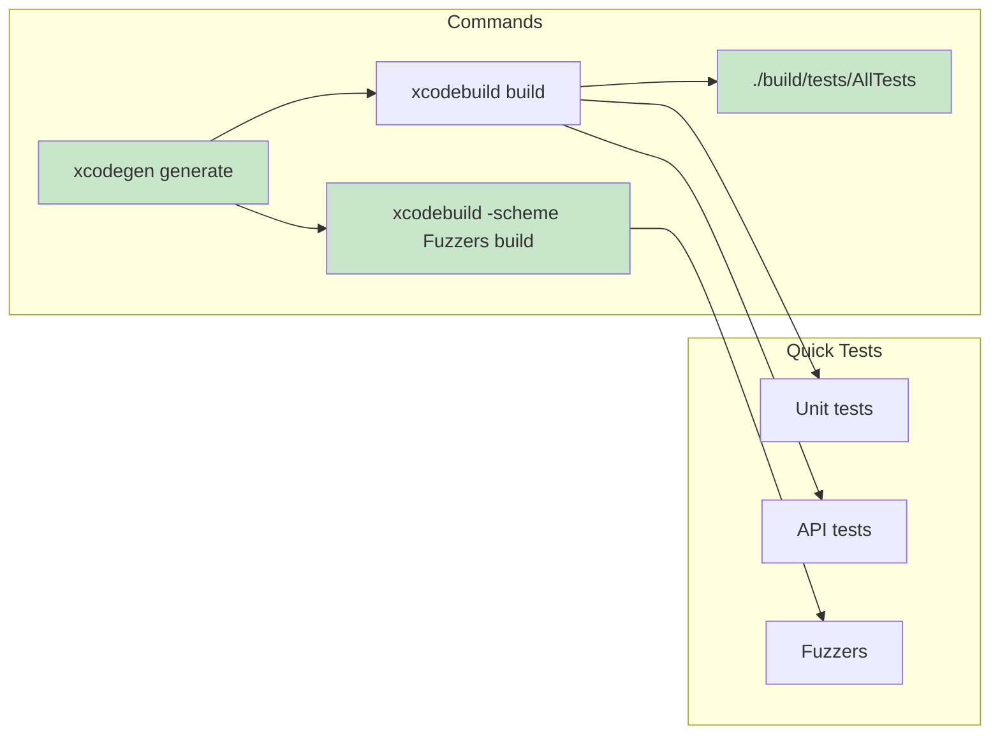
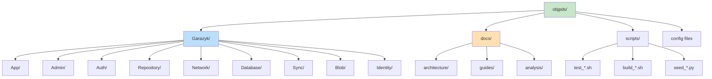

# Development Workflow Diagrams

Visual guides for common development tasks in this project.

## Build and Run Process



## Test Pyramid



## Code Organization

```mermaid
graph TD
    subgraph "Garazyk/Sources"
        subgraph "App"
            PDS[PDSController]
        end
        
        subgraph "Admin"
            Admin[Admin APIs]
        end
        
        subgraph "Auth"
            JWT[JWT Signing]
            OAuth[OAuth2 Provider]
            Sessions[Session Mgmt]
        end
        
        subgraph "Repository"
            MST[Merkle Search Tree]
            CAR[CAR Encoding]
            Records[Record Ops]
        end
        
        subgraph "Network"
            HTTP[HTTP Server]
            XRPC[XRPC Handler]
            WebSocket[WS Handler]
        end
        
        subgraph "Database"
            SQLite[SQLite Wrapper]
            Migrations[Schema Migrations]
        end
        
        subgraph "Sync"
            Firehose[SubscribeRepos]
            Cursors[Cursor Manager]
        end
        
        subgraph "Blob"
            Storage[Blob Storage]
            Validation[MIME Validation]
        end
        
        subgraph "Identity"
            DID[DID Resolution]
            PLC[PLC Directory]
        end
        
        PDS --> Auth
        PDS --> Repository
        PDS --> Admin
        PDS --> Sync
        
        HTTP --> XRPC
        XRPC --> PDS
        
        Repository --> MST
        Repository --> CAR
        Repository --> Blob
        Repository --> Database
        
        Auth --> JWT
        Auth --> OAuth
        Auth --> Sessions
        
        Sync --> Firehose
        Sync --> Cursors
        
        Identity --> DID
        Identity --> PLC
    end
    
    style PDS fill:#c8e6c9
```

## Debugging Flowchart



## OAuth2 Authorization Flow



## Database Transaction Flow



## Quick Reference Commands



## File Structure Overview



## Related Documentation

### Architecture Documents
- [README.md](README) - Architecture documentation index
- [ARCHITECTURE_ANALYSIS.md](# Architecture analysis) - Component analysis and build system details

### Diagram Documents
- [ARCHITECTURE_DIAGRAMS.md](ARCHITECTURE_DIAGRAMS) - System overview diagrams
- [DIAGRAMS_MERMAID.md](DIAGRAMS_MERMAID) - Protocol flow diagrams
- [DIAGRAM_QUICK_REFERENCE.md](DIAGRAM_QUICK_REFERENCE) - Diagram selection guide

### Related Guides
- [../guides/DEVELOPER_GUIDE.md](../guides/development/DEVELOPER_GUIDE) - Developer onboarding guide
- [../guides/DEVELOPMENT_WORKFLOWS.md](../guides/DEVELOPMENT_WORKFLOWS) - Duplicate guide version
- [../guides/SETUP_GUIDE.md](../guides/SETUP_GUIDE) - Environment setup guide
