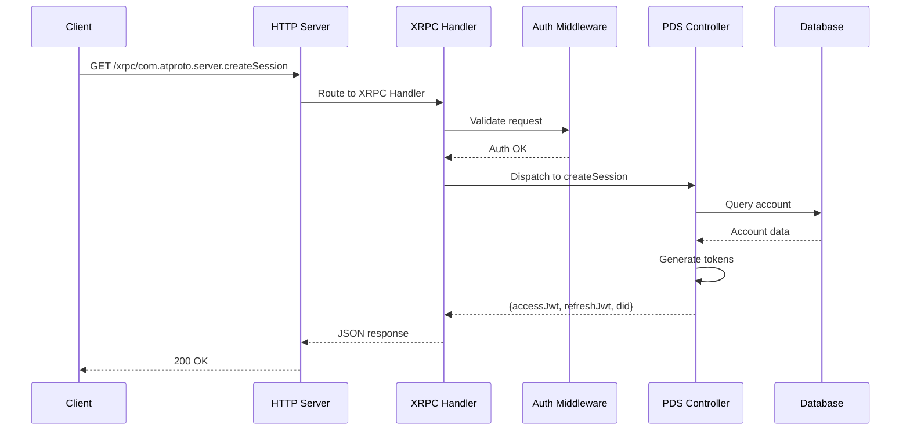
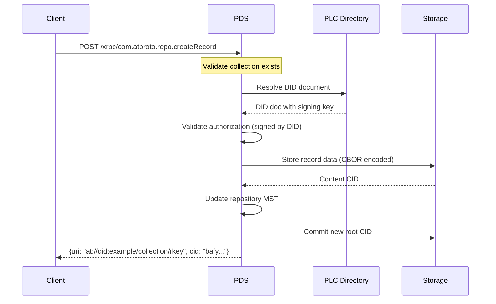
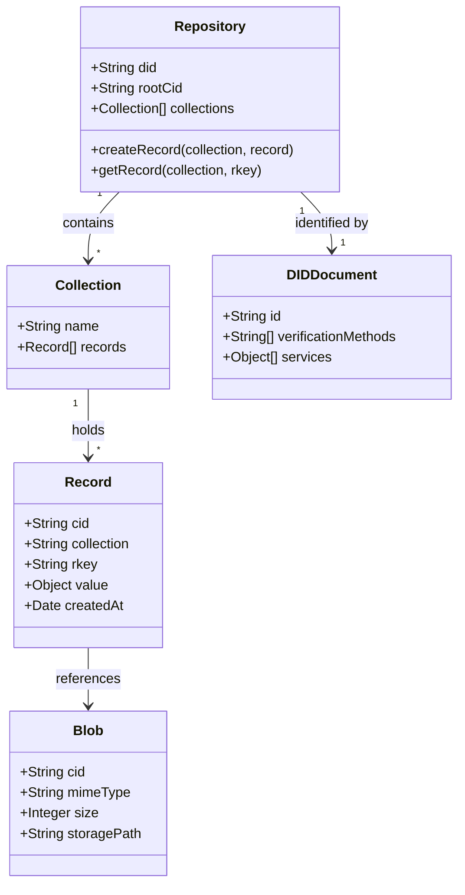
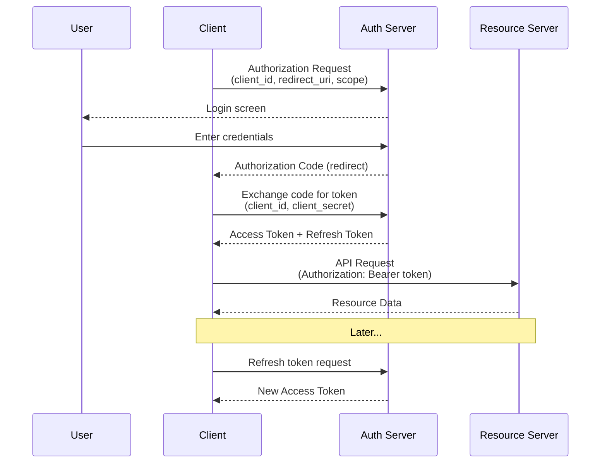
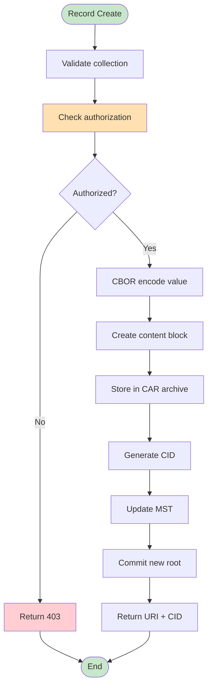
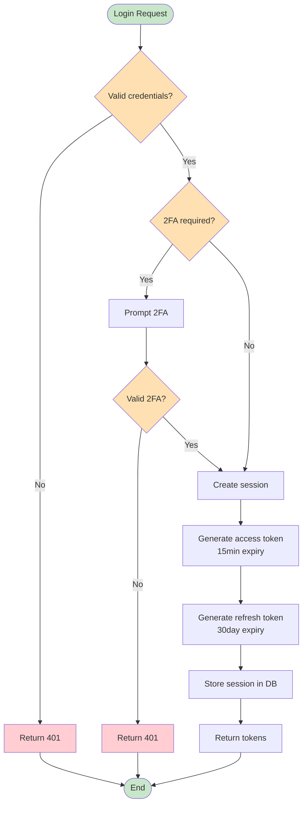
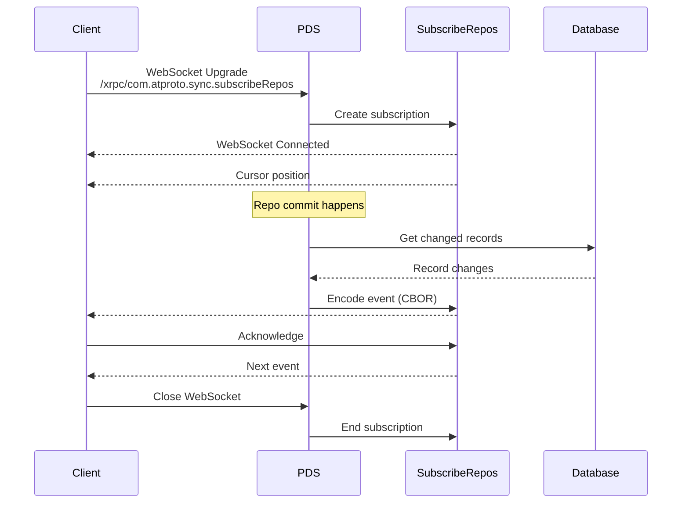
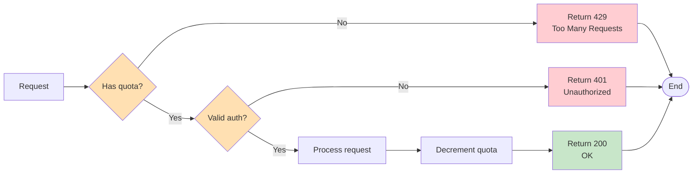
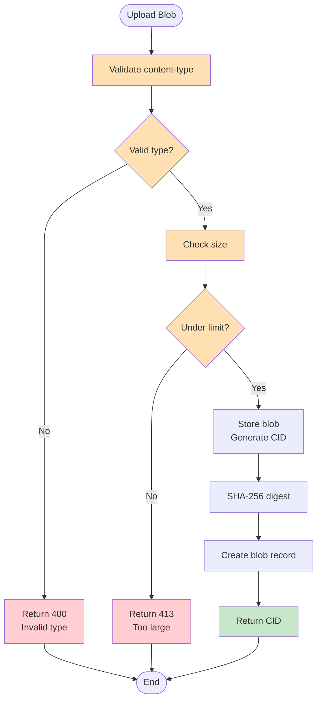

# ATProto PDS - Mermaid Diagrams

This file contains supplementary diagrams in Mermaid format for easier rendering in markdown viewers that support Mermaid.

## XRPC Request Flow (Protocol Diagram)

## Record Creation Protocol

## ATProto Data Models

## OAuth2 Token Flow

## Record Lifecycle Flow

## Session Management Flow

## WebSocket Firehose Subscription

## Rate Limiting Logic

## Blob Storage Flow

## Quick Reference

| Diagram Type | Mermaid Syntax | Use For |
|--------------|----------------|---------|
| Protocol | `sequenceDiagram` | Request/response flows |
| Data Model | `classDiagram` | Object relationships |
| Control Flow | `flowchart TD` | Decision processes |
| Architecture | `graph TB` | Component diagrams |
| State | `stateDiagram-v2` | State machines |

## Related Documentation

### Architecture Documents
- [README.md](README) - Architecture documentation index
- [ARCHITECTURE_ANALYSIS.md](ARCHITECTURE_ANALYSIS) - Component analysis referenced in diagrams
- [atproto_pds_architecture.md](atproto_pds_architecture) - Protocol specifications for flows above
- [atproto_data_models.md](atproto_data_models) - Data model class diagram details

### Diagram Documents
- [ARCHITECTURE_DIAGRAMS.md](ARCHITECTURE_DIAGRAMS) - System overview diagrams
- [DIAGRAM_QUICK_REFERENCE.md](DIAGRAM_QUICK_REFERENCE) - Diagram selection guide
- [DEVELOPMENT_WORKFLOWS.md](DEVELOPMENT_WORKFLOWS) - Development process diagrams
