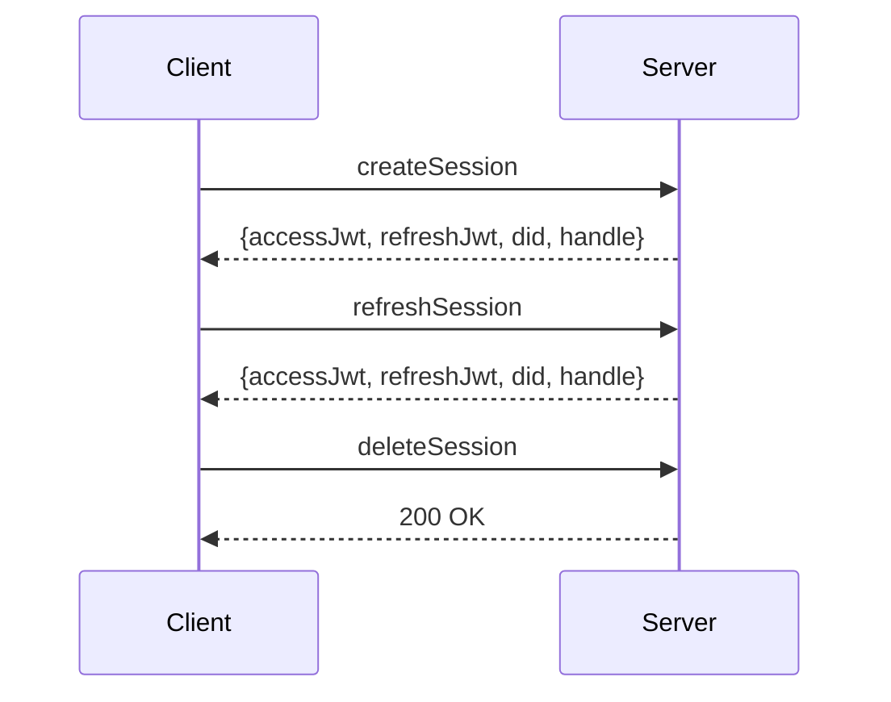
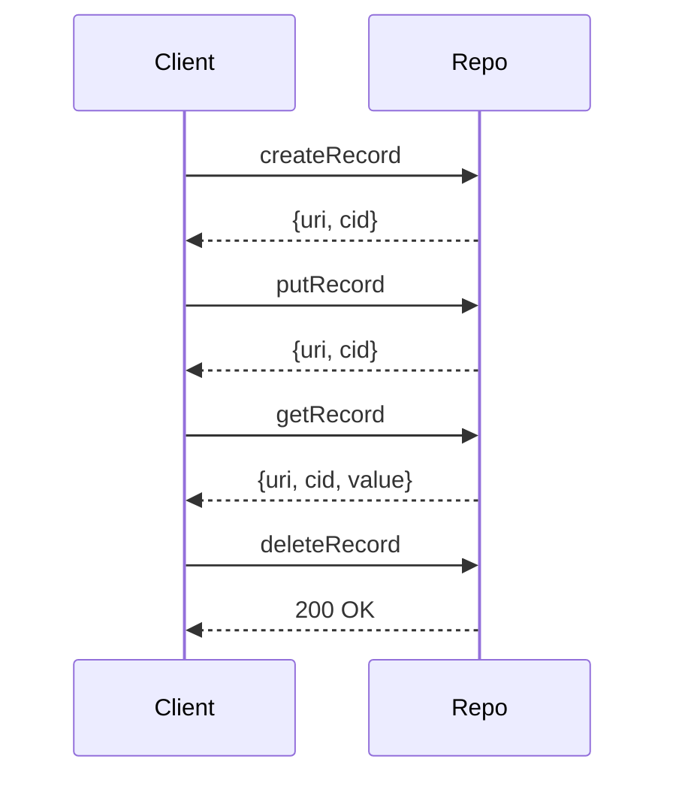
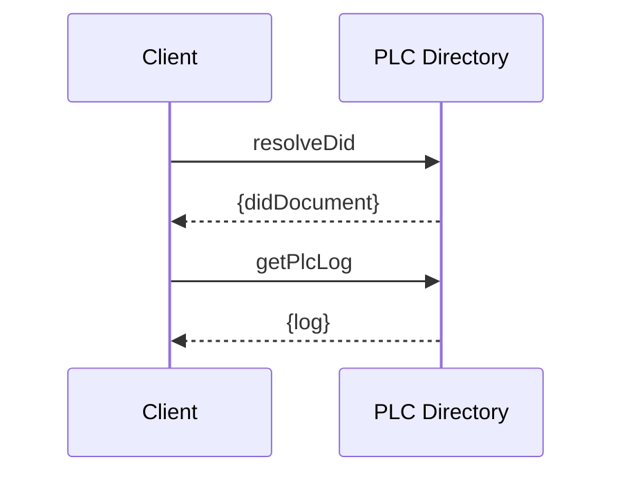

# ATProto XRPC Protocol Reference

Quick reference for XRPC protocol concepts, methods, and data structures.

## XRPC Method Naming

```

com.atproto.<nsid>.<methodName>

Examples:
- com.atproto.server.createSession
- com.atproto.repo.createRecord
- com.atproto.sync.subscribeRepos
```

## NSID Structure

```

<desired-name>.<registrant-domain>

Example: server atproto.com → com.atproto.server
```

## Common Method Patterns

### Session Management



### Repository Operations



### Identity Resolution



## ATProto Lexicon NSIDs

| NSID | Purpose |
|------|---------|
| com.atproto.server | Authentication & sessions |
| com.atproto.repo | Repository operations |
| com.atproto.sync | Synchronization & firehose |
| com.atproto.identity | Identity resolution |
| com.atproto.label | Content labeling |
| com.atproto.moderation | Moderation actions |

## Data Types Reference

| Type | Description | Example |
|------|-------------|---------|
| `did` | Decentralized identifier | `did:plc:kwtz...` |
| `cid` | Content identifier | `bafyreig...` |
| `at-uri` | AT Protocol URI | `at://did:example/collection/rkey` |
| `rkey` | Record key | `3k5xv3l...` |
| `jwt` | JSON Web Token | `eyJhbG...` |

## Error Codes

| Code | Meaning |
|------|---------|
| 400 | Bad Request |
| 401 | Unauthorized |
| 403 | Forbidden |
| 404 | Not Found |
| 429 | Too Many Requests |
| 500 | Internal Server Error |

## Quick Command Reference

```bash
# Create session
curl -X POST https://pds.example.com/xrpc/com.atproto.server.createSession \
  -H "Content-Type: application/json" \
  -d '{"identifier": "@handle", "password": "password"}'

# Get record
curl https://pds.example.com/xrpc/com.atproto.repo.getRecord \
  -H "Authorization: Bearer $ACCESS_JWT" \
  -d "repo=$DID" \
  -d "collection=app.bsky.feed.post" \
  -d "rkey=$RKEY"

# Subscribe to commits
wss://pds.example.com/xrpc/com.atproto.sync.subscribeRepos
```

## Related Documentation

### Architecture Documents
- [README.md](README) - Architecture documentation index
- [atproto_pds_architecture.md](atproto_pds_architecture) - PDS API endpoints and protocols
- [atproto_data_models.md](atproto_data_models) - Data types (DID, CID, AT-URI) reference
- [ARCHITECTURE_ANALYSIS.md](# Architecture analysis) - XRPC handler component analysis

### Diagram Documents
- [DIAGRAMS_MERMAID.md](DIAGRAMS_MERMAID) - XRPC request flow diagrams

### Related Tests
- [../tests/02-network/xrpc.md](../tests/02-network/xrpc) - XRPC protocol tests

### Related Guides
- [../guides/XRPC_PROTOCOL_REFERENCE.md](../guides/XRPC_PROTOCOL_REFERENCE) - Duplicate guide version
