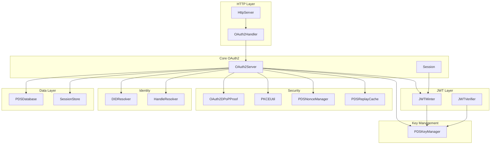
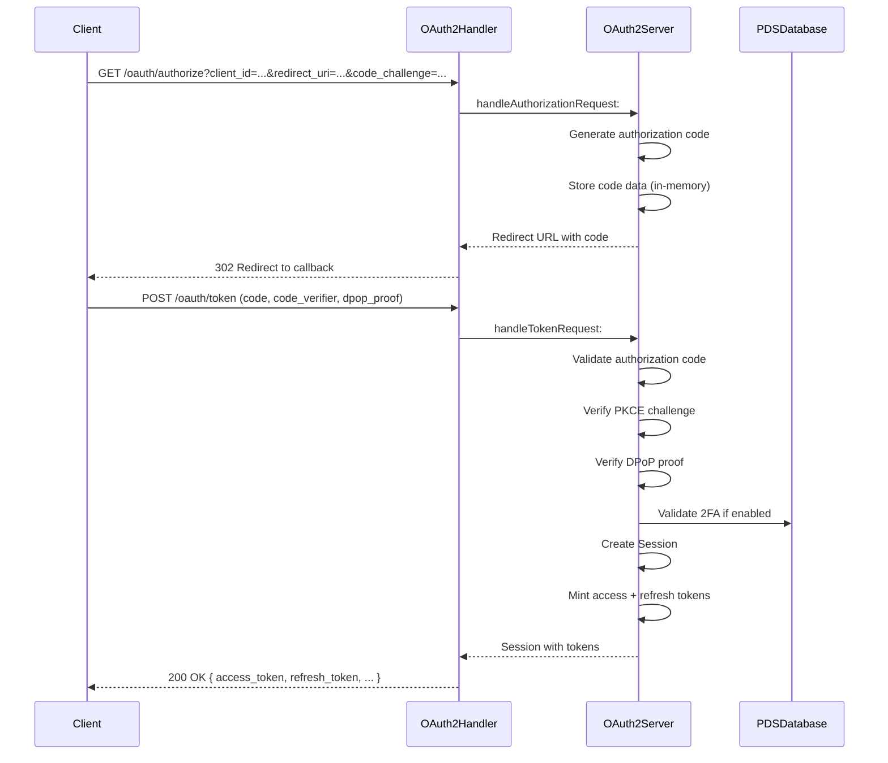
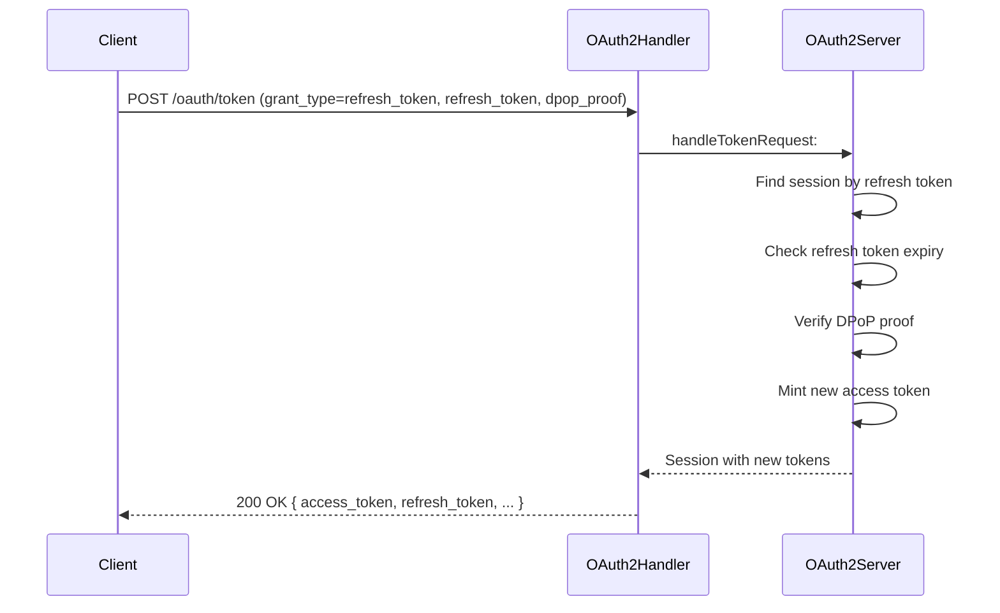

# OAuth 2.0 System Architecture

This document describes the OAuth 2.0 authorization server implementation for ATProto PDS, including DPoP (Demonstration of Proof-of-Possession) support.

## Architecture Overview



## Core Components

### OAuth2Handler (`OAuth2Handler.m`)

HTTP route handler that bridges HTTP requests to the OAuth2 business logic.

**Responsibilities:**
- Registers `/oauth/*` routes with `HttpServer`
- Parses HTTP requests into OAuth2 model objects
- Formats OAuth2 responses to HTTP
- Serves OAuth authorization web UI

**Routes:**
| Route | Handler | Purpose |
|-------|---------|---------|
| `/oauth/authorize` | `handleAuthorizeRequest:` | Authorization endpoint |
| `/oauth/token` | `handleTokenRequest:` | Token endpoint |
| `/oauth/revoke` | `handleRevokeRequest:` | Token revocation |
| `/oauth/par` | `handlePARRequest:` | Pushed Authorization Requests |

### OAuth2Server (`OAuth2.m`)

Core authorization server implementing OAuth 2.0 protocol with DPoP extensions.

**Key Methods:**
- `handleAuthorizationRequest:completion:` - Process authorization requests
- `handleTokenRequest:completion:` - Issue tokens (authorization code, refresh, DPoP grants)
- `refreshAccessToken:scope:dpopJWK:completion:` - Refresh access tokens
- `resolveIdentity:error:` - Resolve handle/DID to DID

**Configuration:**
```objc
OAuth2Server *server = [[OAuth2Server alloc] initWithDatabase:database];
server.issuer = @"https://pds.example.com";
server.authorizationEndpoint = @"/oauth/authorize";
server.tokenEndpoint = @"/oauth/token";
```

### Session (`Session.m`)

Authenticated user session model with token management.

**Properties:**
| Property | Type | Description |
|----------|------|-------------|
| `sessionID` | `NSString` | Unique session identifier |
| `did` | `NSString` | User's decentralized identifier |
| `handle` | `NSString` | User's handle |
| `accessToken` | `NSString` | JWT access token |
| `refreshToken` | `NSString` | Opaque refresh token |
| `scope` | `NSString` | Granted OAuth scopes |
| `dpopKeyThumbprint` | `NSString` | RFC 7638 JWK thumbprint |

**Token Response:**
```objc
Session *session = [Session sessionWithDID:did
                                   handle:handle
                                    scope:scope
                        dpopKeyThumbprint:jkt];
NSDictionary *response = [session toTokenResponse];
// Returns: { access_token, token_type, refresh_token, expires_in, scope }
```

### JWTMinter (`JWT.m`)

JWT creation and signing with key management integration.

**Key Methods:**
- `mintAccessTokenForDID:handle:scopes:dpopKeyThumbprint:error:` - Create access token
- `mintRefreshTokenForDID:handle:scopes:error:` - Create refresh token
- `signPayload:keyManager:error:` - Sign arbitrary payload
- `toJWKS` - Export public keys as JWK Set

**Supported Algorithms:**
- `ES256K` (secp256k1) - Default for ATProto
- `ES256` (P-256) - DPoP proofs

### OAuth2DPoPProof (`OAuth2.m`)

DPoP proof generation and verification per RFC 9449.

**Proof Claims:**
| Claim | Description |
|-------|-------------|
| `jti` | Unique identifier (prevents replay) |
| `htm` | HTTP method (GET, POST, etc.) |
| `htu` | HTTP URI (normalized, no fragment) |
| `iat` | Issued-at timestamp |
| `nonce` | Server-provided nonce (optional) |

**Verification Steps:**
1. Parse JWT structure (3 parts)
2. Validate header (`typ: dpop+jwt`, `alg: ES256`)
3. Verify `htm` matches request method
4. Verify `htu` matches request URL
5. Check `iat` freshness (within 5 minutes)
6. Validate nonce if required
7. Check JTI replay protection via `PDSReplayCache`
8. Verify ECDSA signature

**JWK Thumbprint (RFC 7638):**
```objc
NSString *thumbprint = [OAuth2DPoPProof jwkThumbprint:jwk error:&error];
// Canonical JSON: {"crv":"P-256","kty":"EC","x":"...","y":"..."}
// SHA-256 hash, base64url-encoded
```

## Supporting Classes

### PKCEUtil

PKCE (Proof Key for Code Exchange) challenge/verifier handling.

**Methods:**
- Generate random code verifier (43-128 chars)
- Create S256 challenge: `BASE64URL(SHA256(verifier))`
- Verify verifier against challenge

### PDSNonceManager

Server-side nonce generation and validation for DPoP.

**Behavior:**
- Generates cryptographically random nonces
- Tracks issued nonces with expiration
- Single-use enforcement

### PDSReplayCache

JTI (JWT ID) replay attack prevention.

**Behavior:**
- Tracks used JTI values
- Automatic expiration (5 minutes)
- Thread-safe access

### PDSAdminAuth

Admin authentication for privileged operations.

**Features:**
- Admin token validation
- Scope verification
- Audit logging

## Request Flow

### Authorization Code Flow



### Token Refresh Flow



## Data Storage

### Database Tables

**`oauth_clients`**
| Column | Type | Description |
|--------|------|-------------|
| `client_id` | TEXT | OAuth client identifier |
| `client_name` | TEXT | Display name |
| `redirect_uris` | TEXT | JSON array of allowed URIs |
| `client_secret` | TEXT | Optional client secret |

**`oauth_par_requests`**
| Column | Type | Description |
|--------|------|-------------|
| `request_uri` | TEXT | PAR request URI |
| `client_id` | TEXT | Requesting client |
| `request_data` | TEXT | JSON authorization parameters |
| `expires_at` | INTEGER | Expiration timestamp |

### In-Memory Storage

| Storage | Container | Queue | TTL |
|---------|-----------|-------|-----|
| Authorization Codes | `authorizationCodes` dict | `authorizationQueue` | 10 minutes |
| Active Sessions | `activeSessions` dict | `sessionQueue` | Until revoked |
| DPoP JTI Cache | `PDSReplayCache` | Internal | 5 minutes |
| Nonce Cache | `PDSNonceManager` | Internal | Configurable |

### SessionStore Abstraction

```objc
@protocol PDSSessionStorage <NSObject>
- (BOOL)saveSession:(Session *)session error:(NSError **)error;
- (Session *)getSessionByAccessToken:(NSString *)token error:(NSError **)error;
- (Session *)getSessionByRefreshToken:(NSString *)token error:(NSError **)error;
- (Session *)getSessionByID:(NSString *)sessionID error:(NSError **)error;
- (BOOL)revokeSessionByID:(NSString *)sessionID error:(NSError **)error;
@end
```

**Implementations:**
- `PDSMemorySessionStorage` - In-memory (development)
- `PDSSQLiteSessionStorage` - Persistent SQLite

## Thread Safety

### Serial Queues

OAuth2Server uses two serial dispatch queues for thread-safe state access:

```objc
// Authorization code operations
_authorizationQueue = dispatch_queue_create("com.atproto.oauth2.authorization", 
                                             DISPATCH_QUEUE_SERIAL);

// Session state operations  
_sessionQueue = dispatch_queue_create("com.atproto.oauth2.session", 
                                       DISPATCH_QUEUE_SERIAL);
```

### Access Patterns

```objc
- (void)storeAuthorizationCode:(NSString *)code data:(NSDictionary *)codeData {
    dispatch_sync(self.authorizationQueue, ^{
        self.authorizationCodes[code] = codeData;
    });
}

- (NSDictionary *)getAuthorizationCodeData:(NSString *)code {
    __block NSDictionary *result = nil;
    dispatch_sync(self.authorizationQueue, ^{
        result = [self.authorizationCodes[code] copy];
    });
    return result;
}
```

### Synchronized Access

The `pendingConsents` dictionary uses `@synchronized` for thread safety:

```objc
@synchronized (self.pendingConsents) {
    self.pendingConsents[code] = consentData;
}
```

## OAuth Scopes

| Scope | Description |
|-------|-------------|
| `atproto:identify` | Read user identity information |
| `atproto:signin` | Sign in to PDS |
| `atproto:repo_write` | Write to user repositories |
| `atproto:repo_read` | Read from user repositories |
| `atproto:profile` | Read/write ATProto profile |

## Error Handling

### OAuth2Error Codes

| Code | HTTP Status | Description |
|------|-------------|-------------|
| `invalid_request` | 400 | Missing required parameters |
| `unauthorized_client` | 401 | Client not authorized |
| `access_denied` | 403 | User denied authorization |
| `unsupported_response_type` | 400 | Only "code" supported |
| `invalid_scope` | 400 | Unknown scope requested |
| `server_error` | 500 | Internal server error |
| `temporarily_unavailable` | 503 | Service unavailable |
| `invalid_grant` | 400 | Invalid/expired code |
| `unsupported_grant_type` | 400 | Unknown grant type |
| `invalid_client` | 401 | Invalid client credentials |
| `invalid_dpop_proof` | 400 | DPoP verification failed |
| `token_expired` | 401 | Token has expired |

## Key Dependencies

| Dependency | Purpose |
|------------|---------|
| `PDSDatabase` | Account and client data persistence |
| `PDSKeyManager` | Signing key management and rotation |
| `DIDResolver` | DID document resolution |
| `HandleResolver` | Handle-to-DID resolution |
| `PDSAccountService` | Credential validation |
| `TOTPService` | Two-factor authentication |

## Security Considerations

1. **DPoP Binding**: All tokens bound to client key pair via JWK thumbprint
2. **PKCE**: Required for all authorization code flows
3. **Replay Protection**: JTI tracking prevents proof reuse
4. **Nonce Freshness**: Optional server-provided nonces prevent precomputation
5. **Code Expiry**: Authorization codes expire after 10 minutes
6. **2FA Support**: TOTP verification for accounts with 2FA enabled

## Related Documentation

- [Token Management](token-management) - JWT tokens, sessions, and token lifecycle
- [DPoP](dpop) - DPoP proof verification and JWK thumbprints
- [PKCE](pkce) - PKCE code challenge/verifier implementation
- [Authorization Flow](authorization-flow) - Sign-in and consent flow details
- [Security](security) - Security considerations and threat model
- [Overview](README) - OAuth2 implementation overview
