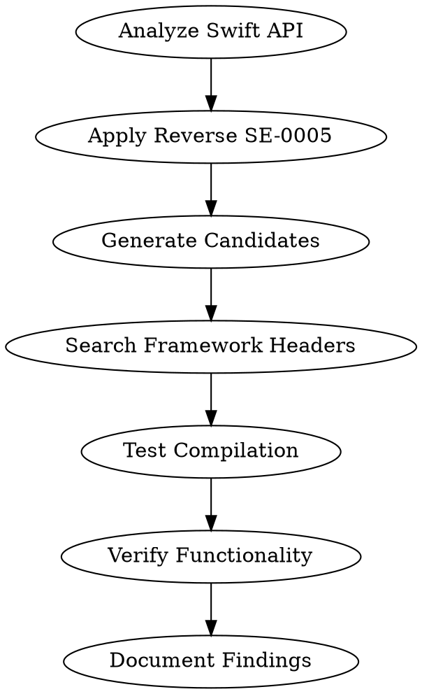

name: objc-api-discovery
description: Use when searching for Objective-C APIs that correspond to known Swift methods, especially for undocumented or hard-to-find functionality. Look for: "What's the ObjC equivalent of Swift's X?", "Can't find ObjC API for Y", "Swift has Z but ObjC doesn't". NOT for basic documented APIs or general questions.

# Objective-C API Discovery

## Overview

Many Apple platform APIs exist in Objective-C but are undocumented or hard to find because they're primarily exposed through Swift naming conventions. This skill reverse-engineers Swift APIs to discover corresponding Objective-C methods using systematic naming translation and framework inspection.

## When to Use

**Use objc-api-discovery when:**
- Swift documentation shows a method but Objective-C equivalent is unclear
- "Undocumented" Objective-C APIs that work but aren't in docs
- Swift-only features that might have Objective-C underpinnings
- Framework methods that exist but are hard to discover
- Bridging between Swift and Objective-C APIs

**NOT for:**
- Basic documented APIs (use objc-research)
- General API questions
- Non-Apple platforms
- Pure Swift-only functionality

## Reverse Engineering Process



## Step 1: Analyze Swift API Structure

**Break down the Swift method:**

```swift
// Example: Array.removeAll(where:)
func removeAll(where predicate: (Element) throws -> Bool) rethrows

// Analysis:
- Base type: Array (NSArray in ObjC)
- Method name: removeAll
- Parameter: where predicate: (Element) throws -> Bool
- Mutating: Yes (changes array in place)
- Throwing: Yes
```

## Step 2: Apply Reverse SE-0005 Translation

**Reverse the naming transformation rules:**

### Method Name Reconstruction
```swift
// Swift → Objective-C patterns:

// 1. Add type information back
removeAll → removeAllObjects
contains → containsObject
append → addObject

// 2. Join preposition-split labels
move(to:) → moveToPoint:
addLine(to:) → addLineToPoint:

// 3. Convert argument labels to method name
filter(_:) → filteredArrayUsingPredicate:
map(_:) → mappedArrayUsingBlock:
```

### Parameter Translation
```swift
// Swift parameters → Objective-C patterns:

// Closures become blocks
(Element) -> Bool → BOOL (^)(ObjectType, NSUInteger, BOOL *)

// Generic types become id
[Element] → NSArray *
(Element) → ObjectType

// Optional parameters become nullable
(Element)? → nullable ObjectType

// Throwing becomes NSError **
throws → error:(NSError **)error
```

## Step 3: Generate Objective-C Candidates

**Systematic candidate generation:**

```objc
// For Array.removeAll(where:)

// Candidate 1: Direct translation
- (void)removeAllObjectsPassingTest:(BOOL (^)(ObjectType obj, NSUInteger idx, BOOL *stop))predicate;

// Candidate 2: Block-based filtering
- (void)removeObjectsUsingBlock:(BOOL (^)(ObjectType obj, NSUInteger idx, BOOL *stop))block;

// Candidate 3: Predicate-based
- (void)removeObjectsMatchingPredicate:(NSPredicate *)predicate;

// Candidate 4: Index-based removal
- (void)removeObjectsAtIndexes:(NSIndexSet *)indexes;
```

## Step 4: Search Framework Headers

**Multi-level header search:**

```bash
# 1. Framework-specific headers
find /Library/Developer/CommandLineTools/SDKs/MacOSX.sdk/System/Library/Frameworks \
  -name "*.h" -exec grep -l "removeAll" {} \;

# 2. Broad pattern search
grep -r "removeObjects" /Library/Developer/CommandLineTools/SDKs/MacOSX.sdk/System/Library/Frameworks/Foundation.framework/Headers/

# 3. Block signature patterns
grep -A 2 -B 2 "BOOL.*\^.*ObjectType" /Library/Developer/CommandLineTools/SDKs/MacOSX.sdk/System/Library/Frameworks/Foundation.framework/Headers/NSArray.h
```

## Step 5: Test Compilation & Runtime

**Compilation testing:**
```objc
// Test in actual code
NSMutableArray *array = [NSMutableArray array];
[array removeAllObjectsPassingTest:^BOOL(id obj, NSUInteger idx, BOOL *stop) {
    return [obj isEqual:@"remove"];
}];
```

**Runtime verification:**
```objc
// Check method existence
if ([array respondsToSelector:@selector(removeAllObjectsPassingTest:)]) {
    // Method exists, safe to call
}
```

## Confidence Level Assessment

**High Confidence (90-100%):**
- Method found in framework headers
- Matches expected signature exactly
- Compiles and runs correctly

**Medium Confidence (50-89%):**
- Method exists but signature slightly different
- Compiles but behavior needs verification
- Found through pattern matching

**Low Confidence (10-49%):**
- Educated guess based on naming patterns
- No header evidence
- May require runtime testing

**Speculative (0-9%):**
- Pure guesswork
- No supporting evidence
- High risk of non-existence

## Common Swift-to-Objective-C Patterns

### Collection Operations

```swift
// Array operations
array.removeAll(where: { $0 > 5 })    // → [array removeAllObjectsPassingTest:^BOOL...]
array.filter({ $0 > 5 })              // → [array filteredArrayUsingPredicate:...]
array.contains(where: { $0 == x })    // → [array indexOfObjectPassingTest:] != NSNotFound

// Dictionary operations  
dict.removeValue(forKey: key)         // → [dict removeObjectForKey:key]
dict.filter({ $0.value > 5 })         // → Complex enumeration pattern
```

### String Operations

```swift
// String operations
string.hasPrefix(prefix)              // → [string hasPrefix:prefix]
string.components(separatedBy: sep)   // → [string componentsSeparatedByString:sep]
string.replacingOccurrences(of: x, with: y)  // → [string stringByReplacingOccurrencesOfString:x withString:y]
```

### View/Layout Operations

```swift
// View operations
view.addSubview(subview)              // → [view addSubview:subview]
view.constraints                      // → [view constraints]
view.layoutIfNeeded()                 // → [view layoutIfNeeded]
```

## Advanced Discovery Techniques

### Runtime Introspection
```objc
// Find all methods on a class
unsigned int count;
Method *methods = class_copyMethodList([NSArray class], &count);

for (unsigned int i = 0; i < count; i++) {
    SEL selector = method_getName(methods[i]);
    const char *name = sel_getName(selector);
    if (strstr(name, "remove") != NULL) {
        NSLog(@"Found method: %s", name);
    }
}
free(methods);
```

### Private API Hunting
```objc
// Sometimes private methods follow similar patterns
// Use with caution - private APIs can break
SEL privateSelector = NSSelectorFromString(@"_removeObjectsPassingTest:");
if ([array respondsToSelector:privateSelector]) {
    // Private method exists
}
```

### Header Preprocessing
```bash
# Look for conditionally compiled methods
grep -A 5 -B 5 "#if.*AVAILABLE" /Library/Developer/CommandLineTools/SDKs/MacOSX.sdk/System/Library/Frameworks/Foundation.framework/Headers/NSArray.h
```

## Integration with Other Skills

**Use with objc-research:**
- objc-api-discovery finds the API
- objc-research provides usage context and examples

**Use with apple-docs-navigation:**
- apple-docs-navigation finds documented APIs
- objc-api-discovery finds undocumented ones

**Use with deep-research:**
- For complex multi-step discovery processes

## Common Pitfalls

| Mistake | Reality | Fix |
|---------|---------|-----|
| Assuming 1:1 mapping | Swift methods often compose multiple ObjC calls | Break down into primitives |
| Ignoring mutability | Swift value types vs ObjC reference types | Check if method returns new or modifies |
| Missing error handling | Swift throws vs ObjC NSError** | Add error parameters |
| Wrong parameter order | Swift  ordering vs ObjC fixed | Check method signatures carefully |
| Overlooking blocks | Swift closures vs ObjC blocks | Convert closure syntax |

## Red Flags - Not API Discovery

- **"Check the docs"** - Use objc-research for documented APIs
- **"Use a loop"** - May miss actual API methods
- **Single search attempt** - Need systematic pattern matching
- **No header inspection** - Must verify against actual frameworks
- **Pure speculation** - Need evidence-based guessing

**Any of these means: Continue systematic discovery.**

## Quick Reference

```bash
# Header search workflow
HEADERS="/Library/Developer/CommandLineTools/SDKs/MacOSX.sdk/System/Library/Frameworks"

# Find framework for type
find "$HEADERS" -name "*Array*.h" -o -name "*Set*.h" -o -name "*Dictionary*.h"

# Search for method patterns
grep -r "PassingTest\|UsingBlock\|UsingPredicate" "$HEADERS"

# Runtime method discovery
unsigned int count;
Method *methods = class_copyMethodList([NSArray class], &count);
for (unsigned int i = 0; i < count; i++) {
    SEL sel = method_getName(methods[i]);
    const char *name = sel_getName(sel);
    printf("%s\n", name);
}
free(methods);

# Confidence levels:
# High: Found in headers + compiles
# Medium: Pattern match + compiles  
# Low: Educated guess
# Speculative: Pure guesswork
```

**Priority order:**
1. Framework header inspection (highest confidence)
2. Runtime introspection (actual method existence)
3. Pattern-based guessing (educated guesses)
4. Compilation testing (verification)

**Always test:** Compile and run discovered APIs before assuming they work as expected.

---

## Related Documentation

- [Archive Index](./README) - Index of all archived plans
- [Current Plans](../README) - Active implementation plans</content>
<parameter name="filePath">/Users/jack/.config/opencode/superpowers/skills/objc-api-discovery.md