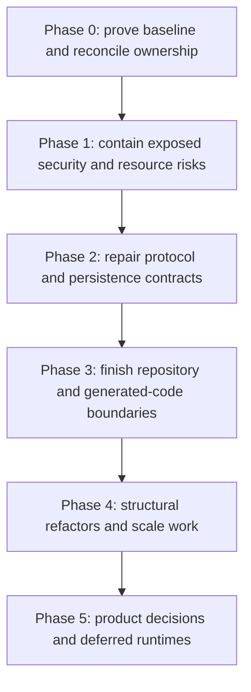

# Garazyk Mega Plan

## Objective

Deliver a production-ready AT Protocol stack in Objective-C: conformant with
every published specification (workstream 01 S6 owns the conformance matrix),
supporting experimental Proposal 0016 permissioned spaces behind its operator
flag, secure, portable to GNUstep/Linux, and easier to change while the
repository boundaries settle. This roadmap replaces the May 2026 scenario,
documentation, TUI, package, and refactor plans.

## Current state

- `main` contains 1,922 tracked files under `Garazyk/`, 234 under `packages/`,
  931 under `scripts/`, and 127 under `objc-jupyter-wasm/`.
- `deno task check` passes for all six in-tree packages as of 2026-07-12.
- `hamownia agent list` discovers 92 scenarios. A current Docker-backed run of
  scenario `01` passed 11 steps on 2026-07-12; the checked-in May matrix still
  cannot establish a current failure backlog.
- The strict XRPC coverage command now passes after removing same-pack graph
  duplicates and the unspecced labeler owner. A complete registry rebuild also
  replaces a prior application's handler set on a reused dispatcher, while
  individual duplicate registrations still fail. The existing percentage still
  measures name presence, not schema or behavior.
- The architecture audit now scans the live `Garazyk/Sources/Services` and
  `Garazyk/Tests` roots. Its smoke test finds 14 service implementations and
  339 Objective-C test files.
- The scenario dashboard now defaults to `127.0.0.1` and protects mutations
  with a per-launch capability, Host/Origin validation, and remote bearer
  authentication. AdminUIServer now rejects inline script attributes and
  enforces session-plus-CSRF checks on its POST mutations. Targeted tests pass.
  The "missing local OpenSSL dylib" that blocked a real Admin browser smoke was
  a stale `build/` CMake cache from before Homebrew's `openssl@3` was
  discoverable; a reconfigure on 2026-07-13 already fixed it
  (`testNonKeychainFactoryPersistenceWhenOpenSSLAvailable` passes, not
  skipped), the docs just never caught up. Playwright's Chromium binary was
  separately never installed (`deno run -A npm:playwright install chromium`,
  done 2026-07-15). Both blockers are cleared, and the browser smoke tests
  are now written and passing (`scripts/admin_ui_browser_smoke_test.ts`,
  `scripts/scenario-dashboard/browser_smoke_test.ts`; run 2026-07-17, see
  workstream 00 B0.2 item 5).
- `HttpConnectionIOCoordinator` now has independent 30-second idle and
  aggregate header deadlines. The aggregate deadline starts with the first
  header byte, cannot be extended by trickle input, cancels a stalled receive,
  and stops at the actual header terminator rather than a valid slow body.
- Lexicon generation now has one package-owned core rooted at
  `Garazyk/Resources/lexicons`. It fails before overwriting output when the
  inventory or endpoint set is empty; its checked-in TypeScript artifact covers
  519 lexicons and 392 endpoints deterministically. Objective-C NSID constants
  remain deliberately deferred to Phase 3.
- `AppViewDatabase` now records ordered schema versions and applies pending
  migrations atomically. File-backed legacy fixtures prove reopen/data/index
  preservation, and all 68 injected statement-failure positions roll back
  schema and version state. A production database backup remains required
  before this schema bump is deployed.
- The Deno split exists in clean local repositories at
  `/Users/jack/Software/garazyk-atproto-testing` and
  `/Users/jack/Software/garazyk-tui`, plus branch
  `codex/split-deno-testing-repos`. Both external repos are now synchronized
  with `main`'s in-tree copies as of 2026-07-15; the old deletion branch is
  still based on a stale June 7 snapshot and needs its own rebase (Phase 3
  item 1) before it can merge.
- The three Objective-C hygiene commits from `refactor/plan01-hygiene-quick-wins`
  are cherry-picked onto `main` (`5d048eb53`, `2f88fad66`, `6511b4502`),
  code-only. `refactor/plan01-hygiene-quick-wins` itself is still based on the
  Deno split and superseded for these three commits; its remaining content is
  the modernization plan docs, which were deliberately left off `main` (see
  Phase 0 item 4).
- The QueryRunner deepening arc is complete and retired: all stranded stores
  (`ATProtoMediaSQLiteStore`, Mikrus, Beskid, `JelczDatabase`, `PDSReplayCache`,
  `PDSSQLiteSessionStorage`, `PLCPersistentStore`/`PLCReplicaStore`,
  `RateLimiter`) run on `ATProtoConnectionManagerSerial` +
  `ATProtoDatabaseQueryRunner`, schema paths are atomic and rollback-tested,
  and every slice passed AllTests. The implementation diary
  (`queryrunner_deepening_pilot_plan.md`) is deleted per the plan-lifecycle
  rule; Git history and deciduous goal 1187 retain the record.
- Proposal 0016 permissioned spaces landed (`da296909f`, ADR 0004): isolated
  SQLite storage, fail-closed URI/scope/credential parsing, delegation,
  membership policy, private blobs, and notification fan-out, all behind
  `permissionedSpacesEnabled` (off by default). The ADR 0005 reconciliation
  protocol is fully implemented in source — CAR multi-root reading, full-CAR
  import, lightweight record-diff recovery, incremental ops, oplog pruning
  with a background timer, and `listRecords`/`listRepoOps` cursor fixes —
  with space test suites registered and green. Scenarios 93 and 94 plus PDS3
  topology config exist (`cc063779a`) but are type-checked only: no runtime
  pass is recorded, so every compatibility-gate row that needs multi-PDS
  acceptance is still pending (workstream 06).

## Priority model

Each dimension uses 1 to 5. Higher boundary risk means greater operational or
contract exposure. Higher change safety means the item can ship in smaller,
better-isolated steps.

| Candidate                                     | Boundary risk | Structural drag | Test leverage | Change safety | Payoff | Priority        |
| --------------------------------------------- | ------------: | --------------: | ------------: | ------------: | -----: | --------------- |
| Dashboard and Admin mutation security         |             5 |               4 |             5 |             4 |      5 | P0              |
| XRPC ownership and truthful contract coverage |             5 |               4 |             5 |             4 |      5 | P0              |
| Absolute HTTP header/read deadlines           |             5 |               3 |             5 |             4 |      5 | P0              |
| Lexicon generator consolidation               |             5 |               4 |             5 |             4 |      5 | P0              |
| Permissioned spaces multi-PDS acceptance      |             5 |               2 |             5 |             5 |      5 | P1              |
| AppView numbered, atomic migrations           |             5 |               5 |             5 |             3 |      5 | P1              |
| OAuth Permissions spec (granular scopes)      |             4 |               3 |             4 |             3 |      4 | P1              |
| Replace false-confidence security tests       |             4 |               3 |             5 |             5 |      5 | P1              |
| PLC schema-upgrade atomicity                  |             4 |               4 |             5 |             3 |      4 | P1              |
| Deno repository-boundary completion           |             4 |               5 |             5 |             2 |      5 | P1              |
| Relay product decision and assembly           |             4 |               5 |             4 |             2 |      5 | P1              |
| Admin UI structural and accessibility work    |             4 |               5 |             4 |             3 |      4 | P1              |
| Spec conformance matrix (S6)                  |             3 |               2 |             5 |             5 |      4 | P2              |
| Incremental public sync                       |             4 |               4 |             4 |             2 |      5 | P2              |
| Dedicated space signing key rotation          |             4 |               2 |             3 |             3 |      4 | P2              |
| Space operational readiness (backup, metrics) |             3 |               2 |             3 |             4 |      3 | P2              |
| Objective-C god-file decomposition            |             3 |               5 |             4 |             2 |      4 | P2              |
| Generated NSID constants                      |             2 |               4 |             5 |             4 |      4 | P2              |
| WASM runtime gap closure                      |             2 |               4 |             4 |             3 |      3 | P2              |
| SMTP, cloud blob, and STAR completion         |             3 |               3 |             3 |             2 |      3 | Decision needed |
| Space app attestation (managing-app)          |             4 |               2 |             3 |             2 |      3 | Decision needed |

## Dependency order



### Phase 0: baseline and ownership

Complete [workstream 00](workstreams/00-baseline-and-governance.md).

1. **Complete:** fix audit scanner roots and establish current Objective-C,
   Deno, browser, XRPC, and scenario baselines. The scanner and current
   scenario discovery/run are proven; the browser baseline is now complete.
   Both environment blockers that previously stopped this (stale OpenSSL
   detection in `build/`, missing Playwright Chromium binary) are cleared as
   of 2026-07-15 — see the current-state note above. Browser smoke tests for
   dashboard controls, Admin CSP/CSRF, OAuth consent, and keyboard workflows
   passed on 2026-07-17 (commit 703723c4cc36033cb02887981982c457a878b39c);
   see workstream 00 B0.2 item 5 for commands and evidence.
2. **Complete:** resolve duplicate XRPC ownership so the existing strict CI
   check is green.
3. **Complete:** synchronize the two external Deno repositories with newer
   in-tree changes. `garazyk-atproto-testing` picked up the real drift on
   `main` since the June 7 split (gruszka lexicon/DNS-timeout fixes, hamownia
   test quieting) and dropped `packages/gruszka/scripts/generate.ts` +
   `generate_test.ts`, which can no longer regenerate standalone now that
   lexicon generation is rooted at the monorepo-only `Garazyk/Resources/lexicons`;
   the repo is a pure vendored consumer of `lexicons.ts` going forward, verified
   clean (`check`/`lint`/`fmt`, 3790 tests). `garazyk-tui` needed no changes —
   zero real commits touched `packages/tui` since the split base.
4. **Complete:** rebase the Objective-C hygiene commits onto current `main`
   without the stale Deno deletion diff (`5d048eb53`, `2f88fad66`,
   `6511b4502`). Cherry-picked code-only from the three
   `refactor/plan01-hygiene-quick-wins` commits, dropping an unrelated
   `plan/objc-modernization-2026-07/` tree and `docs/tui/asciinema-overlay/`
   docs bundled into one of them. `AllTests` is green: 3198 passed, 0 failed.
5. **Complete:** replace security tests that assert empty inputs or
   `XCTAssertTrue(YES)` with fixtures that exercise the claimed boundary.
   Deterministic DPoP/SQL-allowlist/refresh-token/import/CAR coverage landed in
   `SecurityHardeningTests` (`6d8ebe97b` + `6cf9ed1c8` registration +
   `50624140f` fixture dedupe). A fresh HEAD build runs all 9
   `NetworkSecurityHardeningTests` with 0 failures; no placeholder assertions
   remain (deciduous node 1199 closed).

Exit gate: clean generated reports, current scenario run metadata, passing
package checks, and a documented branch disposition. Branch disposition is
now documented (workstream 00, B0.3): `codex/split-deno-testing-repos`
inactive pending Phase 3, `refactor/plan01-hygiene-quick-wins` superseded for
code and kept for its remaining docs, `backup-pre-rewrite` archival-only. All
five items are complete; the Phase 0 exit gate is met.

### Phase 1: containment

Complete the P0 items in
[workstream 01](workstreams/01-security-and-protocol-correctness.md) and
[workstream 04](workstreams/04-web-and-admin-ui.md).

1. **Complete first slice:** bind the scenario dashboard to loopback by default
   and protect all process controls with a launch capability, Origin/Host
   validation, and auth for non-loopback operation.
2. **Complete first slice:** remove inline browser event-handler dependence
   from Admin UI, enforce CSRF on every POST mutation, and reject code-valued
   rendering attributes. A real-browser CSP smoke remains pending local runtime
   repair.
3. **Complete first slice:** enforce independent idle and aggregate HTTP header
   deadlines that trickled bytes cannot reset, cancel stalled receives, and
   stop header accounting at `CRLFCRLF` so a valid slow request body is not
   rejected by the aggregate deadline.
4. **Complete first slice:** consolidate TypeScript lexicon generation on
   `Garazyk/Resources/lexicons`, fail closed on zero input or endpoints, and
   prove checked-in output drift-free. Objective-C NSID constants remain the
   explicitly ordered Phase 3 follow-up.

Exit gate: negative security tests, browser CSP smoke, slowloris simulation, and
deterministic generator tests.

### Phase 2: contracts and persistence

1. **Complete implementation/test slice:** add numbered, transactional AppView
   migrations with legacy file fixtures, rollback injection after every
   statement, and reopen tests. Verify a production database backup before the
   schema bump is deployed.
2. **Complete:** PLC schema-migration atomicity and legacy upgrade tests. The
   `PLCPersistentStore` + `PLCReplicaStore` migration onto ConnectionManagerSerial +
   QueryRunner landed, and schema creation plus the legacy ALTER upgrades now run
   inside a single `transact:` that rolls back on any failed statement. Proven by a
   legacy-schema upgrade fixture and an injected index-collision rollback test; the
   61-test PLC regression net stays green.
3. **Complete (report-only).** Split XRPC metrics published at
   `reports/xrpc_split_metrics.md`. Three semantic fixes applied:
   `chat.bsky.actor.declaration` phantom query removed,
   `app.bsky.labeler.getServices` validates required `dids`,
   `com.atproto.admin.getRecord` uses `ATURI` with documented compatibility
   policy. Schema validation in report-only mode.
4. Make firehose backpressure tests deterministic with test-only low limits.
   Inject adversarial data through real PDS/Relay/AppView boundaries.
5. Verify account state propagation, deletion, suspension, and takedown using
   current AT Protocol account and sync semantics.
6. Run the permissioned-spaces multi-PDS acceptance scenarios (93 and 94)
   against an independently operated PDS3, including the private-blob and
   pruned-oplog recovery cases, and move the compatibility-gate rows on
   dated structured-run evidence ([workstream 06](workstreams/06-permissioned-spaces.md),
   P6.1).
7. **Complete (report-only).** Conformance matrix at
   `docs/reports/spec-conformance-matrix.md`: 21 rows, 16 supported, 4 partial,
   0 gap. Permissions-spec gap assessment at
   `docs/reports/permissions-spec-gap-assessment.md` with 4-phase implementation
   proposal. Known gaps G1-G4 seeded as backlog leads.

Exit gate: migration rollback proof, schema-aware coverage, current
structured scenario results for the affected endpoints, and recorded
scenario 93/94 runtime passes.

### Phase 3: boundaries

1. Complete the two-repository Deno extraction using released package versions
   as the boundary. Keep thin compatibility launchers until consumers pass.
2. Remove the 92 scenario imports through `scripts/lib/deno` and the package
   back-reference in `packages/hamownia/tasks.ts` before the split deletion.
3. Generate plain Objective-C NSID constants only after generator ownership and
   endpoint classification are correct.
4. Continue `GZCommandLineOptions` and `GZServiceLifecycle` adoption beyond
   Beskid, Mikrus, and Syrena, one binary at a time.

Exit gate: all three repositories pass format, lint, check, and tests; Garazyk
uses released dependencies and retains a launcher smoke test.

### Phase 4: structure and scale

1. Decide whether `kaszlak relay serve` becomes a real downstream Relay or is
   removed/marked experimental. A real service needs listener assembly, durable
   cursor state, and one retry owner.
2. Stream repository export preparation and replace per-account summary scans
   with indexed metadata.
3. Decompose Objective-C god files after the branch recovery and
   characterization gates. Start with route ownership, then OAuth and Admin UI.
4. Complete Admin UI accessibility, CSS generation, and browser-module splits.
5. Design and ship the dedicated `#atproto_space` signing-key rotation and
   the existing-DID migration path (workstream 06, P6.2), after Phase 2's
   acceptance scenarios prove the current fallback end-to-end.
6. Space operational readiness: backup/restore drill for the space database,
   downgrade-retention verification, and reconciler/pruner observability
   (workstream 06, P6.5).
7. Implement the Sync 1.1 remainder (export block ordering, collection
   subsets) once published spec text exists (workstream 02, A6).

Exit gate: cross-platform tests, protocol E2E for Relay/sync, and no public API
removals without caller proof.

### Phase 5: decisions

1. Regenerate the `objc-jupyter-wasm` capability baseline and choose a small
   supported subset before scheduling parser/runtime work.
2. Decide whether SMTP, cloud blob delete/copy, and STAR CAR reconstruction are
   supported products. Remove configuration promises for rejected features.
3. Keep AppView QueryRunner/pooling deferred until migration safety is fixed and
   measured contention justifies a concurrency change.
4. Decide whether to implement full end-to-end app attestation for the
   permissioned-spaces `managing-app` policy or keep it rejected until
   upstream standardizes it (workstream 06, P6.3). A structural-only check
   is not an option.
5. Track Proposal 0016 upstream drift on a monthly cadence (workstream 06,
   P6.4); re-pin, re-diff, and record impact before adopting any upstream
   change. `permissionedSpacesEnabled` stays off by default until the
   proposal stabilizes.

## Global gates

Every implementation lane must name targeted tests plus these applicable gates:

```bash
deno task check
deno task lint
deno task test
cmake --build build --target AllTests --parallel
./build/tests/AllTests
```

Run `xcodegen generate` before macOS Xcode builds. Run the Linux Docker gate for
Compat, Network, or binary entrypoint changes. Use structured `hamownia agent`
output for scenario evidence.

## Primary external contracts

- [AT Protocol specification index](https://atproto.com/specs/atp) — the
  conformance target is every published spec page (workstream 01, S6)
- [AT Protocol account lifecycle](https://atproto.com/specs/account)
- [AT Protocol event streams](https://atproto.com/specs/event-stream)
- [AT Protocol synchronization](https://atproto.com/specs/sync)
- [AT Protocol OAuth profile](https://atproto.com/specs/oauth)
- [AT Protocol Permissions](https://atproto.com/specs/permissions)
- [AT Protocol Lexicon](https://atproto.com/specs/lexicon)
- Proposal 0016 permissioned data, pinned
  `3f6c96d5d2d25438bd40fa89d6ecc37865f8e354` (experimental; ADR 0004)
- [did:plc v0.3](https://web.plc.directory/spec/v0.1/did-plc)
- [CSP Level 3](https://www.w3.org/TR/CSP/)
- [WCAG 2.2](https://www.w3.org/TR/WCAG22/)
- [SQLite transactions](https://www.sqlite.org/lang_transaction.html)
- [SQLite WAL](https://www.sqlite.org/wal.html)
