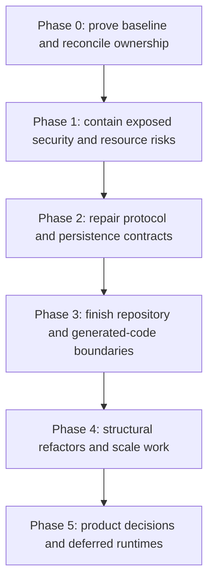

# Garazyk Mega Plan

## Objective

Deliver a production-ready AT Protocol stack in Objective-C: conformant with
every published specification (workstream 01 S6 owns the conformance matrix),
supporting experimental Proposal 0016 permissioned spaces behind its operator
flag, secure, portable to GNUstep/Linux, and easier to change while the
repository boundaries settle. This roadmap replaces the May 2026 scenario,
documentation, TUI, package, and refactor plans.

## Current state

- `main` contains 1,922 tracked files under `Garazyk/`, 234 under `packages/`,
  931 under `scripts/`, and 127 under `objc-jupyter-wasm/`.
- `deno task check` passes for all six in-tree packages as of 2026-07-12.
- `hamownia agent list` discovers 92 scenarios. A current Docker-backed run of
  scenario `01` passed 11 steps on 2026-07-12; the checked-in May matrix still
  cannot establish a current failure backlog.
- The strict XRPC coverage command now passes after removing same-pack graph
  duplicates and the unspecced labeler owner. A complete registry rebuild also
  replaces a prior application's handler set on a reused dispatcher, while
  individual duplicate registrations still fail. The existing percentage still
  measures name presence, not schema or behavior.
- The architecture audit now scans the live `Garazyk/Sources/Services` and
  `Garazyk/Tests` roots. Its smoke test finds 14 service implementations and
  339 Objective-C test files.
- The scenario dashboard now defaults to `127.0.0.1` and protects mutations
  with a per-launch capability, Host/Origin validation, and remote bearer
  authentication. AdminUIServer now rejects inline script attributes and
  enforces session-plus-CSRF checks on its POST mutations. Targeted tests pass.
  The "missing local OpenSSL dylib" that blocked a real Admin browser smoke was
  a stale `build/` CMake cache from before Homebrew's `openssl@3` was
  discoverable; a reconfigure on 2026-07-13 already fixed it
  (`testNonKeychainFactoryPersistenceWhenOpenSSLAvailable` passes, not
  skipped), the docs just never caught up. Playwright's Chromium binary was
  separately never installed (`deno run -A npm:playwright install chromium`,
  done 2026-07-15). Both blockers are cleared, and the browser smoke tests
  are now written and passing (`scripts/admin_ui_browser_smoke_test.ts`,
  `scripts/scenario-dashboard/browser_smoke_test.ts`; run 2026-07-17, see
  workstream 00 B0.2 item 5).
- `HttpConnectionIOCoordinator` now has independent 30-second idle and
  aggregate header deadlines. The aggregate deadline starts with the first
  header byte, cannot be extended by trickle input, cancels a stalled receive,
  and stops at the actual header terminator rather than a valid slow body.
- Lexicon generation now has one package-owned core rooted at
  `Garazyk/Resources/lexicons`. It fails before overwriting output when the
  inventory or endpoint set is empty; its checked-in TypeScript artifact covers
  519 lexicons and 392 endpoints deterministically. The Phase 3 Objective-C
  NSID follow-up has since landed: the generator (`2468d5e0`,
  `scripts/generate_nsid_constants.ts`) and the full call-site adoption sweep
  with a CI drift check (`0601a505`). Only the raw-literal lint remains
  (phase-06 prompt).
- `AppViewDatabase` now records ordered schema versions and applies pending
  migrations atomically. File-backed legacy fixtures prove reopen/data/index
  preservation, and all 68 injected statement-failure positions roll back
  schema and version state. A production database backup remains required
  before this schema bump is deployed.
- The Deno split exists in clean local repositories at
  `/Users/jack/Software/garazyk-atproto-testing` and
  `/Users/jack/Software/garazyk-tui`, plus branch
  `codex/split-deno-testing-repos`. Both external repos are now synchronized
  with `main`'s in-tree copies as of 2026-07-15; the old deletion branch is
  still based on a stale June 7 snapshot and needs its own rebase (Phase 3
  item 1) before it can merge.
- The three Objective-C hygiene commits from `refactor/plan01-hygiene-quick-wins`
  are cherry-picked onto `main` (`7331d0f7`, `071ce4a5`, `439a638f`),
  code-only. `refactor/plan01-hygiene-quick-wins` itself is still based on the
  Deno split and superseded for these three commits; its remaining content is
  the modernization plan docs, which were deliberately left off `main` (see
  Phase 0 item 4).
- The QueryRunner deepening arc is complete and retired: all stranded stores
  (`ATProtoMediaSQLiteStore`, Mikrus, Beskid, `JelczDatabase`, `PDSReplayCache`,
  `PDSSQLiteSessionStorage`, `PLCPersistentStore`/`PLCReplicaStore`,
  `RateLimiter`) run on `ATProtoConnectionManagerSerial` +
  `ATProtoDatabaseQueryRunner`, schema paths are atomic and rollback-tested,
  and every slice passed AllTests. The implementation diary
  (`queryrunner_deepening_pilot_plan.md`) is deleted per the plan-lifecycle
  rule; Git history and deciduous goal 1187 retain the record.
- Proposal 0016 permissioned spaces landed (`06d70f36`, ADR 0004): isolated
  SQLite storage, fail-closed URI/scope/credential parsing, delegation,
  membership policy, private blobs, and notification fan-out, all behind
  `permissionedSpacesEnabled` (off by default). The ADR 0005 reconciliation
  protocol is implemented in source — CAR multi-root reading, full-CAR
  import, lightweight record-diff recovery, incremental ops, oplog pruning
  with a background timer, and `listRecords`/`listRepoOps` cursor fixes —
  with space test suites registered and green. Scenarios 93 and 94 plus PDS3
  topology config exist (`65f367cc`). Scenario 93 now passes 19/19; the two
  OAuth defects are fixed and Scenario 94's exact consent form is
  regression-covered (`583a5efa`). Scenario 94 now passes 25/25 in structured
  run `2026-07-18t2204z-20523`; the prior AppView failure was a transient
  external port collision. Private-blob acceptance now passes in scenario 93
  (21/21, `06d70f36`). Phase 2 is now complete: scenario 94 passes 28/28
  (`2026-07-18t2238z-90828`) and observes incremental, lightweight, and full
  CAR recovery through a triple-gated, production-excluded test pack
  (`4a71b2a3`; workstream 06).
- The 29 gated `AllTests` classes are folded back into CI (Phase 2 item 4,
  first slice of Phase 4/workstream 01 S5): the 2026-07-16 baseline of 76
  failures across 11 classes is repaired (per-class root causes in
  workstream 01 S5), a full `AllTests --gated=run` pass on 2026-07-17 is
  green (3455 tests, 0 failures, re-confirmed 2026-07-17), and
  `ctest`/`scripts/test/run-tests.sh`/`run-asan-tests.sh` all run with
  `--gated=run` again. Phase 4 has since closed: deterministic
  firehose backpressure and adversarial ingress landed (scenarios 33/95),
  gap-free cursor resume is proven live (scenario 96, `1a8da8cb`, with
  the `closeForUpgrade` handoff fix `700352ab`), and the once-missing
  downstream account-status propagation is now implemented — admin
  takedown/reinstate emit real `#account` events, RelayClient/
  RelayUpstreamManager forward them, AppViewIngestEngine persists them
  (`91444a89`, `04f23030`), proven E2E by scenario 97 (`909c6399`).
  Scenarios 93-97 all exist beyond the original 92 discovered in May.
  Evidence in workstream 01 S5. A later regression (discovered 2026-07-19,
  12 suites/~68 failures, unrelated to phase 8's own changes) is now
  root-caused and repaired (2026-07-22): stale/mismatched test fixtures
  across seven suites, plus three real product bugs found along the
  way — `PDSAdminService.createLabel:` could insert a NOT NULL `cts`
  column as null via the real API path, AppView's `groups`/`group_members`
  schema didn't match what `AppViewGroupIndexer.m` actually writes (making
  `chat.bsky.group.definition` indexing entirely non-functional), and
  `PDSSequencerAnalyticsCollector.startCollecting` raced its own queue.
  Full detail in workstream 01 S5. The one protocol-compliance question
  raised there (a P-256 low-S interop fixture contradicting ADR 0007) is
  **resolved (2026-07-22)**: `PLCAuditor` now enforces low-S locally
  (ADR 0007 amendment), leaving the shared DPoP/JWT/WebAuthn verifier
  unchanged.
- Workstream 07 (storage and MST optimization) is underway: O1 landed
  (`ad1f43c7` — `INSERT OR IGNORE` for `ipld_blocks`, plus 15 more
  `INSERT OR REPLACE` → `ON CONFLICT DO UPDATE` conversions, six missing
  indexes, and standardized PRAGMAs) and O2 phases A/B landed
  (`9386db07` actor store V3 `record_tombstones`; `0d0602e7` +
  FK-restoration fix `459ba0e8` service V14 moderation tables), both
  merged to `main`. O2 phases C/D (chat, space store), O4 (the evidence-backed
  actor V5 `records(rev)` covering index), and O3 are complete. The production
  MST path starts root-only and its 256-entry lazy subtree cache has a 10K
  profile proving 7 path loads versus 2,507 eager loads; CAR/STAR fixtures are
  byte-identical. O5 is complete: resolver TTLs are enforced and AppView
  `#identity` events invalidate the shared DID cache. O6 is implemented under
  accepted ADR 0008: a durable, leased SQLite ingest/index queue with atomic
  acknowledgement, recovery, and watermarked backpressure. A deterministic
  SIGSEGV found in the O6 drain worker after the initial checkpoint (an
  `@autoreleasepool` draining before the caller could safely read a written
  out-parameter — see workstream 07 O6) is root-caused and fixed; a full
  `AllTests --gated=run` and an AddressSanitizer run are both clean.
  Workstream global gates remain open only on the repository-wide lint
  baseline before Phase 11 can close. A dedicated skill exists at
  `.agents/skills/sqlite-performance-optimization`.
- The Admin UI decoupling phase is complete: all 34 HTML partials have
  been extracted from `UIServerRuntime+Renderers.m` into separate
  template files in `Garazyk/Sources/AdminUIServer/Assets/html/`. The
  `UITemplateEngine` now handles dynamic interpolation with its new
  `EscapeHTML` utility to prevent XSS.
- The 2026-07-24 Technical Debt Audit (`docs/audits/tech-debt-2026-07-24/`)
  completed its scan for concurrency, SQL injection, and cryptographic vulnerabilities.
  Manual verification confirmed that the automated high-priority findings
  (e.g., `IN (%@)`, `isEqualToString:`, and unbalanced locks) were false positives.
  The codebase's SQL bindings, string comparisons, and backpressure mechanisms
  are already hardened.
- **Complete (2026-08-08): Relay repository-commit signature integrity
  (workstream 01 S6 G5).** Source review
  found that `RelayEventValidator` resolves and decodes a repository DID key
  but accepts the firehose commit without decoding its signed block or verifying
  `RepoCommit` against that key. The implementation parses and CID-verifies the
  signed block, binds its DID, and verifies it through `RepoCommit`; it extracts
  only the published secp256k1 `#atproto` key via one Core primitive now also
  used by `PDSRepoImportValidator`. P-256 repository keys are explicitly
  unsupported and fail closed rather than being treated as secp256k1. Workstream
  01 owns the protocol/security outcome; the change stays at the `ATProtoSync`
  ingress boundary, shared lower-layer DID-key primitive, and existing `zuk`
  composition point, rather than introducing a Sync-to-PDS/Network dependency
  or copying parser logic. `zuk` installs the parsed-mode validator and reuses
  its `DIDPLCResolver`; source composition and signature-failure metric
  assertions guard that wiring. Valid/tampered/wrong-key/unresolved-key and
  validation-mode tests are present; Deno (1,264 passed), source/boundary gates,
  `RelayEventValidatorTests` (15/15), `ZukCommandTests` (5/5),
  `RepoAuthRepoTests` (25/25), `ATProtoDIDDocumentFieldsTests` (5/5), and
  `ATProtoMultibaseTests` (2/2) pass. The full gated native suite was not run
  with only 13 GB free. Strict drops invalid signatures; lenient and log-only retain
  availability-first forwarding while reporting truthful failure. A revert is
  mechanically narrow but knowingly restores forged-commit acceptance. The
  stale relay graph is history, not backlog; details, gate evidence, and the
  explicit native-test blocker live only in
  [workstream 01](workstreams/01-security-and-protocol-correctness.md).
- Workstream 01 items S1 (duplicate XRPC ownership), S2 (canonical lexicon
  generation), and S4 (HTTP deadlines) have been verified complete against
  the codebase (2026-07-26). S1's three duplicate registrations are resolved
  with runtime enforcement, characterization tests, and CI duplicate detection.
  S2's two generators now share the canonical root `Garazyk/Resources/lexicons/`;
  the NSID generator has a CI drift check, the TS generator's drift detection
  runs via `deno task test`. S4's idle and aggregate header deadlines are
  implemented with three characterization tests proving non-reset behavior.
- Workstream 02 item A6 (incremental public sync) verified complete (2026-07-26):
  N+1 fix, delta export, golden fixtures, memory/size bounds, streamable-CAR
  enumerator (flag off), collection subsets, and pruner tests all present.
- Workstream 00 item B0.1 (scanner roots) verified complete (2026-07-26):
  scripts use correct roots, smoke test exists. One stale path in
  `generate_xrpc_next_steps.cjs` fixed.
- Workstream 03 (repository boundaries) remains blocked on maintainer decision
  to lift the indefinite JSR publication deferral (reaffirmed explicitly
  2026-08-08). R1 source synchronization completed; one no-setup runtime
  compatibility check remains blocked by absent local services/binaries and
  9.5 GB disk headroom, not by publication. R2-R4 are blocked on publication.
  No agent may publish until a future maintainer message grants explicit
  permission.

## Priority model

Each dimension uses 1 to 5. Higher boundary risk means greater operational or
contract exposure. Higher change safety means the item can ship in smaller,
better-isolated steps.

| Candidate                                     | Boundary risk | Structural drag | Test leverage | Change safety | Payoff | Priority        |
| --------------------------------------------- | ------------: | --------------: | ------------: | ------------: | -----: | --------------- |
| Dashboard and Admin mutation security         |             5 |               4 |             5 |             4 |      5 | ✓ Complete      |
| XRPC ownership and truthful contract coverage |             5 |               4 |             5 |             4 |      5 | ✓ Complete      |
| Absolute HTTP header/read deadlines           |             5 |               3 |             5 |             4 |      5 | ✓ Complete      |
| Lexicon generator consolidation               |             5 |               4 |             5 |             4 |      5 | ✓ Complete      |
| Permissioned spaces multi-PDS acceptance      |             5 |               2 |             5 |             5 |      5 | ✓ Complete      |
| AppView numbered, atomic migrations           |             5 |               5 |             5 |             3 |      5 | ✓ Complete      |
| OAuth Permissions spec (granular scopes)      |             4 |               3 |             4 |             3 |      4 | ✓ Complete      |
| Replace false-confidence security tests       |             4 |               3 |             5 |             5 |      5 | ✓ Complete      |
| PLC schema-upgrade atomicity                  |             4 |               4 |             5 |             3 |      4 | ✓ Complete      |
| Deno repository-boundary completion           |             4 |               5 |             5 |             2 |      5 | Blocked (publication deferred indefinitely; R1 unblocked) |
| Relay product decision and assembly           |             4 |               5 |             4 |             2 |      5 | Decided (ADR 0006) |
| Admin UI structural and accessibility work    |             4 |               5 |             4 |             3 |      4 | ✓ Complete      |
| Relay repository-commit signature integrity (WS01 S6 G5) |          5 |               2 |             5 |             5 |      5 | ✓ Complete |
| Spec conformance matrix (S6)                  |             3 |               2 |             5 |             5 |      4 | ✓ Complete |
| Incremental public sync                       |             4 |               4 |             4 |             2 |      5 | ✓ Complete      |
| Dedicated space signing key rotation          |             4 |               2 |             3 |             3 |      4 | ✓ Complete      |
| Space operational readiness (backup, metrics) |             3 |               2 |             3 |             4 |      3 | ✓ Complete      |
| Storage and MST optimization (workstream 07)  |             3 |               3 |             4 |             4 |      4 | ✓ Complete      |
| Objective-C god-file decomposition            |             3 |               5 |             4 |             2 |      4 | ✓ Complete      |
| Generated NSID constants                      |             2 |               4 |             5 |             4 |      4 | ✓ Complete      |
| STAR conformance and verifying import (workstream 01 S7) | 3 |               3 |             4 |             3 |      3 | ✓ Complete      |
| WASM runtime gap closure                      |             2 |               4 |             4 |             3 |      3 | ✓ Complete      |
| SMTP, cloud blob, Skylab, dashboard dispositions |          3 |               3 |             3 |             2 |      3 | Decided (5/6 implemented; STAR exempted, see brief) |
| Space app attestation (`appAccess#allowList`)  |             4 |               2 |             3 |             2 |      3 | Decided (ADR 0004 amendment) |
| Deno repository-boundary publication           |             4 |               5 |             5 |             2 |      5 | Blocked (indefinite maintainer deferral) |

## Dependency order


```mermaid
flowchart TD
    B["Phase 0: prove baseline and reconcile ownership"]
    S["Phase 1: contain exposed security and resource risks"]
    P["Phase 2: repair protocol and persistence contracts"]
    R["Phase 3: finish repository and generated-code boundaries"]
    A["Phase 4: structural refactors and scale work"]
    D["Phase 5: product decisions and deferred runtimes"]
    B --> S --> P --> R --> A --> D
```

### Phase 0: baseline and ownership

Complete [workstream 00](workstreams/00-baseline-and-governance.md).

1. **Complete:** fix audit scanner roots and establish current Objective-C,
   Deno, browser, XRPC, and scenario baselines. The scanner and current
   scenario discovery/run are proven; the browser baseline is now complete.
   Both environment blockers that previously stopped this (stale OpenSSL
   detection in `build/`, missing Playwright Chromium binary) are cleared as
   of 2026-07-15 — see the current-state note above. Browser smoke tests for
   dashboard controls, Admin CSP/CSRF, OAuth consent, and keyboard workflows
   passed on 2026-07-17 (commit 06d70f36);
   see workstream 00 B0.2 item 5 for commands and evidence.
2. **Complete:** resolve duplicate XRPC ownership so the existing strict CI
   check is green.
3. **Complete:** synchronize the two external Deno repositories with newer
   in-tree changes. `garazyk-atproto-testing` picked up the real drift on
   `main` since the June 7 split (gruszka lexicon/DNS-timeout fixes, hamownia
   test quieting) and dropped `packages/gruszka/scripts/generate.ts` +
   `generate_test.ts`, which can no longer regenerate standalone now that
   lexicon generation is rooted at the monorepo-only `Garazyk/Resources/lexicons`;
   the repo is a pure vendored consumer of `lexicons.ts` going forward, verified
   clean (`check`/`lint`/`fmt`, 3790 tests). `garazyk-tui` needed no changes —
   zero real commits touched `packages/tui` since the split base.
4. **Complete:** rebase the Objective-C hygiene commits onto current `main`
   without the stale Deno deletion diff (`7331d0f7`, `071ce4a5`,
   `439a638f`). Cherry-picked code-only from the three
   `refactor/plan01-hygiene-quick-wins` commits, dropping an unrelated
   `plan/objc-modernization-2026-07/` tree and `docs/tui/asciinema-overlay/`
   docs bundled into one of them. `AllTests` is green: 3198 passed, 0 failed.
5. **Complete:** replace security tests that assert empty inputs or
   `XCTAssertTrue(YES)` with fixtures that exercise the claimed boundary.
   Deterministic DPoP/SQL-allowlist/refresh-token/import/CAR coverage landed in
   `SecurityHardeningTests` (`4e028797` + `66868486` registration +
   `6f092ced` fixture dedupe). A fresh HEAD build runs all 9
   `NetworkSecurityHardeningTests` with 0 failures; no placeholder assertions
   remain (deciduous node 1199 closed).

Exit gate: clean generated reports, current scenario run metadata, passing
package checks, and a documented branch disposition. Branch disposition is
now documented (workstream 00, B0.3): `codex/split-deno-testing-repos`
inactive pending Phase 3, `refactor/plan01-hygiene-quick-wins` superseded for
code and kept for its remaining docs, `backup-pre-rewrite` archival-only. All
five items are complete; the Phase 0 exit gate is met.

### Phase 1: containment

Complete the P0 items in
[workstream 01](workstreams/01-security-and-protocol-correctness.md) and
[workstream 04](workstreams/04-web-and-admin-ui.md).

1. **Complete first slice:** bind the scenario dashboard to loopback by default
   and protect all process controls with a launch capability, Origin/Host
   validation, and auth for non-loopback operation.
2. **Complete first slice:** remove inline browser event-handler dependence
   from Admin UI, enforce CSRF on every POST mutation, and reject code-valued
   rendering attributes. The real-browser CSP smoke now exists and passes
   (`scripts/admin_ui_browser_smoke_test.ts`, 2026-07-17).
3. **Complete first slice:** enforce independent idle and aggregate HTTP header
   deadlines that trickled bytes cannot reset, cancel stalled receives, and
   stop header accounting at `CRLFCRLF` so a valid slow request body is not
   rejected by the aggregate deadline.
4. **Complete first slice:** consolidate TypeScript lexicon generation on
   `Garazyk/Resources/lexicons`, fail closed on zero input or endpoints, and
   prove checked-in output drift-free. Objective-C NSID constants remain the
   explicitly ordered Phase 3 follow-up.

Exit gate: negative security tests, browser CSP smoke, slowloris simulation, and
deterministic generator tests.

### Phase 2: contracts and persistence

1. **Complete implementation/test slice:** add numbered, transactional AppView
   migrations with legacy file fixtures, rollback injection after every
   statement, and reopen tests. Verify a production database backup before the
   schema bump is deployed.
2. **Complete:** PLC schema-migration atomicity and legacy upgrade tests. The
   `PLCPersistentStore` + `PLCReplicaStore` migration onto ConnectionManagerSerial +
   QueryRunner landed, and schema creation plus the legacy ALTER upgrades now run
   inside a single `transact:` that rolls back on any failed statement. Proven by a
   legacy-schema upgrade fixture and an injected index-collision rollback test; the
   61-test PLC regression net stays green.
3. **Complete (report-only).** Split XRPC metrics published at
   `reports/xrpc_split_metrics.md`. Three semantic fixes applied:
   `chat.bsky.actor.declaration` phantom query removed,
   `app.bsky.labeler.getServices` validates required `dids`,
   `com.atproto.admin.getRecord` uses `ATURI` with documented compatibility
   policy. Schema validation in report-only mode.
4. **Complete (2026-07-17).** Firehose backpressure is deterministic:
   `PDS_FIREHOSE_MAX_PENDING_SENDS`/`_BYTES` now plumbed through `--binary`
   mode and the topology-compiler preset (docker-compose already had it);
   scenario 33 rewritten to poll for the drop instead of sleeping 90s.
   Adversarial data now hits the real PDS boundary too: new scenario 95
   sends malformed/oversized/junk payloads at live repo/blob endpoints and
   asserts rejection plus continued health (scenarios 65/66 previously
   only exercised the Deno-side parser). Evidence in workstream 01 S5.
5. **Complete (2026-07-17).** Write/read enforcement was already proven
   (scenario 55); `getRepoStatus` no longer lies about `active`; the
   downstream-propagation gap found by the audit is now implemented and
   proven E2E (takedown/reinstate → `#account` firehose events →
   Relay forwarding → AppView persistence; `91444a89`, `04f23030`,
   scenario 97) and cursor resume is proven live (scenario 96). One lead
   remains recorded in workstream 01 S5, not backlog: enforcement beyond
   passthrough (`RelayRepoStateManager` still has no callers; AppView
   does not yet un-index takendown accounts).
6. **Complete (2026-07-18):** permissioned-spaces multi-PDS
   acceptance scenarios (93 and 94) against an independently operated PDS3,
   including the private-blob and pruned-oplog recovery cases, and move the
   compatibility-gate rows on dated structured-run evidence
   ([workstream 06](workstreams/06-permissioned-spaces.md), P6.1). PDS3
   topology support across the scenario runner landed (`65f367cc`); scenario
   93 passes 19/19 and the OAuth fixes are characterization-guarded
   (`583a5efa`). Scenario 93's private-blob acceptance passes 21/21
   (`06d70f36`), and Scenario 94 passes 28/28 with all three recovery
   selectors observed (`4a71b2a3`, `2026-07-18t2251z-9158`). The Phase 2
   fixture was hardened to veto issuer-required environments and require a
   per-run local bearer capability, with no remaining security-audit findings.
   Phase completion is blocked until local disk capacity permits the full Deno
   and AllTests acceptance gates to finish.
7. **Complete (report-only).** Conformance matrix at
   `docs/reports/spec-conformance-matrix.md`: 21 rows, 16 supported, 4 partial,
   0 gap. Permissions-spec gap assessment at
   `docs/reports/permissions-spec-gap-assessment.md` with 4-phase implementation
   proposal. Known gaps G1-G4 seeded as backlog leads.

Exit gate: migration rollback proof, schema-aware coverage, current
structured scenario results for the affected endpoints, and recorded
scenario 93/94 runtime passes.

### Phase 3: boundaries

1. **Blocked (2026-07-18, maintainer decision; reaffirmed explicitly
   2026-08-08):** complete the two-repository Deno extraction using released
   package versions as the boundary. Keep thin compatibility launchers until consumers pass.
   `@garazyk/tui@0.1.0` is the first verified release candidate: its dedicated
   format, lint, type-check, and 252-test tasks pass, and it exposes the required
   root, runtime, and testing exports. Its JSR publication is indefinitely
   deferred by maintainer decision: do not request or use publisher access, or
   run `deno publish`, until a future maintainer message grants explicit
   permission and reopens Phase 5. No
   package has been published; later ATProto package releases and the in-tree
   deletion (R4) remain deferred with it (workstream 03). R1 (synchronize
   forward) is not blocked and can proceed independently.
2. **Preparatory rewrite complete (2026-07-25):** no TypeScript source under
   `scripts/scenarios/` or `packages/` imports `scripts/lib/deno`, and
   `packages/hamownia/tasks.ts` now imports `XrpcClient` from workspace
   `@garazyk/gruszka` (Hamownia: type check + 328 tests pass). The final form,
   package-name imports followed by wrapper deletion, remains deferred with
   publication and the in-tree deletion.
3. **Complete (2026-07-18):** plain Objective-C NSID constants are generated
   deterministically (`2468d5e0`) and adopted at every call site with a CI
   drift check (`0601a505`). A Narzedzia guard now rejects direct non-internal
   `registerMethod:@"..."` literals in production source, with six focused
   tests and a read-only CI scan; generator output remains in sync for 419
   endpoints.
4. **Complete (2026-07-19):** `GZCommandLineOptions` and `GZServiceLifecycle` adoption is complete across all remaining service binaries (`garazyk-ui`, `jelcz`, `syrena-chat`, `germ`, `kaszlak`, `campagnola`, `zuk`). Each binary has a dedicated characterization suite (`GarazykUICommandTests`, `JelczCommandTests`, `SyrenaChatCommandTests`, `GermCommandTests`, `KaszlakCommandTests`, `CampagnolaCommandTests`, `ZukCommandTests`) verified natively and inside GNUstep/Linux, preserving signal handling and `/tmp/<binary>-crash.log` diagnostic contracts. All ports are committed one binary per commit.

Exit gate: all three repositories pass format, lint, check, and tests; Garazyk
uses released dependencies and retains a launcher smoke test. This gate is
deferred while the publication deferral stands; items 3-4 are complete and the
remaining program does not depend on items 1-2.

### Phase 4: structure and scale

1. **Complete (2026-07-17):** `kaszlak relay serve` removed (Operator decision: Option 3). `PDSCLIRelayCommand` deleted; `zuk` is the canonical relay binary. Underlying relay components (RelayClient, UpstreamManager, DownstreamHandler, Firehose, etc.) are untouched and continue to serve zuk, PDSRelayService, and AppViewIngestEngine.
2. **Complete (2026-07-19):** stream repository export preparation and
   replace per-account summary scans with indexed metadata. The N+1 fix,
   byte-identical golden-fixture net, and materialized
   `collection_membership` index are committed (`3e7b0340`); the
   incremental export producer with bounded fallback landed (`799fd706`)
   with byte-identical fixtures and memory bounds verified, and
   `PDSCollectionMembershipPruner` now has its own test suite
   (`895ae94c`). Relay removal is recorded in ADR 0006. The Sync 1.1
   remainder stays open under item 7.
3. **Complete (2026-07-23):** Decompose Objective-C god files. All
   committed: the 4 route packs → 31 category files (deciduous
   `#1362`/`#1374`), `OAuth2Handler.m` (4197 → 252 lines, 12 categories),
   `PDSRecordService.m` and `PDSRepositoryService.m` (11 categories),
   `UIBackendClient.m` (10 categories, `7db9a646`), and
   `UIServerRuntime.m` (11 route categories, core ~1840 → ~900 lines,
   `7db9a646`) — each behind a green characterization suite.
   Codemod scripts removed; browser smoke and Linux GNUstep gate
   verified clean (workstream 02 A3).
4. **Complete (2026-07-22):** Admin UI accessibility, CSS generation, and
   browser-module splits. The real-browser visual smoke proves 200%-zoom
   reflow, 44px targets, keyboard-visible focus, and reduced-motion behavior
   against the built `garazyk-ui` binary; the asset synchronization CTest
   prevents stale served UI files.
5. **Complete (2026-07-22):** Dedicated `#atproto_space` signing-key rotation
   and existing-DID migration path (workstream 06, P6.2). Purpose-isolated
   signers, explicit PLC operator tooling, and the runbook preserve the
   account-key fallback until the exact dedicated public key is published.
   Binary three-PDS scenario 93 run `2026-07-22t0530z-70080` passed 25/25,
   including remote verification of both credential key layouts during
   overlap.
6. **Complete (2026-07-22):** space operational readiness (workstream 06,
   P6.5). Online SQLite backup/restore drill with LtHash verification,
   disabled-mode retention proof (flag off leaves the space database
   byte-for-byte unchanged), and credential-free structured observability
   for both the reconciler (replay/gap/recovery-path events) and the
   pruner (per-run removed-entry counts).
7. **Complete:** Sync 1.1 remainder (export block ordering,
   collection subsets). DFS pre-order for STAR L0 block emission is now implemented
   and verified passing by STARPreorderTests. Collection-based subsets are
   served independently via the `tools.garazyk.sync.getRepoFiltered`
   vendor extension, now with test coverage (3 new cases,
   `PDSRepositoryServiceTests.m`).
8. **Complete (2026-07-22):** storage and MST optimization
   ([workstream 07](workstreams/07-storage-and-mst-optimization.md), phase 11).
   All lanes done: `INSERT OR IGNORE`/index/PRAGMA hardening (O1),
   `WITHOUT ROWID` phases A-D including chat and space store (O2), lazy MST
   subtree hydration (O3), the evidence-backed `records(rev)` covering index
   (O4), DID/handle resolution caching audit (O5), and the durable
   ingest/indexing queue with backpressure and dead-letter retention (O6,
   ADR 0008). The repo-wide `deno task lint` baseline this phase left open
   (2,043 findings) is also closed to 0 — see workstream 07's O6 checkpoint
   for the per-package breakdown and one cross-package integration fix it
   required.

9. **Complete (2026-07-23):** STAR conformance and verifying import
   (workstream 01 S7, `docs/archive/planning/star-conformance-plan.md`). All three
   slices landed: V-flag wire-format fix + fixture regeneration (Slice A),
   verifying stack-based `parseL0Body` + corrected `carDataFromSTARData:`
   (Slice B), dead CAR→STAR converter deletion + ADR 0009 (Slice C).
   Round-trip, empty-tree, malformed-input, and STAR→CAR conversion tests
   added (6 new test methods). All 20 STARPreorderTests pass.

10. **Open (re-verified 2026-08-04):** make the ten `ATProto*` static-library
    boundaries real and publish them as a bounded, experimental CMake config
    package. Complete
    [workstream 08](workstreams/08-module-boundaries-and-library-consumption.md).
    M1-M4 are complete: `scripts/check_module_boundaries.sh build` reports **0
    current / 0 baselined** violations across all ten modules and
    `docs/module-boundary-baseline.txt` is empty, meeting M4's zero-baseline
    acceptance gate. M5 (namespace the exported symbols) is the active
    milestone — first step is the shrink-only namespace gate over the ~283
    unprefixed classes; M5.3's first rename batch (internal migration
    classes, the low-risk pilot) is complete and batch 2 (Core primitives)
    is complete in full (all ~25 classes renamed, including `CID` at 265
    consumers, the largest single rename in the workstream),
    and batch 3a (the low-consumer half of Storage/Transport, 14 classes,
    `92395144`) is complete. Batch 3b's Storage slice (17 higher-consumer
    classes) is also complete, ratcheting the namespace baseline
    283 → 253 → 249 → 238 → 234 → 232 → 231 → 230 → 229 → 228 → 214 → 197
    → 191 → 175. Batch 3b (the remaining higher-consumer Storage/Transport
    classes) is complete. M4.5 is also complete: all thirteen module source
    sets are explicit manifests with configure-time ownership checks. Focused
    Core/Storage/Transport builds, the post-Admin-UI native `AllTests` build,
    and all namespace/module-boundary checks pass; the full gated suite is
    still incomplete. The GNUstep Docker builder stopped before compilation
    when OrbStack ran out of storage copying the source context. Batches 4-6
    (PLC/Sync/Services/MediaCore, XRPC/VideoService,
    Runtime) remain open.
    **M7 is now
    complete (2026-08-04):** the remaining host-process `exit()`/`abort()`
    calls in `PDSApplication.m`/`PDSCLIServeCommand.m`/
    `PDSCLIDaemonCommand.m` and the installer's hard-coded
    `/var/db/kaszlak/log/daemon.log` fallback are fixed, `ATProtoSafeHTTPClient`/
    `GZMetrics` were found already injectable via `ATProtoServiceContainer`,
    and a new CI gate (`scripts/check_no_host_process_exit.sh`) rejects new
    `exit()`/`abort()` calls in package-target sources; see workstream 08's
    "M7 residual cleanup complete" section. M6 (relocatable install/export)
    remains open. M0 is
    answered yes for source-built static libraries on macOS and GNUstep/Linux;
    prebuilt binaries, Apple frameworks/XCFrameworks, iOS, and package
    registries remain out of scope.

    **GNUstep/Linux CI truthfulness (2026-08-04, P0 finding):** `ci.yml`'s
    `linux-gnustep-build-and-test` job has never been able to compile this
    project and cannot as configured — its apt package set never provides
    libobjc2's `objc/blocks_runtime.h` (`libblocksruntime-dev` ships an
    unrelated library), an architecture-independent, deterministic failure on
    the very first `.m` file. The from-source toolchain
    (`docker/Dockerfile.gnustep`) does work: a fresh `docker build --target
    builder` links all binaries cleanly, and reconfiguring with
    `-DBUILD_TESTS=ON` produced the first-ever full `AllTests` build and run
    on GNUstep in this workstream's history — reproduced twice: 4,723/560
    then 4,726/562 failures, **933s (~15.5 min) wall clock** (the first run's
    "~101 minutes" was a clock-jump measurement artifact, corrected in
    workstream 08). **86.7% of failures (488/562) trace to one root cause**:
    `AdminAuthXrpcTestBase`/`RepoAuthTempTests`'s shared `-setUp` fails its
    own admin-authentication assertion (`PDSAdminAuth
    authenticateWithPassword:error:`), cascading into every inherited test
    method across 51 test classes regardless of what each test exercises —
    not root-caused further, but a single high-leverage next GNUstep lead.
    Fixing `ci.yml` for real needs a maintainer decision among three options
    recorded in workstream 08 (replace the job with a Docker-based one
    binary-build-only, replace it and accept CI going red until the backlog
    is triaged, or drop the job and rely on `linux-docker-build` alone) — not
    changed unilaterally. Full detail, evidence, and per-class failure
    breakdown: workstream 08's "GNUstep/Linux CI investigation" section.

11. **Open (added 2026-07-30):** cut `AllTests` wall clock and related CI /
    Deno cycle waste. Complete
    [workstream 09](workstreams/09-test-suite-speedups.md). Measured baseline
    from CI run `30512753291`: suite **~654s**, ~61% in XRPC auth-base
    classes, driven by uncached lexicon reloads (~200–250s) and production
    PBKDF2 in tests (~100–150s). Full critique:
    [`test-suite-speedups-2026-07-30.md`](test-suite-speedups-2026-07-30.md).
    Phase 1 (lexicon memoization, test-mode PBKDF2, quieter logs, dead
    sleeps) is the highest-impact / lowest-risk entry; fixture sharing and
    sharding follow.

Cross-link (added 2026-07-28): activate two new workstream 01 sub-items
alongside this entry — **S18** (`OAuthProvider*` adapter-stack deletion,
security-review §4.5) and **S19** (DAG-CBOR routing migration,
security-review §3.4). See
[`docs/plans/security-review-2026-07-28.md`](security-review-2026-07-28.md)
for full traceability; mirrored in the
[`workstreams` table](./README.md#active-structure).

12. **Open (added 2026-08-03):** make Garazyk's DASL (dasl.ing) implementation
    conformant and prove it against the upstream dasl-testing corpus. Complete
    [workstream 10](workstreams/10-dasl-conformance.md). Phases 1–4 (DRISL
    profile fixes, strict DASL CID profile, DASL CAR with block-CID/payload
    verification, 104-vector conformance harness) are implemented and
    passing (`DASLConformanceTests`, 16 tests, 0 failures); rationale and the
    five DRISL defects found are recorded in
    [ADR 0032](../adr/0032-dasl-conformance-profiles.md). Also supersedes
    workstream 01 §S19 row 10 (`Repository/CAR.m` was recorded importer-only;
    its header decoder has now actually migrated to `ATProtoDagCBOR`,
    closing that row for real). A macOS full regression run passes 4,955 tests;
    module boundary and recursive-setter gates are clean. Bounded RASL/BDASL
    and MASL slices are now implemented and merged to `main` (`da56aa18` and
    `4bfd6a8a`) with focused verification; the remaining PFP
    producer/comparator/Ozone, MUXL, S2PA, and Web Tiles integration remainders
    remain open. MUXL's complete deterministic MP4
    muxer remains the largest single item in the workstream. GNUstep/Linux
    full-suite evidence remains open; the compile blocker (an XCTest
    object-pointer-boxing difference in `PDSAdminServiceTests.m` /
    `PDSBlobAuditHandlerTests.m`). The GNUstep-side UTF-8 and shared-fixture
    evidence remains governed by workstreams 08 and 10; no full GNUstep gate
    is claimed by this execution.

13. **Open (added 2026-08-04):** dissolve the single `garazyk-ui` process into
    an admin UI owned by each service binary. Complete
    [workstream 11](workstreams/11-per-service-admin-uis.md). One process
    currently holds admin credentials for the PDS, PLC, relay, AppView, chat,
    and video services simultaneously; `Garazyk/Sources/AdminUIServer/` belongs
    to no static library, so its ~15 `UI*` classes escape both the ADR 0031
    link-time boundary gate and `scripts/check_namespace.sh` (each enumerates
    ten `ATProto*` archives). Decision and constraints:
    [ADR 0033](../adr/0033-per-service-embedded-admin-uis.md). M1 (per-instance
    `HttpServer` concurrency, service-scoped session cookies) unblocks
    embedding; M2 has been implemented and merged to `main` as
    `ATProtoAdminUI`, validated by rebuilding `garazyk-ui` as its first
    consumer before any service is touched. Phase 30 closeout remains blocked
    on its named static/page-load, browser, and full-suite acceptance evidence;
    M3 pilots
    on `campagnola`, which has no admin credential today. Coordinate the Web
    Tiles files (`UITileDataProtocol`, `UITileExecutionPolicy`) with
    workstream 10, and the `UI*` → `GZAdminUI*` rename with workstream 08 M5.3.

Exit gate: cross-platform tests, protocol E2E for Relay/sync, and no public API
removals without caller proof.

### Phase 5: decisions

1. **Complete (2026-07-25): baseline and ADR 0010 subset implemented.** The
    reproducible capability baseline landed in phase 10 slice 2:
    `objc-jupyter-wasm/scripts/run-capability-baseline.sh` rejects a dirty
    checkout, builds `kernel-wasm` twice, runs smoke/runtime/notebook/
    compatibility probes (91/91 runtime probes, 18/18 compat cases, Chromium
    worker smoke green), and regenerates the capability matrix;
    `kernel/PARSER_STATUS.md` and the gap report now redirect to it. The
    subset checkpoint was decided in ADR 0010 (operator delegated,
    2026-07-23): a parser-termination invariant plus `->` member access and
    top-level C function definitions become supported; `@encode`/
    `@synchronized` become intentionally-unsupported diagnostics. The
    clean-checkout baseline now records 97/97 runtime probes, 18/18
    compatibility cases, and 22 passing demo notebooks (138/152 executed
    cells); its Nix-built kernel artifact is promoted to JupyterLite. The
    compiled-cell plane stays deferred by decision.
2. **Complete (2026-07-22), 5 of 6:** operator approved all six dispositions in
    [the Phase 10 product-surface decision brief](../archive/planning/phase-10-product-surface-decision-brief.md).
   Implemented: SMTP removed, S3 blob config now rejected (fails closed), Skylab
   repost button removed, Skylab Germ E2EE selector removed, scenario-dashboard
   manifest health probes added. **STAR CAR reconstruction was not removed** —
   implementing that disposition found the brief's evidence was stale: the
   flagged lossy converter has zero production callers, while the actually
   negotiated public sync export path uses a separate, correct MST-walking
   writer. STAR negotiation is unchanged; see the brief's correction section.
3. **Complete (2026-07-24):** AppView QueryRunner/pooling and schema migration safety is implemented. `AppViewDatabase` uses the standardized `PDSMigrationManager` with transactional `_migrations` history, replacing the inline schema execution entirely. ADR 0002 has been superseded.
4. **Complete (2026-07-25):** app attestation for permissioned-spaces
   `appAccess#allowList` is implemented (client metadata, JWKS, key
   identifier, signature, issuer/subject equality, audience, expiry, nonce
   replay, app identity), recorded as an ADR 0004 amendment (workstream 06,
   P6.3). `policy: managing-app` now validates the delegated
   `checkUserAccess` service-auth response and defaults to deny when no app
   implements that endpoint.
5. Track Proposal 0016 upstream drift on a monthly cadence (workstream 06,
   P6.4); re-pin, re-diff, and record impact before adopting any upstream
   change. `permissionedSpacesEnabled` stays off by default until the
   proposal stabilizes. Second check 2026-07-23 clean; next due ~2026-08-23.

## Global gates

Every implementation lane must name targeted tests plus these applicable gates:

```bash
deno task check
deno task lint
deno task test
cmake --build build --target AllTests --parallel 4
./build/tests/AllTests --gated=run
```

Run `xcodegen generate` before macOS Xcode builds. Run the Linux Docker gate for
Compat, Network, or binary entrypoint changes. Use structured `hamownia agent`
output for scenario evidence.

## Primary external contracts

- [AT Protocol specification index](https://atproto.com/specs/atp) — the
  conformance target is every published spec page (workstream 01, S6)
- [AT Protocol account lifecycle](https://atproto.com/specs/account)
- [AT Protocol event streams](https://atproto.com/specs/event-stream)
- [AT Protocol synchronization](https://atproto.com/specs/sync)
- [AT Protocol OAuth profile](https://atproto.com/specs/oauth)
- [AT Protocol Permissions](https://atproto.com/specs/permissions)
- [AT Protocol Lexicon](https://atproto.com/specs/lexicon)
- Proposal 0016 permissioned data, pinned
  `3f6c96d5d2d25438bd40fa89d6ecc37865f8e354` (experimental; ADR 0004)
- [did:plc v0.3](https://web.plc.directory/spec/v0.1/did-plc)
- [CSP Level 3](https://www.w3.org/TR/CSP/)
- [WCAG 2.2](https://www.w3.org/TR/WCAG22/)
- [SQLite transactions](https://www.sqlite.org/lang_transaction.html)
- [SQLite WAL](https://www.sqlite.org/wal.html)
