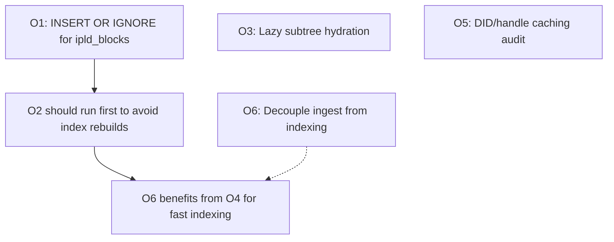

# Storage and MST Optimization

Research report: `docs/reports/2026-07-17-optimization-research.md`
Working skill: `.agents/skills/sqlite-performance-optimization` (query-plan
analysis, indexing, PRAGMA tuning) — load it before touching any lane here.

## Status (2026-07-18)

- **O1 complete** (`3be4ee1ab`, merged `2c45c6814`). `ipld_blocks` now uses
  `INSERT OR IGNORE` (`ActorStore.m:448`). The commit went beyond the planned
  scope: 15 other `INSERT OR REPLACE` sites converted to
  `ON CONFLICT DO UPDATE` (preventing blob-trigger double-firing and silent
  column wipes on `records`), six missing indexes added, PRAGMA configs
  standardized (`temp_store=MEMORY`, `mmap_size`, `busy_timeout`,
  `PRAGMA optimize` on close), and one unparameterized SQL site fixed.
  The added indexes are plain filter indexes — O4's covering-index lane is
  still open.
- **O2 Phase A complete** (`fc1705696`, merged `8386727de`): actor store V3
  `record_tombstones` WITHOUT ROWID migration + fresh-DB schema, with
  apply/rollback/re-apply round-trip tests.
- **O2 Phase B complete** (`50f2482c2` + fix `2f7ba5bdb`): service DB **V14**
  (not V13 as originally planned — V13 was already taken)
  `moderation_set_members` + `moderation_subjects` WITHOUT ROWID. The fix
  commit restored the `FOREIGN KEY (set_id) ... ON DELETE CASCADE` the
  rewrite had dropped — `deleteSet:` relies entirely on that cascade.
  **Lesson for Phases C/D: a WITHOUT ROWID table rewrite must carry over
  every constraint (FKs, CHECKs, DEFAULTs) from the original DDL, not just
  the columns and PK.**
- **O2 Phase C complete (this commit):** the four legacy PDS chat tables
  (`conversation_members`, `message_reactions`, `group_members`, and
  `group_message_reactions`) migrate in PDS DB V12; the service-owned
  `collection_membership` table migrates separately in service DB V15. All
  five fresh DDL definitions use `WITHOUT ROWID`; the focused migration tests
  prove apply/rollback/re-apply data and index preservation. This split is
  intentional: `collection_membership` is not owned by the chat runtime.
- **O2 Phase D complete:** space-store V4 converts all seven
  composite-key tables, including the `space_repo` child-table dependency
  graph, without disabling FK enforcement. Its focused test creates data in
  every converted table, rolls V4 back to V3, reapplies it, and verifies the
  persisted space data.
- **O4 complete (this commit):** query-plan audit found one safe covering
  index: actor-store V5 `idx_records_rev` for `getRepoStatus`'s revision
  union. `listRecords`, `getRecord`, and `getBlocks` already use existing
  indexes or primary keys; making their payload reads covering would duplicate
  record/block BLOBs. No speculative service-DB index was added.
- **O3 complete (this commit):** the production repo-block loader was already
  root-only. Proof traversal now uses a bounded 256-entry LRU side cache.
  A 10K-record profile test proves zero child-block loads at initialization,
  seven loads for one leaf path, and 2,507 for equivalent eager hydration; its
  macOS snapshot observed 0 bytes root-only versus 5,406,720 bytes for the
  retained eager tree. `PDSRepositoryServiceTests` (36),
  `MSTPreorderFixtureTests` (3 active), and `STARPreorderTests` (6) preserve
  the CAR/STAR byte-identical and structural fixtures.

## Scope

Six optimizations ranked by value-to-effort ratio after code audit confirmed
which are already implemented and which remain. Three items from the original
research (dirty-flag CID invalidation, copy-on-write node immutability, batch
transaction discipline) are already done and excluded from this plan.

## Priority model

| Item                                     | Boundary risk | Structural drag | Test leverage | Change safety | Payoff | Priority | Status |
| ---------------------------------------- | ------------- | ---------------- | ------------- | -------------- | ------ | -------- | ------ |
| O1: `INSERT OR IGNORE` for `ipld_blocks` |             2 |                1 |             4 |             5 |      4 | P0       | Done (`3be4ee1ab`) |
| O2: `WITHOUT ROWID` for composite-PK tables |          3 |                2 |             4 |             4 |      4 | P0       | Complete |
| O3: Lazy subtree hydration               |             3 |                4 |             3 |             2 |      5 | P1       | Complete |
| O4: Covering indexes for hot reads       |             2 |                2 |             3 |             4 |      3 | P1       | Complete (actor V5) |
| O5: DID/handle resolution caching audit  |             3 |                2 |             3 |             4 |      3 | P2       | Open   |
| O6: Decouple ingest from indexing        |             4 |                5 |             3 |             2 |      4 | P2       | Open   |

## O1: `INSERT OR IGNORE` for `ipld_blocks` — COMPLETE

Landed in `3be4ee1ab` (see Status above). Steps retained for the record.

**Problem:** `ActorStore.m` uses `INSERT OR REPLACE INTO ipld_blocks (...)`.
For immutable content-addressed blocks, `REPLACE` deletes and re-inserts the
row, firing triggers and rewriting the B-tree page. The caller already dedupes
in memory with CID sets, but the DB-level `REPLACE` still does the
delete+insert dance on every commit.

**Source:** <https://www.sqlite.org/lang_conflict.html>,
<https://ipld.io/docs/data-model/content-addressing/>

### Steps

1. **Find the insert statement.** Search `ActorStore.m` for
   `INSERT OR REPLACE INTO ipld_blocks`. There should be one site in
   `putBlocks:` or a helper.

2. **Change to `INSERT OR IGNORE`.** Replace `INSERT OR REPLACE` with
   `INSERT OR IGNORE` (or `INSERT ... ON CONFLICT(cid) DO NOTHING` if the
   table has a unique constraint on `cid`).

3. **Verify no triggers depend on REPLACE behavior.** Search for
   `CREATE TRIGGER` on `ipld_blocks` in `PDSSchemaManager.m` and
   `Schema.m`. If any trigger fires on `DELETE` or `INSERT`, document
   whether the change is safe.

4. **Add a test.** Insert a block with a given CID, then insert the same
   CID again. Verify the row count is 1 and the block bytes are unchanged.
   The test should also verify that a genuinely new CID still inserts
   correctly.

5. **Run existing tests.** `AllTests --gated=run` must stay green.

### Files

- `Garazyk/Sources/Database/ActorStore/ActorStore.m` — change insert statement
- `Garazyk/Tests/Database/ActorStoreTests.m` (or nearby) — add dedup test

### Verification

```bash
cmake --build build --target AllTests --parallel 4
./build/tests/AllTests --gated=run
```

### Rollback

Revert the single statement change. No schema migration needed.

### Dependencies

None. Can ship independently.

---

## O2: `WITHOUT ROWID` for composite-PK tables — COMPLETE

Phase A landed in `fc1705696`; Phase B in `50f2482c2` + `2f7ba5bdb` (FK
restoration — see the Status lesson). Phases C and D are complete.

**Problem:** Zero tables in the codebase use `WITHOUT ROWID`. Tables with
composite primary keys maintain a redundant rowid B-tree plus a secondary
index, wasting ~20-30% storage and doubling B-tree lookups for PK queries.

**Source:** <https://www.sqlite.org/withoutrowid.html>

### Candidate tables (audited)

**Actor store schema** (`PDSSchemaManager.m` → `actorStoreSchemaSQL`):

| Table | PK | Migration target |
|------|----|------------------|
| `record_tombstones` | `(uri, rev)` | V3 actor store migration |

**Service DB schema** (`PDSSchemaManager.m` → `serviceSchemaSQL`):

| Table | PK | Migration target |
|------|----|------------------|
| `moderation_set_members` | `(set_id, did)` | V14 service migration (done) |
| `moderation_subjects` | `(subject_did, subject_type)` | V14 service migration (done) |

**Chat schema** (`Schema.m`):

| Table | PK | Migration target |
|------|----|------------------|
| `conversation_members` | `(convo_id, member_did)` | Chat migration |
| `message_reactions` | `(message_id, actor_did, emoji)` | Chat migration |
| `group_members` | `(group_uri, member_did)` | Chat migration |
| `group_message_reactions` | `(message_id, actor_did, emoji)` | Chat migration |
| `collection_membership` | `(did, collection)` | Service DB V15 migration (service-owned; not chat runtime) |

**Space store schema** (`PDSSpaceStore.m`):

| Table | PK | Migration target |
|------|----|------------------|
| `space_member` | `(space, did)` | Space migration |
| `space_repo` | `(space, author_did)` | Space migration |
| `space_record` | `(space, author_did, collection, rkey)` | Space migration |
| `space_record_oplog` | `(space, author_did, rev, idx)` | Space migration |
| `space_writer` | `(space, did)` | Space migration |
| `space_credential_recipient` | `(space, service_did)` | Space migration |
| `space_blob` | `(space, author_did, cid)` | Space migration |

**Note:** The `records` and `ipld_blocks` tables in the actor store also have
natural keys, but they use single-column PKs (`uri` or `cid`). Converting
these to `WITHOUT ROWID` is also beneficial but requires more care because
they are the hottest tables. Defer to a later phase.

### Steps

#### Phase A: Actor store — `record_tombstones` (lowest risk) — COMPLETE (`fc1705696`)

1. **Create V3 actor store migration.** Add a `V3RecordTombstonesWithoutRowid`
   class to `PDSMigrationManager.m` that:
   - Creates a new `record_tombstones_new` table with `WITHOUT ROWID`.
   - Copies data from `record_tombstones` to `record_tombstones_new`.
   - Drops the old table.
   - Renames `record_tombstones_new` to `record_tombstones`.
   - Recreates indexes.

2. **Update `PDSSchemaManager.m`.** Change `actorStoreSchemaSQL` to create
   `record_tombstones` with `WITHOUT ROWID` for fresh databases.

3. **Register the migration.** Add to
   `+actorStoreMigrationManager` factory method.

4. **Test.** Create a fresh actor store, verify `record_tombstones` is
   `WITHOUT ROWID` via `PRAGMA table_info`. Create a legacy database
   (V2), run migrations, verify the table is converted and data
   survives. Inject failure mid-migration and verify rollback.

5. **Run existing tests.** `AllTests --gated=run` must stay green.

#### Phase B: Service DB — `moderation_set_members`, `moderation_subjects` — COMPLETE (`50f2482c2` + `2f7ba5bdb`)

6. **Create V14 service migration.** Same pattern as Phase A but for
   both tables. Run within a single transaction. (Landed as
   `V14ModerationWithoutRowid`; the follow-up `2f7ba5bdb` restored the
   `set_id` FK cascade the rewrite dropped.)

7. **Update `PDSSchemaManager.m`.** Change `serviceSchemaSQL` to create
   both tables with `WITHOUT ROWID` for fresh databases.

8. **Register the migration.** Add to
   `+serviceDatabaseMigrationManager` factory method.

9. **Test.** Same pattern as Phase A.

10. **Run existing tests.**

#### Phase C: Chat schema and service-owned membership — COMPLETE

11. **Create ownership-specific migrations.** The four legacy PDS chat
    tables use V12 of `pdsDatabaseMigrationManager`; the service-owned
    `collection_membership` uses V15 of `serviceDatabaseMigrationManager`.
    Carry over every FK/CHECK/DEFAULT constraint from the original DDL
    (the Phase B rewrite dropped an FK — `2f7ba5bdb`).

12. **Update fresh DDL.** Change `Schema.m` and the ChatRuntime schema
    manager statements to include `WITHOUT ROWID` for fresh databases.

13. **Test and run existing tests.** Focused round-trip tests cover fresh
    DDL plus PDS V12 and service V15 apply/rollback/re-apply behavior.

#### Phase D: Space store — 7 tables — COMPLETE

14. **Create a space store migration.** V4 converts all 7 tables. The
    `space_repo` parent is replaced before its dependent record/oplog tables,
    allowing the replacement children to reference the replacement parent
    without disabling foreign-key enforcement.

15. **Update `PDSSpaceStore.m`.** Fresh `CREATE TABLE` statements use
    `WITHOUT ROWID`; V4 has a private, tested rollback to V3 for migration
    round-trip validation.

16. **Test and run existing tests.** The space-store test creates data in
    every converted table, rolls V4 back to V3, reapplies it, and checks both
    DDL and application-level data preservation.

### Files

- `Garazyk/Sources/Database/Migrations/PDSMigrationManager.m` — new migration classes
- `Garazyk/Sources/Database/Schema/PDSSchemaManager.m` — fresh-DB schema
- `Garazyk/Sources/Database/Schema.m` — chat schema
- `Garazyk/Sources/Services/PDS/PDSSpaceStore.m` — space store schema
- `Garazyk/Tests/Database/` — migration tests

### Verification

```bash
cmake --build build --target AllTests --parallel 4
./build/tests/AllTests --gated=run

# Verify WITHOUT ROWID is active
sqlite3 <actorstore.db> "SELECT name FROM pragma_table_info('record_tombstones')"
# Should show no rowid column
```

### Rollback

Each migration has a `down:` method that recreates the old table with
`rowid`. The migration manager wraps each migration in a transaction
with rollback on failure.

### Dependencies

None on O1. Can proceed in parallel.

---

## O3: Lazy Subtree Hydration in `MSTPersistence`

**Problem:** `MSTPersistence.loadNodeWithCID:` (`MSTPersistence.m:243-345`)
is fully recursive and eager — it materializes all subtrees immediately when
loading a repo. For large repos, most nodes are never accessed.

The generic MST API already supports lazy resolution via `blockProvider` in
`deserializeFromCBOR:blockProvider:` and `collectProofNodes:forKey:into:blockProvider:`,
but the persistence path doesn't use it.

**Source:** Bluesky `@atproto/repo` `MST.load()` pattern
(<https://github.com/bluesky-social/atproto/tree/main/packages/repo/src/mst>)

### Steps

1. **Audit current persistence API.** Read `MSTPersistence.h` and all
   callers of `loadMSTForDid:` and `loadMSTNodeWithCID:`. Document every
   call site and what it does with the loaded tree.

2. **Design the lazy loader.** Create a new method
   `loadMSTLazyForDid:` (or modify `loadMSTForDid:`) that:
   - Loads the root node only.
   - Stores child CIDs as unresolved references (`treeCID`, `leftCID`).
   - Returns an `MSTNode` whose children are CID placeholders, not
     materialized `MSTNode` objects.
   - Wires a `blockProvider` callback that fetches blocks from the DB
     on demand.

3. **Implement the blockProvider callback.** The callback takes a CID
   and returns `NSData *` (the CBOR block). It should:
   - Check the `nodeCache` first.
   - Fetch from the `ipld_blocks` table if not cached.
   - Store the result in `nodeCache`.

4. **Add a bounded LRU cache.** The existing `nodeCache` is an
   `NSMutableDictionary` — replace with a bounded LRU (e.g., 256 entries)
   to prevent unbounded memory growth. Track cache hits/misses for
   profiling.

5. **Add prefetch.** During traversal (e.g., `MSTWalker`), prefetch
   children of the current node before descending. This hides DB latency
   for the common sequential access pattern.

6. **Test.** Create a repo with 1000+ records. Load it lazily. Verify:
   - Only the root node is materialized initially.
   - Accessing a leaf triggers hydration of its path.
   - The LRU cache evicts cold entries.
   - All existing MST tests pass (they may use the eager path — provide
     both APIs during transition).

7. **Profile.** Measure peak memory for a 10K-record repo with eager
   vs. lazy loading. Document the improvement.

8. **Run existing tests.** `AllTests --gated=run` must stay green.

### Files

- `Garazyk/Sources/Repository/MSTPersistence.h` — new lazy API
- `Garazyk/Sources/Repository/MSTPersistence.m` — lazy loader implementation
- `Garazyk/Sources/Repository/MST.h` — `blockProvider` callback type (if needed)
- `Garazyk/Sources/Repository/MST.m` — wire `blockProvider` to DB fetch
- `Garazyk/Tests/Repository/MSTTests.m` (or nearby) — lazy loading tests

### Verification

```bash
cmake --build build --target AllTests --parallel 4
./build/tests/AllTests --gated=run

# Profile memory
# Create a 10K-record repo, load it, measure peak RSS
# Compare eager vs. lazy
```

### Rollback

Keep the eager `loadMSTForDid:` method as `loadMSTForDid:eager:` during
transition. If lazy loading has issues, callers can fall back to eager.
Remove the eager path only after lazy is proven in production.

### Dependencies

None on O1 or O2. Can proceed in parallel.

---

## O4: Covering Indexes for Hot Read Paths — COMPLETE

**Problem:** `listRecords` queries by `(collection, rkey)` but may also need
`uri` or `value`. Without a covering index, SQLite must look up the base
table row after finding the index entry.

**Source:** <https://www.sqlite.org/queryplanner.html>

### Steps

1. **Profile the hot queries.** The source audit and an executable
   `EXPLAIN QUERY PLAN` test produced the following evidence:

   | Path | Query shape | Disposition |
   | --- | --- | --- |
   | `listRecords` | `collection = ? ORDER BY rkey`, returning `value` | Existing `idx_records_collection_rkey`; a covering index would duplicate the value BLOB. |
   | `getRecord` | `uri = ?`, returning the full record | `uri` primary key is already the correct lookup. |
   | `getBlocks` | `cid = ?`, returning block bytes | `cid` primary key is already the correct lookup; covering would duplicate the block BLOB. |
   | `describeServer` | configuration-only | No database query. |
   | `getRepoStatus` | latest non-null `rev` across records/tombstones | Added actor-store V5 `idx_records_rev`; the test confirms a covering-index plan. |

   The planned migration slots were stale: actor V4 was occupied by the
   dedicated space signing-key migration, and service V15 by O2 phase C.
   O4 therefore uses actor V5 only; no service candidate met the evidence bar.

   The audit covered the plan's original hot read paths:
   - `listRecords` (by collection, paginated)
   - `getRecord` (by URI)
   - `getBlocks` (by CID)
   - `describeServer` (aggregate queries)
   - `getRepoStatus` (by DID)

2. **Identify covering index candidates.** For each query, determine
   which columns are filtered on and which are selected. A covering
   index includes all selected columns.

3. **Add indexes.** Create actor-store V5 for the one verified covering index.
   Note `3be4ee1ab` already added six plain filter indexes
   (`idx_records_collection`, `idx_blocks_repo_did_created`,
   `idx_blobs_did_created`, `idx_labels_val`, `idx_labels_src_val`,
   `idx_takedowns_applied`); check query plans against those before
   adding covering variants. Example:
   ```sql
   CREATE INDEX IF NOT EXISTS idx_records_collection_rkey_value
     ON records(collection, rkey, value);
   ```

4. **Verify with `EXPLAIN QUERY PLAN`.** Confirm that the query planner
   uses the covering index (look for "USING COVERING INDEX" in the
   output).

5. **Test.** `PDSMigrationManagerTests` migrates a V4 actor store, verifies
   `idx_records_rev`, asserts its query-plan use, then rolls V5 back and
   reapplies it.

6. **Run existing tests.**

### Files

- `Garazyk/Sources/Database/Schema/PDSSchemaManager.m` — index definitions
- `Garazyk/Sources/Database/Migrations/PDSMigrationManager.m` — migration
- `Garazyk/Tests/Database/` — covering index tests

### Verification

```bash
cmake --build build --target AllTests --parallel 4
./build/tests/AllTests --gated=run

# Verify covering index usage
sqlite3 <actorstore.db> "EXPLAIN QUERY PLAN SELECT rev FROM records WHERE rev IS NOT NULL ORDER BY rev DESC LIMIT 1"
# Should show "USING COVERING INDEX"
```

### Rollback

Drop the indexes. No data loss.

### Dependencies

Can proceed in parallel with O2. The indexes should be added after
`WITHOUT ROWID` migrations (O2) to avoid recreating indexes on the
old table structure.

---

## O5: DID/Handle Resolution Caching Audit

**Problem:** `Beskid` provides a TTL-based identity cache, but coverage
of all hot identity resolution paths is unverified. Bluesky's reference
PDS uses `cacheStaleTTL=1h`, `cacheMaxTTL=1d`.

**Source:** <https://atproto.com/specs/identity>,
<https://github.com/bluesky-social/atproto/blob/main/packages/pds/src/config/config.ts>

### Steps

1. **Audit all DID/handle resolution call sites.** Search for:
   - `resolveDID:`, `resolveHandle:`, `DIDResolver`, `HandleResolver`
   - Any direct DNS or HTTPS calls for identity resolution
   - Any code that constructs `at://` URIs without resolving the DID first

2. **Map which paths go through `Beskid`.** For each call site, determine
   whether it uses `Beskid` directly, uses a different resolver, or
   makes raw network calls.

3. **Compare TTLs.** Check `Beskid`'s TTL configuration against Bluesky
   defaults (1h stale, 1d max). Document any differences.

4. **Check firehose invalidation.** Verify that identity update events
   from the firehose (`#identity`, `#handle` events) trigger cache
   invalidation in `Beskid`.

5. **Fix gaps.** Route any unguarded resolution paths through `Beskid`.
   Adjust TTLs if needed. Add firehose invalidation if missing.

6. **Test.** Add tests that verify:
   - Resolution results are cached.
   - Cache entries expire after TTL.
   - Firehose identity events invalidate the cache.
   - Stale-while-revalidate behavior works (serve stale, refresh in
     background).

7. **Run existing tests.**

### Files

- `Garazyk/Sources/Beskid/BeskidDatabase.h/.m` — TTL configuration
- `Garazyk/Sources/Services/` — any direct resolution call sites
- `Garazyk/Tests/Beskid/` — cache tests

### Verification

```bash
cmake --build build --target AllTests --parallel 4
./build/tests/AllTests --gated=run
```

### Rollback

Revert TTL changes. No schema migration needed.

### Dependencies

None. Can proceed in parallel.

---

## O6: Decouple Ingest from Indexing

**Problem:** If the firehose ingestion path does synchronous indexing
(updating AppView tables, search index, etc.), ingest throughput is
limited by the slowest indexing operation.

**Source:** <https://atproto.com/specs/sync>

### Steps

1. **Audit the ingest path.** Read `FirehoseCARBuilder.m` and the sync
   ingestion code. Determine whether indexing (AppView table updates,
   search index updates, link extraction) happens synchronously during
   firehose event processing.

2. **Design the durable queue.** If synchronous indexing is found:
   - Add a `pending_events` table (or a WAL-like append-only log) to
     the service DB.
   - The ingest path writes the raw event + cursor to this table.
   - A separate worker reads from the table and updates indexes.
   - Apply backpressure when the queue exceeds a threshold.

3. **Implement the worker.** The worker should:
   - Read events from the queue in order.
   - Be idempotent (safe to retry).
   - Update its own cursor.
   - Handle backpressure by pausing ingest when the queue is full.

4. **Test.** Verify:
   - Events are persisted to the queue before indexing.
   - Indexing happens asynchronously.
   - Crash recovery resumes from the queue cursor.
   - Backpressure kicks in when the queue exceeds the threshold.

5. **Run existing tests.**

### Files

- `Garazyk/Sources/Sync/Firehose/FirehoseCARBuilder.m` — ingest path
- `Garazyk/Sources/AppView/` — indexing code
- `Garazyk/Sources/Database/Schema/PDSSchemaManager.m` — queue table schema
- `Garazyk/Tests/Sync/` — queue and worker tests

### Verification

```bash
cmake --build build --target AllTests --parallel 4
./build/tests/AllTests --gated=run

# Scenario: verify ingest continues when indexing is slow
# Scenario: verify crash recovery from queue
```

### Rollback

If the queue approach has issues, revert to synchronous indexing. The
queue table can be dropped without data loss (events are already in the
firehose).

### Dependencies

This is an architectural change. Should be designed and reviewed before
implementation. May depend on O4 (covering indexes) to make the
indexing worker fast enough to keep up with ingest.

---

## Dependency order



## Global gates

Every implementation lane must pass:

```bash
deno task check
deno task lint
deno task test
cmake --build build --target AllTests --parallel 4
./build/tests/AllTests --gated=run
```

Run `xcodegen generate` before macOS Xcode builds. Use structured
`hamownia agent` output for scenario evidence.

## Primary external contracts

- [SQLite WITHOUT ROWID](https://www.sqlite.org/withoutrowid.html)
- [SQLite ON CONFLICT](https://www.sqlite.org/lang_conflict.html)
- [SQLite Query Planner](https://www.sqlite.org/queryplanner.html)
- [SQLite WAL](https://www.sqlite.org/wal.html)
- [AT Protocol Repository](https://atproto.com/specs/repository)
- [AT Protocol Sync](https://atproto.com/specs/sync)
- [AT Protocol Identity](https://atproto.com/specs/identity)
- [IPLD Content Addressing](https://ipld.io/docs/data-model/content-addressing/)
- [Bluesky @atproto/repo MST](https://github.com/bluesky-social/atproto/tree/main/packages/repo/src/mst)
- [Bluesky PDS Config](https://github.com/bluesky-social/atproto/blob/main/packages/pds/src/config/config.ts)
