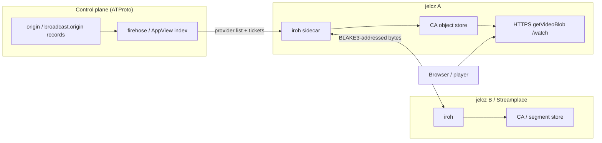

# Jelcz P2P Peership

Turn multiple `jelcz` (and optionally Streamplace) nodes from **independent
HTTPS mirrors** into a **fan-out peer network**: discover who holds which
content-addressed video bytes, fetch over a P2P transport when useful, verify
into the local CA store, and re-announce so others can pull from us.

This workstream is the detailed reopen path for [workstream 12 Phase
11](12-content-addressed-video.md) (peer transports). It does **not** replace
[workstream 15](15-streamplace-vod-peership.md) (HTTPS `getVideoBlob` peership);
WS15 remains the always-on fallback and browser-facing serve path.

Upstream playbook (Streamplace):
[How Streamplace Works: Syndication](https://blog.stream.place/3m3ngytdrws2k)
— firehose `place.stream.broadcast.origin` records (tracker-like, with
`irohTicket`) → iroh node↔node segment copy → re-publish origins → honor
`place.stream.metadata.distributionPolicy`. Related:
[S2PA and MUXL](https://blog.stream.place/3mfd2zatm4c2s),
[Signing and Segmentation](https://blog.stream.place/3lvjz5qno7k26).

Garazyk context: [ADR 0036](../../adr/0036-content-addressed-video-distribution.md),
[video discovery guide](../../20-explanation/guides/video-discovery-and-peer-sharing-options.md).

## Status (2026-08-21; source review plus dated Track A lab evidence)

**Phases 0–3 complete. Phase 1 ADR accepted ([ADR 0038](../../adr/0038-jelcz-p2p-layering.md)).**
Phase 4 Track A is **complete for the narrow lab exception**. The Track B
compatibility decision is approved and implemented as source/static evidence;
Track B remains blocked on its own dated pinned-image live acceptance in
[phase-36](../prompts/phase-36-ws16-streamplace-iroh-bridge.md).
Scenario 100 supplies the dated Track A transport proof; it does not supply
Track B or production-promotion evidence.

**Research (2026-08-13):**
[`docs/archive/planning/2026-08-13-phase-35-iroh-sidecar-research.md`](../../archive/planning/2026-08-13-phase-35-iroh-sidecar-research.md)
— Garazyk CA/VOD (`iroh-blobs`, iroh 1.x) and Streamplace live
(`/iroh/streamplace/1`, NodeTicket) are **separate protocols**; two sidecar
binaries, not one.

Execution prompts:
[phase-35](../prompts/phase-35-ws16-iroh-sidecar.md) (Track A),
[phase-36](../prompts/phase-36-ws16-streamplace-iroh-bridge.md) (Track B).

### Evidence boundary

The worktree contains both Track implementations and their acceptance
procedures. Track A S7–S11 are complete: the 2026-08-21 fresh Compose lab
passed Scenario 100 12/0 with one explicit scope skip and the S10 report
measured independent 1 MiB HTTP and iroh fresh misses plus verified CA-store
warm hits. The canonical Docker lab is HTTP internally (`SP_SECURE=false`), so
it proves neither HTTPS nor true TLS, direct-versus-relay routing, wire bytes,
production demand, nor production cost justification. Track B has source,
static, focused-test, and fault-topology evidence only; it has no dated
Scenario 101 live acceptance.

## Decision (locked for this workstream)

| Decision | Choice |
| --- | --- |
| Discovery control plane | ATProto records + firehose/AppView index (`cid` / stream → providers). **Not** IPNI, **not** a Garazyk-owned DHT. |
| Live Streamplace shape | Consume / optionally emit `place.stream.broadcast.origin` (`irohTicket`, `server`, `streamer`, heartbeat `updatedAt`). |
| Garazyk VOD shape | Prefer `tools.garazyk.video.origin` (+ optional ticket field via ADR) for MASL `/watch` assets; do not adopt `place.stream.video` as primary VOD NSID (ADR 0036). |
| Transport | **Two sidecar tracks** (see research): Track A = `iroh-blobs` on iroh 1.x for Garazyk CA/VOD; Track B = Streamplace `/iroh/streamplace/1` on iroh 0.9x ecosystem. No link-time iroh in MediaCore. |
| Track B compatibility | Separate pin-specific bridge reproduces Streamplace revision `5ba597dbedda8f2fdb84b815ee633301212f5f51`; its custom `ProtocolHandler` binds `RecvSegment.from` to authenticated QUIC `remote_node_id`, because the upstream generic handler discards that identity. |
| Byte trust | Untrusted peers; BLAKE3/BDASL (and Bao range proofs where needed) before CA put — same Phase 10 resolver contract. |
| Browser path | Production design: browser talks HTTPS to a jelcz (or Streamplace) origin. P2P is **node↔node** backfill into CA. The canonical Docker lab uses HTTP and does not assert TLS. |
| IPFS | Rejected (ADR 0036); do not reopen. |
| Short-form WebRTC swarm | Out of scope (structurally dead per WS12 / ADR 0037). |

## Non-goals

- Replacing WS15 HTTPS mirror fetch
- Browser↔browser WebRTC VOD
- Becoming a Streamplace binary, indexer, or chat host
- Link-time Rust/iroh inside the ObjC static libraries
- Cross-asset Willow/RBSR catalog sync (deferred; possession bitmaps +
  manifest CID compare first — see discovery guide)
- Auto-enrolling every jelcz as a public CDN without consent policy

## Architecture (target)



**Possession model** (do not invent set-reconciliation on the hot path):

| Question | Answer |
| --- | --- |
| Same asset version? | Compare manifest CID |
| Which segments of this asset? | Bitmap over manifest-ordered indices (~hundreds of bytes) |
| Which assets does this mirror hold? | Later / optional RBSR over CID keyspace |

## Owner boundaries

| Concern | Owner |
| --- | --- |
| CA verify/put + mirror resolver seam | `Garazyk/Sources/MediaCore` (`ATProtoCAMirrorResolver` / `ATProtoCAMirrorFetching`) |
| Origin record parse + provider ranking | jelcz / Video helpers (composition), optional AppView indexer later |
| iroh sidecar binary + IPC | **Track A:** `tools/jelcz-iroh-blobs-sidecar/` (iroh 1.x). **Track B:** `tools/jelcz-streamplace-iroh-bridge/`, a default-off, receive-only bridge for the pinned Streamplace 0.93 ecosystem. Local IPC is loopback/UDS; the Track B Compose service has no published host port. Track A's private service-name HTTP remains limited to `JELCZ_IROH_SIDECAR_TRUST_LAN=1` lab use. |
| Publishing origins (server DID + repo write) | Needs a Garazyk-operated server identity path (embedded/static PDS pattern or operator-configured repo) — **explicit design in Phase 2** |
| Consent / allowlists | Honor `tools.garazyk.video.distributionPolicy` and Streamplace `place.stream.metadata.distributionPolicy`; operator env analogous to `SP_ALLOWED_STREAMS` |
| Admin / demo observability | jelcz admin Distribution + peer demo UI (peer source: `ca-store` / `https-mirror` / `iroh-peer`) |

## Dependency order

```text
WS12 Phases 1–10 (done) ──► WS15 HTTPS peership (done / demo)
         │                         │
         └──────────► WS16 Phase 0–2 (this plan: discovery + identity)
                                   │
                    blocked ──► Phase 4+ iroh sidecar + live mesh demos
```

## Phases

### Phase 0 — Governance and reopen criteria

**Status:** DONE (2026-08-12).

- Mega-plan item 16 + README row; cross-links from WS12 Phase 11, WS15, ADR 0036,
  discovery guide.
- Reopen criteria recorded under [Blocked on](#blocked-on).
- Deciduous goal #403.

### Phase 1 — ADR: P2P layering for Garazyk video

**Status:** DONE (2026-08-13) — [ADR 0038](../../adr/0038-jelcz-p2p-layering.md).

Frozen: origin-record control plane; HTTPS default + iroh sidecar data plane;
additive `irohTicket` / `httpsBase` on `tools.garazyk.video.origin`; announce
via remote PDS write (Option A); threat model; iroh gate = production evidence.

### Phase 2 — Provider discovery without P2P transport

**Status:** DONE (2026-08-12).

Delivered:

1. **`GZJelczPeerProviderIndex`** — parse `place.stream.broadcast.origin`,
   `tools.garazyk.video.origin`, `place.stream.media.origin`; rank by
   `updatedAt`/`lastSeenAt`; merge bootstrap + `JELCZ_PEER_HTTPS_PROVIDERS`.
2. **Consent stub** — empty `JELCZ_P2P_ALLOWED_STREAMERS` /
   `JELCZ_P2P_ALLOWED_BROADCASTERS` denies auto-ingest of origin records;
   `*` or explicit DIDs allow. Env peer bases always apply.
3. **Optional `JELCZ_PEER_ORIGINS_JSON`** file + demo
   `POST /demo/streamplace/api/origins`.
4. **Multi-jelcz HTTPS mesh** —
   `scripts/demo/jelcz_https_mesh_demo.sh` (A seed → B `pull-peer` → B local
   serve). Demo APIs: `/api/providers`, `/api/seed`, `/api/pull-peer`.
5. UI shows HTTPS peer list from stats.

**Evidence (2026-08-12):**
- `JelczPeerProviderIndexTests` 9/0 (`-XCTest JelczPeerProviderIndexTests --gated=run`)
- Mesh script OK: `peered-verified` from `http://127.0.0.1:2586` → B CA → 200
  `getVideoBlob` byte-identical

**Rollback:** unset `JELCZ_PEER_HTTPS_PROVIDERS` / origins JSON; single WS15
base remains.

### Phase 3 — Server identity for announcing

**Status:** DONE (2026-08-13).

**Decision:** operator-configured **remote PDS write** (Option A). Embedded PDS
in jelcz deferred. Admin/demo announce API wraps the same write path.

**Delivered:**

1. **`GZJelczOriginAnnouncer`** — `createSession` + `putRecord` /
   `deleteRecord` for `tools.garazyk.video.origin` via injected HTTP client.
2. Record builder includes additive `irohTicket` / `httpsBase` (lexicon already
   revised; ADR 0038).
3. Flag-gated wiring: `JELCZ_ORIGIN_ANNOUNCE=1` +
   `JELCZ_ORIGIN_ANNOUNCE_IDENTIFIER` / `_APP_PASSWORD` (+ optional
   `_PDS_URL`, `_SERVER_DID`, `_HTTPS_BASE`, `_IROH_TICKET`).
4. Demo APIs: `POST /demo/streamplace/api/announce-origin`,
   `POST /demo/streamplace/api/retract-origin`.

**Implementation evidence:** `JelczOriginAnnouncerTests` cover the client and
record construction. `jelcz_origin_announce_smoke.sh` defines a local-PDS
announce → getRecord → retract procedure. No dated current run artifact is
recorded here for Docker PDS announce/discovery or cross-PDS federation, so
neither is claimed as live evidence.

**Rollback:** unset `JELCZ_ORIGIN_ANNOUNCE` → pull-only peering (Phase 2).

### Phase 4 — Track A: iroh-blobs sidecar (CA/VOD)

**Status:** complete (2026-08-21) for the narrow Track A lab exception in
[ADR 0038 §6.1](../../adr/0038-jelcz-p2p-layering.md). Production
cost-justification remains a separate promotion gate.

Deliverables ([phase-35](../prompts/phase-35-ws16-iroh-sidecar.md) S0–S11):

#### Track A contracts (frozen 2026-08-13, S1)

| Contract | Choice |
| --- | --- |
| Binary | `tools/jelcz-iroh-blobs-sidecar/` |
| iroh stack | Exactly locked **iroh 1.x** + compatible **iroh-blobs** (lab: current 1.x; production maturity = separate gate) |
| Content identity | Garazyk CA CID ↔ fixture-proven 32-byte BLAKE3 ↔ iroh `Hash` |
| Provider identity | Stable **EndpointID**; optional bootstrap **EndpointTicket** |
| Garazyk origin fields | Additive `irohEndpointId`, `irohEndpointTicket`; deprecate P2P use of legacy `irohTicket` on Garazyk origins |
| IPC | UDS preferred; versioned `GET /v1/health`, `GET /v1/identity`, `POST /v1/fetch`, `POST /v1/offer`; **no** tickets in query strings |
| Integrity | Sidecar stages bytes → `ATProtoCAMirrorResolver` verifies → CA put |
| Flags | `JELCZ_P2P=0` default; `JELCZ_IROH_SIDECAR_URL` or UDS path |

1. Separate Rust binary `tools/jelcz-iroh-blobs-sidecar/` on locked **iroh 1.x
   + iroh-blobs** (not Streamplace 0.9x).
2. UDS/loopback IPC: versioned `POST /v1/fetch` with EndpointID + CA CID; **no**
   tickets in query strings.
3. Cross-language **CID ↔ BLAKE3 ↔ iroh Hash** fixtures before network code.
4. `ATProtoCAMirrorFetching` adapter; resolver verifies before CA put.
5. Garazyk origin fields: prefer `irohEndpointId` + optional bootstrap ticket —
   do **not** overload Streamplace `irohTicket` semantics.
6. Flags: `JELCZ_P2P=0` default off; sidecar URL/UDS path env.
7. Two-node lab demo; security limits + consent before dial.
8. Boundary check: ObjC tree stays free of iroh link deps.

**Available verification:** focused hash-mapping, sidecar-fetcher,
mirror-integrity, and P2P-configuration tests; the sidecar crate test suite;
`jelcz_iroh_sidecar_smoke.sh`; and the Compose assertion procedure in
[Scenario 100](../../../scripts/scenarios/scenarios/100_jelcz_iroh_peership.ts).
The project-scoped Compose smoke and Scenario 100 now provide dated S7
transport evidence (12 passing steps and one explicit scope skip). S8
(origin announce) is **complete 2026-08-14**: `tools.garazyk.video.origin`
lexicon extended with `irohEndpointId` + optional `irohEndpointTicket`;
`GZJelczOriginAnnouncer` factory updated; `JelczOriginAnnouncerTests` 6/6.
S9 is complete: progress-driven cancellation and bounded staging protect the
sidecar, and its Rust and focused Objective-C negative tests passed. On
2026-08-21, a fresh Compose rebuild corrected the Linux `libatomic.so.1`
runtime dependency, Scenario 100 passed 12/0 with one explicit Track B scope
skip, and the S10 report recorded fresh-miss/warm-hit evidence for both HTTP
and iroh. S11 is therefore complete for Track A lab scope.
**Rollback:** flag off → HTTPS-only.

### Phase 5 — Track B: Streamplace live mesh (opt-in)

**Status:** blocked. The maintainer-approved compatibility decision is present
as source/static evidence; Phase 35 is still in progress and no dated real-peer
acceptance against the required pinned Streamplace image has been recorded.

Deliverables ([phase-36](../prompts/phase-36-ws16-streamplace-iroh-bridge.md)):

- Separate pin-specific binary reproducing Streamplace's
  `/iroh/streamplace/1` wire at revision
  `5ba597dbedda8f2fdb84b815ee633301212f5f51` (Subscribe by streamer DID,
  pushed MUXL segments).
- Consume real `place.stream.broadcast.origin.irohTicket` (**NodeTicket** only).
- Bind `RecvSegment.from` to the authenticated QUIC `remote_node_id` in a
  custom `ProtocolHandler`; do not use the upstream generic handler, which
  loses that identity.
- Honor `distributionPolicy` / `JELCZ_P2P_ALLOWED_STREAMERS`.
- Keep the bridge default-off with loopback/UDS local IPC and no published
  Compose port; require a per-run bearer capability on subscription IPC.
- **Do not** require Streamplace website listing.

**Static implementation evidence (2026-08-13):**
`tools/jelcz-streamplace-iroh-bridge/` declares the immutable source revision,
exact ALPN, NodeTicket parsing, bounded receive-only transport, and the custom
identity-binding handler. Its Compose override connects Jelcz A/B/C to the
unpublished bridge over capability-protected, explicitly lab-trusted private
HTTP. [Scenario 101](../../../scripts/scenarios/scenarios/101_streamplace_track_b_live_iroh.ts)
checks the private, opt-in Compose profile and requires a pinned OCI revision,
real origin/firehose record, consent, NodeID binding, valid MUXL, and negative
cases. This was source-reviewed only; no dated live run is claimed.

**Acceptance evidence required:** a dated opt-in Scenario 101 pass against the
pinned image after Phase 35 completes. The bridge now atomically persists
bridge-owned session evidence, and `acceptance-report --json` reads that
running-process state and fails closed until a capability-bound Jelcz
attestation matches the exact session, ticket fingerprint, byte count, and
content SHA-256. Scenario 101 independently proves the causal firehose
commit/CAR and Track A exclusion. It also uses private pin-specific fault peers
for wrong streamer, wrong ALPN, authenticated `from` spoof, corrupt MUXL,
oversize segment, and dropped-Subscribe retry exhaustion. Isolated stale and
malformed origin cases use capability-protected whole-fixture replacement and
prove that bridge session evidence remains unchanged. Locked/offline `cargo
check` and all 17 Rust library tests passed on 2026-08-13; the crate target was
removed afterward. The executable matrix has not yet run against the required
pinned Streamplace image, so no live acceptance is claimed.
Direct Scenario 101 check/lint/format, 28 Hamownia metadata/preflight tests,
the static Compose contract, module boundaries, VideoService compilation, and
the focused peer-demo test object pass. Follow-up verification rebuilt two
interrupted static archives (`ATProtoServices` 31/117 → 117/117 and
`ATProtoAppViewServer` 3/29 → 29/29), after which the complete `AllTests` target
and all dependent binaries link. The bridge and peer-demo XCTest classes pass
17/17. The native registration audit passes after correcting the stale
`SessionStoreTests` entry, and `PDSSessionStoreTests` passes 24/24. Full Deno
check/lint/test also pass (1,271 passed, 0 failed, 1 ignored) after regenerating
the checked-in Gruszka client and removing a stale Schemat test import. A full
native gated run was started but interrupted after its integration fixtures
slowed to 8–10 seconds per method, so no completed global `AllTests --gated=run`
result is claimed.
Track A/iroh-blobs evidence cannot substitute for this protocol-specific
acceptance.
**Rollback:** disable Track B; jelcz↔jelcz Track A and HTTPS remain.

### Phase 6 — VOD origins + observability (Track A completion)

**Status:** pending. Depends on Phase 4 Track A.

- Map MASL/BDASL object CIDs onto iroh-blobs fetch keys (via S2 fixtures).
- Optional possession bitmap exchange between known peers (deferred RBSR).
- Extend `tools.garazyk.video.origin` with EndpointID/bootstrap fields.
- Admin + demo: peer source mix (`ca-store` / `https-mirror` / `iroh-blobs`).

**Gate:** two jelcz nodes, one seeds VOD object, second backfills via Track A
then serves browser over HTTPS.
**Rollback:** VOD stays on WS15 HTTPS.

### Phase 7 — Hardening and ops

**Status:** pending.

- Ticket TTL / stale origin eviction; rate limits; egress accounting DID.
- Metrics: dial success, bytes by source, verify failures, peer churn.
- Chaos: kill origin mid-play → failover to second peer or HTTPS.
- Security review (sidecar attack surface, SSRF via tickets, consent bypass).
- Docs: operator guide for multi-node + optional Streamplace mesh.

## Blocked on

**Track A (Phase 4): complete for the lab exception (2026-08-21).** The fresh
isolated local Compose lab rebuilt from the current image after installing
`libatomic1`, passed Scenario 100 (12/0 plus its explicit Track B scope skip),
and wrote the S10 measurement at
`scripts/scenarios/reports/measurements/2026-08-21T162856617z-jelcz-track-a-s10.json`.
For 1 MiB payloads, HTTP measured 41.876 ms fresh / 11.742 ms warm and iroh
measured 58.006 ms fresh / 3.499 ms warm; both warm results were `ca-store`
and both fresh transfers were BLAKE3 verified. Wire bytes and direct-versus-
relay remain intentionally unobservable from the public contract. The Crimson
VM remains unsuitable for this lab at 3.0 GiB free, but it was not needed.

**Production promotion** still requires:

1. **Production CA VOD** — dated production `/watch` (or WS15 compat) traffic.
2. **Origin bandwidth / cache-miss measurements** — evidence P2P beats HTTPS
   mirrors/CDN enough to justify operational complexity.

**Track B (Phase 5)** compatibility is decided: the separate, pin-specific
bridge reproduces the wire at Streamplace revision
`5ba597dbedda8f2fdb84b815ee633301212f5f51` and binds segment identity to the
authenticated QUIC peer. It remains blocked on a dated successful pinned-image
[Scenario 101](../../../scripts/scenarios/scenarios/101_streamplace_track_b_live_iroh.ts)
run; no such run is recorded.

The current live-readiness audit also requires digest-pinned Streamplace,
publisher, and bridge images; the Streamplace container must carry OCI revision
`5ba597dbedda8f2fdb84b815ee633301212f5f51`. The static checker and Scenario 101
now fail closed unless all three image references are SHA-256 digests, and the
scenario records them as provenance. The host still needs a local PDS/relay
firehose on ports 2583/2584, nonempty bridge/demo capabilities, the configured
streamer DID, and enough disk to build or pull the pinned images. None of those
live inputs is present in the current Track A-only topology.

The bridge's authenticated transport, local IPC, atomic persistent evidence,
and single-use bounded Jelcz attestation are implemented. Scenario 101 owns the
firehose proof rather than trusting a bridge boolean. One reproducibility code
gap was closed on 2026-08-13 by enforcing all three image digests in the static
checker and Scenario 101. The remaining inputs are the pinned live Streamplace
image/publisher run and its full positive and fault matrix. Locked/offline Rust
compilation and 17/17 library tests passed on
2026-08-13. No dated live Scenario 101 pass is recorded.

Phase 3 identity — **DONE**.

## Verification (global)

```bash
./scripts/dev/check_module_boundaries.sh .
cmake --build build --target AllTests --parallel 4
./build/tests/AllTests -XCTest 'JelczPeerProviderIndexTests' --gated=run
./build/tests/AllTests --filter 'JelczStreamplace*' --gated=run
# Host mesh (leaves two jelcz processes running):
./scripts/demo/jelcz_https_mesh_demo.sh
# Docker: Streamplace + ATProto + 3× jelcz (see docker/streamplace-peership/README.md):
./scripts/demo/streamplace_peership_up.sh
./scripts/demo/streamplace_peership_smoke.sh
# Optional Docker jelcz-a announce → PDS read-back → retract proof:
./scripts/demo/streamplace_peership_federation_smoke.sh
# The Compose lab must already be running; Scenario 100 skips otherwise.
JELCZ_PEERSHIP_LAB=1 deno task hamownia run --no-setup 100
# Operator guide: docs/20-explanation/guides/streamplace-jelcz-peership-lab.md
```

The Compose smoke and Scenario 100 use freshly generated payloads and require
the destination to return 404 before each transport pull. They then require
`peered-verified`, the expected `peerSource` (`http-peer` or `iroh-peer`),
`blake3Verified=true`, and byte-equal local `getVideoBlob` output. If the
Docker wrapper generated its required capabilities, run its printed validated
runtime-loader command before either command. These commands do not prove
the optional public catalog, deterministic Streamplace VOD, TLS, origin
announce/discovery, or federation. The separate federation smoke is the
Docker-PDS acceptance procedure; it is evidence only when a dated run succeeds.

**Dated lab evidence (2026-08-13):** the isolated
`codex-peership-verify` project passed the shell smoke and Hamownia Scenario 100
passed 12 steps with one explicit scope skip. The report path was
`scripts/scenarios/reports/runs/2026-08-13t2257z-82379/reports/100_jelcz_iroh_peership.json`.
The optional federation smoke was invoked, but stopped before mutation because
`http://127.0.0.1:2583` had no reachable PDS. This closes the live Track A
HTTP/iroh transport proof, not the production promotion gate: quantitative
origin/cache-miss measurements and Track A security closeout remain
outstanding. The complete native target now links; the interrupted full
`AllTests --gated=run` execution is still not claimed green.

**2026-08-13 S9 security checkpoint:** protected sidecar routes require a
per-project bearer capability; the Compose wrapper stores it with the demo
capability in a non-printed `0600` runtime file whose parser rejects symlinks,
unsafe permissions, and unexpected records; and Jelcz sends it on identity,
offer, and fetch calls. `trustLan` now admits only loopback plus the exact
`iroh-a`, `iroh-b`, and `iroh-c` Compose service names. Fetches use two-request
admission and a 60-second timeout. These changes pass Rust formatting, shell
syntax, Compose interpolation, diff checks, and compilation of
`ATProtoVideoService`, `jelcz`, and the four touched Objective-C test objects.
The follow-up security re-audit found no residual issue in those remediated
surfaces.
**2026-08-15 S9 completion:** The Rust sidecar now uses progress-driven cancellation and bounded staging to safely reject oversized blobs before memory exhaustion. The Rust crate tests and focused Objective-C negative tests (`testBoundedByteLimitRejectsInvalidValues`) both pass, completing the S9 security limits slice.
The 2026-08-21 local Compose rebuild and S10 collection close the remaining
Track A live-lab gates; the older Crimson capacity restriction does not affect
that local evidence.

**2026-08-13 S10 measurement attempt (not evidence):** the new
`scripts/demo/jelcz_track_a_s10_measurement.ts` collector passed format and
type checks but correctly refused to write a report against the existing
isolated lab. The source's response to
`POST /demo/streamplace/api/seed?fanout=0` contained `meshFanout` instead of
`meshFanoutSuppressed=true`, so its older jelcz image had already populated the
HTTP and iroh destinations. That violates the fresh-miss prerequisite. Rebuild
only a fresh isolated Track A lab from the current image before retrying; S10
is still pending and no quantitative result is claimed.

Env (Phase 2):

| Variable | Role |
| --- | --- |
| `JELCZ_PEER_HTTPS_PROVIDERS` | Comma-separated peer bases (always trusted) |
| `JELCZ_PEER_ORIGINS_JSON` | Path to JSON array/`{origins:[…]}` of origin records |
| `JELCZ_P2P_ALLOWED_STREAMERS` | Consent; empty=deny auto-ingest; `*`=allow all |
| `JELCZ_P2P_ALLOWED_BROADCASTERS` | Same for broadcaster/server DIDs |

Track A iroh sidecar (lab, default off — see
[streamplace-jelcz-peership-lab.md](../../20-explanation/guides/streamplace-jelcz-peership-lab.md)):

| Variable | Role |
| --- | --- |
| `JELCZ_P2P` | Opt-in Track A iroh mirror fetch (default off) |
| `JELCZ_IROH_SIDECAR_URL` | Loopback HTTP IPC to `jelcz-iroh-blobs-sidecar` |
| `JELCZ_IROH_PROVIDER_ENDPOINT_ID` | Bootstrap provider EndpointID |
| `JELCZ_IROH_PROVIDER_ENDPOINT_TICKET` | Optional bootstrap ticket |
| `JELCZ_IROH_SIDECAR_TRUST_LAN` | Compose-lab-only permission for private sidecar service-name URLs; unset for standalone loopback-only IPC |
| `JELCZ_IROH_SIDECAR_CAPABILITY` | Required bearer capability for identity, offer, and fetch; the Compose wrapper generates it in the private project runtime file when blank |
| `JELCZ_DEMO_API_TOKEN` | Required in Docker (the wrapper generates a 0600 project runtime env file when blank); optional only for standalone demo compatibility |

Docker config is copied from `docker/streamplace-peership/.env.example`. Its
Streamplace image is pinned to
`oci.stream.place/streamplace@sha256:d2b79900b03eb6a964961bc9df0423492ea8b83602f7d3c2f4b7c7a66dbf8776`
as reviewed on 2026-08-13. `LAB_BIND_ADDRESS=127.0.0.1` is the default for
published host ports; it does not turn the internal HTTP lab into TLS.

## Relationship to existing work

| Workstream / ADR | Relationship |
| --- | --- |
| WS12 Phase 11 | This plan is the reopen + execution detail; Phase 11 stays closed-not-pursued for iroh until [Blocked on](#blocked-on) clears |
| WS15 | Prerequisite HTTPS path; remains fallback and browser serve |
| ADR 0036 | Byte model + untrusted mirrors; P2P is another untrusted origin class |
| Discovery guide | Phase ladder 2→5; this workstream implements steps 2 (multi-provider), 3 (consent), 5 (iroh) |

## References

- Research: [`2026-08-13-phase-35-iroh-sidecar-research.md`](../../archive/planning/2026-08-13-phase-35-iroh-sidecar-research.md)
- Streamplace syndication blog: https://blog.stream.place/3m3ngytdrws2k
- Lexicon: `Garazyk/Resources/lexicons/place/stream/broadcast/origin.json`
- Lexicon: `Garazyk/Resources/lexicons/tools/garazyk/video/origin.json`
- iroh: https://iroh.computer/
- Optional identity binding notes: https://mfzx.net/drafts/iroh-with-atp
