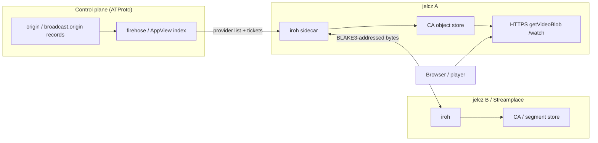

# Jelcz P2P Peership

Turn multiple `jelcz` (and optionally Streamplace) nodes from **independent
HTTPS mirrors** into a **fan-out peer network**: discover who holds which
content-addressed video bytes, fetch over a P2P transport when useful, verify
into the local CA store, and re-announce so others can pull from us.

This workstream is the detailed reopen path for [workstream 12 Phase
11](12-content-addressed-video.md) (peer transports). It does **not** replace
[workstream 15](15-streamplace-vod-peership.md) (HTTPS `getVideoBlob` peership);
WS15 remains the always-on fallback and browser-facing serve path.

Upstream playbook (Streamplace):
[How Streamplace Works: Syndication](https://blog.stream.place/3m3ngytdrws2k)
— firehose `place.stream.broadcast.origin` records (tracker-like, with
`irohTicket`) → iroh node↔node segment copy → re-publish origins → honor
`place.stream.metadata.distributionPolicy`. Related:
[S2PA and MUXL](https://blog.stream.place/3mfd2zatm4c2s),
[Signing and Segmentation](https://blog.stream.place/3lvjz5qno7k26).

Garazyk context: [ADR 0036](../../adr/0036-content-addressed-video-distribution.md),
[video discovery guide](../../20-explanation/guides/video-discovery-and-peer-sharing-options.md).

## Status (2026-08-13)

**Phases 0–2 complete. Phase 1 ADR accepted ([ADR 0038](../../adr/0038-jelcz-p2p-layering.md)).**
Phase 3 (remote-PDS origin announce) is the next implementation slice.
Phases 4+ (iroh sidecar / live Streamplace mesh) remain **blocked** on
[## Blocked on](#blocked-on) unless an explicit lab exception is recorded.

## Decision (locked for this workstream)

| Decision | Choice |
| --- | --- |
| Discovery control plane | ATProto records + firehose/AppView index (`cid` / stream → providers). **Not** IPNI, **not** a Garazyk-owned DHT. |
| Live Streamplace shape | Consume / optionally emit `place.stream.broadcast.origin` (`irohTicket`, `server`, `streamer`, heartbeat `updatedAt`). |
| Garazyk VOD shape | Prefer `tools.garazyk.video.origin` (+ optional ticket field via ADR) for MASL `/watch` assets; do not adopt `place.stream.video` as primary VOD NSID (ADR 0036). |
| Transport | **iroh sidecar process** (QUIC, dial-by-ticket/key, NAT traversal). No link-time iroh in MediaCore; no MediaCore→Network PUBLIC edge for this. |
| Byte trust | Untrusted peers; BLAKE3/BDASL (and Bao range proofs where needed) before CA put — same Phase 10 resolver contract. |
| Browser path | Unchanged: browser talks HTTPS to a jelcz (or Streamplace) origin. P2P is **node↔node** backfill into CA. |
| IPFS | Rejected (ADR 0036); do not reopen. |
| Short-form WebRTC swarm | Out of scope (structurally dead per WS12 / ADR 0037). |

## Non-goals

- Replacing WS15 HTTPS mirror fetch
- Browser↔browser WebRTC VOD
- Becoming a Streamplace binary, indexer, or chat host
- Link-time Rust/iroh inside the ObjC static libraries
- Cross-asset Willow/RBSR catalog sync (deferred; possession bitmaps +
  manifest CID compare first — see discovery guide)
- Auto-enrolling every jelcz as a public CDN without consent policy

## Architecture (target)



**Possession model** (do not invent set-reconciliation on the hot path):

| Question | Answer |
| --- | --- |
| Same asset version? | Compare manifest CID |
| Which segments of this asset? | Bitmap over manifest-ordered indices (~hundreds of bytes) |
| Which assets does this mirror hold? | Later / optional RBSR over CID keyspace |

## Owner boundaries

| Concern | Owner |
| --- | --- |
| CA verify/put + mirror resolver seam | `Garazyk/Sources/MediaCore` (`ATProtoCAMirrorResolver` / `ATProtoCAMirrorFetching`) |
| Origin record parse + provider ranking | jelcz / Video helpers (composition), optional AppView indexer later |
| iroh sidecar binary + IPC | New process under `Garazyk/Binaries/` or `tools/` (Rust or vendored iroh CLI); ObjC talks over localhost HTTP/UDS |
| Publishing origins (server DID + repo write) | Needs a Garazyk-operated server identity path (embedded/static PDS pattern or operator-configured repo) — **explicit design in Phase 2** |
| Consent / allowlists | Honor `tools.garazyk.video.distributionPolicy` and Streamplace `place.stream.metadata.distributionPolicy`; operator env analogous to `SP_ALLOWED_STREAMS` |
| Admin / demo observability | jelcz admin Distribution + peer demo UI (peer source: `ca-store` / `https-mirror` / `iroh-peer`) |

## Dependency order

```text
WS12 Phases 1–10 (done) ──► WS15 HTTPS peership (done / demo)
         │                         │
         └──────────► WS16 Phase 0–2 (this plan: discovery + identity)
                                   │
                    blocked ──► Phase 3+ iroh sidecar + mesh demos
```

## Phases

### Phase 0 — Governance and reopen criteria

**Status:** DONE (2026-08-12).

- Mega-plan item 16 + README row; cross-links from WS12 Phase 11, WS15, ADR 0036,
  discovery guide.
- Reopen criteria recorded under [Blocked on](#blocked-on).
- Deciduous goal #403.

### Phase 1 — ADR: P2P layering for Garazyk video

**Status:** DONE (2026-08-13) — [ADR 0038](../../adr/0038-jelcz-p2p-layering.md).

Frozen: origin-record control plane; HTTPS default + iroh sidecar data plane;
additive `irohTicket` / `httpsBase` on `tools.garazyk.video.origin`; announce
via remote PDS write (Option A); threat model; iroh gate = production evidence.

### Phase 2 — Provider discovery without P2P transport

**Status:** DONE (2026-08-12).

Delivered:

1. **`GZJelczPeerProviderIndex`** — parse `place.stream.broadcast.origin`,
   `tools.garazyk.video.origin`, `place.stream.media.origin`; rank by
   `updatedAt`/`lastSeenAt`; merge bootstrap + `JELCZ_PEER_HTTPS_PROVIDERS`.
2. **Consent stub** — empty `JELCZ_P2P_ALLOWED_STREAMERS` /
   `JELCZ_P2P_ALLOWED_BROADCASTERS` denies auto-ingest of origin records;
   `*` or explicit DIDs allow. Env peer bases always apply.
3. **Optional `JELCZ_PEER_ORIGINS_JSON`** file + demo
   `POST /demo/streamplace/api/origins`.
4. **Multi-jelcz HTTPS mesh** —
   `scripts/demo/jelcz_https_mesh_demo.sh` (A seed → B `pull-peer` → B local
   serve). Demo APIs: `/api/providers`, `/api/seed`, `/api/pull-peer`.
5. UI shows HTTPS peer list from stats.

**Evidence (2026-08-12):**
- `JelczPeerProviderIndexTests` 9/0 (`-XCTest JelczPeerProviderIndexTests --gated=run`)
- Mesh script OK: `peered-verified` from `http://127.0.0.1:2586` → B CA → 200
  `getVideoBlob` byte-identical

**Rollback:** unset `JELCZ_PEER_HTTPS_PROVIDERS` / origins JSON; single WS15
base remains.

### Phase 3 — Server identity for announcing

**Status:** pending (decision locked in ADR 0038).

**Decision:** operator-configured **remote PDS write** (Option A). Embedded PDS
in jelcz deferred. Admin announce API may wrap the same write path.

**Deliverable:** flag-gated publish/heartbeat/retract of
`tools.garazyk.video.origin` (and optional Streamplace-shaped
`broadcast.origin` when policy allows) using configured PDS credentials +
server DID. Lexicon additive `irohTicket` / `httpsBase` land with this phase.
**Gate:** create/update/delete one origin record against a test PDS.
**Rollback:** pull-only peering (Phase 2) without announce.

### Phase 4 — iroh sidecar MVP

**Status:** pending. **Blocked on** [production reopen criteria](#blocked-on)
unless an explicit exception is recorded.

Deliverables:

1. Sidecar process wrapping iroh (ticket listen + fetch-by-hash/CID mapping
   documented against Streamplace’s segment addressing).
2. Localhost IPC: jelcz asks sidecar `GET /peer/blob?cid=` → bytes or
   range; sidecar never writes CA directly.
3. `ATProtoCAMirrorFetching` adapter that prefers sidecar when ticketed
   providers exist, else HTTPS (WS15 / RASL).
4. Feature flags: `JELCZ_P2P=0` default off; `JELCZ_IROH_SIDECAR_URL=…`.
5. Boundary check: ObjC tree stays free of iroh link deps.

**Evidence:** sidecar unit/integration tests with two local endpoints;
hostile bytes rejected by resolver; module boundary script green.
**Rollback:** flag off → HTTPS-only.

### Phase 5 — Live Streamplace mesh interoperability (opt-in)

**Status:** pending. Depends on Phase 4.

- Consume real `irohTicket` values from public/staging Streamplace origins.
- Optionally publish Garazyk origin tickets into the same lexicon when
  Phase 3 identity exists and policy allows.
- Honor `distributionPolicy` / `SP_ALLOWED_STREAMS`-equivalent env
  (`JELCZ_P2P_ALLOWED_STREAMERS`).
- **Do not** require Streamplace website listing; operator opt-in only.

**Evidence:** documented opt-in smoke (not default CI) with dated log of
ticket dial + verified segment put.
**Rollback:** disable Streamplace ticket consumption; keep jelcz↔jelcz only.

### Phase 6 — VOD / long-form P2P via Garazyk origins

**Status:** pending. Depends on Phase 4 + Phase 1 ticket field decision.

- Map MASL segment CIDs (or VOD BDASL objects) onto sidecar fetch keys.
- Possession bitmap exchange for “which segments of manifest M?” between
  known peers (avoid full catalog RBSR).
- Extend `tools.garazyk.video.origin` heartbeats with ticket + optional
  possession summary hash.
- Admin + demo: show peer source mix (local CA / HTTPS / iroh).

**Gate:** two jelcz nodes, one seeds VOD object, second plays via P2P put
into CA then local HTTPS to browser.
**Rollback:** VOD stays on WS15 HTTPS.

### Phase 7 — Hardening and ops

**Status:** pending.

- Ticket TTL / stale origin eviction; rate limits; egress accounting DID.
- Metrics: dial success, bytes by source, verify failures, peer churn.
- Chaos: kill origin mid-play → failover to second peer or HTTPS.
- Security review (sidecar attack surface, SSRF via tickets, consent bypass).
- Docs: operator guide for multi-node + optional Streamplace mesh.

## Blocked on

Named inputs before **Phase 4+ implementation** (iroh / live mesh):

1. **Production CA VOD** — at least one deployment serving real `/watch` (or
   WS15 compat) traffic, so P2P is solving a measured cost — *or* an explicit
   operator exception to prototype in lab only (record in ADR + this file).
2. **Origin bandwidth / cache-miss measurements** — enough to justify sidecar
   complexity vs more HTTPS mirrors / CDN.
3. **Phase 3 identity decision** — required before we *announce* (pull-only
   P2P can use others’ tickets without it).

Phases 0–2 are **not** blocked on the above.

## Verification (global)

```bash
./scripts/dev/check_module_boundaries.sh .
cmake --build build --target AllTests --parallel 4
./build/tests/AllTests -XCTest 'JelczPeerProviderIndexTests' --gated=run
./build/tests/AllTests --filter 'JelczStreamplace*' --gated=run
# Host mesh (leaves two jelcz processes running):
./scripts/demo/jelcz_https_mesh_demo.sh
# Docker: Streamplace + ATProto + 3× jelcz (see docker/streamplace-peership/README.md):
./scripts/demo/streamplace_peership_up.sh
./scripts/demo/streamplace_peership_smoke.sh
# Operator guide: docs/20-explanation/guides/streamplace-jelcz-peership-lab.md
```

Env (Phase 2):

| Variable | Role |
| --- | --- |
| `JELCZ_PEER_HTTPS_PROVIDERS` | Comma-separated peer bases (always trusted) |
| `JELCZ_PEER_ORIGINS_JSON` | Path to JSON array/`{origins:[…]}` of origin records |
| `JELCZ_P2P_ALLOWED_STREAMERS` | Consent; empty=deny auto-ingest; `*`=allow all |
| `JELCZ_P2P_ALLOWED_BROADCASTERS` | Same for broadcaster/server DIDs |
## Relationship to existing work

| Workstream / ADR | Relationship |
| --- | --- |
| WS12 Phase 11 | This plan is the reopen + execution detail; Phase 11 stays closed-not-pursued for iroh until [Blocked on](#blocked-on) clears |
| WS15 | Prerequisite HTTPS path; remains fallback and browser serve |
| ADR 0036 | Byte model + untrusted mirrors; P2P is another untrusted origin class |
| Discovery guide | Phase ladder 2→5; this workstream implements steps 2 (multi-provider), 3 (consent), 5 (iroh) |

## References

- Streamplace syndication blog: https://blog.stream.place/3m3ngytdrws2k
- Lexicon: `Garazyk/Resources/lexicons/place/stream/broadcast/origin.json`
- Lexicon: `Garazyk/Resources/lexicons/tools/garazyk/video/origin.json`
- iroh: https://iroh.computer/
- Optional identity binding notes: https://mfzx.net/drafts/iroh-with-atp
