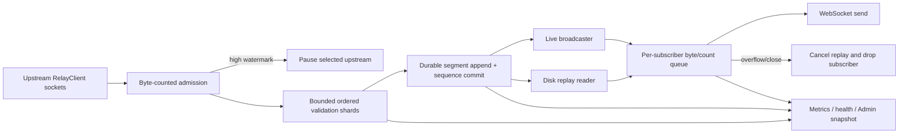

# Zuk relay resource bounds and stream correctness

## Mission

Make `zuk` a protocol-correct relay whose memory, disk, downstream backlog,
validation concurrency, upstream fleet, and log volume remain bounded under
slow consumers, crawl bursts, identity-service latency, and restart. The work
is complete only after a production canary on `bingus` demonstrates a large,
sustained reduction from the 2026-08-13 incident baseline.

[Incident evidence](17-zuk-relay-resource-bounds/incident-evidence.md) records
the measurements, confirmed source findings, open questions, and pinned Indigo
reference. It is supporting evidence; this file is the authoritative backlog.

## Priority and current disposition

| Lane | Priority | Reason |
| --- | --- | --- |
| Phase 37: cursor and replay-loop containment | P0 | Active resource exhaustion and protocol violation |
| Phase 38: bounded ingress and processing | P0 | Unbounded anonymous-memory retention path |
| Phase 39: durable disk replay | P1 | Restart correctness and removal of traffic-history-sized RAM |
| Phase 40: validation and identity efficiency | P1 | Protocol support gap and serial network-bound bottleneck |
| Phase 41: crawl admission, observability, service limits | P1 | Public fleet-growth boundary and truthful operations |
| Phase 42: production canary and closeout | P0 release gate | The resource reduction is not complete without live evidence |

Phases 37 and 38 are incident containment. They may preempt lower-priority
feature work only in a clean, dedicated worktree; they must not be folded into
the active WS16/Phase 35 change. The ordinary prompt loop still owns phase
state. Phase 37 has no dependency on Phase 35 or 36.

## Locked findings and decisions

1. **Omitting `cursor` means live-only.** It must not be translated to cursor
   zero. This is required by the event-stream specification and matches
   Indigo.
2. **Slow consumers remain bounded and disposable.** Do not remove
   `ConsumerTooSlow`, grow output queues until the symptom disappears, or
   retry an entire retained window indefinitely.
3. **Memory is budgeted in bytes, not only object counts.** Event count remains
   a secondary abuse bound because event sizes vary widely.
4. **Backpressure reaches the socket.** A bounded downstream queue that merely
   moves overflow to an unbounded upstream GCD queue is not a fix.
5. **Replay history belongs on disk.** Memory may hold a small hot cache, but
   restartable history and sequence allocation are durable before publish.
6. **Repository ordering is preserved.** Parallel validation may shard by DID
   or upstream, but events for one repository must retain stream order.
7. **Validation modes have honest costs and guarantees.** Strict validates and
   rejects; log-only validates and forwards with rate-limited diagnostics;
   lenient performs only documented cheap checks and must not pretend to have
   verified signatures.
8. **Both P-256 and k256 repository signing keys are supported.** A supported
   ATProto curve cannot be categorized as an invalid signature.
9. **Public crawl is admission-controlled.** Reachability and SSRF checks are
   necessary but do not replace quotas and fleet limits.
10. **Systemd limits are a last guardrail.** Apply them after internal queues
    are bounded so pressure produces throttling or a controlled drop rather
    than a restart loop.

ADR 0012's deliberate future-cursor behavior is not changed in Phase 37. If
that behavior is revisited, amend the ADR in a separate protocol decision; do
not couple it to the omitted-cursor incident fix.

## Scope

### In scope

- downstream `subscribeRepos` cursor and replay semantics;
- producer-visible downstream admission and cancellation;
- relay ingress count/byte budgets and upstream socket pause/resume;
- ordered bounded validation workers and cursor acknowledgement;
- durable output sequence plus segmented disk replay;
- P-256/k256 verification, compact identity caching, and in-flight lookup
  coalescing;
- request-crawl quotas and upstream fleet/account caps;
- Relay metrics, health, Admin UI, NixOS settings, runbooks, and canary gates;
- regression, stress, restart, slow-consumer, and structured scenario evidence.

### Out of scope

- weakening or removing slow-consumer closes;
- changing repository or firehose wire formats;
- copying Indigo wholesale or adopting its production-scale defaults;
- making `zuk` a full Bluesky-network relay in one slice;
- changing AppView or Beskid business behavior beyond exercising their existing
  cursor/reconnect contracts;
- killing the unidentified loopback client without ownership evidence;
- claiming a memory target from unit tests alone.

## Target architecture



The admission budget includes every event accepted from an upstream but not
yet durably processed. Ownership must be explicit: exactly one component owns
each payload at a time, and releasing/cancelling a stage releases its payload.

## Initial resource envelope

These are starting canary values, not immutable product defaults. Phase 37
records real payload distributions; later phases may adjust them with dated
evidence.

| Resource | Initial small-host value | Required behavior at limit |
| --- | ---: | --- |
| Accepted ingress backlog | 2,048 events and 64 MiB encoded bytes globally | Pause contributing upstreams; resume below 1,024 events and 32 MiB |
| Validation workers | 4 ordered shards | No same-DID reordering; no unbounded overflow queue |
| Replay hot cache | 10,000 events and 64 MiB, whichever comes first | Read older events from disk |
| Per-subscriber pending output | 256 frames and 4 MiB | Send one slow-consumer info frame when possible, cancel replay, close |
| Durable replay | 24 hours and 5 GiB, whichever expires first | Delete only closed segments older than both active-reader and sequence safety points |
| Identity cache | 64 MiB compact parsed entries; 15-minute positive TTL | Evict by bytes; coalesce concurrent lookup for the same DID |
| Active dynamically crawled upstreams | 64 | Reject new admission with a typed, observable result |
| New crawl hosts | 25 per rolling day globally, plus per-client rate limit | Reject before allocating a client or socket |
| Accounts accepted per upstream | 100 initially | Throttle/refuse additional repositories with a metric |

Configuration must validate that low watermarks are below high watermarks,
all byte/count limits are positive, disk directories are writable, and a
configured hard limit cannot overflow `NSUInteger`/`uint64_t` conversions.

## Success criteria

### Protocol correctness

- A subscription without `cursor` receives only events published after live
  attachment; it does not receive the retained oldest event.
- A valid retained cursor replays in order and crosses over to live without a
  gap or duplicate caused by the handoff.
- Replay stops promptly when the connection closes or its queue rejects a
  frame.
- Output sequence allocation survives restart without reuse; persisted events
  are visible before broadcast.
- P-256 and k256 known-good fixtures verify through the same public validator
  contract.

### Resource behavior

- Every ingress, replay, and subscriber queue exports both count and byte
  gauges and has a tested hard bound.
- A slow DID resolver or consumer causes pause/drop behavior, not monotonic RSS
  growth.
- A 60-minute stress run remains below 1.5 GiB RSS after warmup and grows less
  than 128 MiB between the first and final 15-minute windows.
- The 24-hour `bingus` canary remains below 2.0 GiB RSS and adds no more than
  128 MiB service swap. Any threshold adjustment requires captured evidence
  and a workstream update.
- No-cursor reconnect traffic no longer produces retained-window-sized output;
  output bytes per input byte return to a workload-explained ratio.

### Operational behavior

- Backpressure and signature diagnostics are state-transition or sampled logs,
  not per-frame storms. Sustained pressure produces fewer than 10 repeated
  warning/error records per minute per source/subscriber after the initial
  transition.
- Health degrades when persistence fails, ingress remains above its high
  watermark, or the real connected-upstream set is unavailable; it does not
  rely on the divergent lifecycle counter.
- Operators can distinguish queue pressure, validation latency, replay reads,
  subscriber drops, crawl rejection, and persistence failure without reading
  raw repository events.

## Phase 37 — Cursor correctness and replay-loop containment

Execution prompt:
[phase 37](../prompts/phase-37-zuk-cursor-containment.md).

Deliverables:

1. Characterize omitted, retained, outdated, future, and zero cursor behavior
   with focused tests before changing code.
2. Make omitted cursor attach live without replay and prove the subscription
   does not miss the live handoff boundary.
3. Give replay a cancellation/admission result so it stops at the first closed
   or overflowing subscriber queue.
4. Rate-limit backpressure logs by subscriber state transition and aggregate
   repeated signature failures by reason.
5. Add an emergency configuration profile and operator steps that reduce log
   volume and replay exposure without weakening queue bounds.
6. Add a regression scenario reproducing the connect/no-cursor/slow/read/close
   loop deterministically.

Owner boundary: `SubscribeReposHandler`, WebSocket send/backpressure state,
relay metrics/logging, focused Firehose/Relay tests, and one scenario. Do not
redesign upstream processing or disk persistence in this phase.

Acceptance:

- focused native tests for cursor matrix, live crossover, replay cancellation,
  and one-shot slow-consumer diagnostics;
- structured local scenario with at least 25 no-cursor reconnect attempts:
  zero retained-window replays and bounded subscriber memory;
- no change to ADR 0012 future-cursor behavior;
- Linux/GNUstep build for Sync and `zuk` because the binary/network path moves.

Rollback: revert the behavior slice and operator profile together. A rollback
knowingly restores the no-cursor replay defect and is only acceptable while
downstream access is restricted at the reverse proxy.

## Phase 38 — Bounded ingress and ordered processing

Execution prompt:
[phase 38](../prompts/phase-38-zuk-bounded-ingress.md).

Deliverables:

1. Introduce a single admission object that accounts encoded bytes and event
   count before an event crosses into asynchronous work.
2. Remove the unbounded main-queue-to-handler-queue handoff. Use bounded
   ordered shards keyed by repository DID, or document and test an equivalent
   ordering primitive.
3. Pause upstream reads at the high watermark and resume at the low watermark;
   make disconnect/cancel release accounted bytes exactly once.
4. Acknowledge/advance input cursors only after durable acceptance or the
   explicitly documented processing boundary.
5. Export queue depth/bytes, oldest age, pause duration, and worker latency.
6. Reuse the proven AppView ingest watermark approach where its ownership
   semantics fit; do not create an unrelated second backpressure vocabulary.

Owner boundary: `RelayClient`, `RelayUpstreamManager`,
`RelayDownstreamHandler`, shared bounded-work primitives where justified, and
Relay metrics. Disk replay remains Phase 39.

Acceptance:

- deterministic fake-resolver stall holds RSS/backlog within configured
  bounds and causes pause/resume;
- cancellation, reconnect, and shutdown tests end with zero accounted bytes;
- multi-DID work runs concurrently while same-DID events remain ordered;
- Thread Sanitizer or the repository's applicable concurrency stress gate shows
  no double release, counter underflow, or resume-after-close.

Rollback: keep the new code behind one relay-ingress feature flag for one
release. Disabling it restores the previous queue path; never leave both paths
active for the same upstream.

## Phase 39 — Durable segmented replay and sequence recovery

Execution prompt:
[phase 39](../prompts/phase-39-zuk-durable-replay.md).

Deliverables:

1. Record an ADR for the segment header, event framing/checksum, output sequence
   metadata, retention/byte caps, crash recovery, and fsync policy.
2. Append and make sequence metadata durable before broadcasting an event.
3. Rotate closed segments at a bounded event/byte threshold; garbage-collect
   them without deleting data visible to active readers.
4. Stream playback rather than materializing a selected window; use a bounded
   crossover buffer for disk-to-live handoff.
5. Recover from a truncated final record, missing metadata, disk-full error,
   restart, and downgrade to a binary that ignores the replay directory.
6. Replace the unbounded `RelayEventBuffer` array with the configured hot cache
   and delete dead time-pruning behavior after migration.

Owner boundary: a Sync-owned relay event-log module, output sequence allocator,
`SubscribeReposHandler` replay adapter, Zuk configuration, and migration tests.
Do not store relay history in a PDS actor/service database.

Acceptance:

- restart and crash-injection tests prove no sequence reuse and no partially
  visible event;
- replay of a window larger than RAM remains inside the hot-cache and reader
  budgets;
- concurrent append/replay/GC tests prove ordered, gap-free crossover;
- disk-full degrades health and stops unsafe publish rather than falling back
  silently to unbounded memory.

Rollback: persistence format is additive. The prior binary must ignore the
replay directory. Do not delete segment data during rollback; disable durable
replay and restrict downstream cursor promises until forward recovery.

## Phase 40 — Validation correctness and identity efficiency

Execution prompt:
[phase 40](../prompts/phase-40-zuk-validation-efficiency.md).

Deliverables:

1. Generalize `#atproto` signing-key extraction into a curve-tagged result and
   verify both supported P-256 and k256 repository commits.
2. Categorize failures: DID resolution, unsupported/malformed key, missing
   commit block, CID mismatch, DID mismatch, signature mismatch, and internal
   error.
3. Replace serial blocking DID lookups with asynchronous/coalesced resolution
   compatible with the bounded Phase 38 worker budget.
4. Cache compact parsed verification material by bytes and TTL; do not retain
   arbitrary complete DID documents indefinitely.
5. Define and test strict, log-only, and lenient mode cost/guarantee contracts.
6. Run known-good network fixtures and a sampled live shadow-validation pass
   before changing the production policy from `log-only`.

Owner boundary: shared DID signing-key parsing in Core, `RepoCommit` curve
dispatch, `RelayEventValidator`, DID resolver/cache, validation metrics, and
focused importer regression tests.

Acceptance:

- known-good P-256 and k256 commits pass; tampered/wrong-key variants fail;
- 99th-percentile synthetic resolver latency does not cause queue growth beyond
  Phase 38 bounds;
- failure-reason totals sum to validation attempts without double-counting
  forwarded events;
- strict mode is not enabled on `bingus` until shadow evidence explains the
  incident's near-total failure rate.

Rollback: mode selection remains operator-controlled. Curve support and
failure categorization are safe to retain even if asynchronous resolution is
rolled back.

## Phase 41 — Crawl admission, observability, and service guardrails

Execution prompt:
[phase 41](../prompts/phase-41-zuk-admission-observability.md).

Deliverables:

1. Add global, per-client, and rolling-day request-crawl quotas; active
   upstream and per-host account caps; canonical host deduplication; and a
   configuration switch that disables public crawl.
2. Derive connected/configured gauges from synchronized authoritative sets.
   Retain cumulative connect/disconnect counters separately.
3. Surface ingress/replay/subscriber byte counts, watermark state, persistence
   health, validation latency/reasons, crawl rejections, and process/cgroup
   memory in Relay admin snapshots and health policy.
4. Add validated NixOS module options and systemd guardrails. Introduce
   `MemoryHigh` before `MemoryMax`; use `MemorySwapMax` only after the canary
   demonstrates ordinary operation below the internal budget.
5. Add a credential-safe incident/runbook section with containment, backup,
   deploy, verification, and rollback commands.

Owner boundary: request-crawl route and upstream manager, Relay metrics/admin
pack, `nixos/modules/zuk.nix`, NixOS smoke tests, and the Relay operator guide.

Acceptance:

- quota-boundary tests allocate no client/socket after rejection;
- admin and health tests use actual set sizes and degrade on sustained queue or
  persistence failure;
- Nix evaluation/smoke proves option types, defaults, credentials, and systemd
  properties;
- logging contains no credential, raw record, signing material, or full DID
  document.

Rollback: crawl may be disabled independently. Remove `MemoryMax` first if a
false-positive restart loop appears; retain `MemoryHigh`, internal bounds, and
metrics while investigating.

## Phase 42 — Production canary and closeout

Execution prompt:
[phase 42](../prompts/phase-42-zuk-production-canary.md).

Deliverables:

1. Identify the exact `bingus` deployment revision, configuration, replay
   directory, secrets source, reverse proxy, backup scope, and rollback binary.
2. Capture the baseline contract from the incident evidence file without raw
   user data.
3. Build and pass all relevant local, GNUstep/Linux, scenario, package, and
   documentation gates before touching production.
4. Back up and verify the relay state/replay metadata. Deploy Phase 37 first if
   an incremental cutover is required; otherwise deploy the fully bounded
   stack with explicit stop conditions.
5. Run a 30-minute adversarial smoke, a six-hour observation checkpoint, and a
   24-hour canary. Compare RSS/swap, queue bytes, output/input ratio, logs,
   reconnects, cursor correctness, upstream set, validation outcomes, and disk
   retention against baseline.
6. Record a dated structured scenario plus production evidence in this
   workstream, update mega-plan/prompt state, and close the deciduous goal only
   when every success criterion passes.

No database restore is needed unless Phase 39 metadata is corrupted. Roll back
the binary and configuration first; preserve segment files for forward repair.

## Dependencies and coordination

| Workstream | Relationship |
| --- | --- |
| WS01 Security/protocol | Curve support and truthful signature results extend S6 G5; WS17 owns the new resource/validation-efficiency execution |
| WS02 A8 | A8's slow-consumer close observability remains correct; WS17 does not weaken it and owns the omitted-cursor/resource gaps A8 left out |
| WS07 O6 | Reuse its durable-queue and watermarked-backpressure lessons; do not couple Relay state to AppView storage |
| WS11 Relay Admin UI | Add bounded operational fields to the existing Relay-owned snapshot/pack; do not create a second dashboard |
| WS14 Beskid invalidation | Beskid is a cursoring downstream acceptance client and must survive replay-window/outdated-cursor behavior |
| WS16 / phases 35–36 | Independent feature work; use separate worktrees and never combine commits or plan state |

## Verification gates

Each phase runs its focused acceptance gate plus all applicable repository
gates. The closeout phase runs the complete set:

```bash
deno task check
deno task lint
deno task test
cmake --build build --target AllTests --parallel 4
./build/tests/AllTests --gated=run
./scripts/dev/check_module_boundaries.sh .
./scripts/check_module_boundaries.sh build
./scripts/check_namespace.sh build
./scripts/check-recursive-setters.sh
./scripts/check_no_host_process_exit.sh
deno run -A scripts/generate_nsid_constants.ts --check
deno run -A scripts/dev/generate_skill_index.ts --check
deno run --allow-read packages/narzedzia/nsid_registration_literal_check.ts .
deno run -A scripts/dev/check_codex_agent_roles.ts
deno run -A scripts/docs/repo_docs.ts sync
deno run -A scripts/docs/repo_docs.ts validate --internal-strict --orphans
```

Run `xcodegen generate` before Xcode builds. Relay/Network/binary changes also
require the Linux GNUstep gate. Production claims require a current structured
scenario and the dated `bingus` canary; source review is not a substitute.

## Definition of done

- Phases 37–42 are complete with commit hashes and dated evidence.
- No omitted-cursor replay occurs.
- Every queue and retained history component has count and byte bounds.
- Replay and output sequence recover correctly across restart.
- Both ATProto repository signing curves verify correctly.
- Crawl admission cannot grow the fleet without configured authorization and
  quotas.
- The 24-hour production canary meets the memory, swap, log, traffic, health,
  and protocol success criteria.
- Rollback was rehearsed without deleting replay data.
- Mega-plan, prompt index, Relay admin brief, operator guide, and deciduous
  goal/outcome agree with the shipped state.
